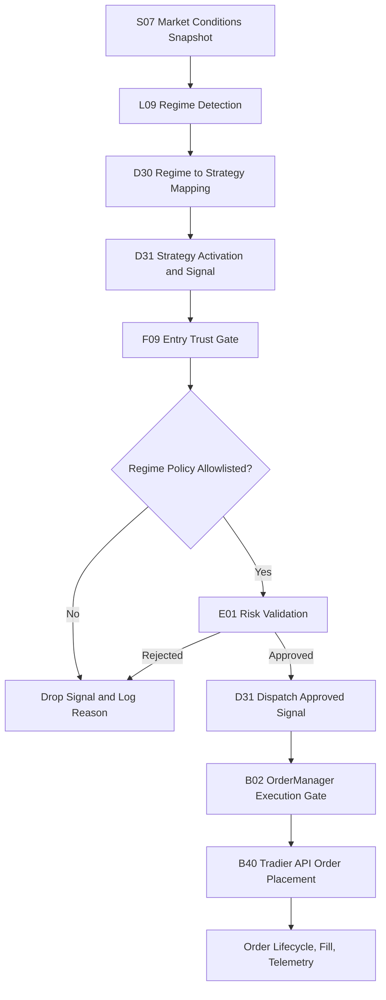

# Trading Decision Workflow (Full) — v4

Last Updated: 2026-05-01
Status: Design Specification (Deterministic)
Scope: 6-Regime Master Logic and Strategy Mapping for SPY options

## Change Log

| Version | Date | Changes |
|---|---|---|
| v1 | 2026-04-28 | Initial draft |
| v2 | 2026-04-29 | Added pivot overlay section (Rule 6.1) |
| v3 | 2026-04-30 | Added cross-symbol weighting (5.1) and exact regime-key matrix (5.2) |
| v4 | 2026-05-01 | Added dashboard display field naming and 18-combination reference matrix (5.3) |

## 1) Objective

Define a single deterministic workflow for regime detection and strategy gating with these hard constraints:

- Only 4 trading strategies are permitted.
- Maximum 2 strategies may run concurrently.
- Crisis and Event regimes are hard halt states (no new entries).

## 1.1) End-to-End Automated Execution Flow (Compact)

## 2) Allowed Strategies and Regime Mapping

| Regime | Trading Posture | Permitted Strategy |
|---|---|---|
| 1. BULL REGIME | Directional bullish premium | SpyderD06_BullPutSpread |
| 2. BEAR REGIME | Directional bearish premium | SpyderD07_BearCallSpread |
| 3. NEUTRAL REGIME | Range / mean containment | SpyderD02_IronCondor |
| 4. VOLATILE REGIME | High-volatility mean reversion | SpyderD10_IronButterfly |
| 5. CRISIS REGIME | Turbulent / disorderly | HARD HALT / KILL-SWITCH |
| 6. EVENT REGIME | Scheduled macro transition window | HARD HALT / NO TRADE |

## 3) Deterministic Input Universe

### Symbols

- SPY: Primary tradable and trend anchor
- VIX: Volatility level and stress anchor
- VIX9D: Front-vol term structure stress check
- VXV: Mid-tenor term structure context (fallback optional)

### Event Signal

- Event clock state from scheduler/calendar (for example FOMC/CPI windows)
- Event window default: plus/minus 30 minutes around high-impact event timestamp

### Required Indicators

- SPY EMA50
- VIX EMA50
- SPY ATR and ATR percent (ATR divided by SPY price)
- VIX percentile (rolling lookback, default 252 trading days)
- Intraday SPY return over short horizon (for shock detection)
- Daily pivot ladder: P, R1, R2, R3, S1, S2, S3
- Distance-to-pivot metrics (in ATR units) for nearest support and resistance

## 4) Regime Trigger Logic (Deterministic, Priority-Ordered)

Use first-match precedence from top to bottom.

### 4.0) Canonical Master Logic (Exact Required Elements)

The following six definitions are mandatory and must be preserved exactly in implementation intent:

| # | Regime | Mathematical Trigger Logic | Strategy / Action |
|---|---|---|---|
| 1 | Bull Regime | SPY > 50-EMA AND VIX < 50-EMA | SpyderD06_BullPutSpread |
| 2 | Bear Regime | SPY < 50-EMA AND VIX > 50-EMA | SpyderD07_BearCallSpread |
| 3 | Neutral Regime | SPY within ATR bands AND VIX Contango | SpyderD02_IronCondor |
| 4 | Volatile Regime (High-Volatility Mean Reversion) | SPY ATR Elevated AND VIX > 80th PCTL | SpyderD10_IronButterfly |
| 5 | Crisis Regime (Turbulent) | VIX9D > VIX (Term Structure Inversion) | HARD HALT / KILL-SWITCH |
| 6 | Event Regime (Transition) | Calendar Proximity (for example +/-30 mins of FOMC) | HARD HALT / NO TRADE |

Interpretation:

- Section 4.0 is the canonical rule set.
- The detailed rules below must remain consistent with this canonical set.
- If any extended safety condition is added, it must not weaken these six required triggers/actions.

### Rule 0: EVENT REGIME (highest priority)

Trigger:
- event_clock_state in {pre, live, post}
- or absolute time distance to high-impact event less than or equal to 30 minutes

Action:
- Regime = EVENT
- Hard halt: no new strategy entries

### Rule 1: CRISIS REGIME

Trigger (any one condition):
- VIX9D greater than VIX (front-vol inversion), or
- VIX greater than or equal to 35, or
- SPY short-horizon drop less than or equal to -1.25% AND VIX change greater than or equal to +4 points

Action:
- Regime = CRISIS
- Hard halt / kill-switch: flatten entry pipeline and block new risk

### Rule 2: BULL REGIME

Trigger (all):
- SPY greater than SPY EMA50
- VIX less than VIX EMA50
- Not EVENT and not CRISIS

Action:
- Regime = BULL
- Strategy = SpyderD06_BullPutSpread

### Rule 3: BEAR REGIME

Trigger (all):
- SPY less than SPY EMA50
- VIX greater than VIX EMA50
- Not EVENT and not CRISIS

Action:
- Regime = BEAR
- Strategy = SpyderD07_BearCallSpread

### Rule 4: NEUTRAL REGIME

Trigger (all):
- Absolute distance of SPY from EMA50 less than or equal to 1.0 ATR
- Term structure not stressed (VIX9D less than or equal to VIX, or VIX less than or equal to VXV)
- Not EVENT and not CRISIS

Action:
- Regime = NEUTRAL
- Strategy = SpyderD02_IronCondor

### Rule 5: VOLATILE REGIME

Trigger (all):
- SPY ATR percent greater than or equal to 1.5%
- VIX percentile greater than or equal to 80th percentile OR VIX greater than or equal to 25
- Not EVENT and not CRISIS

Action:
- Regime = VOLATILE
- Strategy = SpyderD10_IronButterfly

### Rule 6: Fallback

If no rule is matched:
- Assign NEUTRAL as safe fallback
- Strategy = SpyderD02_IronCondor

### Rule 6.1: Pivot Opportunity Overlay (execution qualifier, no new strategy)

Purpose:
- Convert strong pivot reactions into deterministic entry timing improvements.
- Preserve the canonical 4-strategy mapping (no additional strategy types).

Policy:
- Regime classification in Rules 0-6 remains authoritative.
- Pivot overlay only qualifies or delays entry timing for the mapped strategy.
- Pivot overlay must never override EVENT or CRISIS hard-halt states.

Source of truth:
- Pivot overlay input is the live `SpyderS08_PivotMeanReversionSignal` payload.
- Required consumed fields: `direction`, `score`, `fired`, `nearest_level_name`, `nearest_level_price`, `atr_distance`, `reasons`, `penalties`.
- Integration keys accepted in runtime payloads: `pivot_mr_signal` (preferred), `s08_pivot_signal` (fallback alias).

Deterministic qualifiers by mapped strategy:
- Bull regime -> SpyderD06_BullPutSpread:
  - Prefer entries on rejection/hold above P or S1 with bullish micro-momentum.
  - Block fresh entry if price is stretched into R2/R3 without pullback confirmation.
- Bear regime -> SpyderD07_BearCallSpread:
  - Prefer entries on rejection/hold below P or R1 with bearish micro-momentum.
  - Block fresh entry if price is stretched into S2/S3 without bounce confirmation.
- Neutral regime -> SpyderD02_IronCondor:
  - Prefer entries when price is rotating around P and remains inside R1/S1.
  - Reduce confidence or delay when price is expanding toward R2 or S2.
- Volatile regime -> SpyderD10_IronButterfly:
  - Prefer entries near central pivot magnet behavior after expansion/reversion signal.
  - Delay entry on one-direction trend acceleration through R2/R3 or S2/S3.

Logging requirement:
- Every pivot-qualified block must emit `pivot_block_reason` and nearest level context.
- Example reasons: `pivot_stretch_no_pullback`, `pivot_breakout_unconfirmed`, `pivot_rotation_absent`.
- When available, include S08 context in decision logs: direction, score, fired-state, nearest level, and ATR distance.

## 5) Regime Detection Signals by Regime

### BULL

- Positive SPY trend state: SPY above EMA50
- Benign vol trend state: VIX below EMA50
- Optional confirmation: stable term structure (no VIX9D inversion)

### BEAR

- Negative SPY trend state: SPY below EMA50
- Rising vol trend state: VIX above EMA50
- Optional confirmation: weakening term structure

### RANGE

- SPY oscillating around EMA50 inside ATR band
- No front-vol inversion
- Volatility not in high-percentile stress state

### VOLATILE

- Elevated realized movement (ATR percent high)
- Elevated implied volatility context (VIX percentile high)
- Not in outright crisis dislocation

### CRISIS

- Front-vol inversion, or very high VIX, or joint price shock plus vol shock
- This is always risk-first, no new trade state

### EVENT

- Calendar proximity to high-impact macro event window
- This is always no-trade by policy

## 5.1) Cross-Symbol and Metric Weighting by Regime

This section mirrors the policy-aligned mapping in
01-Overview-Specs/Autonomous-Decision-Contract.md so both documents stay consistent.

| Regime | Primary symbols to weight | Primary metrics to weight | Deterministic trigger + mapped strategy/action | Typical gate emphasis |
|---|---|---|---|---|
| BULL REGIME | SPY, QQQ, XLK, VIX, VIX9D | BREADTH_REGIME, GEX, DIX, dealer_flow, flow_imbalance | SPY > 50-EMA AND VIX < 50-EMA -> SpyderD06_BullPutSpread | Confirm SPY-relative leadership (QQQ/XLK), reject weak participation (RVOL), guard against short-term vol stress (VIX9D/VIX) |
| BEAR REGIME | SPY, IWM, XLF, VIX, VVIX | BREADTH_REGIME, SWAN, CHEX, wall_confidence, dealer_flow | SPY < 50-EMA AND VIX > 50-EMA -> SpyderD07_BearCallSpread | Confirm downside breadth/financial weakness (IWM/XLF), tighten CPC/VVIX stress checks, require strong data_quality_feed |
| NEUTRAL REGIME | SPY, VIX, VIX9D, CPC | GEX, DIX, BREADTH_REGIME, rr_25d, fly_25d | SPY within ATR bands AND VIX Contango -> SpyderD02_IronCondor | Favor neutral participation and stable vol-of-vol; block if cross-index confirmation or surface quality deteriorates |
| VOLATILE REGIME | SPY, VIX, VIX9D, VVIX, SKEW | SWAN, VEX, CHEX, rr_25d, fly_25d, term_slope_0_7 | SPY ATR Elevated AND VIX > 80th PCTL -> SpyderD10_IronButterfly | Emphasize vol-shock containment, skew/term-structure quality, and stricter surface_confidence/surface_age_ms thresholds |
| CRISIS REGIME | SPY, VIX, VVIX, $TICK, $ADD, $TRIN | SWAN, CHEX, BREADTH_REGIME, YIELD_INVERTED, YIELD_SLOPE | VIX9D > VIX (Term Structure Inversion) -> HARD HALT / KILL-SWITCH | Prefer hard-block posture; strongest dependence on data_quality_feed, stress metrics, and internals where available |
| EVENT REGIME | SPY, VIX, VIX9D, QQQ, IWM, XLK, XLF | BREADTH_REGIME, DIX, GEX, YIELD_10Y, AAII_BULLISH, AAII_BEARISH, NAAIM_EXPOSURE | Calendar Proximity (for example +/-30 mins of FOMC) -> HARD HALT / NO TRADE | Event-clock style caution: maintain confirmation gates, reduce trust in stale/aging surface inputs, and avoid over-reliance on any single macro print |

Interpretation notes:

- This weighting matrix governs cross-symbol confirmation and quality weighting.
- Deterministic regime trigger precedence in Section 4 remains the hard classifier for regime labeling.
- In any conflict, EVENT and CRISIS hard-halt policy overrides all symbol/metric weighting outcomes.

### 5.2) Exact Regime-Key Matrix (Canonical Labels from Contract)

This is the exact regime-key version requested for implementation/reference alignment.

| Regime | Primary symbols to weight | Primary metrics to weight | Deterministic trigger + mapped strategy/action | Typical gate emphasis |
|---|---|---|---|---|
| bull_trend | SPY, QQQ, XLK, VIX, VIX9D | BREADTH_REGIME, GEX, DIX, dealer_flow, flow_imbalance | SPY > 50-EMA AND VIX < 50-EMA -> SpyderD06_BullPutSpread | Confirm SPY-relative leadership (QQQ/XLK), reject weak participation (RVOL), guard against short-term vol stress (VIX9D/VIX) |
| bear_trend | SPY, IWM, XLF, VIX, VVIX | BREADTH_REGIME, SWAN, CHEX, wall_confidence, dealer_flow | SPY < 50-EMA AND VIX > 50-EMA -> SpyderD07_BearCallSpread | Confirm downside breadth/financial weakness (IWM/XLF), tighten CPC/VVIX stress checks, require strong data_quality_feed |
| range_calm | SPY, VIX, VIX9D, CPC | GEX, DIX, BREADTH_REGIME, rr_25d, fly_25d | SPY within ATR bands AND VIX Contango -> SpyderD02_IronCondor | Favor neutral participation and stable vol-of-vol; block if cross-index confirmation or surface quality deteriorates |
| high_vol_mean_reversion | SPY, VIX, VIX9D, VVIX, SKEW | SWAN, VEX, CHEX, rr_25d, fly_25d, term_slope_0_7 | SPY ATR Elevated AND VIX > 80th PCTL -> SpyderD10_IronButterfly | Emphasize vol-shock containment, skew/term-structure quality, and stricter surface_confidence/surface_age_ms thresholds |
| crisis_turbulent | SPY, VIX, VVIX, $TICK, $ADD, $TRIN | SWAN, CHEX, BREADTH_REGIME, YIELD_INVERTED, YIELD_SLOPE | VIX9D > VIX (Term Structure Inversion) -> HARD HALT / KILL-SWITCH | Prefer hard-block posture; strongest dependence on data_quality_feed, stress metrics, and internals where available |
| event_transition | SPY, VIX, VIX9D, QQQ, IWM, XLK, XLF | BREADTH_REGIME, DIX, GEX, YIELD_10Y, AAII_BULLISH, AAII_BEARISH, NAAIM_EXPOSURE | Calendar Proximity (for example +/-30 mins of FOMC) -> HARD HALT / NO TRADE | Event-clock style caution: maintain confirmation gates, reduce trust in stale/aging surface inputs, and avoid over-reliance on any single macro print |

### 5.3) Dashboard Display Field Names and 18-Combination Reference Matrix

#### Field Name Decisions (Final — 2026-05-01)

| Internal Name | Dashboard Display Label | Source |
|---|---|---|
| Regime (L09 output) | **Regime** | SpyderL09_UnifiedRegimeEngine |
| Directional Bias | **Bias** | SpyderR08 `_regime_preferred_direction()` |
| Exec Bucket (D30 output) | **Strategy Stance** | SpyderD30_RegimeGatedSelector |
| Policy Key (D31 gate) | **Strategy Gate** | SpyderD31_StrategyOrchestrator |

#### Strategy Stance Display Values

| Internal Value | Dashboard Display Value |
|---|---|
| BULL | BULLISH |
| CHOP | CHOPPY |
| CRISIS | CRISIS |
| UNKNOWN | UNKNOWN |

#### Bias Display Values

| Value | Meaning |
|---|---|
| BULLISH | DIX > 0.45 — institutional dark pool flow net bullish |
| BEARISH | DIX < 0.35 — institutional dark pool flow net bearish |
| NEUTRAL | GEX > 0 AND SWAN < 1.0 — dealers long gamma, no tail stress |
| NONE | DIX in ambiguous range (0.35–0.45) or conditions unclear — no directional lean |
| RISK-OFF | CRISIS or EVENT regime — bias computation bypassed, hard halt in effect |

#### Complete 18-Combination Reference Matrix

| # | Regime | Bias | Strategy Stance | Strategy Gate | Tradeable |
|---|---|---|---|---|---|
| 1 | BULL | BULLISH | BULLISH | Bull Trend | ✅ |
| 2 | BULL | BEARISH | BULLISH | Bull Trend | ✅ |
| 3 | BULL | NEUTRAL | BULLISH | Bull Trend | ✅ |
| 4 | BULL | NONE | BULLISH | Bull Trend | ✅ |
| 5 | BEAR | BULLISH | CHOPPY | Bear Trend | ✅ |
| 6 | BEAR | BEARISH | CHOPPY | Bear Trend | ✅ |
| 7 | BEAR | NEUTRAL | CHOPPY | Bear Trend | ✅ |
| 8 | BEAR | NONE | CHOPPY | Bear Trend | ✅ |
| 9 | RANGE | BULLISH | CHOPPY | Range Calm | ✅ |
| 10 | RANGE | BEARISH | CHOPPY | Range Calm | ✅ |
| 11 | RANGE | NEUTRAL | CHOPPY | Range Calm | ✅ |
| 12 | RANGE | NONE | CHOPPY | Range Calm | ✅ |
| 13 | VOLATILE | BULLISH | CHOPPY | High Vol | ✅ |
| 14 | VOLATILE | BEARISH | CHOPPY | High Vol | ✅ |
| 15 | VOLATILE | NEUTRAL | CHOPPY | High Vol | ✅ |
| 16 | VOLATILE | NONE | CHOPPY | High Vol | ✅ |
| 17 | CRISIS | RISK-OFF | CRISIS | Crisis | 🚫 HALT |
| 18 | EVENT | RISK-OFF | CRISIS | Event | 🚫 HALT |

#### Notes on the Matrix

- **Rows 1–4 (BULL)**: Regime is always BULLISH stance regardless of Bias — Bias only influences internal spread direction selection inside R08, not the posture displayed.
- **Rows 5–16 (BEAR / RANGE / VOLATILE)**: All share CHOPPY stance — distinguished from each other by Strategy Gate.
- **NONE Bias (rows 4, 8, 12, 16)**: DIX/GEX data unavailable, feature flag off, or DIX in the ambiguous 0.35–0.45 band. Trading continues normally — Bias is informational only.
- **RISK-OFF Bias (rows 17–18)**: Forced state; normal bias computation is bypassed entirely in halt regimes.
- **Bias does not gate execution**: Strategy Gate and Strategy Stance are the authoritative execution controls. Bias is operator-facing context only.

## 6) Strategy Gating and Concurrency Rules

### Hard Policy

- Allowed strategy universe is exactly:
  - SpyderD06_BullPutSpread
  - SpyderD07_BearCallSpread
  - SpyderD02_IronCondor
  - SpyderD10_IronButterfly
- No other strategy may be activated by regime selector.

### Concurrency Cap

- Maximum concurrently active strategies = 2.

### Runtime Behavior

- Normal steady state: 1 active strategy mapped from current regime.
- Transition state (optional): up to 2 active strategies only during handoff window.
- EVENT/CRISIS: 0 active entry strategies; kill-switch posture.

### Handoff Guardrails

- If regime changes, maintain old and new strategy concurrently only for transition_timeout.
- Default transition_timeout: 5 minutes.
- If transition_timeout expires, force deactivation of outgoing strategy.
- If entering EVENT or CRISIS, immediately deactivate all entries (no handoff grace).

## 7) End-to-End Workflow

1. Ingest SPY/VIX/VIX9D/VXV prices and event clock.
2. Compute deterministic indicators (EMA50, ATR percent, VIX percentile, short-horizon SPY return).
3. Evaluate regime rules in strict priority order.
4. Emit one regime label.
5. Apply regime-to-strategy map.
6. Apply pivot opportunity overlay as entry timing qualifier for the mapped strategy.
7. Enforce hard halt rules for EVENT/CRISIS.
8. Enforce max two concurrent strategies.
9. Pass only allowed strategy signals downstream to risk and execution.

## 8) Decision Contract for L09 and D30

### L09 Unified Regime Engine (contract)

- Must produce only one of:
  - bull_trending
  - bear_trending
  - sideways_range
  - high_volatility
  - crisis_mode
  - event_transition
- Classification must be deterministic and precedence-ordered.
- ML, probabilistic blending, and non-deterministic weighting are excluded from this contract.

### D30 Regime Gated Selector (contract)

- Must map regimes one-to-one to the 4 allowed strategies or hard halt states.
- Must enforce max concurrent strategies = 2.
- Must block all non-approved strategy types.

## 9) Operational Safety Defaults

- Default mode for EVENT and CRISIS is no-trade.
- If required indicator data is missing, fail safe to EVENT/NO TRADE or NEUTRAL according to deployment policy.
- All state transitions must be timestamped and auditable.

## 10) Acceptance Criteria

- Regime output is fully reproducible for identical input snapshots.
- Only 4 permitted strategies are ever selected.
- Concurrent active strategies never exceed 2.
- EVENT and CRISIS always block new entries.
- Regime change logs include trigger condition that fired.
- Pivot-qualified blocks include explicit reason codes and nearest pivot context.

## 11) Notes

This v4 specification defines the deterministic workflow, detection logic, and dashboard display contract. It is the source policy for subsequent implementation updates in:

- SpyderL09_UnifiedRegimeEngine.py
- SpyderD30_RegimeGatedSelector.py
- SpyderF09_EntryFilters.py
- SpyderD31_StrategyOrchestrator.py
- SpyderG05_TradingDashboard.py (dashboard display — section 5.3)
- SpyderR08_PaperTradingQtWorker.py (Bias computation)
