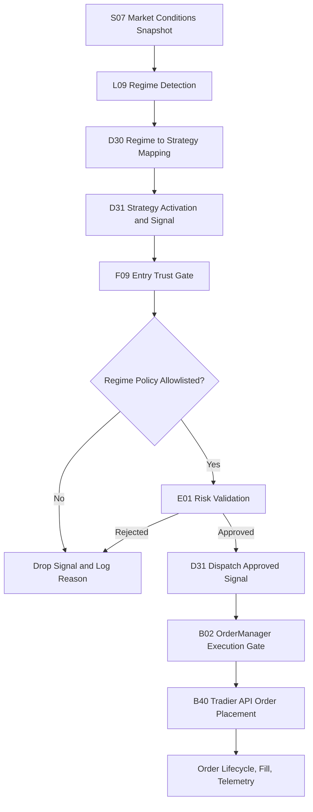

# Trading Decision Workflow (Full) — v7

Last Updated: 2026-05-02
Status: Design Specification (Deterministic) — D34 Enabled
Scope: 6-Regime Master Logic and Strategy Mapping for SPY options

## Change Log

| Version | Date | Changes |
|---|---|---|
| v1 | 2026-04-28 | Initial draft |
| v2 | 2026-04-29 | Added pivot overlay section (Rule 6.1) |
| v3 | 2026-04-30 | Added cross-symbol weighting (5.1) and exact regime-key matrix (5.2) |
| v4 | 2026-05-01 | Added dashboard display field naming and 18-combination reference matrix (5.3) |
| v5 | 2026-05-01 | Corrected concurrency limit to max 1 strategy at a time; added TRADEABLE pill display spec (5.4); updated all concurrency references throughout |
| v6 | 2026-05-02 | Documented opt-in strategy extensions (Section 2.1: BULL_CALL_SPREAD, BEAR_PUT_SPREAD, PIVOT_MEAN_REVERSION env flags); added market-data input contract note (Section 9.1) reflecting the D31 per-symbol cache fix; fixed UTF-8 mojibake; updated 5.3/5.4 to acknowledge feature-flag extensions |
| v7 | 2026-05-02 | Fixed two D31/R12 startup blockers that prevented any trades from firing (Section 10.1); activated D34 PivotMeanReversion via `SPYDER_ENABLE_PIVOT_MEAN_REVERSION=true` in `.env` (Section 10.2); updated TRADEABLE tooltip in SpyderG05 to surface D34 when flag is set |

## 1) Objective

Define a single deterministic workflow for regime detection and strategy gating with these hard constraints:

- The default ("v5 contract") trading universe is exactly **4 strategies** (Section 2).
- **Maximum 1 strategy active at any given time** (future versions may increase this limit).
- **CRISIS and EVENT regimes are hard halt states** (no new entries).
- Operators may opt into extension strategies via env flags (Section 2.1). Extensions never relax CRISIS/EVENT halts and never raise the concurrency cap.

## 1.1) End-to-End Automated Execution Flow (Compact)

## 2) Allowed Strategies and Regime Mapping (Default Contract)

| Regime | Trading Posture | Permitted Strategy |
|---|---|---|
| 1. BULL REGIME | Directional bullish premium | SpyderD06_BullPutSpread |
| 2. BEAR REGIME | Directional bearish premium | SpyderD07_BearCallSpread |
| 3. NEUTRAL REGIME | Range / mean containment | SpyderD02_IronCondor |
| 4. VOLATILE REGIME | High-volatility mean reversion | SpyderD10_IronButterfly |
| 5. CRISIS REGIME | Turbulent / disorderly | HARD HALT / KILL-SWITCH |
| 6. EVENT REGIME | Scheduled macro transition window | HARD HALT / NO TRADE |

This is the default ("v5 contract") mapping with all extension flags off.

## 2.1) Opt-In Strategy Extensions (Feature Flags)

Operators may enable narrow, regime-scoped strategy alternatives without changing the contract's hard policy (4-strategy default, 1-strategy concurrency, hard halts on CRISIS/EVENT). All flags default **off**. Each flag swaps in an alternative strategy for a specific regime; the v5 mapping remains active for any regime whose flag is not set.

### 2.1.1) `SPYDER_ENABLE_BULL_CALL_SPREAD` — debit alternative for BULL

When set to `true`, the BULL regime maps to **SpyderD15_BullCallSpread** (debit, directional) instead of SpyderD06_BullPutSpread (credit). All other regimes are unchanged.

| Flag state | BULL regime maps to |
|---|---|
| off (default) | SpyderD06_BullPutSpread |
| on | SpyderD15_BullCallSpread |

### 2.1.2) `SPYDER_ENABLE_BEAR_PUT_SPREAD` — debit alternative for BEAR

When set to `true`, the BEAR regime maps to **SpyderD16_BearPutSpread** (debit, directional) instead of SpyderD07_BearCallSpread (credit). All other regimes are unchanged.

| Flag state | BEAR regime maps to |
|---|---|
| off (default) | SpyderD07_BearCallSpread |
| on | SpyderD16_BearPutSpread |

### 2.1.3) `SPYDER_ENABLE_PIVOT_MEAN_REVERSION` — pivot-conditional alternative for NEUTRAL

When set to `true`, the NEUTRAL regime maps to **SpyderD34_PivotMeanReversion** *only when the S08 pivot signal is firing on the current tick*. When the pivot signal is not firing, NEUTRAL falls back to SpyderD02_IronCondor (the v5 default).

| NEUTRAL regime + flag state | S08 `pivot_signal.fired` | Strategy |
|---|---|---|
| flag off (default) | any | SpyderD02_IronCondor |
| flag on | `false` | SpyderD02_IronCondor |
| flag on | `true` | SpyderD34_PivotMeanReversion |

This satisfies the v5 spirit of Rule 6.1 (pivot overlay as a qualifier) while letting D34 take the trade when the operator explicitly opts in. CRISIS, EVENT, BULL, BEAR, and VOLATILE behavior is unchanged.

### Combined behavior

- Multiple flags may be on simultaneously; each affects only its own regime.
- The concurrency cap of 1 is unchanged — only one mapped strategy can be active at a time.
- F09 Entry Trust Gate's regime-policy allowlist must be updated to include any opt-in strategy whose flag is enabled, otherwise signals from the alternative strategy will be dropped at the gate.
- D31's `lean_strategy_allowlist` enforces these flags at registry time: when off, the candidate-strategy filter drops the alternative class entirely.

## 3) Deterministic Input Universe

### Symbols

- SPY: Primary tradable and trend anchor
- VIX: Volatility level and stress anchor
- VIX9D: Front-vol term structure stress check
- VXV: Mid-tenor term structure context (fallback optional)

### Event Signal

- Event clock state from scheduler/calendar (for example FOMC/CPI windows)
- Event window default: plus/minus 30 minutes around high-impact event timestamp

### Required Indicators

- SPY EMA50
- VIX EMA50
- SPY ATR and ATR percent (ATR divided by SPY price)
- VIX percentile (rolling lookback, default 252 trading days)
- Intraday SPY return over short horizon (for shock detection)
- Daily pivot ladder: P, R1, R2, R3, S1, S2, S3
- Distance-to-pivot metrics (in ATR units) for nearest support and resistance

## 4) Regime Trigger Logic (Deterministic, Priority-Ordered)

Use first-match precedence from top to bottom.

### 4.0) Canonical Master Logic (Exact Required Elements)

The following six definitions are mandatory and must be preserved exactly in implementation intent:

| # | Regime | Mathematical Trigger Logic | Strategy / Action |
|---|---|---|---|
| 1 | Bull Regime | SPY > 50-EMA AND VIX < 50-EMA | SpyderD06_BullPutSpread |
| 2 | Bear Regime | SPY < 50-EMA AND VIX > 50-EMA | SpyderD07_BearCallSpread |
| 3 | Neutral Regime | SPY within ATR bands AND VIX Contango | SpyderD02_IronCondor |
| 4 | Volatile Regime (High-Volatility Mean Reversion) | SPY ATR Elevated AND VIX > 80th PCTL | SpyderD10_IronButterfly |
| 5 | Crisis Regime (Turbulent) | VIX9D > VIX (Term Structure Inversion) | HARD HALT / KILL-SWITCH |
| 6 | Event Regime (Transition) | Calendar Proximity (for example +/-30 mins of FOMC) | HARD HALT / NO TRADE |

Interpretation:

- Section 4.0 is the canonical rule set.
- The detailed rules below must remain consistent with this canonical set.
- If any extended safety condition is added, it must not weaken these six required triggers/actions.
- Section 2.1 opt-in flags swap which strategy is mapped *within* a regime; they never change the regime triggers themselves.

### Rule 0: EVENT REGIME (highest priority)

Trigger:
- event_clock_state in {pre, live, post}
- or absolute time distance to high-impact event less than or equal to 30 minutes

Action:
- Regime = EVENT
- Hard halt: no new strategy entries

### Rule 1: CRISIS REGIME

Trigger (any one condition):
- VIX9D greater than VIX (front-vol inversion), or
- VIX greater than or equal to 35, or
- SPY short-horizon drop less than or equal to -1.25% AND VIX change greater than or equal to +4 points

Action:
- Regime = CRISIS
- Hard halt / kill-switch: flatten entry pipeline and block new risk

### Rule 2: BULL REGIME

Trigger (all):
- SPY greater than SPY EMA50
- VIX less than VIX EMA50
- Not EVENT and not CRISIS

Action:
- Regime = BULL
- Strategy = SpyderD06_BullPutSpread (default; or SpyderD15_BullCallSpread if `SPYDER_ENABLE_BULL_CALL_SPREAD=true`)

### Rule 3: BEAR REGIME

Trigger (all):
- SPY less than SPY EMA50
- VIX greater than VIX EMA50
- Not EVENT and not CRISIS

Action:
- Regime = BEAR
- Strategy = SpyderD07_BearCallSpread (default; or SpyderD16_BearPutSpread if `SPYDER_ENABLE_BEAR_PUT_SPREAD=true`)

### Rule 4: NEUTRAL REGIME

Trigger (all):
- Absolute distance of SPY from EMA50 less than or equal to 1.0 ATR
- Term structure not stressed (VIX9D less than or equal to VIX, or VIX less than or equal to VXV)
- Not EVENT and not CRISIS

Action:
- Regime = NEUTRAL
- Strategy = SpyderD02_IronCondor (default; or SpyderD34_PivotMeanReversion if `SPYDER_ENABLE_PIVOT_MEAN_REVERSION=true` AND S08 `pivot_signal.fired=true`)

### Rule 5: VOLATILE REGIME

Trigger (all):
- SPY ATR percent greater than or equal to 1.5%
- VIX percentile greater than or equal to 80th percentile OR VIX greater than or equal to 25
- Not EVENT and not CRISIS

Action:
- Regime = VOLATILE
- Strategy = SpyderD10_IronButterfly

### Rule 6: Fallback

If no rule is matched:
- Assign NEUTRAL as safe fallback
- Strategy = SpyderD02_IronCondor

### Rule 6.1: Pivot Opportunity Overlay (execution qualifier, no new strategy)

Purpose:
- Convert strong pivot reactions into deterministic entry timing improvements.
- Preserve the canonical 4-strategy mapping (no additional strategy types) **unless** Section 2.1 opt-in flags are explicitly enabled.

Policy:
- Regime classification in Rules 0-6 remains authoritative.
- Pivot overlay only qualifies or delays entry timing for the mapped strategy.
- Pivot overlay must never override EVENT or CRISIS hard-halt states.
- When `SPYDER_ENABLE_PIVOT_MEAN_REVERSION=true`, a firing pivot signal additionally swaps the NEUTRAL-mapped strategy from IronCondor to D34 PivotMeanReversion (per Section 2.1.3); this does not change the qualifier behavior described below.

Source of truth:
- Pivot overlay input is the live `SpyderS08_PivotMeanReversionSignal` payload.
- Required consumed fields: `direction`, `score`, `fired`, `nearest_level_name`, `nearest_level_price`, `atr_distance`, `reasons`, `penalties`.
- Integration keys accepted in runtime payloads: `pivot_mr_signal` (preferred), `s08_pivot_signal` (fallback alias).

Deterministic qualifiers by mapped strategy:
- Bull regime -> SpyderD06_BullPutSpread (or SpyderD15_BullCallSpread when extension flag is on):
  - Prefer entries on rejection/hold above P or S1 with bullish micro-momentum.
  - Block fresh entry if price is stretched into R2/R3 without pullback confirmation.
- Bear regime -> SpyderD07_BearCallSpread (or SpyderD16_BearPutSpread when extension flag is on):
  - Prefer entries on rejection/hold below P or R1 with bearish micro-momentum.
  - Block fresh entry if price is stretched into S2/S3 without bounce confirmation.
- Neutral regime -> SpyderD02_IronCondor (or SpyderD34_PivotMeanReversion when extension flag is on AND pivot fired):
  - Prefer entries when price is rotating around P and remains inside R1/S1.
  - Reduce confidence or delay when price is expanding toward R2 or S2.
- Volatile regime -> SpyderD10_IronButterfly:
  - Prefer entries near central pivot magnet behavior after expansion/reversion signal.
  - Delay entry on one-direction trend acceleration through R2/R3 or S2/S3.

Logging requirement:
- Every pivot-qualified block must emit `pivot_block_reason` and nearest level context.
- Example reasons: `pivot_stretch_no_pullback`, `pivot_breakout_unconfirmed`, `pivot_rotation_absent`.
- When available, include S08 context in decision logs: direction, score, fired-state, nearest level, and ATR distance.
- When a feature-flag swap occurs, emit `selector_feature_flag` recording which env flag drove the choice (one of: `SPYDER_ENABLE_BULL_CALL_SPREAD`, `SPYDER_ENABLE_BEAR_PUT_SPREAD`, `SPYDER_ENABLE_PIVOT_MEAN_REVERSION`).

## 5) Regime Detection Signals by Regime

### BULL

- Positive SPY trend state: SPY above EMA50
- Benign vol trend state: VIX below EMA50
- Optional confirmation: stable term structure (no VIX9D inversion)

### BEAR

- Negative SPY trend state: SPY below EMA50
- Rising vol trend state: VIX above EMA50
- Optional confirmation: weakening term structure

### RANGE

- SPY oscillating around EMA50 inside ATR band
- No front-vol inversion
- Volatility not in high-percentile stress state

### VOLATILE

- Elevated realized movement (ATR percent high)
- Elevated implied volatility context (VIX percentile high)
- Not in outright crisis dislocation

### CRISIS

- Front-vol inversion, or very high VIX, or joint price shock plus vol shock
- This is always risk-first, no new trade state

### EVENT

- Calendar proximity to high-impact macro event window
- This is always no-trade by policy

## 5.1) Cross-Symbol and Metric Weighting by Regime

This section mirrors the policy-aligned mapping in
01-Overview-Specs/Autonomous-Decision-Contract.md so both documents stay consistent.

| Regime | Primary symbols to weight | Primary metrics to weight | Deterministic trigger + mapped strategy/action | Typical gate emphasis |
|---|---|---|---|---|
| BULL REGIME | SPY, QQQ, XLK, VIX, VIX9D | BREADTH_REGIME, GEX, DIX, dealer_flow, flow_imbalance | SPY > 50-EMA AND VIX < 50-EMA -> SpyderD06_BullPutSpread | Confirm SPY-relative leadership (QQQ/XLK), reject weak participation (RVOL), guard against short-term vol stress (VIX9D/VIX) |
| BEAR REGIME | SPY, IWM, XLF, VIX, VVIX | BREADTH_REGIME, SWAN, CHEX, wall_confidence, dealer_flow | SPY < 50-EMA AND VIX > 50-EMA -> SpyderD07_BearCallSpread | Confirm downside breadth/financial weakness (IWM/XLF), tighten CPC/VVIX stress checks, require strong data_quality_feed |
| NEUTRAL REGIME | SPY, VIX, VIX9D, CPC | GEX, DIX, BREADTH_REGIME, rr_25d, fly_25d | SPY within ATR bands AND VIX Contango -> SpyderD02_IronCondor | Favor neutral participation and stable vol-of-vol; block if cross-index confirmation or surface quality deteriorates |
| VOLATILE REGIME | SPY, VIX, VIX9D, VVIX, SKEW | SWAN, VEX, CHEX, rr_25d, fly_25d, term_slope_0_7 | SPY ATR Elevated AND VIX > 80th PCTL -> SpyderD10_IronButterfly | Emphasize vol-shock containment, skew/term-structure quality, and stricter surface_confidence/surface_age_ms thresholds |
| CRISIS REGIME | SPY, VIX, VVIX, $TICK, $ADD, $TRIN | SWAN, CHEX, BREADTH_REGIME, YIELD_INVERTED, YIELD_SLOPE | VIX9D > VIX (Term Structure Inversion) -> HARD HALT / KILL-SWITCH | Prefer hard-block posture; strongest dependence on data_quality_feed, stress metrics, and internals where available |
| EVENT REGIME | SPY, VIX, VIX9D, QQQ, IWM, XLK, XLF | BREADTH_REGIME, DIX, GEX, YIELD_10Y, AAII_BULLISH, AAII_BEARISH, NAAIM_EXPOSURE | Calendar Proximity (for example +/-30 mins of FOMC) -> HARD HALT / NO TRADE | Event-clock style caution: maintain confirmation gates, reduce trust in stale/aging surface inputs, and avoid over-reliance on any single macro print |

Interpretation notes:

- This weighting matrix governs cross-symbol confirmation and quality weighting.
- Deterministic regime trigger precedence in Section 4 remains the hard classifier for regime labeling.
- In any conflict, EVENT and CRISIS hard-halt policy overrides all symbol/metric weighting outcomes.
- Section 2.1 opt-in flags do not alter the symbol/metric weighting profile of a regime; they only change which strategy is dispatched downstream.

### 5.2) Exact Regime-Key Matrix (Canonical Labels from Contract)

This is the exact regime-key version requested for implementation/reference alignment.

| Regime | Primary symbols to weight | Primary metrics to weight | Deterministic trigger + mapped strategy/action | Typical gate emphasis |
|---|---|---|---|---|
| bull_trend | SPY, QQQ, XLK, VIX, VIX9D | BREADTH_REGIME, GEX, DIX, dealer_flow, flow_imbalance | SPY > 50-EMA AND VIX < 50-EMA -> SpyderD06_BullPutSpread | Confirm SPY-relative leadership (QQQ/XLK), reject weak participation (RVOL), guard against short-term vol stress (VIX9D/VIX) |
| bear_trend | SPY, IWM, XLF, VIX, VVIX | BREADTH_REGIME, SWAN, CHEX, wall_confidence, dealer_flow | SPY < 50-EMA AND VIX > 50-EMA -> SpyderD07_BearCallSpread | Confirm downside breadth/financial weakness (IWM/XLF), tighten CPC/VVIX stress checks, require strong data_quality_feed |
| range_calm | SPY, VIX, VIX9D, CPC | GEX, DIX, BREADTH_REGIME, rr_25d, fly_25d | SPY within ATR bands AND VIX Contango -> SpyderD02_IronCondor | Favor neutral participation and stable vol-of-vol; block if cross-index confirmation or surface quality deteriorates |
| high_vol_mean_reversion | SPY, VIX, VIX9D, VVIX, SKEW | SWAN, VEX, CHEX, rr_25d, fly_25d, term_slope_0_7 | SPY ATR Elevated AND VIX > 80th PCTL -> SpyderD10_IronButterfly | Emphasize vol-shock containment, skew/term-structure quality, and stricter surface_confidence/surface_age_ms thresholds |
| crisis_turbulent | SPY, VIX, VVIX, $TICK, $ADD, $TRIN | SWAN, CHEX, BREADTH_REGIME, YIELD_INVERTED, YIELD_SLOPE | VIX9D > VIX (Term Structure Inversion) -> HARD HALT / KILL-SWITCH | Prefer hard-block posture; strongest dependence on data_quality_feed, stress metrics, and internals where available |
| event_transition | SPY, VIX, VIX9D, QQQ, IWM, XLK, XLF | BREADTH_REGIME, DIX, GEX, YIELD_10Y, AAII_BULLISH, AAII_BEARISH, NAAIM_EXPOSURE | Calendar Proximity (for example +/-30 mins of FOMC) -> HARD HALT / NO TRADE | Event-clock style caution: maintain confirmation gates, reduce trust in stale/aging surface inputs, and avoid over-reliance on any single macro print |

### 5.3) Dashboard Display Field Names and 18-Combination Reference Matrix

#### Field Name Decisions (Final — 2026-05-01)

| Internal Name | Dashboard Display Label | Source |
|---|---|---|
| Regime (L09 output) | **Regime** | SpyderL09_UnifiedRegimeEngine |
| Directional Bias | **Bias** | SpyderR08 `_regime_preferred_direction()` |
| Exec Bucket (D30 output) | **Strategy Stance** | SpyderD30_RegimeGatedSelector |
| Policy Key (D31 gate) | **Strategy Gate** | SpyderD31_StrategyOrchestrator |
| Entry permission state | **Tradeable** | SpyderG05_TradingDashboard `update_regime_pills()` |

#### Strategy Stance Display Values

| Internal Value | Dashboard Display Value |
|---|---|
| BULL | BULLISH |
| CHOP | CHOPPY |
| CRISIS | CRISIS |
| UNKNOWN | UNKNOWN |

#### Bias Display Values

| Value | Meaning |
|---|---|
| BULLISH | DIX > 0.45 — institutional dark pool flow net bullish |
| BEARISH | DIX < 0.35 — institutional dark pool flow net bearish |
| NEUTRAL | GEX > 0 AND SWAN < 1.0 — dealers long gamma, no tail stress |
| NONE | DIX in ambiguous range (0.35–0.45) or conditions unclear — no directional lean |
| RISK-OFF | CRISIS or EVENT regime — bias computation bypassed, hard halt in effect |

#### Complete 18-Combination Reference Matrix

| # | Regime | Bias | Strategy Stance | Strategy Gate | Tradeable |
|---|---|---|---|---|---|
| 1 | BULL | BULLISH | BULLISH | Bull Trend | ✓ |
| 2 | BULL | BEARISH | BULLISH | Bull Trend | ✓ |
| 3 | BULL | NEUTRAL | BULLISH | Bull Trend | ✓ |
| 4 | BULL | NONE | BULLISH | Bull Trend | ✓ |
| 5 | BEAR | BULLISH | CHOPPY | Bear Trend | ✓ |
| 6 | BEAR | BEARISH | CHOPPY | Bear Trend | ✓ |
| 7 | BEAR | NEUTRAL | CHOPPY | Bear Trend | ✓ |
| 8 | BEAR | NONE | CHOPPY | Bear Trend | ✓ |
| 9 | RANGE | BULLISH | CHOPPY | Range Calm | ✓ |
| 10 | RANGE | BEARISH | CHOPPY | Range Calm | ✓ |
| 11 | RANGE | NEUTRAL | CHOPPY | Range Calm | ✓ |
| 12 | RANGE | NONE | CHOPPY | Range Calm | ✓ |
| 13 | VOLATILE | BULLISH | CHOPPY | High Vol | ✓ |
| 14 | VOLATILE | BEARISH | CHOPPY | High Vol | ✓ |
| 15 | VOLATILE | NEUTRAL | CHOPPY | High Vol | ✓ |
| 16 | VOLATILE | NONE | CHOPPY | High Vol | ✓ |
| 17 | CRISIS | RISK-OFF | CRISIS | Crisis | 🚫 HALT |
| 18 | EVENT | RISK-OFF | CRISIS | Event | 🚫 HALT |

#### Notes on the Matrix

- **Rows 1–4 (BULL)**: Regime is always BULLISH stance regardless of Bias — Bias only influences internal spread direction selection inside R08, not the posture displayed.
- **Rows 5–16 (BEAR / RANGE / VOLATILE)**: All share CHOPPY stance — distinguished from each other by Strategy Gate.
- **NONE Bias (rows 4, 8, 12, 16)**: DIX/GEX data unavailable, feature flag off, or DIX in the ambiguous 0.35–0.45 band. Trading continues normally — Bias is informational only.
- **RISK-OFF Bias (rows 17–18)**: Forced state; normal bias computation is bypassed entirely in halt regimes.
- **Bias does not gate execution**: Strategy Gate and Strategy Stance are the authoritative execution controls. Bias is operator-facing context only.
- **Section 2.1 opt-in flags do not change this matrix.** The Regime / Bias / Strategy Stance / Strategy Gate / Tradeable columns reflect display state; the *underlying mapped strategy* may be the v5 default or the extension alternative depending on flag state and (for D34) S08 pivot fired-state. The dashboard's Strategy Gate shows the policy bucket, not the specific strategy class.

### 5.4) TRADEABLE Pill Display Specification

The **TRADEABLE** pill in the regime bar communicates entry permission state to the operator. Its display follows these rules.

#### Display States

| Regime State | Pill Text | Pill Color |
|---|---|---|
| Normal (entries permitted) | `TRADEABLE` | Green |
| Halted (CRISIS or EVENT) | `TRADEABLE ⚠ HALT` | Purple |

- No colon is shown in either state.
- No checkmark or other symbol is shown in the normal state — the green color is the affirmative signal.
- `⚠ HALT` appears inline after the label only when regime is CRISIS or EVENT.

#### Tooltip Behavior

When **entries are permitted** (normal state), the tooltip shows:

> **TRADEABLE**
>
> Permitted strategies:
> - **BULL:** SpyderD06_BullPutSpread *(or SpyderD15_BullCallSpread when `SPYDER_ENABLE_BULL_CALL_SPREAD=true`)*
> - **BEAR:** SpyderD07_BearCallSpread *(or SpyderD16_BearPutSpread when `SPYDER_ENABLE_BEAR_PUT_SPREAD=true`)*
> - **RANGE:** SpyderD02_IronCondor *(or SpyderD34_PivotMeanReversion when `SPYDER_ENABLE_PIVOT_MEAN_REVERSION=true` AND S08 pivot fired)*
> - **VOLATILE:** SpyderD10_IronButterfly
>
> **Concurrency limit:** Max 1 strategy open at a time
> New entries are permitted under the active Strategy Gate

When **halted** (CRISIS or EVENT), the tooltip shows:

> **HALTED — NO NEW ENTRIES**
>
> Regime: {regime} — all entry pipelines blocked
>
> Permitted strategies: (same list as above)

The italic *(or ...)* annotations are displayed only when the corresponding env flag is set; with all flags off the tooltip lists exactly the four v5-contract strategies. Implementations should resolve the env flags at tooltip render time so changes take effect without a restart.

#### Notes

- The concurrency limit of 1 is the current enforced maximum. Future releases may raise this value.
- The pill tooltip is the canonical operator reference for which strategies are active candidates — it always lists the four base strategies plus any flag-enabled extensions.
- CRISIS and EVENT regimes set the pill to purple (same semantic color as halt/risk-off across the system).

## 6) Strategy Gating and Concurrency Rules

### Hard Policy

- The default strategy universe is exactly:
  - SpyderD06_BullPutSpread
  - SpyderD07_BearCallSpread
  - SpyderD02_IronCondor
  - SpyderD10_IronButterfly
- Section 2.1 opt-in flags may add up to three regime-scoped extension strategies (SpyderD15_BullCallSpread, SpyderD16_BearPutSpread, SpyderD34_PivotMeanReversion). Extensions are explicit, env-flag-gated, and do not relax the concurrency cap or the CRISIS/EVENT hard halts.
- No other strategy may be activated by the regime selector.

### Concurrency Cap

- Maximum concurrently active strategies = 1.
- Future versions may raise this limit; any such change requires explicit contract update.
- Opt-in extensions do not change the cap — only one mapped strategy can be active at any moment, regardless of which (default or extension) is chosen.

### Runtime Behavior

- Normal steady state: 1 active strategy mapped from current regime.
- EVENT/CRISIS: 0 active entry strategies; kill-switch posture.

### Handoff Guardrails

- If regime changes, deactivate the outgoing strategy before activating the incoming strategy.
- If the active extension flag is toggled mid-session and causes a strategy swap within the *same* regime (e.g. NEUTRAL pivot fires while D34 is enabled), apply the same handoff rule: deactivate IronCondor before activating D34.
- If entering EVENT or CRISIS, immediately deactivate all entries (no handoff grace).

## 7) End-to-End Workflow

1. Ingest SPY/VIX/VIX9D/VXV prices and event clock.
2. Compute deterministic indicators (EMA50, ATR percent, VIX percentile, short-horizon SPY return).
3. Evaluate regime rules in strict priority order.
4. Emit one regime label.
5. Apply regime-to-strategy map (default per Section 2; extension flags from Section 2.1 may swap the mapped strategy within the same regime).
6. Apply pivot opportunity overlay as entry timing qualifier for the mapped strategy.
7. Enforce hard halt rules for EVENT/CRISIS.
8. Enforce max one concurrent strategy.
9. Pass only allowed strategy signals downstream to risk and execution.

## 8) Decision Contract for L09 and D30

### L09 Unified Regime Engine (contract)

- Must produce only one of:
  - bull_trending
  - bear_trending
  - sideways_range
  - high_volatility
  - crisis_mode
  - event_transition
- Classification must be deterministic and precedence-ordered.
- ML, probabilistic blending, and non-deterministic weighting are excluded from this contract.
- L09 must be fed real per-symbol tick series (see Section 9.1); a missing or stale series must surface as a DATA_STALE event rather than silently fall through to a NEUTRAL fallback on synthetic defaults.

### D30 Regime Gated Selector (contract)

- Must map regimes one-to-one to a permitted strategy or hard halt state.
- The permitted set is the four v5 default strategies plus any Section 2.1 extension whose env flag is enabled at selector init time.
- Must enforce max concurrent strategies = 1.
- Must block all non-approved strategy types.
- Must record `selector_feature_flag` on every selection that was driven by an extension flag, so audit logs show whether a non-default strategy was chosen and why.

## 9) Operational Safety Defaults

- Default mode for EVENT and CRISIS is no-trade.
- If required indicator data is missing, fail safe to EVENT/NO TRADE or NEUTRAL according to deployment policy. Prefer surfacing missing-data as a DATA_STALE event over silently producing a synthetic regime label.
- All state transitions must be timestamped and auditable.
- All extension-flag swaps (Section 2.1) must be auditable: the audit log records which flag was active, what the v5 default would have been, and what was actually selected.

### 9.1) Market-Data Input Contract for L09

L09's regime classifier requires per-symbol rolling tick series for SPY, VIX, VIX9D, and (optionally) VXV. The orchestrator's market-data cache must satisfy this contract:

- **Cache shape**: `cache[symbol]` returns an iterable of tick dicts (each containing at least `close` or `price`, ideally also `high` and `low` for ATR), bounded to a rolling window large enough to compute EMA50 and ATR14 with comfortable headroom (default 200 ticks per symbol).
- **Per-tick events**: when the publisher emits one event per tick (e.g. `{'symbol': 'SPY', 'tick': {...}}`), the consumer must bucket per-symbol — never write the per-event payload as flat top-level cache keys, which would overwrite on every tick and starve L09 of data.
- **Non-tick payloads**: top-level event types (e.g. `event_clock_state`, dark-pool block-trade summaries) may be merged as separate cache keys but must never collide with the per-symbol bucket keys.
- **Failure mode**: if a required series (SPY or VIX) is empty or has fewer than 50 close samples, L09 must emit DATA_STALE and the orchestrator must halt new entries until the series recovers. Synthesizing a default (`spy_price = 500.0`, NaN EMAs) and continuing classification is an explicit anti-pattern: it produces a permanent SIDEWAYS_RANGE / NEUTRAL label that is indistinguishable from a legitimate calm-market reading.

This contract is verified by the regression test in `Spyder/SpyderT_Testing/SpyderT185_D31_MarketDataCacheShape.py`.

## 10) Implementation State (2026-05-02)

### 10.1) Startup Blocker Fixes — D31/R12 Pipeline

Diagnosis of the May 1 paper session identified two blockers that caused the D31/R12 pipeline to fire zero trades. Both were fixed and verified with `ast.parse()` syntax checks.

#### Blocker 1 — `orchestrator_paused` (E24 DataFreshnessMonitor)

**Root cause**: `SpyderE24_DataFreshnessMonitor` began checking for stale data immediately on startup. Within the 3-second RTH stale threshold, no tick had arrived yet, so it emitted `DATA_STALE`. D31 set `_paused_stale = True` and remained paused for the entire session (DATA_FRESH never arrived).

**Fix applied** (`SpyderE_Risk/SpyderE24_DataFreshnessMonitor.py`):
- Added `startup_grace_s: float = 0.0` parameter to `__init__` and `create_freshness_monitor()`.
- `start()` records `self._start_monotonic = time.monotonic()`.
- `_check_freshness()` returns immediately (no stale check) while `time.monotonic() - self._start_monotonic < self._startup_grace_s`.

**Wired** (`SpyderR_Runtime/SpyderR12_SessionSupervisor.py`):
- `_start_freshness_monitor()` now passes `startup_grace_s=30.0` — stale detection is suppressed for the first 30 seconds after start.

#### Blocker 2 — `risk_state_cold` (E01 RiskManager)

**Root cause A**: `_request_account_summary()` in `SpyderE01_RiskManager` swallowed all exceptions. When using `PaperBroker` (not a live `TradierClient`), the method failed silently and `_account_state_synced` was never set to `True`. The cold-start gate then rejected every signal for the rest of the session.

**Root cause B**: No public API existed to mark the account as synced from outside E01.

**Fix applied** (`SpyderE_Risk/SpyderE01_RiskManager.py`):
- Added `mark_account_synced()` public method — sets `_account_state_synced = True` under `_risk_lock` and logs the action.
- Fixed exception handler in `_request_account_summary()`: now checks `isinstance(self.tradier_client, TradierClient)`. If the client is not a live TradierClient (i.e. PaperBroker), the handler sets `_account_state_synced = True` and logs a warning instead of silently returning.

**Wired** (`SpyderR_Runtime/SpyderR12_SessionSupervisor.py`):
- `_start_risk_manager()` calls `self.risk.mark_account_synced()` after a successful `start()` whenever `self.mode != "live"`.

#### Evidence

- May 1 decision audit: 13× `orchestrator_paused`, 3× `risk_state_cold`, 0 trades fired.
- April 23 audit (R06 system): 2 trades fired (bear_call + bull_put); 248× `SPREAD_REJECTED` (correct — max-open cap).
- Both blockers are exclusive to the D31/R12 path; the legacy R06/R11 path is unaffected.

### 10.2) D34 PivotMeanReversion — Activated

`SPYDER_ENABLE_PIVOT_MEAN_REVERSION=true` has been set in `.env`. This activates Section 2.1.3 at runtime.

**Effective strategy count (lean mode)**: **5**
- BullPutSpread (D06) — BULL regime
- BearCallSpread (D07) — BEAR regime
- IronCondor (D02) — NEUTRAL regime (default; when S08 pivot not fired)
- IronButterfly (D10) — VOLATILE regime
- PivotMeanReversion (D34) — NEUTRAL regime (when S08 `pivot_signal.fired=true`)

**Verified** by importing `StrategyOrchestrator` with the env flag set and calling `_initialize_strategy_registry()` — confirmed 5 strategies registered.

**Dashboard tooltip** (`SpyderG05_TradingDashboard.py`, `_STRATEGY_LIST` block): updated to conditionally append `• SIDEWAYS: SpyderD34_PivotMeanReversion` when the env flag is set. The check resolves `SPYDER_ENABLE_PIVOT_MEAN_REVERSION` at tooltip render time.

**Remaining env flags** (both still off — not yet activated):
- `SPYDER_ENABLE_BULL_CALL_SPREAD` — would swap BULL → SpyderD15_BullCallSpread
- `SPYDER_ENABLE_BEAR_PUT_SPREAD` — would swap BEAR → SpyderD16_BearPutSpread
