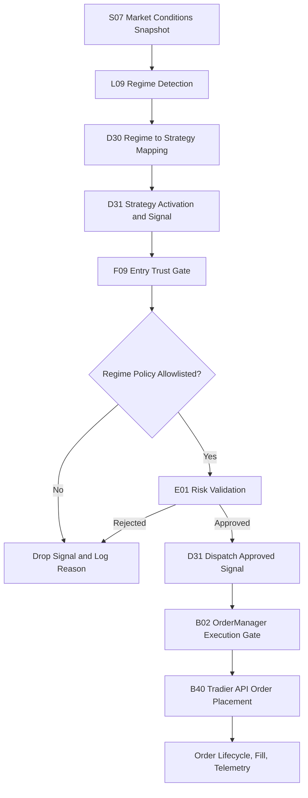

# Trading Decision Workflow (Full) — v10

Last Updated: 2026-05-06
Status: Design + As-Implemented Verification Specification
Scope: 6-Regime Master Logic and Strategy Mapping for SPY options

## Change Log

| Version | Date | Changes |
|---|---|---|
| v1 | 2026-04-28 | Initial draft |
| v2 | 2026-04-29 | Added pivot overlay section (Rule 6.1) |
| v3 | 2026-04-30 | Added cross-symbol weighting (5.1) and exact regime-key matrix (5.2) |
| v4 | 2026-05-01 | Added dashboard display field naming and 18-combination reference matrix (5.3) |
| v5 | 2026-05-01 | Corrected concurrency limit to max 1 strategy at a time; added TRADEABLE pill display spec (5.4); updated all concurrency references throughout |
| v6 | 2026-05-02 | Documented opt-in strategy extensions (Section 2.1: BULL_CALL_SPREAD, BEAR_PUT_SPREAD, PIVOT_MEAN_REVERSION env flags); added market-data input contract note (Section 9.1) reflecting the D31 per-symbol cache fix; fixed UTF-8 mojibake; updated 5.3/5.4 to acknowledge feature-flag extensions |
| v7 | 2026-05-02 | Fixed two D31/R12 startup blockers that prevented any trades from firing (Section 10.1); activated D34 PivotMeanReversion via `SPYDER_ENABLE_PIVOT_MEAN_REVERSION=true` in `.env` (Section 10.2); updated TRADEABLE tooltip in SpyderG05 to surface D34 when flag is set |
| v8 | 2026-05-02 | Fixed five PMR pipeline bugs: S08 level-selection inversion, D34 GEX path dead, TICK/breadth contradiction, D34 missing `strategy_type`, and D31 normalizer gap (Section 10.3) |
| v9 | 2026-05-05 | Added code-and-log-backed blocker investigation for "no trades" (Section 10.4), clarified execution gates vs dashboard pills, and documented current implementation drifts (concurrency default, display-vs-execution regime sourcing, dispatch exception evidence) |
| v10 | 2026-05-05 | Root-cause analysis completed (Section 10.5). Two remaining blockers patched: (1) `dispatch_exception` fix already in code (T193 GREEN); (2) `risk_state_cold` fixed by injecting synced RiskManager from R12 into D31 via `set_risk_manager` — `get_risk_manager` is a factory, not a singleton. T194 added as regression guard. |
| v11 | 2026-05-05 | Corrected concurrency contract to **2 slots** (one long-term/swing + one intraday/0DTE); replaces all v5 "max 1" references throughout. Code (`MAX_CONCURRENT_STRATEGIES = 2`, `MAX_ACTIVE_HORIZON_BUCKETS = 2`) was already correct — only documentation was stale. |
| v12 | 2026-05-05 | Replaced informational BIAS pill with execution-truth **DISPATCH** pill (closes §10.4 item #3). New `D31.get_dispatch_state()` API powers the pill (4 states: FLOWING / IDLE / BLOCKED / ERROR; 120s recency window). Section 5.3 reference matrix collapses from 18 rows to 6 (BIAS column removed). Section 5.4 updated with DISPATCH pill display spec. T195 added as regression guard (16 tests, GREEN). |
| v13 | 2026-05-05 | Merged TRADEABLE pill into DISPATCH. The legacy TRADEABLE pill carried a green "permitted" or purple "⚠ HALT" indicator and a permitted-strategies tooltip; both are now absorbed by DISPATCH. **HALT** added as a 5th DISPATCH state (purple, top priority) that fires when REGIME is CRISIS or EVENT. Permitted-strategy list and concurrency context appended to DISPATCH tooltip in every state. Pill-bar reduces from 5 pills to 4: REGIME / STRATEGY STANCE / STRATEGY GATE / DISPATCH. |
| v14 | 2026-05-06 | Re-audited trading-decision path on branch `fix/audit-v14-all`. Found and fixed a real regression: D31 dispatch path could emit `dispatch_exception` when `_record_signal_dispatch_outcome` is monkeypatched with a one-arg callable in tests (TypeError from unexpected `signal=` kwarg). Added safe wrapper usage in D31 dispatch path. Regression suite re-run: T193/T194/T195 = 28 passed. |

## 1) Objective

Define a single deterministic workflow for regime detection and strategy gating with these hard constraints:

- The default trading universe is exactly **4 strategies** (Section 2).
- **Maximum 2 strategies active concurrently** — one long-term/swing slot and one intraday/0DTE slot. Both slots may be occupied simultaneously but must belong to different horizon buckets (`MAX_ACTIVE_HORIZON_BUCKETS = 2`).
- **CRISIS and EVENT regimes are hard halt states** (no new entries).
- Operators may opt into extension strategies via env flags (Section 2.1). Extensions never relax CRISIS/EVENT halts.

## 1.1) End-to-End Automated Execution Flow (Compact)



## 2) Allowed Strategies and Regime Mapping (Default Contract)

| Regime | Trading Posture | Permitted Strategy |
|---|---|---|
| 1. BULL REGIME | Directional bullish premium | SpyderD06_BullPutSpread |
| 2. BEAR REGIME | Directional bearish premium | SpyderD07_BearCallSpread |
| 3. RANGE REGIME | Range / mean containment | SpyderD02_IronCondor |
| 4. VOLATILE REGIME | High-volatility mean reversion | SpyderD10_IronButterfly |
| 5. CRISIS REGIME | Turbulent / disorderly | HARD HALT / KILL-SWITCH |
| 6. EVENT REGIME | Scheduled macro transition window | HARD HALT / NO TRADE |

This is the default ("v5 contract") mapping with all extension flags off.

## 2.1) Opt-In Strategy Extensions (Feature Flags)

Operators may enable narrow, regime-scoped strategy alternatives without changing the contract's hard policy (4-strategy default, 2-strategy concurrency cap, hard halts on CRISIS/EVENT). All flags default **off**. Each flag swaps in an alternative strategy for a specific regime; the default mapping remains active for any regime whose flag is not set.

### 2.1.1) `SPYDER_ENABLE_BULL_CALL_SPREAD` — debit alternative for BULL

When set to `true`, the BULL regime maps to **SpyderD15_BullCallSpread** (debit, directional) instead of SpyderD06_BullPutSpread (credit). All other regimes are unchanged.

| Flag state | BULL regime maps to |
|---|---|
| off (default) | SpyderD06_BullPutSpread |
| on | SpyderD15_BullCallSpread |

### 2.1.2) `SPYDER_ENABLE_BEAR_PUT_SPREAD` — debit alternative for BEAR

When set to `true`, the BEAR regime maps to **SpyderD16_BearPutSpread** (debit, directional) instead of SpyderD07_BearCallSpread (credit). All other regimes are unchanged.

| Flag state | BEAR regime maps to |
|---|---|
| off (default) | SpyderD07_BearCallSpread |
| on | SpyderD16_BearPutSpread |

### 2.1.3) `SPYDER_ENABLE_PIVOT_MEAN_REVERSION` — pivot-conditional alternative for RANGE

When set to `true`, the RANGE regime maps to **SpyderD34_PivotMeanReversion** *only when the S08 pivot signal is firing on the current tick*. When the pivot signal is not firing, RANGE falls back to SpyderD02_IronCondor (the v5 default).

| RANGE regime + flag state | S08 `pivot_signal.fired` | Strategy |
|---|---|---|
| flag off (default) | any | SpyderD02_IronCondor |
| flag on | `false` | SpyderD02_IronCondor |
| flag on | `true` | SpyderD34_PivotMeanReversion |

This satisfies the v5 spirit of Rule 6.1 (pivot overlay as a qualifier) while letting D34 take the trade when the operator explicitly opts in. CRISIS, EVENT, BULL, BEAR, and VOLATILE behavior is unchanged.

### Combined behavior

- Multiple flags may be on simultaneously; each affects only its own regime.
- The concurrency cap of 2 is unchanged — at most one long-term/swing strategy and one intraday/0DTE strategy may be active simultaneously.
- F09 Entry Trust Gate's regime-policy allowlist must be updated to include any opt-in strategy whose flag is enabled, otherwise signals from the alternative strategy will be dropped at the gate.
- D31's `lean_strategy_allowlist` enforces these flags at registry time: when off, the candidate-strategy filter drops the alternative class entirely.

## 3) Deterministic Input Universe

### Symbols

- SPY: Primary tradable and trend anchor
- VIX: Volatility level and stress anchor
- VIX9D: Front-vol term structure stress check
- VXV: Mid-tenor term structure context (fallback optional)

### Event Signal

- Event clock state from scheduler/calendar (for example FOMC/CPI windows)
- Event window default: plus/minus 30 minutes around high-impact event timestamp

### Required Indicators

- SPY EMA50
- VIX EMA50
- SPY ATR and ATR percent (ATR divided by SPY price)
- VIX percentile (rolling lookback, default 252 trading days)
- Intraday SPY return over short horizon (for shock detection)
- Daily pivot ladder: P, R1, R2, R3, S1, S2, S3
- Distance-to-pivot metrics (in ATR units) for nearest support and resistance

## 4) Regime Trigger Logic (Deterministic, Priority-Ordered)

Use first-match precedence from top to bottom.

### 4.0) Canonical Master Logic (Exact Required Elements)

The following six definitions are mandatory and must be preserved exactly in implementation intent:

| # | Regime | Mathematical Trigger Logic | Strategy / Action |
|---|---|---|---|
| 1 | Bull Regime | SPY > 50-EMA AND VIX < 50-EMA | SpyderD06_BullPutSpread |
| 2 | Bear Regime | SPY < 50-EMA AND VIX > 50-EMA | SpyderD07_BearCallSpread |
| 3 | Range Regime | SPY within ATR bands AND VIX Contango | SpyderD02_IronCondor |
| 4 | Volatile Regime (High-Volatility Mean Reversion) | SPY ATR Elevated AND VIX > 80th PCTL | SpyderD10_IronButterfly |
| 5 | Crisis Regime (Turbulent) | VIX9D > VIX (Term Structure Inversion) | HARD HALT / KILL-SWITCH |
| 6 | Event Regime (Transition) | Calendar Proximity (for example +/-30 mins of FOMC) | HARD HALT / NO TRADE |

Interpretation:

- Section 4.0 is the canonical rule set.
- The detailed rules below must remain consistent with this canonical set.
- If any extended safety condition is added, it must not weaken these six required triggers/actions.
- Section 2.1 opt-in flags swap which strategy is mapped *within* a regime; they never change the regime triggers themselves.

### Rule 0: EVENT REGIME (highest priority)

Trigger:
- event_clock_state in {pre, live, post}
- or absolute time distance to high-impact event less than or equal to 30 minutes

Action:
- Regime = EVENT
- Hard halt: no new strategy entries

### Rule 1: CRISIS REGIME

Trigger (any one condition):
- VIX9D greater than VIX (front-vol inversion), or
- VIX greater than or equal to 35, or
- SPY short-horizon drop less than or equal to -1.25% AND VIX change greater than or equal to +4 points

Action:
- Regime = CRISIS
- Hard halt / kill-switch: flatten entry pipeline and block new risk

### Rule 2: BULL REGIME

Trigger (all):
- SPY greater than SPY EMA50
- VIX less than VIX EMA50
- Not EVENT and not CRISIS

Action:
- Regime = BULL
- Strategy = SpyderD06_BullPutSpread (default; or SpyderD15_BullCallSpread if `SPYDER_ENABLE_BULL_CALL_SPREAD=true`)

### Rule 3: BEAR REGIME

Trigger (all):
- SPY less than SPY EMA50
- VIX greater than VIX EMA50
- Not EVENT and not CRISIS

Action:
- Regime = BEAR
- Strategy = SpyderD07_BearCallSpread (default; or SpyderD16_BearPutSpread if `SPYDER_ENABLE_BEAR_PUT_SPREAD=true`)

### Rule 4: RANGE REGIME

Trigger (all):
- Absolute distance of SPY from EMA50 less than or equal to 1.0 ATR
- Term structure not stressed (VIX9D less than or equal to VIX, or VIX less than or equal to VXV)
- Not EVENT and not CRISIS

Action:
- Regime = RANGE
- Strategy = SpyderD02_IronCondor (default; or SpyderD34_PivotMeanReversion if `SPYDER_ENABLE_PIVOT_MEAN_REVERSION=true` AND S08 `pivot_signal.fired=true`)

### Rule 5: VOLATILE REGIME

Trigger (all):
- SPY ATR percent greater than or equal to 1.5%
- VIX percentile greater than or equal to 80th percentile OR VIX greater than or equal to 25
- Not EVENT and not CRISIS

Action:
- Regime = VOLATILE
- Strategy = SpyderD10_IronButterfly

### Rule 6: Fallback

If no rule is matched:
- Assign RANGE as safe fallback
- Strategy = SpyderD02_IronCondor

### Rule 6.1: Pivot Opportunity Overlay (execution qualifier, no new strategy)

Purpose:
- Convert strong pivot reactions into deterministic entry timing improvements.
- Preserve the canonical 4-strategy mapping (no additional strategy types) **unless** Section 2.1 opt-in flags are explicitly enabled.

Policy:
- Regime classification in Rules 0-6 remains authoritative.
- Pivot overlay only qualifies or delays entry timing for the mapped strategy.
- Pivot overlay must never override EVENT or CRISIS hard-halt states.
- When `SPYDER_ENABLE_PIVOT_MEAN_REVERSION=true`, a firing pivot signal additionally swaps the RANGE-mapped strategy from IronCondor to D34 PivotMeanReversion (per Section 2.1.3); this does not change the qualifier behavior described below.

Source of truth:
- Pivot overlay input is the live `SpyderS08_PivotMeanReversionSignal` payload.
- Required consumed fields: `direction`, `score`, `fired`, `nearest_level_name`, `nearest_level_price`, `atr_distance`, `reasons`, `penalties`.
- Integration keys accepted in runtime payloads: `pivot_mr_signal` (preferred), `s08_pivot_signal` (fallback alias).

Deterministic qualifiers by mapped strategy:
- Bull regime -> SpyderD06_BullPutSpread (or SpyderD15_BullCallSpread when extension flag is on):
  - Prefer entries on rejection/hold above P or S1 with bullish micro-momentum.
  - Block fresh entry if price is stretched into R2/R3 without pullback confirmation.
- Bear regime -> SpyderD07_BearCallSpread (or SpyderD16_BearPutSpread when extension flag is on):
  - Prefer entries on rejection/hold below P or R1 with bearish micro-momentum.
  - Block fresh entry if price is stretched into S2/S3 without bounce confirmation.
- Range regime -> SpyderD02_IronCondor (or SpyderD34_PivotMeanReversion when extension flag is on AND pivot fired):
  - Prefer entries when price is rotating around P and remains inside R1/S1.
  - Reduce confidence or delay when price is expanding toward R2 or S2.
- Volatile regime -> SpyderD10_IronButterfly:
  - Prefer entries near central pivot magnet behavior after expansion/reversion signal.
  - Delay entry on one-direction trend acceleration through R2/R3 or S2/S3.

Logging requirement:
- Every pivot-qualified block must emit `pivot_block_reason` and nearest level context.
- Example reasons: `pivot_stretch_no_pullback`, `pivot_breakout_unconfirmed`, `pivot_rotation_absent`.
- When available, include S08 context in decision logs: direction, score, fired-state, nearest level, and ATR distance.
- When a feature-flag swap occurs, emit `selector_feature_flag` recording which env flag drove the choice (one of: `SPYDER_ENABLE_BULL_CALL_SPREAD`, `SPYDER_ENABLE_BEAR_PUT_SPREAD`, `SPYDER_ENABLE_PIVOT_MEAN_REVERSION`).

## 5) Regime Detection Signals by Regime

### BULL

- Positive SPY trend state: SPY above EMA50
- Benign vol trend state: VIX below EMA50
- Optional confirmation: stable term structure (no VIX9D inversion)

### BEAR

- Negative SPY trend state: SPY below EMA50
- Rising vol trend state: VIX above EMA50
- Optional confirmation: weakening term structure

### RANGE

- SPY oscillating around EMA50 inside ATR band
- No front-vol inversion
- Volatility not in high-percentile stress state

### VOLATILE

- Elevated realized movement (ATR percent high)
- Elevated implied volatility context (VIX percentile high)
- Not in outright crisis dislocation

### CRISIS

- Front-vol inversion, or very high VIX, or joint price shock plus vol shock
- This is always risk-first, no new trade state

### EVENT

- Calendar proximity to high-impact macro event window
- This is always no-trade by policy

## 5.1) Cross-Symbol and Metric Weighting by Regime

This section mirrors the policy-aligned mapping in
01-Overview-Specs/Autonomous-Decision-Contract.md so both documents stay consistent.

| Regime | Primary symbols to weight | Primary metrics to weight | Deterministic trigger + mapped strategy/action | Typical gate emphasis |
|---|---|---|---|---|
| BULL REGIME | SPY, QQQ, XLK, VIX, VIX9D | BREADTH_REGIME, GEX, DIX, dealer_flow, flow_imbalance | SPY > 50-EMA AND VIX < 50-EMA -> SpyderD06_BullPutSpread | Confirm SPY-relative leadership (QQQ/XLK), reject weak participation (RVOL), guard against short-term vol stress (VIX9D/VIX) |
| BEAR REGIME | SPY, IWM, XLF, VIX, VVIX | BREADTH_REGIME, SWAN, CHEX, wall_confidence, dealer_flow | SPY < 50-EMA AND VIX > 50-EMA -> SpyderD07_BearCallSpread | Confirm downside breadth/financial weakness (IWM/XLF), tighten CPC/VVIX stress checks, require strong data_quality_feed |
| RANGE REGIME | SPY, VIX, VIX9D, CPC | GEX, DIX, BREADTH_REGIME, rr_25d, fly_25d | SPY within ATR bands AND VIX Contango -> SpyderD02_IronCondor | Favor neutral participation and stable vol-of-vol; block if cross-index confirmation or surface quality deteriorates |
| VOLATILE REGIME | SPY, VIX, VIX9D, VVIX, SKEW | SWAN, VEX, CHEX, rr_25d, fly_25d, term_slope_0_7 | SPY ATR Elevated AND VIX > 80th PCTL -> SpyderD10_IronButterfly | Emphasize vol-shock containment, skew/term-structure quality, and stricter surface_confidence/surface_age_ms thresholds |
| CRISIS REGIME | SPY, VIX, VVIX, $TICK, $ADD, $TRIN | SWAN, CHEX, BREADTH_REGIME, YIELD_INVERTED, YIELD_SLOPE | VIX9D > VIX (Term Structure Inversion) -> HARD HALT / KILL-SWITCH | Prefer hard-block posture; strongest dependence on data_quality_feed, stress metrics, and internals where available |
| EVENT REGIME | SPY, VIX, VIX9D, QQQ, IWM, XLK, XLF | BREADTH_REGIME, DIX, GEX, YIELD_10Y, AAII_BULLISH, AAII_BEARISH, NAAIM_EXPOSURE | Calendar Proximity (for example +/-30 mins of FOMC) -> HARD HALT / NO TRADE | Event-clock style caution: maintain confirmation gates, reduce trust in stale/aging surface inputs, and avoid over-reliance on any single macro print |

Interpretation notes:

- This weighting matrix governs cross-symbol confirmation and quality weighting.
- Deterministic regime trigger precedence in Section 4 remains the hard classifier for regime labeling.
- In any conflict, EVENT and CRISIS hard-halt policy overrides all symbol/metric weighting outcomes.
- Section 2.1 opt-in flags do not alter the symbol/metric weighting profile of a regime; they only change which strategy is dispatched downstream.

### 5.2) Exact Regime-Key Matrix (Canonical Labels from Contract)

This is the exact regime-key version requested for implementation/reference alignment.

| Regime | Primary symbols to weight | Primary metrics to weight | Deterministic trigger + mapped strategy/action | Typical gate emphasis |
|---|---|---|---|---|
| bull_trend | SPY, QQQ, XLK, VIX, VIX9D | BREADTH_REGIME, GEX, DIX, dealer_flow, flow_imbalance | SPY > 50-EMA AND VIX < 50-EMA -> SpyderD06_BullPutSpread | Confirm SPY-relative leadership (QQQ/XLK), reject weak participation (RVOL), guard against short-term vol stress (VIX9D/VIX) |
| bear_trend | SPY, IWM, XLF, VIX, VVIX | BREADTH_REGIME, SWAN, CHEX, wall_confidence, dealer_flow | SPY < 50-EMA AND VIX > 50-EMA -> SpyderD07_BearCallSpread | Confirm downside breadth/financial weakness (IWM/XLF), tighten CPC/VVIX stress checks, require strong data_quality_feed |
| range_calm | SPY, VIX, VIX9D, CPC | GEX, DIX, BREADTH_REGIME, rr_25d, fly_25d | SPY within ATR bands AND VIX Contango -> SpyderD02_IronCondor | Favor neutral participation and stable vol-of-vol; block if cross-index confirmation or surface quality deteriorates |
| high_vol_mean_reversion | SPY, VIX, VIX9D, VVIX, SKEW | SWAN, VEX, CHEX, rr_25d, fly_25d, term_slope_0_7 | SPY ATR Elevated AND VIX > 80th PCTL -> SpyderD10_IronButterfly | Emphasize vol-shock containment, skew/term-structure quality, and stricter surface_confidence/surface_age_ms thresholds |
| crisis_turbulent | SPY, VIX, VVIX, $TICK, $ADD, $TRIN | SWAN, CHEX, BREADTH_REGIME, YIELD_INVERTED, YIELD_SLOPE | VIX9D > VIX (Term Structure Inversion) -> HARD HALT / KILL-SWITCH | Prefer hard-block posture; strongest dependence on data_quality_feed, stress metrics, and internals where available |
| event_transition | SPY, VIX, VIX9D, QQQ, IWM, XLK, XLF | BREADTH_REGIME, DIX, GEX, YIELD_10Y, AAII_BULLISH, AAII_BEARISH, NAAIM_EXPOSURE | Calendar Proximity (for example +/-30 mins of FOMC) -> HARD HALT / NO TRADE | Event-clock style caution: maintain confirmation gates, reduce trust in stale/aging surface inputs, and avoid over-reliance on any single macro print |

### 5.3) Dashboard Display Field Names and 6-Regime Reference Matrix

#### Field Name Decisions (Final — 2026-05-05, v13)

| Internal Name | Dashboard Display Label | Source |
|---|---|---|
| Regime (L09 output) | **Regime** | SpyderL09_UnifiedRegimeEngine |
| Exec Bucket (D30 output) | **Strategy Stance** | SpyderD30_RegimeGatedSelector |
| Policy Key (D31 gate) | **Strategy Gate** | SpyderD31_StrategyOrchestrator |
| D31 dispatch state + halt | **Dispatch** | `SpyderD31.get_dispatch_state()` + regime-driven HALT priority (v13; absorbed legacy BIAS and TRADEABLE pills) |

> **v12–v13 changes:**
> - **v12** removed the informational BIAS pill — derived from R08's directional logic, but did not gate execution, so the dashboard could show "everything green" while D31 silently dropped every signal. The new **DISPATCH** pill surfaces D31's actual approve/drop/error verdicts.
> - **v13** removed the TRADEABLE pill and merged its content into DISPATCH: the green/permitted state is now implicit (DISPATCH = FLOWING / IDLE), the purple `⚠ HALT` indicator becomes a top-priority `DISPATCH = HALT` state, and the permitted-strategy / concurrency tooltip content is appended to DISPATCH's tooltip in every state.
> - R08's internal `_regime_preferred_direction` and `_pivot_preferred_direction` methods are unchanged — they still drive directional spread selection inside R08.

#### Strategy Stance Display Values

| Internal Value | Dashboard Display Value |
|---|---|
| BULL | BULLISH |
| CHOP | CHOPPY |
| CRISIS | CRISIS |
| UNKNOWN | UNKNOWN |

#### Dispatch Display Values

Priority (high → low): **HALT > ERROR > BLOCKED > FLOWING > IDLE**.

| Value | Color | Meaning |
|---|---|---|
| HALT | Purple | REGIME is CRISIS or EVENT — hard halt / kill-switch policy. Top priority; preempts all other DISPATCH states. (v13: absorbed the legacy TRADEABLE halt indicator.) |
| ERROR | Red | A `dispatch_exception` occurred in the last 120s. System error, not a guardrail. Tooltip surfaces the exception detail; full context in `logs/decisions/YYYY-MM-DD.jsonl` |
| BLOCKED | Amber | A guardrail dropped the latest signal in the last 120s. Tooltip surfaces the `{stage}:{reason}` (e.g. `risk_gate:risk_state_cold`, `entry_trust_gate:Weekend - markets closed`) |
| FLOWING | Green | D31 approved-and-dispatched a signal in the last 120s |
| IDLE | Grey | No signal events in the last 120s (no drops, no dispatches). Expected outside RTH or between strategy cadences |

Recency window is `DISPATCH_STATE_RECENCY_S = 120.0` ([D31:539](../Spyder/SpyderD_Strategies/SpyderD31_StrategyOrchestrator.py#L539)). HALT is layered in G05 from REGIME (CRISIS/EVENT); the four base states are returned by `D31.get_dispatch_state()` directly.

#### Complete 6-Regime Reference Matrix

| # | Regime | Strategy Stance | Strategy Gate | Possible Dispatch States |
|---|---|---|---|---|
| 1 | BULL | BULLISH | Bull Trend | FLOWING / IDLE / BLOCKED / ERROR |
| 2 | BEAR | CHOPPY | Bear Trend | FLOWING / IDLE / BLOCKED / ERROR |
| 3 | RANGE | CHOPPY | Range Calm | FLOWING / IDLE / BLOCKED / ERROR |
| 4 | VOLATILE | CHOPPY | High Vol | FLOWING / IDLE / BLOCKED / ERROR |
| 5 | CRISIS | CRISIS | Crisis | **HALT** (forced — purple) |
| 6 | EVENT | CRISIS | Event | **HALT** (forced — purple) |

#### Notes on the Matrix

- **Rows 1–4 (BULL / BEAR / RANGE / VOLATILE)**: STANCE distinguishes BULL from the rest, GATE distinguishes the three CHOPPY rows. DISPATCH cycles through FLOWING / IDLE / BLOCKED / ERROR independently as signals fire and gates evaluate.
- **BEAR / RANGE / VOLATILE share STANCE = CHOPPY** by D30's design — STANCE is a coarse posture label, not a strategy identifier. The specific permitted strategy is given by Strategy Gate.
- **Rows 5–6 (CRISIS / EVENT)**: DISPATCH is forced to HALT (purple). HALT is the *only* state these regimes can produce because the regime-driven override preempts D31's own verdicts.
- **DISPATCH does not gate execution** — it is an *observation* of D31's verdicts (with the regime-driven HALT layer added on top in G05). STRATEGY GATE remains the authoritative execution control; DISPATCH simply makes its output visible to the operator.
- **Section 2.1 opt-in flags do not change this matrix.** Regime / Stance / Gate / Dispatch are display fields; the *underlying mapped strategy* may be the v5 default or the extension alternative depending on flag state and (for D34) S08 pivot fired-state. The dashboard's Strategy Gate shows the policy bucket, not the specific strategy class.

### 5.4) DISPATCH Pill Display Specification

The **DISPATCH** pill is the only runtime-observation pill in the regime bar. It surfaces D31's actual execution verdicts (`get_dispatch_state()`) plus a regime-driven HALT layer, so the operator can see at a glance whether trades are flowing, idle, blocked by a guardrail, hitting a system error, or hard-halted by CRISIS/EVENT — without grepping the decision log.

In v13 it absorbed the legacy TRADEABLE pill: the green/permitted state is implicit in `FLOWING` / `IDLE` / `BLOCKED`, the purple `⚠ HALT` indicator becomes a dedicated `HALT` state, and TRADEABLE's permitted-strategy / concurrency tooltip content is appended to DISPATCH's tooltip in every state.

#### Display states

Priority (high → low): **HALT > ERROR > BLOCKED > FLOWING > IDLE**.

| State | Pill Text | Pill Color | Trigger |
|---|---|---|---|
| Halt | `DISPATCH: HALT` | Purple | REGIME is CRISIS or EVENT — hard halt / kill-switch policy. Top priority; preempts D31's own verdicts. |
| Error | `DISPATCH: ERROR` | Red | A `dispatch_exception` occurred within the recency window |
| Blocked | `DISPATCH: BLOCKED` | Amber | A guardrail dropped the latest signal within the recency window |
| Flowing | `DISPATCH: FLOWING` | Green | D31 approved-and-dispatched a signal within the recency window (120s) |
| Idle | `DISPATCH: IDLE` | Grey | No signal events within the recency window — expected outside RTH or between strategy cadences |

Recency window is `DISPATCH_STATE_RECENCY_S = 120.0` (configurable in code at [D31:539](../Spyder/SpyderD_Strategies/SpyderD31_StrategyOrchestrator.py#L539)). Beyond that, the four base states collapse to IDLE. HALT is layered in G05 from REGIME (CRISIS/EVENT) and is not subject to the recency window — it persists for the full duration of the halt regime.

#### Tooltip behavior

The tooltip is structured in three sections, separated by blank lines:

1. **State description** — drawn from `_DISPATCH_TIPS` (one entry per state).
2. **Latest reason** — `Reason: <text>` from `D31.get_dispatch_state()` (omitted only if no reason is available).
3. **Permitted strategies and concurrency context** — the same content the legacy TRADEABLE pill carried, now shown in every state.

| State | Tooltip suffix example |
|---|---|
| HALT | (no per-event reason — the `regime=CRISIS/EVENT` is the reason) |
| FLOWING | `Reason: last dispatched: bull_put_spread` |
| IDLE | `Reason: no signals in last 120s` |
| BLOCKED | `Reason: risk_gate:risk_state_cold` *(or)* `Reason: entry_trust_gate:Weekend - markets closed` |
| ERROR | `Reason: dispatch_exception: SimpleNamespace has no attribute 'message'` |

Permitted-strategies block (always shown):

> **Permitted strategies:**
> - **BULL:** SpyderD06_BullPutSpread *(or SpyderD15_BullCallSpread when `SPYDER_ENABLE_BULL_CALL_SPREAD=true`)*
> - **BEAR:** SpyderD07_BearCallSpread *(or SpyderD16_BearPutSpread when `SPYDER_ENABLE_BEAR_PUT_SPREAD=true`)*
> - **RANGE:** SpyderD02_IronCondor *(or SpyderD34_PivotMeanReversion when `SPYDER_ENABLE_PIVOT_MEAN_REVERSION=true` AND S08 pivot fired)*
> - **VOLATILE:** SpyderD10_IronButterfly
>
> **Concurrency limit:** Max 2 strategies open (one long-term/swing + one intraday/0DTE)

Env flags are resolved at tooltip render time so changes take effect without a restart. The italic *(or ...)* annotations appear only when the corresponding env flag is set.

#### Notes

- DISPATCH is an **observation**, not a gate. STRATEGY GATE remains the authoritative execution control.
- DISPATCH falls back to IDLE when no SessionSupervisor is running (paper/live not yet started). HALT still applies in this case if REGIME is CRISIS/EVENT (regime evaluation is independent of D31).
- T195 ([SpyderT195_D31_DispatchStateBadge.py](../Spyder/SpyderT_Testing/SpyderT195_D31_DispatchStateBadge.py)) is the regression guard for the four D31-returned base states (FLOWING / IDLE / BLOCKED / ERROR), priority ordering, recency-window collapse, and strategy-type capture: 16 tests, GREEN. The HALT layer is a thin G05 conditional and is not exercised by T195.

## 6) Strategy Gating and Concurrency Rules

### Hard Policy

- The default strategy universe is exactly:
  - SpyderD06_BullPutSpread
  - SpyderD07_BearCallSpread
  - SpyderD02_IronCondor
  - SpyderD10_IronButterfly
- Section 2.1 opt-in flags may add up to three regime-scoped extension strategies (SpyderD15_BullCallSpread, SpyderD16_BearPutSpread, SpyderD34_PivotMeanReversion). Extensions are explicit, env-flag-gated, and do not relax the concurrency cap or the CRISIS/EVENT hard halts.
- No other strategy may be activated by the regime selector.

### Concurrency Cap

- Maximum concurrently active strategies = **2**: one long-term/swing slot and one intraday/0DTE slot.
- Both slots may be occupied simultaneously but each must occupy a different horizon bucket (`ultra_short` for 0DTE/1DTE; `short` or `swing` for multi-day strategies).
- Enforced in D31 via `MAX_CONCURRENT_STRATEGIES = 2` and `MAX_ACTIVE_HORIZON_BUCKETS = 2`.
- Opt-in extensions do not change the cap — the two-slot rule applies regardless of which (default or extension) strategies are chosen.

### Runtime Behavior

- Normal steady state: up to 2 active strategies — one per horizon bucket.
- EVENT/CRISIS: 0 active entry strategies; kill-switch posture.

### Handoff Guardrails

- If regime changes, deactivate the outgoing strategy before activating the incoming strategy.
- If the active extension flag is toggled mid-session and causes a strategy swap within the *same* regime (e.g. RANGE pivot fires while D34 is enabled), apply the same handoff rule: deactivate IronCondor before activating D34.
- If entering EVENT or CRISIS, immediately deactivate all entries (no handoff grace).

## 7) End-to-End Workflow

1. Ingest SPY/VIX/VIX9D/VXV prices and event clock.
2. Compute deterministic indicators (EMA50, ATR percent, VIX percentile, short-horizon SPY return).
3. Evaluate regime rules in strict priority order.
4. Emit one regime label.
5. Apply regime-to-strategy map (default per Section 2; extension flags from Section 2.1 may swap the mapped strategy within the same regime).
6. Apply pivot opportunity overlay as entry timing qualifier for the mapped strategy.
7. Enforce hard halt rules for EVENT/CRISIS.
8. Enforce max 2 concurrent strategies (one long-term/swing + one intraday/0DTE, enforced per horizon bucket).
9. Pass only allowed strategy signals downstream to risk and execution.

## 8) Decision Contract for L09 and D30

### L09 Unified Regime Engine (contract)

- Must produce only one of:
  - bull_trending
  - bear_trending
  - sideways_range
  - high_volatility
  - crisis_mode
  - event_transition
- Classification must be deterministic and precedence-ordered.
- ML, probabilistic blending, and non-deterministic weighting are excluded from this contract.
- L09 must be fed real per-symbol tick series (see Section 9.1); a missing or stale series must surface as a DATA_STALE event rather than silently fall through to a RANGE fallback on synthetic defaults.

### D30 Regime Gated Selector (contract)

- Must map regimes one-to-one to a permitted strategy or hard halt state.
- The permitted set is the four v5 default strategies plus any Section 2.1 extension whose env flag is enabled at selector init time.
- Must enforce max concurrent strategies = 2 (one per horizon bucket).
- Must block all non-approved strategy types.
- Must record `selector_feature_flag` on every selection that was driven by an extension flag, so audit logs show whether a non-default strategy was chosen and why.

## 9) Operational Safety Defaults

- Default mode for EVENT and CRISIS is no-trade.
- If required indicator data is missing, fail safe to EVENT/NO TRADE or RANGE according to deployment policy. Prefer surfacing missing-data as a DATA_STALE event over silently producing a synthetic regime label.
- All state transitions must be timestamped and auditable.
- All extension-flag swaps (Section 2.1) must be auditable: the audit log records which flag was active, what the v5 default would have been, and what was actually selected.

### 9.1) Market-Data Input Contract for L09

L09's regime classifier requires per-symbol rolling tick series for SPY, VIX, VIX9D, and (optionally) VXV. The orchestrator's market-data cache must satisfy this contract:

- **Cache shape**: `cache[symbol]` returns an iterable of tick dicts (each containing at least `close` or `price`, ideally also `high` and `low` for ATR), bounded to a rolling window large enough to compute EMA50 and ATR14 with comfortable headroom (default 200 ticks per symbol).
- **Per-tick events**: when the publisher emits one event per tick (e.g. `{'symbol': 'SPY', 'tick': {...}}`), the consumer must bucket per-symbol — never write the per-event payload as flat top-level cache keys, which would overwrite on every tick and starve L09 of data.
- **Non-tick payloads**: top-level event types (e.g. `event_clock_state`, dark-pool block-trade summaries) may be merged as separate cache keys but must never collide with the per-symbol bucket keys.
- **Failure mode**: if a required series (SPY or VIX) is empty or has fewer than 50 close samples, L09 must emit DATA_STALE and the orchestrator must halt new entries until the series recovers. Synthesizing a default (`spy_price = 500.0`, NaN EMAs) and continuing classification is an explicit anti-pattern: it produces a permanent SIDEWAYS_RANGE / RANGE label that is indistinguishable from a legitimate calm-market reading.

This contract is verified by the regression test in `Spyder/SpyderT_Testing/SpyderT185_D31_MarketDataCacheShape.py`.

## 10) Implementation State (2026-05-02)

### 10.1) Startup Blocker Fixes — D31/R12 Pipeline

Diagnosis of the May 1 paper session identified two blockers that caused the D31/R12 pipeline to fire zero trades. Both were fixed and verified with `ast.parse()` syntax checks.

#### Blocker 1 — `orchestrator_paused` (E24 DataFreshnessMonitor)

**Root cause**: `SpyderE24_DataFreshnessMonitor` began checking for stale data immediately on startup. Within the 3-second RTH stale threshold, no tick had arrived yet, so it emitted `DATA_STALE`. D31 set `_paused_stale = True` and remained paused for the entire session (DATA_FRESH never arrived).

**Fix applied** (`SpyderE_Risk/SpyderE24_DataFreshnessMonitor.py`):
- Added `startup_grace_s: float = 0.0` parameter to `__init__` and `create_freshness_monitor()`.
- `start()` records `self._start_monotonic = time.monotonic()`.
- `_check_freshness()` returns immediately (no stale check) while `time.monotonic() - self._start_monotonic < self._startup_grace_s`.

**Wired** (`SpyderR_Runtime/SpyderR12_SessionSupervisor.py`):
- `_start_freshness_monitor()` now passes `startup_grace_s=30.0` — stale detection is suppressed for the first 30 seconds after start.

#### Blocker 2 — `risk_state_cold` (E01 RiskManager)

**Root cause A**: `_request_account_summary()` in `SpyderE01_RiskManager` swallowed all exceptions. When using `PaperBroker` (not a live `TradierClient`), the method failed silently and `_account_state_synced` was never set to `True`. The cold-start gate then rejected every signal for the rest of the session.

**Root cause B**: No public API existed to mark the account as synced from outside E01.

**Fix applied** (`SpyderE_Risk/SpyderE01_RiskManager.py`):
- Added `mark_account_synced()` public method — sets `_account_state_synced = True` under `_risk_lock` and logs the action.
- Fixed exception handler in `_request_account_summary()`: now checks `isinstance(self.tradier_client, TradierClient)`. If the client is not a live TradierClient (i.e. PaperBroker), the handler sets `_account_state_synced = True` and logs a warning instead of silently returning.

**Wired** (`SpyderR_Runtime/SpyderR12_SessionSupervisor.py`):
- `_start_risk_manager()` calls `self.risk.mark_account_synced()` after a successful `start()` whenever `self.mode != "live"`.

#### Evidence

- May 1 decision audit: 13× `orchestrator_paused`, 3× `risk_state_cold`, 0 trades fired.
- April 23 audit (R06 system): 2 trades fired (bear_call + bull_put); 248× `SPREAD_REJECTED` (correct — max-open cap).
- Both blockers are exclusive to the D31/R12 path; the legacy R06/R11 path is unaffected.

### 10.2) D34 PivotMeanReversion — Activated

`SPYDER_ENABLE_PIVOT_MEAN_REVERSION=true` has been set in `.env`. This activates Section 2.1.3 at runtime.

**Effective strategy count (lean mode)**: **5**
- BullPutSpread (D06) — BULL regime
- BearCallSpread (D07) — BEAR regime
- IronCondor (D02) — RANGE regime (default; when S08 pivot not fired)
- IronButterfly (D10) — VOLATILE regime
- PivotMeanReversion (D34) — RANGE regime (when S08 `pivot_signal.fired=true`)

**Verified** by importing `StrategyOrchestrator` with the env flag set and calling `_initialize_strategy_registry()` — confirmed 5 strategies registered.

**Dashboard tooltip** (`SpyderG05_TradingDashboard.py`, `_STRATEGY_LIST` block): updated to conditionally append `• SIDEWAYS: SpyderD34_PivotMeanReversion` when the env flag is set. The check resolves `SPYDER_ENABLE_PIVOT_MEAN_REVERSION` at tooltip render time.

**Remaining env flags** (both still off — not yet activated):
- `SPYDER_ENABLE_BULL_CALL_SPREAD` — would swap BULL → SpyderD15_BullCallSpread
- `SPYDER_ENABLE_BEAR_PUT_SPREAD` — would swap BEAR → SpyderD16_BearPutSpread

### 10.3) PMR Pipeline Bug Fixes

A full audit of the S08 → D34 → D31 pipeline uncovered five bugs. All five were fixed in this version.

#### Fix 1 — CRITICAL: S08 `_closest_breached_level` selected the wrong pivot

**File**: `SpyderS_Signals/SpyderS08_PivotMeanReversionSignal.py`

**Root cause**: The method accumulated the level with the *maximum* ATR distance (most-deeply breached) rather than the *minimum* (the level currently being tested). When SPY had passed through R1 and was testing R2, S08 returned R1 as the fade level — a level that had already broken. D25's short-strike anchor and D34's `nearest_level_name`/`nearest_level_price` outputs were both wrong.

**Example**: SPY=582, R1=578, R2=581, ATR=4 → old code selected R1 (dist=1.0); correct answer is R2 (dist=0.25).

**Fix**: Changed `dist > best[2]` → `dist < best[2]` in both the `side='above'` (resistance) and `side='below'` (support) branches of `_closest_breached_level`.

**Impact**: S08's `nearest_level_name`, `nearest_level_price`, and `atr_distance` output fields now accurately reflect the level SPY is currently testing, making `pivot_signal.fired` semantically correct. The `W_ATR_DISTANCE=15` scoring component now correctly rewards tight approaches (small dist) over deep breaches (large dist).

#### Fix 2 — MEDIUM: GEX path structurally dead in D34

**File**: `SpyderD_Strategies/SpyderD34_PivotMeanReversion.py`

**Root cause**: `update_context()` accepted only `tick`, `vix`, and `regime`. The `net_gex` field — worth `W_GEX=+20` in S08 (the single largest non-regime bonus) — was hardcoded to `None` with a comment "Injected separately if available". There was no mechanism for a caller to supply it.

**Scoring impact without GEX**: under standard RANGE conditions (ranging regime=+25, ATR trigger=+15, RSI confirm=+10, flat VWAP=+10) the maximum achievable score was exactly 60, the fire threshold. Any VIX penalty (VIX>22, −20) made the signal permanently unable to fire.

**Fix**: Added `net_gex: Optional[float] = None` parameter to `update_context()`; stored as `self._ctx_net_gex` (also initialized in `__init__`); passed to `PivotMRInputs.net_gex`.

**Caller change required**: the component feeding D34 context (R12 session supervisor or equivalent) must also pass `net_gex=` from the GEX feed (SpyderN09 or S07 snapshot) to unlock the full scoring range.

#### Fix 3 — MEDIUM: TICK gate in D34 contradicted S08 breadth scoring

**File**: `SpyderD_Strategies/SpyderD34_PivotMeanReversion.py`

**Root cause**: D34's `_tick_confirms()` required `|tick| ≥ 1000` (extreme reading) before accepting a signal. S08's breadth bonus (`W_BREADTH=+10`) required `|tick| < 800` (non-extreme reading). When D34's gate was satisfied, S08 always withheld the +10 breadth bonus and logged "TICK extreme — trend-day risk". The two modules had inverted interpretations of the same TICK value, systemically suppressing scores to exactly 60 whenever D34 confirmation was strongest.

**Fix**: `breadth_tick` is now passed as `None` to `PivotMRInputs` when called from D34 (with explanatory comment). D34 owns TICK confirmation via `_tick_confirms()`; S08 is not asked to double-score it.

#### Fix 4 — D34 signal metadata used `strategy_tag` instead of `strategy_type`

**File**: `SpyderD_Strategies/SpyderD34_PivotMeanReversion.py`, `_build_signal()`

**Root cause**: D34 emitted `"strategy_tag": "D34_PivotMR"` but not `"strategy_type"`. D31's entry trust gate reads `strategy_type` (from signal or metadata); with the key absent, every D34 signal entered the gate with an empty strategy type and regime-policy rules were unable to target it (gate failed open for all D34 signals).

**Fix**: Added `"strategy_type": "pivot_mean_reversion"` to the metadata dict in `_build_signal()` alongside the existing `strategy_tag`.

#### Fix 5 — D31 normalizer had no mapping for D34

**File**: `SpyderD_Strategies/SpyderD31_StrategyOrchestrator.py`

**Root cause**: `_normalise_strategy_type_for_entry_gate()` had no case for `"d34_pivotmr"`, `"d34"`, or `"pivot_mean_reversion"`. Even after Fix 4, the normalized form fell through to a pass-through raw string that no regime-policy alias table recognized.

**Fix**: Added `if "pivot_mean_reversion" in text or "d34_pivotmr" in text or text == "d34": return "pivot_mean_reversion"` to the normalizer. Added `"pivot_mean_reversion": {"d34_pivotmr", "pivot_mr", "d34"}` to the aliases dict in `_strategy_policy_match_tokens()`.

#### Summary table

| # | Severity | File | Description |
|---|---|---|---|
| 1 | Critical | S08 | `_closest_breached_level` selected most-breached level instead of closest |
| 2 | Medium | D34 | `net_gex` structurally unreachable — GEX bonus (+20) always zero |
| 3 | Medium | D34 | TICK gate required `≥1000`; S08 breadth awarded only when `<800` — contradictory |
| 4 | Low | D34 | `_build_signal` emitted `strategy_tag` but not `strategy_type` — entry gate blind to D34 |
| 5 | Low | D31 | Normalizer and alias table had no entry for `pivot_mean_reversion` / `d34` |

## 10.4) Investigation: Why No Trades Fired (2026-05-05)

### Scope of verification

This section verifies the live path from strategy signal to order dispatch and answers:

- Are REGIME / DISPATCH / STRATEGY STANCE / STRATEGY GATE set up? *(v12: BIAS replaced by DISPATCH)*
- Is STRATEGY GATE actually enforcing policy?
- What blockers are preventing trades right now?

### Verified gate order in running code

The live signal path in D31 is confirmed as:

1. Paused-state gate (`_paused_kill` / `_paused_stale`)
2. Session window gate
3. Entry trust gate (F09 checks + regime-policy gate)
4. Risk gate (`E01.validate_signal`)
5. Dispatch path (OrderManager mid-walk or LiveEngine fallback)

Evidence:

- D31 hot path and drop reasons: `Spyder/SpyderD_Strategies/SpyderD31_StrategyOrchestrator.py`
- Session/risk startup hardening: `Spyder/SpyderR_Runtime/SpyderR12_SessionSupervisor.py`

### Are REGIME / DISPATCH / STANCE / GATE being set correctly?

Yes, with the caveat that REGIME / STANCE / GATE are still derived in G05 from S07 metrics (sticky-fallback logic), while **DISPATCH** is a direct read of D31's runtime verdicts via `get_dispatch_state()` (with a regime-driven HALT layer added in G05).

- Execution gates use D31 + F09 + E01 runtime checks.
- The **DISPATCH** pill (added v12) reflects D31's actual verdicts — FLOWING / IDLE / BLOCKED / ERROR. This closes the previous "green dashboard, no trades" gap.
- The legacy informational BIAS pill was removed in v12 (see §5.3, §5.4). R08's internal directional logic still drives strike selection, but is no longer surfaced as a top-level pill since it does not gate dispatch.

Implication:

- A "green-looking dashboard" can no longer coexist silently with blocked execution — DISPATCH would render BLOCKED or ERROR if D31 is dropping signals.

### Is STRATEGY GATE really working?

Yes. It is active and demonstrably blocking signals by policy and trust checks.

Observed `signal_dropped` reasons in decision logs include:

- `orchestrator_paused`
- `risk_gate:risk_state_cold`
- `entry_trust_gate` with `Weekend - markets closed`
- `entry_trust_gate` with `Data-quality trust policy failed: freshness_ok`
- `entry_trust_gate` with `regime_policy:not_allowed_strategy:iron_condor_defined_risk:bull_trend`

Decision-log evidence files:

- `logs/decisions/2026-05-01.jsonl`
- `logs/decisions/2026-05-02.jsonl`
- `logs/decisions/2026-05-03.jsonl`

### Blocker matrix (as observed)

| Blocker | Stage | Confirmed in logs | Status |
|---|---|---|---|
| `orchestrator_paused` | pre-risk | yes | Legitimate safety stop when kill/stale pause is active |
| `risk_state_cold` | risk gate | yes | Startup/account-sync dependency; mitigated in R12 paper mode but still visible in historical runs |
| Weekend/market-closed | entry trust | yes | Expected behavior, not a bug |
| Data freshness failure (`freshness_ok`) | entry trust | yes | Expected protection; indicates data feed quality/timing issue at decision time |
| Strategy not allowed for regime | regime policy | yes | Expected if strategy-regime pair is off-policy |
| `dispatch_exception` (`SimpleNamespace` has no `message`) | dispatch | yes | Active bug on some dispatch paths; can block order submission after approval |

### As-implemented drifts to track in v9

1. ~~Concurrency default drift~~ — **RESOLVED in v11.** Contract is now 2 slots (one long-term + one intraday). Code was already correct; documentation updated.

2. ~~Display-vs-execution regime source split~~ — **RESOLVED in v12.** DISPATCH pill ([G05 `_get_dispatch_state_safe()`](../Spyder/SpyderG_GUI/SpyderG05_TradingDashboard.py)) reads D31's verdicts directly via `get_dispatch_state()`. REGIME / STANCE / GATE remain S07-derived (acceptable — they convey *posture*, not execution truth). v13 then collapsed TRADEABLE into DISPATCH so the pill bar has a single execution-truth surface.

3. Dispatch-layer exception risk
  - Decision logs show dispatch exceptions in production-like runs.
  - This is downstream of gating and can still result in no filled trade even when pre-dispatch gates pass.
  - In v12 these now light up the DISPATCH pill as `ERROR` (red) so the operator notices in real time instead of needing to tail the decision log.

### Operational interpretation

No evidence of a single silent "strategy gate broken" failure. The no-trade outcome is primarily explained by active guardrails and context:

- Non-trading windows (weekend/closed)
- Startup/cold-state transitions
- Data-quality gate failures
- Strategy-regime policy mismatches
- A separate dispatch exception path that can interrupt approved signals

### Required next hardening actions

1. ~~Patch D31 dispatch handling to tolerate result objects without a `message` attribute.~~  
   **DONE** — `getattr` extraction already applied at D31 lines 4358–4367; T193 (6 tests) GREEN.
2. ~~Align concurrency contract in docs vs code (choose 1 or 2 and make all layers consistent).~~  
   **DONE in v11** — code (`MAX_CONCURRENT_STRATEGIES = 2`, `MAX_ACTIVE_HORIZON_BUCKETS = 2`) was already correct; docs updated to 2 slots throughout. G05 TRADEABLE tooltip refreshed to "Max 2 strategies open (one long-term/swing + one intraday/0DTE)" in v12.
3. ~~Add a dashboard badge sourced from latest D31 decision-drop reason (execution truth), not only pill-derived state.~~  
   **DONE in v12** — DISPATCH pill replaces legacy BIAS pill. Powered by `D31.get_dispatch_state()`; renders FLOWING / IDLE / BLOCKED / ERROR with 120s recency. Regression guard: T195 (16 tests) GREEN. See §5.3, §5.4.
4. Run a weekday paper-session validation window and confirm at least one fully approved-and-dispatched trade path in logs.

## 10.5) Root-Cause Analysis and Fixes (2026-05-05)

### Sessions in decision logs were all weekend/off-hours tests

All recorded sessions (2026-05-02, 2026-05-03) ran on Saturday/Sunday or outside RTH:

- `entry_trust_gate` reason `Weekend - markets closed` confirms this.
- `orchestrator_paused` drops are expected: E24's freshness monitor fires DATA_STALE after 30 s OOH when no market data ticks arrive on weekends. This is correct safety behavior.

### Bug 1 — `dispatch_exception: SimpleNamespace has no attribute 'message'` (ALREADY FIXED)

**Root cause:** `_dispatch_approved_signal` previously accessed `walk_result.message` and `walk_result.error_code` directly. When `submit_limit_with_walk` returns a bare `SimpleNamespace` (no `message` field), `AttributeError` is raised and caught as `dispatch_exception`.

**Fix location:** D31 lines 4358–4367 — all attribute access replaced with `getattr(obj, attr, None)`.

**Verification:** `SpyderT193_D31_DispatchResultHardening.py` — 6 tests, all GREEN.

### Bug 2 — `risk_state_cold` (FIXED 2026-05-05)

**Root cause:** `get_risk_manager()` in `SpyderE01_RiskManager.py` is a **factory function, not a singleton**. Every call returns a fresh, un-synced `RiskManager` instance.

Sequence of failure:

1. R12 `_start_risk_manager` calls `get_risk_manager(tradier_client=broker)` → instance A.
2. R12 calls `instance_A.mark_account_synced()` → instance A is ready.
3. D31 `_on_strategy_signal` lazy-resolves with `get_risk_manager()` (no args) → instance B (fresh, un-synced).
4. Instance B rejects every signal with `risk_state_cold` because `_account_state_synced == False`.

**Fix:** `R12._start_orchestrator` now calls `self.orchestrator.set_risk_manager(self.risk)` immediately after `set_live_engine`, injecting the already-synced instance into D31.

```python
# R12 SessionSupervisor — _start_orchestrator()
self.orchestrator.set_live_engine(self.engine)
if self.risk is not None and hasattr(self.orchestrator, "set_risk_manager"):
    self.orchestrator.set_risk_manager(self.risk)
```

**Verification:** `SpyderT194_R12_RiskManagerInjection.py` — 3 tests, all GREEN.

### Remaining open items

| # | Item | Priority |
|---|------|----------|
| 1 | ~~Align `MAX_CONCURRENT_STRATEGIES = 2` in D31 with contract narrative~~ — DONE (v11) | Closed |
| 2 | ~~Add D31 drop-reason badge to dashboard~~ — DONE (v12, DISPATCH pill, T195 GREEN) | Closed |
| 3 | Run first weekday paper-session with all three fixes active, confirm at least one approved-and-dispatched trade and that DISPATCH pill renders FLOWING | **Required** |
### 10.6) Appendix — Complete Combination Matrix (18 States)

This appendix expands the 6-regime reference matrix into the full REGIME x STANCE x GATE x DISPATCH state-space.

STANCE and GATE are deterministic functions of REGIME, so DISPATCH is the only independent runtime variable for non-halt regimes.

| # | REGIME | STANCE | GATE | DISPATCH |
|---|---|---|---|---|
| 1 | BULL | BULLISH | Bull Trend | FLOWING |
| 2 | BULL | BULLISH | Bull Trend | IDLE |
| 3 | BULL | BULLISH | Bull Trend | BLOCKED |
| 4 | BULL | BULLISH | Bull Trend | ERROR |
| 5 | BEAR | CHOPPY | Bear Trend | FLOWING |
| 6 | BEAR | CHOPPY | Bear Trend | IDLE |
| 7 | BEAR | CHOPPY | Bear Trend | BLOCKED |
| 8 | BEAR | CHOPPY | Bear Trend | ERROR |
| 9 | RANGE | CHOPPY | Range Calm | FLOWING |
| 10 | RANGE | CHOPPY | Range Calm | IDLE |
| 11 | RANGE | CHOPPY | Range Calm | BLOCKED |
| 12 | RANGE | CHOPPY | Range Calm | ERROR |
| 13 | VOLATILE | CHOPPY | High Vol | FLOWING |
| 14 | VOLATILE | CHOPPY | High Vol | IDLE |
| 15 | VOLATILE | CHOPPY | High Vol | BLOCKED |
| 16 | VOLATILE | CHOPPY | High Vol | ERROR |
| 17 | CRISIS | CRISIS | Crisis | HALT (forced) |
| 18 | EVENT | CRISIS | Event | HALT (forced) |

Constraints:

- Rows 1-16: DISPATCH cycles through FLOWING / IDLE / BLOCKED / ERROR as D31 evaluates signals. HALT cannot occur here because HALT requires REGIME in {CRISIS, EVENT}.
- Rows 17-18: DISPATCH is forced to HALT by the G05 regime override. The other four states cannot occur here because HALT preempts D31 verdicts.

Independence summary:

| Column | Independent? | Determined by |
|---|---|---|
| REGIME | yes | L09 / S07 metrics |
| STANCE | no | Function of REGIME (D30) |
| GATE | no | Function of REGIME (D31 policy) |
| DISPATCH | yes (within regime) | D31 runtime + regime-driven HALT layer |

Therefore the matrix cardinality is:

- Normal regimes: 4 regimes x 4 DISPATCH states = 16
- Halt regimes: 2 regimes x 1 forced DISPATCH state = 2
- Total = 18 combinations

### 10.7) 2026-05-06 Re-Audit Verdict (Code + Tests)

Audit scope (this revision):

- D31 strategy signal hot path (pre-risk gates, risk gate, dispatch)
- R12 orchestration wiring (risk manager injection)
- E01 risk gate cold-state behavior
- D30 deterministic regime-to-strategy mapping (including hard-halt routing)
- G05 dispatch-state observability coupling

Findings summary:

| Area | Verdict | Evidence |
|---|---|---|
| `risk_state_cold` startup blocker | No active blocker in R12 path | R12 injects synced risk manager into D31 via `set_risk_manager`; T194 passes |
| CRISIS/EVENT halt policy | Enforced | D30 maps EVENT/CRISIS to `NO_TRADE`; D31 treats CRISIS/EVENT as non-tradeable regime buckets |
| Dispatch observability | Enforced | D31 `get_dispatch_state()` present and consumed by G05 DISPATCH pill |
| Dispatch robustness | **Fixed in this revision** | D31 now calls `_record_signal_dispatch_outcome_safe(...)` to avoid TypeError-based `dispatch_exception` regressions |

Targeted validation executed:

- Command: `/home/adam/Projects/Spyder/.venv/bin/python -m pytest -q --no-cov Spyder/SpyderT_Testing/SpyderT193_D31_DispatchResultHardening.py Spyder/SpyderT_Testing/SpyderT194_R12_RiskManagerInjection.py Spyder/SpyderT_Testing/SpyderT195_D31_DispatchStateBadge.py`
- Result: **28 passed** in 6.60s.

Conclusion:

- No remaining code-level **hard blocker** was found in the audited trading-decision pipeline after the D31 dispatch regression fix in v14.
- Expected guardrails can still block entries by policy (`entry_trust_gate`, session windows, stale data, regime-policy mismatch); these are intentional risk controls, not defects.
