# Trading Decision Workflow (Full) — v41

Last Updated: 2026-05-20
Status: Design + As-Implemented Verification Specification
Scope: 6-Regime Master Logic and Strategy Mapping for SPY options

Source note: this saved `v41` snapshot adds the results of a dual-path regime audit triggered by an observed REGIME=RANGE on the dashboard during a genuine bull-market condition. Three concrete bugs were identified in the display and execution regime classifiers; all findings and a prioritized implementation plan are documented in Section 10.36. All historical audit notes from v40 are preserved. v40 context: current code aligns A03/A04/A06/D31/Q92/G05 around `first_entry_not_before_et=10:15` and `zero_dte_no_new_risk_cutoff_et=14:30`; U03/A04 expose the explicit SPY intraday activity windows for operator guidance; historical sections 10.26–10.28 preserve references to the older `09:40 ET` contract where they describe earlier audit boundaries rather than the current live policy.

## Change Log

| Version | Date | Changes |
|---|---|---|
| v1 | 2026-04-28 | Initial draft |
| v2 | 2026-04-29 | Added pivot overlay section (Rule 6.1) |
| v3 | 2026-04-30 | Added cross-symbol weighting (5.1) and exact regime-key matrix (5.2) |
| v4 | 2026-05-01 | Added dashboard display field naming and 18-combination reference matrix (5.3) |
| v5 | 2026-05-01 | Corrected concurrency limit to max 1 strategy at a time; added TRADEABLE pill display spec (5.4); updated all concurrency references throughout |
| v6 | 2026-05-02 | Documented opt-in strategy extensions (Section 2.1: BULL_CALL_SPREAD, BEAR_PUT_SPREAD, PIVOT_MEAN_REVERSION env flags); added market-data input contract note (Section 9.1) reflecting the D31 per-symbol cache fix; fixed UTF-8 mojibake; updated 5.3/5.4 to acknowledge feature-flag extensions |
| v7 | 2026-05-02 | Fixed two D31/R12 startup blockers that prevented any trades from firing (Section 10.1); activated D34 PivotMeanReversion via `SPYDER_ENABLE_PIVOT_MEAN_REVERSION=true` in `.env` (Section 10.2); updated TRADEABLE tooltip in SpyderG05 to surface D34 when flag is set |
| v8 | 2026-05-02 | Fixed five PMR pipeline bugs: S08 level-selection inversion, D34 GEX path dead, TICK/breadth contradiction, D34 missing `strategy_type`, and D31 normalizer gap (Section 10.3) |
| v9 | 2026-05-05 | Added code-and-log-backed blocker investigation for "no trades" (Section 10.4), clarified execution gates vs dashboard pills, and documented current implementation drifts (concurrency default, display-vs-execution regime sourcing, dispatch exception evidence) |
| v10 | 2026-05-05 | Root-cause analysis completed (Section 10.5). Two remaining blockers patched: (1) `dispatch_exception` fix already in code (T193 GREEN); (2) `risk_state_cold` fixed by injecting synced RiskManager from R12 into D31 via `set_risk_manager` — `get_risk_manager` is a factory, not a singleton. T194 added as regression guard. |
| v11 | 2026-05-05 | Corrected concurrency contract to **2 slots** (one long-term/swing + one intraday/0DTE); replaces all v5 "max 1" references throughout. Code (`MAX_CONCURRENT_STRATEGIES = 2`, `MAX_ACTIVE_HORIZON_BUCKETS = 2`) was already correct — only documentation was stale. |
| v12 | 2026-05-05 | Replaced informational BIAS pill with execution-truth **DISPATCH** pill (closes §10.4 item #3). New `D31.get_dispatch_state()` API powers the pill (4 states: FLOWING / IDLE / BLOCKED / ERROR; 120s recency window). Section 5.3 reference matrix collapses from 18 rows to 6 (BIAS column removed). Section 5.4 updated with DISPATCH pill display spec. T195 added as regression guard (16 tests, GREEN). |
| v13 | 2026-05-05 | Merged TRADEABLE pill into DISPATCH. The legacy TRADEABLE pill carried a green "permitted" or purple "⚠ HALT" indicator and a permitted-strategies tooltip; both are now absorbed by DISPATCH. **HALT** added as a 5th DISPATCH state (purple, top priority) that fires when REGIME is CRISIS or EVENT. Permitted-strategy list and concurrency context appended to DISPATCH tooltip in every state. Pill-bar reduces from 5 pills to 4: REGIME / STRATEGY STANCE / STRATEGY GATE / DISPATCH. |
| v14 | 2026-05-06 | Re-audited trading-decision path on branch `fix/audit-v14-all`. Found and fixed a real regression: D31 dispatch path could emit `dispatch_exception` when `_record_signal_dispatch_outcome` is monkeypatched with a one-arg callable in tests (TypeError from unexpected `signal=` kwarg). Added safe wrapper usage in D31 dispatch path. Regression suite re-run: T193/T194/T195 = 28 passed. |
| v15 | 2026-05-07 | Root-caused permanent CRISIS regime in dashboard-only mode (Section 10.8). G18 (`MarketDataWorker`) writes `live_data.json` every 10 s but never publishes `EventType.MARKET_DATA` events to the A05 event bus. D31's `market_data_cache["SPY"]` therefore stays at 0 entries all session → regime classifier fails closed to CRISIS → no strategies loaded → ENTRY permanently IDLE. Fix: added `_recover_cache_if_cold()` to D31 (reads `live_data.json` when SPY cache has fewer than 2 closes; throttled 30 s); called at the top of `_classify_market_regime_unified()` before the CRISIS guard. Also set `SPYDER_ENABLE_STARTUP_CACHE_SEED=1` in `.env` for immediate cache warm-start on every restart. Also confirmed as-implemented: today's decision log shows only `orchestrator_paused` (×15) and `session_window_gate` (×11) drops with zero real strategy blocks — evidence that D31 never reached the dispatch stage because strategies were never loaded under permanent CRISIS. |
| v16 | 2026-05-08 | Fixed silent regime divergence between D31 (L09) and dashboard (S07): added 70% confidence threshold gate to D31's `_classify_market_regime_unified()` — when L09 returns confidence < 0.70 (D30's existing threshold), D31 now defers to the heuristic classifier rather than using the low-confidence result (Section 10.9.1). Documented two as-implemented gaps: (1) D31 heuristic fallback uses a simple momentum proxy, not the canonical EMA50 logic from Section 4.0 (Section 10.9.2); (2) corrected §5.3 — the dashboard REGIME pill source is S07 DIX/SWAN/SKEW via G05 `update_regime_pills()`, not L09 (Section 10.9.3). |
| v17 | 2026-05-09 | Added explicit operations directive for an extended SpyderBox paper phase before any live promotion (Section 9.2). Documented live-switch controls (typed arming phrase + typed start confirmation) and live-only Tradier endpoint/data hard locks now enforced across startup, validator, and data-routing layers. |
| v18 | 2026-05-10 | Closed remaining live-only policy drift outside R12/Q02/C29: shared `config/config.py` now rejects `TRADING_MODE=sandbox` and non-live Tradier envs, launcher/factory defaults were normalized to live, `SpyderQ93_RunPaper` now permits paper mode only, and standalone WRS/PSR signal modules ignore sandbox flags instead of routing to the Tradier sandbox endpoint (Sections 9.2, 10.10). |
| v19 | 2026-05-10 | Added S14 PCA-PROXY / PCA-IV workflow coverage as supplemental S07 custom-metric observability only. Documented non-gating operator-awareness role, accurate PCA-IV row-state semantics (`live` signed value vs `SEED` / `HOLD` / `PEND`), and G05 cached-row hydration after late S07 connection (Sections 1.1, 3.1, 5.5, 7, 10.11). |
| v20 | 2026-05-12 | Added a pre-open verification note for the current paper-trading stack. Confirmed the active local environment passes Q02 validation, Q10 dry-run resolves to `TRADING_MODE=paper` with `TRADIER_ENVIRONMENT=live`, focused startup/no-trade regressions passed 65/65, and the present workstation remains explicitly configured for Tradier market data (Section 10.12). Also documented and fixed a real post-paint GUI stall: G05 started S07 on the main thread, and S07 eagerly imported/initialized heavy calculators in its constructor; S07 now defers calculator setup to background startup/update paths and returns immediately from the dashboard startup call site (Section 10.13). |
| v21 | 2026-05-12 | Documented three runtime-truth fixes discovered during the live paper session: (1) R04 now persists `POSITION_UPDATED` net positions into H05 and H05 updates quantity/entry price on conflict, closing the gap where paper fills wrote trade rows but never open positions; (2) G05 paper mode now falls back to persisted H05 open positions instead of rendering a false `no open spreads` empty-state when the legacy spread worker is not the source of truth; and (3) G18 now deduplicates identical SPY `MARKET_DATA` bridge events so overlapping slow/fast quote fetches do not feed D31 twice per quote update and over-dispatch duplicate paper orders (Section 10.14). |
| v22 | 2026-05-12 | Documented the remaining root cause behind the repeated paper `iron_condor` sell loop: duplicate orders were still possible because D31 had no open-position admission gate. D31 now blocks new entry actions when R04 already reports a nonzero open position for the same symbol/strategy, both before the “approved for dispatch” log and again in the dispatch path as a defensive fallback. Focused D31 regression validation passed 21/21; a fresh Spyder restart is still required before the running paper session picks up the new guard (Section 10.15). |
| v23 | 2026-05-12 | Restart verification of v22 showed the D31 guard was live, but the latest paper session still leaked two SPY `iron_condor` sells during startup because R04 booted with `Loaded 0 active positions` before H05 was attached. R04 now hydrates paper `active_positions` from persisted H05 open positions as soon as `set_session_db()` runs, closing the restart-only window before D31 can enforce the duplicate-entry block. Focused R04/H05 startup validation passed 3/3; one more Spyder restart is required to load the startup hydration fix (Section 10.16). |
| v24 | 2026-05-12 | Verified the v23 startup hydration fix in a fresh Spyder restart. Latest launch logs now show R04 hydrating `1` active paper position from H05 immediately after the initial empty broker snapshot and before the paper session begins; the dashboard now shows the carried paper SPY `iron_condor` position as an active trade, D31 stays in duplicate-entry block mode, and the paper `trades` table has not advanced beyond the prior startup leak timestamp. This closes the restart-time duplicate-entry window for the currently active paper position (Section 10.17). |
| v25 | 2026-05-12 | Closed a separate paper-flatten blind spot and completed the requested clean-slate reset. R12 flatten now falls back to paper-local inventory when broker positions are empty, PaperBroker closes use the signed held quantity to submit the correct side and full size, and G05 emergency-close now routes through `SessionSupervisor.stop(flatten=True)`. After stopping Spyder, the carried paper state was backed up, `data/spyder_paper.db` and `~/.spyder/position_tracker_state.json` were cleared, Spyder was relaunched, and the recreated paper DB was verified at `0` open positions / `0` trades with no tracker carryover (Section 10.18). |
| v26 | 2026-05-12 | Closed the remaining paper account-panel truth gap on the current R12/R04 paper path. A fresh paper session produced `1` open position and `1` trade in H05 but `0` account snapshots, so G18 correctly warned that the local SpyderBox paper balance snapshot was missing and left the SpyderBox balance panel blank. R04 now seeds a paper account snapshot from the attached broker balance when a paper session starts and no local snapshot exists, while preserving any existing snapshot on restart. Focused R04 regression validation passed 4/4 for the touched slice (Section 10.19). |
| v27 | 2026-05-12 | Verified the v26 paper snapshot fix in a fresh real restart: H05 now contains `1` paper account snapshot with `$100,000` cash/equity/buying power alongside the carried `SPY qty=-1` paper position, and the SpyderBox account panel now renders those values correctly. This same restart exposed one adjacent UI-only truth gap: when A01 autostarts the injected `SessionSupervisor`, G05 reused the backend but left the top action pill on `START TRADING`. A01 now notifies G05 to adopt the already-running session into the active UI state; focused A01/G05 regression validation passed 5/5 for the touched slice (Section 10.20). |
| v28 | 2026-05-12 | Final live restart verification of the v27 UI-state fix. The top action pill now correctly shows `PAPER ACTIVE` on startup, matching the already-running A01-autostarted paper session. D31 telemetry shows `approved=0`, `dispatched=0`, and `top_drop=pre_dispatch:duplicate_open_position x36`, which is the expected steady state while the carried `SPY -1 iron_condor` paper position remains open. No additional runtime blocker was found; the remaining `DISPATCH: BLOCKED` state is execution-truth for the carried paper position, not a defect (Section 10.21). |
| v29 | 2026-05-12 | A clean-slate restart exposed one more D31 duplicate-entry race after v28: when the paper DB was reset and Spyder relaunched, D31 approved the same `SPY` paper entry twice before `POSITION_UPDATED` landed, resulting in `PAPER-000001`, `PAPER-000002`, and a persisted `SPY qty=-2` paper position. D31 now reserves an in-flight `symbol+strategy` entry before handing work to the async dispatch executor, treats that reservation as a duplicate-entry block during the pre-fill window, and clears the reservation on `POSITION_UPDATED`, terminal order events, and local dispatch rejection/exception. Focused D31 regression validation passed `23/23` across T141+T193, and the poisoned paper DB/tracker state from the failing startup was backed up and cleared again so the next restart begins clean (Section 10.22). |
| v30 | 2026-05-12 | Verified the v29 D31 reservation fix on the next clean-slate restart: runtime truth now shows exactly one paper `SPY -1 iron_condor` position, one trade, and one account snapshot, so the duplicate-dispatch race is closed. That same restart exposed a separate G05 UI timing gap: the Orders & Positions panel could still show `Paper trading - no open spreads` until a later refresh because SessionSupervisor paper mode was not triggering a dashboard refresh on `POSITION_UPDATED`. G05 now subscribes to `POSITION_UPDATED` and queues `_refresh_positions_table()` in paper mode, reusing the existing H05 fallback renderer. Focused G05 regression validation passed `2/2` in T212 (Section 10.23). |
| v31 | 2026-05-13 | Root-caused a new May 13 no-trade day to the desktop launcher path, not D31/risk logic: `launch_spyder_desktop.sh` had regressed to GUI-only defaults (`SPYDER_A01_AUTOSTART_SESSION_SUPERVISOR=0`), so A01 logged `SessionSupervisor autostart disabled in A01`, emitted no May 13 decision log, and left H05 empty (`0` trades / `0` positions / `0` account snapshots). The launcher now defaults to paper SessionSupervisor autostart and explicitly allows deferred GUI autostart; focused shell validation passed (`bash -n`). A fresh relaunch is required for the running GUI-only session to pick up the fix (Section 10.24). |
| v32 | 2026-05-13 | Strengthened the autostart safety contract: A01 no longer has any env-based escape hatch for live autostart. Any `SPYDER_A01_AUTOSTART_MODE=live` request is now forcibly downgraded to paper with a warning, even if legacy `SPYDER_A01_ALLOW_LIVE_AUTOSTART` is set. Added focused regression coverage in T200 proving autostart remains paper-only; targeted validation passed `8/8` with `--no-cov` (Section 10.25). |
| v31-save | 2026-05-14 | Pre-paper audit before the May 14 paper session found and fixed two residual startup blockers: (1) the desktop launcher still omitted `SPYDER_A01_ALLOW_GUI_AUTOSTART=1`, so A01 would block deferred GUI autostart even though the spec claimed that path was fixed; and (2) paper `SpyderB03_PositionTracker` still restored stale `~/.spyder/position_tracker_state.json` carryover even when the paper DB was clean, producing launcher-path divergence warnings and non-authoritative paper inventory. A follow-up startup policy update moved G05 launch hydration to an immediate quiet prewarm path so Spyder now attempts any available startup data source as soon as the GUI launches, including outside the Tradier session window, while the `09:40 ET` rule remains enforced at the downstream entry gate rather than in launch-time data hydration. Added focused regressions `SpyderT215_QDesktopLauncherAutostart.py`, `SpyderT216_B03_PaperStateCarryover.py`, and updated G05 startup/readiness coverage; validated adjacent A01 autostart, R12 flatten, and G05 startup guards (Section 10.26). |
| v32-save | 2026-05-14 | Post-open forensic audit of the May 14 paper session found one invalid `09:33 ET` paper iron condor, rooted in D31 treating wrapped short-premium `action="sell"` entries as generic sells and therefore missing the `09:40 ET` first-entry embargo. The invalid H05 rows were backed up and removed. A later `10:25 ET` `duplicate_open_position` block was validated as correct because a new paper iron condor was already open/in flight in H05. Also fixed two standards drifts in the fallback path: D30 no longer defaults every missing-L09 selector outcome to IronCondor, and D31 low-confidence fallback now uses the Section 4 contract inputs instead of a simplified momentum proxy. Finally, R12 now resolves provider-aware freshness thresholds so degraded Tradier REST quote fallback sessions no longer inherit the streaming-only `3.0s` RTH stale gate. Added focused regression coverage in T141, T184, and T218 (Section 10.27). |
| v33 | 2026-05-15 | Added a May 15 follow-up audit narrowing the prior conclusion that no further blockers remained. Documented three additional paper-session findings: (1) deferred paper L09 attach now has a fail-closed initialization guard via `paper_startup_regime_wait`, clarified here as not being a 30-second startup trade deferral, (2) D31 paper mode now blocks only untyped fallback IronCondor openings returned from D30 selector fallback reasons while preserving typed Range/Calm IronCondor selections, and (3) the recurring post-cleanup condor ghost was traced to R04 re-persisting stale in-memory paper positions without H05 session lineage. Added validation references for `SpyderT212_D31_StartupDeferral.py` and `SpyderT116_RSeries.py`, and recorded the final clean-disk state after removing the stale manifest and zeroing the paper DB (Section 10.28). |
| v34 | 2026-05-18 | Added ODTE Pivot overlay-slot policy: baseline remains 2 concurrent strategies (one swing + one intraday), with an optional third ODTE Pivot slot enabled only behind strict gates (regime, exposure, daily-risk, execution-quality, and event-window checks). Added sizing and immediate-disable rules for the overlay slot (Sections 1, 2.1, 6, 7, 8, 9.3, and 9.4). |
| v35 | 2026-05-18 | Fixed four spec-accuracy problems: (1) §5.4 DISPATCH tooltip concurrency limit updated to mention optional 3rd ODTE Pivot overlay slot; (2) §10.5 open item #4 closed — multiple paper sessions with DISPATCH FLOWING confirmed in §10.14–§10.28; (3) §9.4 overlay sign-off matrix corrected T220/T221/T222 target file numbers to T230/T231/T232 (those lower numbers are already occupied by unrelated tests: T220_D02_IronCondorExitMonitor, T221_PaperIronCondorExitSmoke, T222_G24_PnlMetricsResolver — and T222_D31_OverlayAuditSchema and T220_E01_OverlayPretradeVerdict are duplicate-numbered scaffolds created before the collision was caught); (4) added §10.29 documenting the R12 paper-start gate audit breadcrumb (`R12_PAPER_START_GATE` structured log line) implemented 2026-05-18. |
| v36 | 2026-05-19 | Closed a pre-open UI/runtime-truth drift: the G05/G52 regime pill bar and G111 announcement helper were already powered by D31 `get_dispatch_state()` but still labeled that surface as `ENTRY`. Code now renders/logs `DISPATCH` consistently, the remaining legacy references in this document are corrected, and focused validation passed in T252/T326/T327. |
| v37 | 2026-05-19 | Post-v36 overlay audit confirmed the optional ODTE Pivot third-slot policy is **not** live. D31 still enforces the baseline two-slot model, `SPYDER_ENABLE_ODTE_PIVOT_OVERLAY_SLOT` is unsupported, E01 overlay-verdict/audit surfaces are not implemented, and the overlay tests remain skipped scaffolds. Added a D31 warning when the unsupported overlay flag is requested, corrected this document to treat Sections 6.2/9.3/9.4 as planned design rather than as-implemented behavior, and added an exact implementation plan anchored to the current D31/E01/test surfaces. |
| v38 | 2026-05-19 | Aligned the workflow to the first landed overlay slice: E00/E01 now expose a typed overlay verdict API, D31 now performs a narrow `_on_strategy_signal()` overlay gate for baseline-full PMR candidates, and focused tests passed in T143_E00/T46/T141/T143_D31. Also added a post-open runtime audit note: the current PID was dashboard-only with market-data/DB polling but no armed paper session, no decision JSONL for today, and an empty `data/spyder_paper.db`. |
| v39 | 2026-05-19 | Closed the remaining live D31 admission gap: `add_strategy()` now admits the narrow third-slot `ultra_short` PivotMeanReversion overlay exception behind `SPYDER_ENABLE_ODTE_PIVOT_OVERLAY_SLOT`, PMR now defaults to the `ultra_short` bucket, and focused D31 validation passed in T141/T143. The overlay remains partial overall because decision-log schema, runtime disable, and clean paper replay verification are still outstanding. |
| v40 | 2026-05-20 | Aligned the current paper-trading session-window contract and operator-facing intraday timetable to the stricter SPY activity policy: first-entry embargo `10:15 ET`, primary session `10:15-11:30`, secondary continuation `13:00-14:30`, and new `0DTE` short-risk cutoff `14:30 ET`. Fixed stale A04/A06/D31/G05/Q92 defaults, added explicit intraday activity windows to U03/A04, and documented the pre-open validation audit in Sections 1.2 and 10.35. |
| v41 | 2026-05-20 | Dual-path regime audit: discovered 3 bugs causing REGIME=RANGE on the dashboard during genuine bull-market conditions. Bug 1 (CRITICAL): `SpyderG109_RegimePillStateHelper._classify_vix_regime()` uses absolute `VIX < 20` threshold for BULL — in a slow bull market (VIX=20–24, still below its 50-day EMA) the condition fails and the function returns RANGE; slow-bull SPX daily change (`< 1.0%`) makes this almost permanent when S07 is offline. Bug 2 (HIGH): `SpyderL09_UnifiedRegimeEngine._detect_lean_regime()` `spy_trend_ready` guard requires `vix_ema50` to be finite — cold VIX cache (< 50 ticks) causes the entire BULL/BEAR check to be skipped; SIDEWAYS_RANGE is returned at 0.85 confidence (above D31's 70% threshold), so execution regime also drifts to RANGE. Bug 3 (MEDIUM): `SpyderG110_RegimePillStatusHelper` GATE and STANCE fall back to the S07 display regime when `execution_truth.gate` is empty — at startup before D31's first classification, GATE shows "RANGE CALM" and STANCE shows "CHOPPY" even when D31 later classifies BULL. All findings, exact code references, proposed fixes, and regression test targets documented in Section 10.36. |

## 1) Objective

Define a single deterministic workflow for regime detection and strategy gating with these hard constraints:

- The default trading universe is exactly **4 strategies** (Section 2).
- **Baseline maximum 2 strategies active concurrently** — one long-term/swing slot and one intraday/0DTE slot. Both slots may be occupied simultaneously but must belong to different horizon buckets (`MAX_ACTIVE_HORIZON_BUCKETS = 2`).
- **Live third-slot overlay admission is now narrowly implemented.** When `SPYDER_ENABLE_ODTE_PIVOT_OVERLAY_SLOT=true`, D31 may admit one third `ultra_short` PivotMeanReversion slot only after the baseline two slots are already full and the overlay candidate still passes the E01 overlay gate. Audit-schema/runtime-disable/paper-verification work remains incomplete.
- **CRISIS and EVENT regimes are hard halt states** (no new entries).
- Operators may opt into extension strategies via env flags (Section 2.1). Extensions never relax CRISIS/EVENT halts.

## 1.1) End-to-End Automated Execution Flow (Compact)

```mermaid
flowchart TD
  subgraph AUTO[Automated execution path]
    A[S07 Market Conditions Snapshot] --> B[L09 Regime Detection]
    B --> C[D30 Regime to Strategy Mapping]
    C --> D[D31 Strategy Activation and Signal]
    D --> E[F09 Entry Trust Gate]
    E --> F{Regime Policy Allowlisted?}
    F -- No --> X[Drop Signal and Log Reason]
    F -- Yes --> G[E01 Risk Validation]
    G -- Rejected --> X
    G -- Approved --> H[D31 Dispatch Approved Signal]
    H --> I[B02 OrderManager Execution Gate]
    I --> J[B40 Tradier API Order Placement]
    J --> K[Order Lifecycle, Fill, Telemetry]
  end

  subgraph PCA[Supplemental observability path]
    P[S14 PCA-Proxy and PCA-IV snapshots] --> Q[S07 publish and format PCA rows]
    Q --> R[G05 and G13 Market Overview rows and detail dialogs]
  end
```



PCA-PROXY and PCA-IV are currently surfaced through S07/G05/G13 for operator awareness and confirmation only. In the current code they are not deterministic regime triggers, not regime-policy allowlist inputs, and not hard execution gates.

## 1.2) Intraday SPY Options Activity Timetable (Current v40 Contract)

The current automated paper/live session policy is intentionally more conservative than discretionary trader guidance. Spyder observes the full open, skips new opening trades through the post-open fade, concentrates new risk in the `10:15-11:30 ET` primary session, allows a secondary `13:00-14:30 ET` window, and blocks new `0DTE` short-premium risk before pre-MOC.

| Window | ET | Professional read | Current Spyder execution policy |
|---|---|---|---|
| Opening range | `09:30-09:45` | Observe only; spreads and order flow are still settling | No new opening trades |
| Post-open fade | `09:45-10:15` | Experienced discretionary window only | No new opening trades; `first_entry_not_before_et` is still active |
| Primary session | `10:15-11:30` | Highest-probability session | Preferred automated new-entry window; `OPTIMAL_ENTRY_WINDOW` and `first_entry_not_before_et` align here |
| Lunch drift | `11:30-13:00` | Lower volume, more chop | Existing positions may be managed; new entries should be selective |
| Afternoon continuation | `13:00-14:30` | Secondary continuation / premium-selling window | Secondary entry window; new `0DTE` short risk is still allowed before `14:30 ET` |
| Pre-MOC | `14:30-15:00` | Cautious; MOC distortion starts to build | `zero_dte_no_new_risk_cutoff_et=14:30`; do not open new `0DTE` short-premium risk |
| MOC / close | `15:00-16:00` | Close-only / high gamma risk | Closing and risk-reduction only; avoid fresh options risk |

Current implementation anchors:

- `first_entry_not_before_et=10:15`
- `zero_dte_no_new_risk_cutoff_et=14:30`
- `OPTIMAL_ENTRY_WINDOW=10:15-11:30`
- explicit timetable windows are exposed through `SpyderU03_DateTimeUtils.get_trading_windows()` and `SpyderA04_Scheduler`
- `primary_end_et` remains `16:15` for broader session supervision and closeout timing, but the activity timetable above is stricter for new-risk decisions

## 2) Allowed Strategies and Regime Mapping (Default Contract)

| Regime | Trading Posture | Permitted Strategy |
|---|---|---|
| 1. BULL REGIME | Directional bullish premium | SpyderD06_BullPutSpread |
| 2. BEAR REGIME | Directional bearish premium | SpyderD07_BearCallSpread |
| 3. RANGE REGIME | Range / mean containment | SpyderD02_IronCondor |
| 4. VOLATILE REGIME | High-volatility mean reversion | SpyderD10_IronButterfly |
| 5. CRISIS REGIME | Turbulent / disorderly | HARD HALT / KILL-SWITCH |
| 6. EVENT REGIME | Scheduled macro transition window | HARD HALT / NO TRADE |

This is the default ("v5 contract") mapping with all extension flags off.

## 2.1) Opt-In Strategy Extensions (Feature Flags)

Operators may enable narrow, regime-scoped strategy alternatives without changing the contract's hard policy (4-strategy default, 2-strategy concurrency cap, hard halts on CRISIS/EVENT). All flags default **off**. Each flag swaps in an alternative strategy for a specific regime; the default mapping remains active for any regime whose flag is not set.

### 2.1.1) `SPYDER_ENABLE_BULL_CALL_SPREAD` — debit alternative for BULL

When set to `true`, the BULL regime maps to **SpyderD15_BullCallSpread** (debit, directional) instead of SpyderD06_BullPutSpread (credit). All other regimes are unchanged.

| Flag state | BULL regime maps to |
|---|---|
| off (default) | SpyderD06_BullPutSpread |
| on | SpyderD15_BullCallSpread |

### 2.1.2) `SPYDER_ENABLE_BEAR_PUT_SPREAD` — debit alternative for BEAR

When set to `true`, the BEAR regime maps to **SpyderD16_BearPutSpread** (debit, directional) instead of SpyderD07_BearCallSpread (credit). All other regimes are unchanged.

| Flag state | BEAR regime maps to |
|---|---|
| off (default) | SpyderD07_BearCallSpread |
| on | SpyderD16_BearPutSpread |

### 2.1.3) `SPYDER_ENABLE_PIVOT_MEAN_REVERSION` — pivot-conditional alternative for RANGE

When set to `true`, the RANGE regime maps to **SpyderD34_PivotMeanReversion** *only when the S08 pivot signal is firing on the current tick*. When the pivot signal is not firing, RANGE falls back to SpyderD02_IronCondor (the v5 default).

| RANGE regime + flag state | S08 `pivot_signal.fired` | Strategy |
|---|---|---|
| flag off (default) | any | SpyderD02_IronCondor |
| flag on | `false` | SpyderD02_IronCondor |
| flag on | `true` | SpyderD34_PivotMeanReversion |

This satisfies the v5 spirit of Rule 6.1 (pivot overlay as a qualifier) while letting D34 take the trade when the operator explicitly opts in. CRISIS, EVENT, BULL, BEAR, and VOLATILE behavior is unchanged.

### Combined behavior

- Multiple flags may be on simultaneously; each affects only its own regime.
- Baseline concurrency cap of 2 is unchanged — at most one long-term/swing strategy and one intraday/0DTE strategy may be active simultaneously.
- The optional ODTE Pivot third-slot concept is still only partially implemented. Current code now admits a narrow D31 third-slot PMR exception for `ultra_short` overlay candidates and still applies the D31/E01 signal-path gate, but the audit schema, runtime-disable loop, and paper replay work are not finished.
- F09 Entry Trust Gate's regime-policy allowlist must be updated to include any opt-in strategy whose flag is enabled, otherwise signals from the alternative strategy will be dropped at the gate.
- D31's `lean_strategy_allowlist` enforces these flags at registry time: when off, the candidate-strategy filter drops the alternative class entirely.

## 3) Deterministic Input Universe

### Symbols

- SPY: Primary tradable and trend anchor
- VIX: Volatility level and stress anchor
- VIX9D: Front-vol term structure stress check
- VXV: Mid-tenor term structure context (fallback optional)

### Event Signal

- Event clock state from scheduler/calendar (for example FOMC/CPI windows)
- Event window default: plus/minus 30 minutes around high-impact event timestamp

### Required Indicators

- SPY EMA50
- VIX EMA50
- SPY ATR and ATR percent (ATR divided by SPY price)
- VIX percentile (rolling lookback, default 252 trading days)
- Intraday SPY return over short horizon (for shock detection)
- Daily pivot ladder: P, R1, R2, R3, S1, S2, S3
- Distance-to-pivot metrics (in ATR units) for nearest support and resistance

### 3.1) Supplemental Observability Inputs (Non-Gating)

The dashboard now carries two additional S07 custom metrics sourced from S14. These sit alongside the automated workflow as operator-awareness inputs; they do **not** currently change Section 4 regime classification, Section 6 policy gating, or dispatch behavior.

| Metric | Source path | High-level meaning | Current contract |
|---|---|---|---|
| PCA-PROXY | S14 `get_proxy_snapshot()` → S07 `PCA-PROXY` → G05/G13 row/dialog | Rolling sector-ETF eigenfactor signal. Positive values mean the latest sector move aligns with the dominant common factor; negative values mean it moved against that factor; higher dispersion means more internal rotation under the headline move. | Supplemental confirmation / observability only |
| PCA-IV | S14 `get_iv_snapshot()` + persisted SPY surface features from S07/N06 → S07 `PCA-IV` → G05/G13 row/dialog | SPY implied-volatility-surface eigenfactor. Positive live values align with higher-volatility surface stress / expansion; negative live values align with compression / normalization. Before live computation is ready, the row stays in explicit seed / pending / hold states. | Supplemental confirmation / observability only |

Implementation note:

- PCA-IV persistence and readiness are fed from S07's volatility-surface update path, which stores compact SPY surface feature snapshots for S14.
- When the dedicated PCA-IV surface-history file is empty, S14 may bootstrap an approximate starter history from the persisted scalar SPY IV cache (`data/cache/spy_iv_history.json`). This is a cold-start aid only; true surface snapshots still replace and extend that seed during live operation.
- These PCA rows are intended to help an operator interpret breadth / surface context around the deterministic regime and strategy pipeline, not to override it.

## 4) Regime Trigger Logic (Deterministic, Priority-Ordered)

Use first-match precedence from top to bottom.

### 4.0) Canonical Master Logic (Exact Required Elements)

The following six definitions are mandatory and must be preserved exactly in implementation intent:

| # | Regime | Mathematical Trigger Logic | Strategy / Action |
|---|---|---|---|
| 1 | Bull Regime | SPY > 50-EMA AND VIX < 50-EMA | SpyderD06_BullPutSpread |
| 2 | Bear Regime | SPY < 50-EMA AND VIX > 50-EMA | SpyderD07_BearCallSpread |
| 3 | Range Regime | SPY within ATR bands AND VIX Contango | SpyderD02_IronCondor |
| 4 | Volatile Regime (High-Volatility Mean Reversion) | SPY ATR Elevated AND VIX > 80th PCTL | SpyderD10_IronButterfly |
| 5 | Crisis Regime (Turbulent) | VIX9D > VIX (Term Structure Inversion) | HARD HALT / KILL-SWITCH |
| 6 | Event Regime (Transition) | Calendar Proximity (for example +/-30 mins of FOMC) | HARD HALT / NO TRADE |

Interpretation:

- Section 4.0 is the canonical rule set.
- The detailed rules below must remain consistent with this canonical set.
- If any extended safety condition is added, it must not weaken these six required triggers/actions.
- Section 2.1 opt-in flags swap which strategy is mapped *within* a regime; they never change the regime triggers themselves.

### Rule 0: EVENT REGIME (highest priority)

Trigger:
- event_clock_state in {pre, live, post}
- or absolute time distance to high-impact event less than or equal to 30 minutes

Action:
- Regime = EVENT
- Hard halt: no new strategy entries

### Rule 1: CRISIS REGIME

Trigger (any one condition):
- VIX9D greater than VIX (front-vol inversion), or
- VIX greater than or equal to 35, or
- SPY short-horizon drop less than or equal to -1.25% AND VIX change greater than or equal to +4 points

Action:
- Regime = CRISIS
- Hard halt / kill-switch: flatten entry pipeline and block new risk

### Rule 2: BULL REGIME

Trigger (all):
- SPY greater than SPY EMA50
- VIX less than VIX EMA50
- Not EVENT and not CRISIS

Action:
- Regime = BULL
- Strategy = SpyderD06_BullPutSpread (default; or SpyderD15_BullCallSpread if `SPYDER_ENABLE_BULL_CALL_SPREAD=true`)

### Rule 3: BEAR REGIME

Trigger (all):
- SPY less than SPY EMA50
- VIX greater than VIX EMA50
- Not EVENT and not CRISIS

Action:
- Regime = BEAR
- Strategy = SpyderD07_BearCallSpread (default; or SpyderD16_BearPutSpread if `SPYDER_ENABLE_BEAR_PUT_SPREAD=true`)

### Rule 4: RANGE REGIME

Trigger (all):
- Absolute distance of SPY from EMA50 less than or equal to 1.0 ATR
- Term structure not stressed (VIX9D less than or equal to VIX, or VIX less than or equal to VXV)
- Not EVENT and not CRISIS

Action:
- Regime = RANGE
- Strategy = SpyderD02_IronCondor (default; or SpyderD34_PivotMeanReversion if `SPYDER_ENABLE_PIVOT_MEAN_REVERSION=true` AND S08 `pivot_signal.fired=true`)

### Rule 5: VOLATILE REGIME

Trigger (all):
- SPY ATR percent greater than or equal to 1.5%
- VIX percentile greater than or equal to 80th percentile OR VIX greater than or equal to 25
- Not EVENT and not CRISIS

Action:
- Regime = VOLATILE
- Strategy = SpyderD10_IronButterfly

### Rule 6: Fallback

If no rule is matched:
- Assign RANGE as safe fallback
- Strategy = SpyderD02_IronCondor

### Rule 6.1: Pivot Opportunity Overlay (execution qualifier, no new strategy)

Purpose:
- Convert strong pivot reactions into deterministic entry timing improvements.
- Preserve the canonical 4-strategy mapping (no additional strategy types) **unless** Section 2.1 opt-in flags are explicitly enabled.

Policy:
- Regime classification in Rules 0-6 remains authoritative.
- Pivot overlay only qualifies or delays entry timing for the mapped strategy.
- Pivot overlay must never override EVENT or CRISIS hard-halt states.
- When `SPYDER_ENABLE_PIVOT_MEAN_REVERSION=true`, a firing pivot signal additionally swaps the RANGE-mapped strategy from IronCondor to D34 PivotMeanReversion (per Section 2.1.3); this does not change the qualifier behavior described below.

Source of truth:
- Pivot overlay input is the live `SpyderS08_PivotMeanReversionSignal` payload.
- Required consumed fields: `direction`, `score`, `fired`, `nearest_level_name`, `nearest_level_price`, `atr_distance`, `reasons`, `penalties`.
- Integration keys accepted in runtime payloads: `pivot_mr_signal` (preferred), `s08_pivot_signal` (fallback alias).

Deterministic qualifiers by mapped strategy:
- Bull regime -> SpyderD06_BullPutSpread (or SpyderD15_BullCallSpread when extension flag is on):
  - Prefer entries on rejection/hold above P or S1 with bullish micro-momentum.
  - Block fresh entry if price is stretched into R2/R3 without pullback confirmation.
- Bear regime -> SpyderD07_BearCallSpread (or SpyderD16_BearPutSpread when extension flag is on):
  - Prefer entries on rejection/hold below P or R1 with bearish micro-momentum.
  - Block fresh entry if price is stretched into S2/S3 without bounce confirmation.
- Range regime -> SpyderD02_IronCondor (or SpyderD34_PivotMeanReversion when extension flag is on AND pivot fired):
  - Prefer entries when price is rotating around P and remains inside R1/S1.
  - Reduce confidence or delay when price is expanding toward R2 or S2.
- Volatile regime -> SpyderD10_IronButterfly:
  - Prefer entries near central pivot magnet behavior after expansion/reversion signal.
  - Delay entry on one-direction trend acceleration through R2/R3 or S2/S3.

Logging requirement:
- Every pivot-qualified block must emit `pivot_block_reason` and nearest level context.
- Example reasons: `pivot_stretch_no_pullback`, `pivot_breakout_unconfirmed`, `pivot_rotation_absent`.
- When available, include S08 context in decision logs: direction, score, fired-state, nearest level, and ATR distance.
- When a feature-flag swap occurs, emit `selector_feature_flag` recording which env flag drove the choice (one of: `SPYDER_ENABLE_BULL_CALL_SPREAD`, `SPYDER_ENABLE_BEAR_PUT_SPREAD`, `SPYDER_ENABLE_PIVOT_MEAN_REVERSION`).

## 5) Regime Detection Signals by Regime

### BULL

- Positive SPY trend state: SPY above EMA50
- Benign vol trend state: VIX below EMA50
- Optional confirmation: stable term structure (no VIX9D inversion)

### BEAR

- Negative SPY trend state: SPY below EMA50
- Rising vol trend state: VIX above EMA50
- Optional confirmation: weakening term structure

### RANGE

- SPY oscillating around EMA50 inside ATR band
- No front-vol inversion
- Volatility not in high-percentile stress state

### VOLATILE

- Elevated realized movement (ATR percent high)
- Elevated implied volatility context (VIX percentile high)
- Not in outright crisis dislocation

### CRISIS

- Front-vol inversion, or very high VIX, or joint price shock plus vol shock
- This is always risk-first, no new trade state

### EVENT

- Calendar proximity to high-impact macro event window
- This is always no-trade by policy

## 5.1) Cross-Symbol and Metric Weighting by Regime

This section mirrors the policy-aligned mapping in
01-Overview-Specs/Autonomous-Decision-Contract.md so both documents stay consistent.

| Regime | Primary symbols to weight | Primary metrics to weight | Deterministic trigger + mapped strategy/action | Typical gate emphasis |
|---|---|---|---|---|
| BULL REGIME | SPY, QQQ, XLK, VIX, VIX9D | BREADTH_REGIME, GEX, DIX, dealer_flow, flow_imbalance | SPY > 50-EMA AND VIX < 50-EMA -> SpyderD06_BullPutSpread | Confirm SPY-relative leadership (QQQ/XLK), reject weak participation (RVOL), guard against short-term vol stress (VIX9D/VIX) |
| BEAR REGIME | SPY, IWM, XLF, VIX, VVIX | BREADTH_REGIME, SWAN, CHEX, wall_confidence, dealer_flow | SPY < 50-EMA AND VIX > 50-EMA -> SpyderD07_BearCallSpread | Confirm downside breadth/financial weakness (IWM/XLF), tighten CPC/VVIX stress checks, require strong data_quality_feed |
| RANGE REGIME | SPY, VIX, VIX9D, CPC | GEX, DIX, BREADTH_REGIME, rr_25d, fly_25d | SPY within ATR bands AND VIX Contango -> SpyderD02_IronCondor | Favor neutral participation and stable vol-of-vol; block if cross-index confirmation or surface quality deteriorates |
| VOLATILE REGIME | SPY, VIX, VIX9D, VVIX, SKEW | SWAN, VEX, CHEX, rr_25d, fly_25d, term_slope_0_7 | SPY ATR Elevated AND VIX > 80th PCTL -> SpyderD10_IronButterfly | Emphasize vol-shock containment, skew/term-structure quality, and stricter surface_confidence/surface_age_ms thresholds |
| CRISIS REGIME | SPY, VIX, VVIX, $TICK, $ADD, $TRIN | SWAN, CHEX, BREADTH_REGIME, YIELD_INVERTED, YIELD_SLOPE | VIX9D > VIX (Term Structure Inversion) -> HARD HALT / KILL-SWITCH | Prefer hard-block posture; strongest dependence on data_quality_feed, stress metrics, and internals where available |
| EVENT REGIME | SPY, VIX, VIX9D, QQQ, IWM, XLK, XLF | BREADTH_REGIME, DIX, GEX, YIELD_10Y, AAII_BULLISH, AAII_BEARISH, NAAIM_EXPOSURE | Calendar Proximity (for example +/-30 mins of FOMC) -> HARD HALT / NO TRADE | Event-clock style caution: maintain confirmation gates, reduce trust in stale/aging surface inputs, and avoid over-reliance on any single macro print |

Interpretation notes:

- This weighting matrix governs cross-symbol confirmation and quality weighting.
- Deterministic regime trigger precedence in Section 4 remains the hard classifier for regime labeling.
- In any conflict, EVENT and CRISIS hard-halt policy overrides all symbol/metric weighting outcomes.
- Section 2.1 opt-in flags do not alter the symbol/metric weighting profile of a regime; they only change which strategy is dispatched downstream.

### 5.2) Exact Regime-Key Matrix (Canonical Labels from Contract)

This is the exact regime-key version requested for implementation/reference alignment.

| Regime | Primary symbols to weight | Primary metrics to weight | Deterministic trigger + mapped strategy/action | Typical gate emphasis |
|---|---|---|---|---|
| bull_trend | SPY, QQQ, XLK, VIX, VIX9D | BREADTH_REGIME, GEX, DIX, dealer_flow, flow_imbalance | SPY > 50-EMA AND VIX < 50-EMA -> SpyderD06_BullPutSpread | Confirm SPY-relative leadership (QQQ/XLK), reject weak participation (RVOL), guard against short-term vol stress (VIX9D/VIX) |
| bear_trend | SPY, IWM, XLF, VIX, VVIX | BREADTH_REGIME, SWAN, CHEX, wall_confidence, dealer_flow | SPY < 50-EMA AND VIX > 50-EMA -> SpyderD07_BearCallSpread | Confirm downside breadth/financial weakness (IWM/XLF), tighten CPC/VVIX stress checks, require strong data_quality_feed |
| range_calm | SPY, VIX, VIX9D, CPC | GEX, DIX, BREADTH_REGIME, rr_25d, fly_25d | SPY within ATR bands AND VIX Contango -> SpyderD02_IronCondor | Favor neutral participation and stable vol-of-vol; block if cross-index confirmation or surface quality deteriorates |
| high_vol_mean_reversion | SPY, VIX, VIX9D, VVIX, SKEW | SWAN, VEX, CHEX, rr_25d, fly_25d, term_slope_0_7 | SPY ATR Elevated AND VIX > 80th PCTL -> SpyderD10_IronButterfly | Emphasize vol-shock containment, skew/term-structure quality, and stricter surface_confidence/surface_age_ms thresholds |
| crisis_turbulent | SPY, VIX, VVIX, $TICK, $ADD, $TRIN | SWAN, CHEX, BREADTH_REGIME, YIELD_INVERTED, YIELD_SLOPE | VIX9D > VIX (Term Structure Inversion) -> HARD HALT / KILL-SWITCH | Prefer hard-block posture; strongest dependence on data_quality_feed, stress metrics, and internals where available |
| event_transition | SPY, VIX, VIX9D, QQQ, IWM, XLK, XLF | BREADTH_REGIME, DIX, GEX, YIELD_10Y, AAII_BULLISH, AAII_BEARISH, NAAIM_EXPOSURE | Calendar Proximity (for example +/-30 mins of FOMC) -> HARD HALT / NO TRADE | Event-clock style caution: maintain confirmation gates, reduce trust in stale/aging surface inputs, and avoid over-reliance on any single macro print |

### 5.3) Dashboard Display Field Names and 6-Regime Reference Matrix

#### Field Name Decisions (Final — 2026-05-05, v13)

| Internal Name | Dashboard Display Label | Source |
|---|---|---|
| Regime (display posture) | **Regime** | G05 `update_regime_pills()` — derived from S07 DIX / SWAN / SKEW / GEX metrics; **not** L09 (see §10.9.3) |
| Exec Bucket (D30 output) | **Strategy Stance** | SpyderD30_RegimeGatedSelector |
| Policy Key (D31 gate) | **Strategy Gate** | SpyderD31_StrategyOrchestrator |
| D31 dispatch state + halt | **Dispatch** | `SpyderD31.get_dispatch_state()` + regime-driven HALT priority (v13; absorbed legacy BIAS and TRADEABLE pills) |

> **Dual-regime-path note (v16):** Two independent regime classifiers run in parallel and are intentionally not reconciled at the display layer:
> - **Dashboard REGIME pill** (display posture): S07 DIX/SWAN/SKEW/GEX → G05 `update_regime_pills()`. Updates every 1 s.
> - **D31 execution regime** (strategy selection): L09 `UnifiedRegimeEngine._detect_lean_regime()` → D31 `_classify_market_regime_unified()`. Used internally by D31 to select strategy weights and gated by a 70% confidence threshold (v16; see §10.9.1).
>
> These may disagree during low-confidence market conditions. This is intentional: the display pill conveys *posture* (operator awareness); the execution regime conveys *what D31 is actually doing*. The DISPATCH pill is the single surface that reflects execution truth. When D31's L09 confidence falls below 70%, D31 defers to its heuristic classifier (§10.9.1), which typically aligns with the S07-derived dashboard label.

> **v12–v13 changes:**
> - **v12** removed the informational BIAS pill — derived from R08's directional logic, but did not gate execution, so the dashboard could show "everything green" while D31 silently dropped every signal. The new **DISPATCH** pill surfaces D31's actual approve/drop/error verdicts.
> - **v13** removed the TRADEABLE pill and merged its content into DISPATCH: the green/permitted state is now implicit (DISPATCH = FLOWING / IDLE), the purple `⚠ HALT` indicator becomes a top-priority `DISPATCH = HALT` state, and the permitted-strategy / concurrency tooltip content is appended to DISPATCH's tooltip in every state.
> - R08's internal `_regime_preferred_direction` and `_pivot_preferred_direction` methods are unchanged — they still drive directional spread selection inside R08.

#### Strategy Stance Display Values

| Internal Value | Dashboard Display Value |
|---|---|
| BULL | BULLISH |
| CHOP | CHOPPY |
| CRISIS | CRISIS |
| UNKNOWN | UNKNOWN |

#### Dispatch Display Values

Priority (high → low): **HALT > ERROR > BLOCKED > FLOWING > IDLE**.

| Value | Color | Meaning |
|---|---|---|
| HALT | Purple | REGIME is CRISIS or EVENT — hard halt / kill-switch policy. Top priority; preempts all other DISPATCH states. (v13: absorbed the legacy TRADEABLE halt indicator.) |
| ERROR | Red | A `dispatch_exception` occurred in the last 120s. System error, not a guardrail. Tooltip surfaces the exception detail; full context in `logs/decisions/YYYY-MM-DD.jsonl` |
| BLOCKED | Amber | A guardrail dropped the latest signal in the last 120s. Tooltip surfaces the `{stage}:{reason}` (e.g. `risk_gate:risk_state_cold`, `entry_trust_gate:Weekend - markets closed`) |
| FLOWING | Green | D31 approved-and-dispatched a signal in the last 120s |
| IDLE | Grey | No signal events in the last 120s (no drops, no dispatches). Expected outside RTH or between strategy cadences |

Recency window is `DISPATCH_STATE_RECENCY_S = 120.0` ([D31:539](../Spyder/SpyderD_Strategies/SpyderD31_StrategyOrchestrator.py#L539)). HALT is layered in G05 from REGIME (CRISIS/EVENT); the four base states are returned by `D31.get_dispatch_state()` directly.

#### Complete 6-Regime Reference Matrix

| # | Regime | Strategy Stance | Strategy Gate | Possible Dispatch States |
|---|---|---|---|---|
| 1 | BULL | BULLISH | Bull Trend | FLOWING / IDLE / BLOCKED / ERROR |
| 2 | BEAR | CHOPPY | Bear Trend | FLOWING / IDLE / BLOCKED / ERROR |
| 3 | RANGE | CHOPPY | Range Calm | FLOWING / IDLE / BLOCKED / ERROR |
| 4 | VOLATILE | CHOPPY | High Vol | FLOWING / IDLE / BLOCKED / ERROR |
| 5 | CRISIS | CRISIS | Crisis | **HALT** (forced — purple) |
| 6 | EVENT | CRISIS | Event | **HALT** (forced — purple) |

#### Notes on the Matrix

- **Rows 1–4 (BULL / BEAR / RANGE / VOLATILE)**: STANCE distinguishes BULL from the rest, GATE distinguishes the three CHOPPY rows. DISPATCH cycles through FLOWING / IDLE / BLOCKED / ERROR independently as signals fire and gates evaluate.
- **BEAR / RANGE / VOLATILE share STANCE = CHOPPY** by D30's design — STANCE is a coarse posture label, not a strategy identifier. The specific permitted strategy is given by Strategy Gate.
- **Rows 5–6 (CRISIS / EVENT)**: DISPATCH is forced to HALT (purple). HALT is the *only* state these regimes can produce because the regime-driven override preempts D31's own verdicts.
- **DISPATCH does not gate execution** — it is an *observation* of D31's verdicts (with the regime-driven HALT layer added on top in G05). STRATEGY GATE remains the authoritative execution control; DISPATCH simply makes its output visible to the operator.
- **Section 2.1 opt-in flags do not change this matrix.** Regime / Stance / Gate / Dispatch are display fields; the *underlying mapped strategy* may be the v5 default or the extension alternative depending on flag state and (for D34) S08 pivot fired-state. The dashboard's Strategy Gate shows the policy bucket, not the specific strategy class.

### 5.4) DISPATCH Pill Display Specification

The **DISPATCH** pill is the only runtime-observation pill in the regime bar. It surfaces D31's actual execution verdicts (`get_dispatch_state()`) plus a regime-driven HALT layer, so the operator can see at a glance whether trades are flowing, idle, blocked by a guardrail, hitting a system error, or hard-halted by CRISIS/EVENT — without grepping the decision log.

In v13 it absorbed the legacy TRADEABLE pill: the green/permitted state is implicit in `FLOWING` / `IDLE` / `BLOCKED`, the purple `⚠ HALT` indicator becomes a dedicated `HALT` state, and TRADEABLE's permitted-strategy / concurrency tooltip content is appended to DISPATCH's tooltip in every state.

#### Display states

Priority (high → low): **HALT > ERROR > BLOCKED > FLOWING > IDLE**.

| State | Pill Text | Pill Color | Trigger |
|---|---|---|---|
| Halt | `DISPATCH: HALT` | Purple | REGIME is CRISIS or EVENT — hard halt / kill-switch policy. Top priority; preempts D31's own verdicts. |
| Error | `DISPATCH: ERROR` | Red | A `dispatch_exception` occurred within the recency window |
| Blocked | `DISPATCH: BLOCKED` | Amber | A guardrail dropped the latest signal within the recency window |
| Flowing | `DISPATCH: FLOWING` | Green | D31 approved-and-dispatched a signal within the recency window (120s) |
| Idle | `DISPATCH: IDLE` | Grey | No signal events within the recency window — expected outside RTH or between strategy cadences |

Recency window is `DISPATCH_STATE_RECENCY_S = 120.0` (configurable in code at [D31:539](../Spyder/SpyderD_Strategies/SpyderD31_StrategyOrchestrator.py#L539)). Beyond that, the four base states collapse to IDLE. HALT is layered in G05 from REGIME (CRISIS/EVENT) and is not subject to the recency window — it persists for the full duration of the halt regime.

#### Tooltip behavior

The tooltip is structured in three sections, separated by blank lines:

1. **State description** — drawn from `_DISPATCH_TIPS` (one entry per state).
2. **Latest reason** — `Reason: <text>` from `D31.get_dispatch_state()` (omitted only if no reason is available).
3. **Permitted strategies and concurrency context** — the same content the legacy TRADEABLE pill carried, now shown in every state.

| State | Tooltip suffix example |
|---|---|
| HALT | (no per-event reason — the `regime=CRISIS/EVENT` is the reason) |
| FLOWING | `Reason: last dispatched: bull_put_spread` |
| IDLE | `Reason: no signals in last 120s` |
| BLOCKED | `Reason: risk_gate:risk_state_cold` *(or)* `Reason: entry_trust_gate:Weekend - markets closed` |
| ERROR | `Reason: dispatch_exception: SimpleNamespace has no attribute 'message'` |

Permitted-strategies block (always shown):

> **Permitted strategies:**
> - **BULL:** SpyderD06_BullPutSpread *(or SpyderD15_BullCallSpread when `SPYDER_ENABLE_BULL_CALL_SPREAD=true`)*
> - **BEAR:** SpyderD07_BearCallSpread *(or SpyderD16_BearPutSpread when `SPYDER_ENABLE_BEAR_PUT_SPREAD=true`)*
> - **RANGE:** SpyderD02_IronCondor *(or SpyderD34_PivotMeanReversion when `SPYDER_ENABLE_PIVOT_MEAN_REVERSION=true` AND S08 pivot fired)*
> - **VOLATILE:** SpyderD10_IronButterfly
>
> **Concurrency limit:** Max 2 strategies open by default (one long-term/swing + one intraday/0DTE). v39 adds a narrow D31/E01 overlay path that may admit one third `ultra_short` PivotMeanReversion slot behind the overlay flag and baseline-full admission/risk checks.

Env flags are resolved at tooltip render time so changes take effect without a restart. The italic *(or ...)* annotations appear only when the corresponding env flag is set.

#### Notes

- DISPATCH is an **observation**, not a gate. STRATEGY GATE remains the authoritative execution control.
- DISPATCH falls back to IDLE when no SessionSupervisor is running (paper/live not yet started). HALT still applies in this case if REGIME is CRISIS/EVENT (regime evaluation is independent of D31).
- T195 ([SpyderT195_D31_DispatchStateBadge.py](../Spyder/SpyderT_Testing/SpyderT195_D31_DispatchStateBadge.py)) is the regression guard for the four D31-returned base states (FLOWING / IDLE / BLOCKED / ERROR), priority ordering, recency-window collapse, and strategy-type capture: 16 tests, GREEN. The HALT layer is a thin G05 conditional and is not exercised by T195.

### 5.5) PCA Custom Metrics in Market Overview (Observability Only)

S07 now publishes `PCA-PROXY` and `PCA-IV` into the Market Overview custom-metrics panel, and G05/G13 render them as clickable rows with detail dialogs. Their current role is to supplement operator interpretation of sector leadership / dispersion and SPY IV-surface shape.

| Row | Current display behavior | Operator reading | Current policy impact |
|---|---|---|---|
| PCA-PROXY | Signed numeric value (for example `+1.25`, `-0.40`) | Dominant sector-factor alignment and internal rotation | None — not a hard gate |
| PCA-IV | Signed live numeric value when live, otherwise explicit state label | Live SPY IV-surface factor when enough seeded history exists; explicit staging/fallback states otherwise | None — not a hard gate |

#### PCA-IV Row-State Semantics

- `live` signed value: shown when S14 returns `status="live"`. This can happen as soon as the persisted feature history has at least `PCA_IV_MIN_OBSERVATIONS = 30` clean rows and live computation succeeds.
- A cold-start bootstrap from the scalar SPY IV cache may satisfy that minimum before the dedicated surface-history file has accumulated enough true surface rows on its own, so `live` can appear immediately after startup even while the broader seed history is still synthetic / approximate.
- `SEED`: shown when the row is not live and the nested storage `phase` is `history-seeding`. This is the pre-live accumulation phase while stored snapshots are still below the 30-row live threshold.
- `HOLD`: shown when S14 returns `status="fallback"`. This means the row has crossed into the live-compute path but the current live PCA-IV build failed, so the dashboard surfaces an explicit hold/fallback state instead of inventing a new signed reading.
- `PEND`: shown for the remaining non-live placeholder states, including the zero-history case when neither true surface rows nor scalar-history bootstrap rows are available yet.

Important nuance:

- `phase="live-seeding"` is **not** a separate display gate. Once S14 can compute a live PCA-IV snapshot, the row shows the signed live value even if readiness progress is still working toward the broader `PCA_IV_HISTORY_TARGET = 120` burn-in target.
- The 120-snapshot target is a readiness / progress milestone surfaced in the details dialog, not a requirement before the row can leave `SEED`.

## 6) Strategy Gating and Concurrency Rules

### Hard Policy

- The default strategy universe is exactly:
  - SpyderD06_BullPutSpread
  - SpyderD07_BearCallSpread
  - SpyderD02_IronCondor
  - SpyderD10_IronButterfly
- Section 2.1 opt-in flags may add up to three regime-scoped extension strategies (SpyderD15_BullCallSpread, SpyderD16_BearPutSpread, SpyderD34_PivotMeanReversion). Extensions are explicit, env-flag-gated, and do not relax the concurrency cap or the CRISIS/EVENT hard halts.
- No other strategy may be activated by the regime selector.

### Concurrency Cap

- Baseline maximum concurrently active strategies = **2**: one long-term/swing slot and one intraday/0DTE slot.
- Both slots may be occupied simultaneously but each must occupy a different horizon bucket (`ultra_short` for 0DTE/1DTE; `short` or `swing` for multi-day strategies).
- Enforced in D31 via `MAX_CONCURRENT_STRATEGIES = 2` and `MAX_ACTIVE_HORIZON_BUCKETS = 2`.
- Opt-in extensions do not change the baseline cap — the two-slot rule applies regardless of which (default or extension) strategies are chosen.

### 6.2) ODTE Pivot Overlay Slot (Partially Implemented)

As-implemented status (v39 audit): current code now partially honors this contract. E00/E01 expose a typed `OverlayPretradeVerdict` / `validate_overlay_slot()` API, flat overlay risk-limit keys exist in E01, and D31 now normalizes PMR aliases, classifies PivotMeanReversion as `ultra_short` by default, admits a narrow third-slot registration exception in `add_strategy()`, and calls the overlay gate on the `_on_strategy_signal()` path when the flag is on and the baseline cap is already full. The baseline constants remain authoritative for every non-overlay strategy, and D31 still fail-closes unless the candidate is the single allowed PMR overlay. Expanded overlay audit-schema, runtime-disable/test-migration work, and clean paper verification remain incomplete. The items below are retained as the remaining design contract around the landed path.

Policy intent:
- Keep baseline at 2 slots and permit a third slot only for ODTE Pivot opportunities with tighter risk controls.

Activation contract (all required):
- Feature flag on: `SPYDER_ENABLE_ODTE_PIVOT_OVERLAY_SLOT=true`.
- Regime is not EVENT and not CRISIS.
- Overlay strategy candidate is PivotMeanReversion only (D34).
- Post-trade projected Greeks remain inside tighter overlay limits (delta, gamma, vega).
- Daily risk used remains below overlay threshold (`overlay_daily_risk_used <= 0.60` of daily risk cap).
- Execution quality passes (`bid_ask_width_ok=true` and expected slippage within configured tolerance).
- Event clock is outside blocked window (default: +/- 30 minutes around high-impact events).

Sizing contract:
- Overlay position size is reduced versus core slots (`0.25x` to `0.50x` of standard per-trade risk budget).
- Overlay slot may never consume the reserved swing-slot budget.

Immediate disable triggers (any one):
- Regime flips to EVENT or CRISIS.
- Risk manager reports limit breach after fill projection.
- Market quality deteriorates (spread/slippage gate fails).
- Daily risk used crosses overlay threshold.

Enforcement note:
- Overlay slot admission is fail-closed; missing inputs must block overlay entry rather than defaulting to allow.

### Runtime Behavior

- Normal steady state: up to 2 active strategies — one per horizon bucket.
- Current overlay state: up to 3 active strategies only when the 3rd is an ODTE Pivot overlay entry that resolves to `ultra_short`, is admitted by D31 `add_strategy()`, and then passes the Section 6.2 gates on the signal path. Audit schema, runtime disable, and paper verification remain outstanding.
- EVENT/CRISIS: 0 active entry strategies; kill-switch posture.

### Handoff Guardrails

- If regime changes, deactivate the outgoing strategy before activating the incoming strategy.
- If the active extension flag is toggled mid-session and causes a strategy swap within the *same* regime (e.g. RANGE pivot fires while D34 is enabled), apply the same handoff rule: deactivate IronCondor before activating D34.
- If entering EVENT or CRISIS, immediately deactivate all entries (no handoff grace).

## 7) End-to-End Workflow

1. Ingest SPY/VIX/VIX9D/VXV prices and event clock.
2. Compute deterministic indicators (EMA50, ATR percent, VIX percentile, short-horizon SPY return).
3. In parallel, refresh S07 custom-metric context, including S14-backed `PCA-PROXY` and `PCA-IV` rows for Market Overview observability.
4. Evaluate regime rules in strict priority order.
5. Emit one regime label.
6. Apply regime-to-strategy map (default per Section 2; extension flags from Section 2.1 may swap the mapped strategy within the same regime).
7. Apply pivot opportunity overlay as entry timing qualifier for the mapped strategy.
8. Enforce hard halt rules for EVENT/CRISIS.
9. Enforce baseline max 2 concurrent strategies (one long-term/swing + one intraday/0DTE, enforced per horizon bucket) and allow only the narrow v39 PMR overlay exception from Section 6.2.
10. Pass only allowed strategy signals downstream to risk and execution.
11. Surface PCA and other S07 custom-metric context in G05/G13 for operator awareness and confirmation; current automation does not treat PCA rows as hard gates.

## 8) Decision Contract for L09 and D30

### L09 Unified Regime Engine (contract)

- Must produce only one of:
  - bull_trending
  - bear_trending
  - sideways_range
  - high_volatility
  - crisis_mode
  - event_transition
- Classification must be deterministic and precedence-ordered.
- ML, probabilistic blending, and non-deterministic weighting are excluded from this contract.
- L09 must be fed real per-symbol tick series (see Section 9.1); a missing or stale series must surface as a DATA_STALE event rather than silently fall through to a RANGE fallback on synthetic defaults.

### D30 Regime Gated Selector (contract)

- Must map regimes one-to-one to a permitted strategy or hard halt state.
- The permitted set is the four v5 default strategies plus any Section 2.1 extension whose env flag is enabled at selector init time.
- Must keep the baseline 2-slot posture in selector output. The only live 3rd-slot exception is the downstream D31/E01 ODTE Pivot path for `ultra_short` PivotMeanReversion; D30 itself does not widen the selector contract.
- Must block all non-approved strategy types.
- Must record `selector_feature_flag` on every selection that was driven by an extension flag, so audit logs show whether a non-default strategy was chosen and why.

## 9) Operational Safety Defaults

- Default mode for EVENT and CRISIS is no-trade.
- ODTE Pivot third-slot logic is partially implemented. If `SPYDER_ENABLE_ODTE_PIVOT_OVERLAY_SLOT` is set, current code may admit one third `ultra_short` PivotMeanReversion slot behind D31 admission and E01 signal-path gating, but the audit schema, runtime disable, and end-to-end paper verification are still incomplete.
- If required indicator data is missing, fail safe to EVENT/NO TRADE or RANGE according to deployment policy. Prefer surfacing missing-data as a DATA_STALE event over silently producing a synthetic regime label.
- All state transitions must be timestamped and auditable.
- All extension-flag swaps (Section 2.1) must be auditable: the audit log records which flag was active, what the v5 default would have been, and what was actually selected.

### 9.1) Market-Data Input Contract for L09

L09's regime classifier requires per-symbol rolling tick series for SPY, VIX, VIX9D, and (optionally) VXV. The orchestrator's market-data cache must satisfy this contract:

- **Cache shape**: `cache[symbol]` returns an iterable of tick dicts (each containing at least `close` or `price`, ideally also `high` and `low` for ATR), bounded to a rolling window large enough to compute EMA50 and ATR14 with comfortable headroom (default 200 ticks per symbol).
- **Per-tick events**: when the publisher emits one event per tick (e.g. `{'symbol': 'SPY', 'tick': {...}}`), the consumer must bucket per-symbol — never write the per-event payload as flat top-level cache keys, which would overwrite on every tick and starve L09 of data.
- **Non-tick payloads**: top-level event types (e.g. `event_clock_state`, dark-pool block-trade summaries) may be merged as separate cache keys but must never collide with the per-symbol bucket keys.
- **Failure mode**: if a required series (SPY or VIX) is empty or has fewer than 50 close samples, L09 must emit DATA_STALE and the orchestrator must halt new entries until the series recovers. Synthesizing a default (`spy_price = 500.0`, NaN EMAs) and continuing classification is an explicit anti-pattern: it produces a permanent SIDEWAYS_RANGE / RANGE label that is indistinguishable from a legitimate calm-market reading.

This contract is verified by the regression test in `Spyder/SpyderT_Testing/SpyderT185_D31_MarketDataCacheShape.py`.

### 9.2) Current Operations Directive (2026-05-10)

For current operations, the system remains in **SpyderBox paper trading** for an extended evaluation period until results are consistently acceptable to the operator.

- Default operating posture: `TRADING_MODE=paper` with local SpyderBox paper ledger (`SPYDER_PAPER_ACCOUNT_SOURCE=spyderbox_local`).
- Market-data and broker endpoints remain live (`TRADIER_ENVIRONMENT=live`, `TRADIER_MARKET_DATA_ENVIRONMENT=live`) so paper decisions are trained on live conditions.
- Promotion to real live trading is explicit and gated:
  - Mode/arming switch requires exact typed phrase: `I WANT TO SWITCH TO REAL LIVE TRADING`.
  - Start-live action requires a second typed confirmation (`I CONFIRM LIVE TRADING`).
  - If trading is active, mode/arming changes are blocked until the session is stopped.
- Live-only market-data policy is fail-closed:
  - Startup aborts on sandbox requests (`LiveOnlyTradierPolicy` in R12).
  - Shared config validation rejects `TRADING_MODE=sandbox`, rejects non-live `TRADIER_ENVIRONMENT` / `TRADIER_MARKET_DATA_ENVIRONMENT`, and rejects `SPYDER_ALLOW_SANDBOX_MARKET_DATA=true`.
  - Launcher and factory fallbacks default to live rather than sandbox when env is missing or invalid.
  - Router/adapter/fallback layers reject or disable sandbox override paths.
  - Standalone signal/data helper modules may keep legacy sandbox CLI flags for compatibility, but the flag is inert and the request is forced back to live.

This directive means "paper-first by default" is not a temporary UI preference; it is an explicit runtime safety policy.

### 9.3) Planned ODTE Pivot Overlay Slot — D31/E01 Implementation Checklist

Verification boundary (v39): read/validated audit of D31, E00, E01, focused tests, and the earlier read-only runtime check now finds a deeper partial overlay implementation: E00/E01 expose a typed `OverlayPretradeVerdict` / `validate_overlay_slot()` API, flat overlay risk-limit keys exist in E01, and D31 now adds overlay metadata, defaults PMR to `ultra_short`, admits the narrow `add_strategy()` third-slot exception, and calls the `_on_strategy_signal()` overlay gate when a baseline-full PMR candidate is evaluated. Expanded decision-audit schema, runtime disable loop, scaffold migration, and paper-session verification are still outstanding.

The following checklist is the required implementation contract for enabling the optional third ODTE Pivot slot in production code.

#### A) D31 admission path (order of evaluation)

1. Evaluate baseline guards first (existing behavior):
   - trading mode/session window valid
   - regime not halted by EVENT/CRISIS
   - strategy is allowlisted for current regime
2. If active-strategy count is below baseline cap (2), proceed with normal admission path.
3. If active-strategy count is exactly baseline cap (2), attempt overlay admission only when all are true:
   - `SPYDER_ENABLE_ODTE_PIVOT_OVERLAY_SLOT=true`
   - candidate strategy normalized type is `pivot_mean_reversion`
   - candidate horizon bucket is `ultra_short`
   - no existing active or reserved `pivot_mean_reversion` position for same symbol
4. Request E01 overlay pre-trade verdict using projected post-trade exposures.
5. Admit third slot only when E01 returns explicit allow. Otherwise fail closed.

#### B) D31 required runtime fields

- `strategy_type_normalized` (must normalize D34 aliases to `pivot_mean_reversion`)
- `horizon_bucket` (`ultra_short` for ODTE overlay)
- `active_strategy_count`
- `overlay_slot_requested` (bool)
- `overlay_slot_admitted` (bool)
- `overlay_block_reason` (string, required when blocked)
- `overlay_gate_missing_inputs` (list of missing/stale fields)

#### C) E01 overlay pre-trade API contract

Add/confirm an explicit method (name may vary) returning a structured verdict:

- Input (minimum):
  - `strategy_type`
  - `symbol`
  - `is_overlay_slot`
  - `projected_post_trade_greeks` (delta, gamma, vega, theta)
  - `daily_risk_used_fraction`
  - `execution_quality` (`bid_ask_width_ok`, `expected_slippage_bps`)
  - `event_window_blocked` (bool)
- Output (minimum):
  - `allow` (bool)
  - `reason_code` (enum/string)
  - `limits_snapshot` (used limits + thresholds)

Required E01 deny conditions (any one):
- projected Greek limit breach under overlay thresholds
- `daily_risk_used_fraction > 0.60`
- `execution_quality` gate failure
- `event_window_blocked=true`
- missing/stale required risk inputs

#### D) Audit and telemetry keys

Every overlay request must emit one decision record with these keys:

- `policy_version`: `v34`
- `overlay_slot_requested`: bool
- `overlay_slot_admitted`: bool
- `overlay_reason_code`: `admitted|flag_off|not_pivot|non_ultra_short|duplicate_overlay_position|risk_limit|daily_risk_limit|execution_quality|event_window|missing_inputs`
- `overlay_daily_risk_used_fraction`: float
- `overlay_greeks_projected`: object
- `overlay_execution_quality`: object
- `overlay_event_window_blocked`: bool

#### E) Immediate-disable runtime behavior

After overlay admission, D31/E01 must re-check disable triggers on each decision cycle. If any trigger flips to breached state, D31 must:

1. set `overlay_slot_admitted=false` for new entries,
2. emit `overlay_disabled_runtime` audit event with reason,
3. block additional ODTE overlay entries until gates recover.

### 9.4) Implementation Status and Sign-Off Matrix (v34-v39)

> **T-number collision note (v35):** The v34 matrix referenced `SpyderT220_E01_OverlayPretradeVerdict.py`, `SpyderT221_ODTE_ExecutionQualityEventWindow.py`, and `SpyderT222_D31_OverlayAuditSchema.py` as new files, but T220, T221, and T222 are already occupied by unrelated tests (`SpyderT220_D02_IronCondorExitMonitor.py`, `SpyderT221_PaperIronCondorExitSmoke.py`, `SpyderT222_G24_PnlMetricsResolver.py`). Scaffold files `SpyderT220_E01_OverlayPretradeVerdict.py` and `SpyderT222_D31_OverlayAuditSchema.py` were created with duplicate numbers before the collision was detected. The canonical target files are now **T230 / T231 / T232** as corrected below; the duplicate-numbered scaffolds should be renamed to those numbers before implementation.
>
> **Current audit status (v39):** Overlay work is no longer fully **Planned**. E00/E01 overlay verdict surfaces, the D31 signal-path gate, and the D31 `add_strategy()` admission exception are landed and focused-validated, but the expanded audit schema, runtime disable loop, scaffold migration, and end-to-end paper verification remain incomplete.

| Workstream | Owner Module(s) | Status | Sign-Off Criteria | Target Test File(s) |
|---|---|---|---|---|
| D31 overlay admission ordering | D31 | Partial | `add_strategy()` and `_on_strategy_signal()` now enforce the narrow baseline-full PMR overlay path; audit/runtime verification is still incomplete | `Spyder/SpyderT_Testing/SpyderT141_D31_EntryTrustGate.py` (extended and passing), `Spyder/SpyderT_Testing/SpyderT143_D31_AdmissionGuardrails.py` (extended and passing), `Spyder/SpyderT_Testing/SpyderT219_D31_ODTEOverlaySlot.py` (scaffold remains) |
| D31 normalization and duplicate overlay guard | D31 | Partial | PMR aliases normalize to `pivot_mean_reversion`, PMR now defaults to `ultra_short`, and D31 rejects a second overlay allocation; active-position/reservation interaction coverage is still pending | `Spyder/SpyderT_Testing/SpyderT141_D31_EntryTrustGate.py` (extended and passing), `Spyder/SpyderT_Testing/SpyderT143_D31_AdmissionGuardrails.py` (extended and passing), `Spyder/SpyderT_Testing/SpyderT193_D31_DispatchResultHardening.py` (future regression) |
| E01 overlay pre-trade verdict API | E01 | Implemented | `OverlayPretradeVerdict` and `validate_overlay_slot()` exist and fail closed on missing inputs | `Spyder/SpyderT_Testing/SpyderT143_E00_RiskProtocol.py`, `Spyder/SpyderT_Testing/SpyderT46_RiskManager_Test.py` |
| Overlay risk thresholds | E01 | Implemented | Flat overlay thresholds now deny on projected Greek breaches and daily-risk overuse | `Spyder/SpyderT_Testing/SpyderT46_RiskManager_Test.py` |
| Execution-quality and event-window gates | D31 + E01 + F09 | Partial | E01 now denies blocked event-window/execution-quality cases and D31 calls the gate on the narrow signal path; broader allocation/runtime-disable coverage is still pending | `Spyder/SpyderT_Testing/SpyderT46_RiskManager_Test.py`, `Spyder/SpyderT_Testing/SpyderT141_D31_EntryTrustGate.py`, `Spyder/SpyderT_Testing/SpyderT231_ODTE_ExecutionQualityEventWindow.py` (planned) |
| Audit/telemetry schema | D31 + K-series reporting | Planned | Every overlay request emits required v34 keys and reason codes; events visible in decision logs and reports | `Spyder/SpyderT_Testing/SpyderT232_D31_OverlayAuditSchema.py` (rename from T222_D31 scaffold), `Spyder/SpyderT_Testing/SpyderT65_ErrorHandlerNetworkTests.py` (sanity no schema regressions) |
| Runtime disable loop | D31 + E01 | Planned | Overlay auto-disables on trigger breach and remains blocked until gates recover | `Spyder/SpyderT_Testing/SpyderT219_D31_ODTEOverlaySlot.py` (scaffold exists — implement), `Spyder/SpyderT_Testing/SpyderT116_RSeries.py` (extend) |
| End-to-end paper verification | R12 + D31 + E01 + B02/B40 | Planned | No clean paper replay of the new overlay slice exists yet; the 2026-05-19 post-open audit found no armed paper session to inspect | `Spyder/SpyderT_Testing/SpyderT55_PaperTradingHarness_Test.py` (extend), `Spyder/SpyderT_Testing/SpyderT116_RSeries.py` (extend) |

Sign-off rule:
- v34 overlay policy is production-ready only after all rows are GREEN in CI and one clean paper-session replay confirms expected admission/block telemetry without duplicate entries.

### 9.5) Concrete Implementation Plan Anchored to Current Code (v39)

This section now records both the lowest-churn implementation plan and the landed slice that matches the live codebase as of v39.

Landing state at v39:

- Completed: E00 typed `OverlayPretradeVerdict`, `RiskManagerProtocol.validate_overlay_slot()`, and E01 flat overlay risk-limit keys.
- Completed: E01 `validate_overlay_slot()` fail-closed checks for missing inputs, event window, execution quality, daily risk, and projected Greek limits.
- Completed: D31 PMR alias normalization, default `ultra_short` PMR classification, overlay metadata builder, narrow `_on_strategy_signal()` gate for baseline-full PMR candidates, and the `add_strategy()` third-slot admission exception.
- Completed: focused validation in `SpyderT143_E00_RiskProtocol.py`, `SpyderT46_RiskManager_Test.py`, `SpyderT141_D31_EntryTrustGate.py`, and `SpyderT143_D31_AdmissionGuardrails.py`.
- Pending: expanded decision-log schema, runtime-disable loop, scaffold migration, and a clean paper-session replay.

#### A) Keep the baseline contract explicit

- Do **not** raise `MAX_CONCURRENT_STRATEGIES` or `MAX_ACTIVE_HORIZON_BUCKETS` globally. Current D31 code uses those constants as the baseline two-slot contract, and broadening them would accidentally relax every strategy path rather than only the ODTE Pivot exception.
- Treat overlay admission as a narrow exception layered on top of the existing baseline cap, not as a new default concurrency model.

#### B) D31 exact implementation surfaces

1. `add_strategy()` remains the owning strategy-allocation admission surface.
  - Reuse the existing `_resolve_horizon_bucket()`, `_get_active_horizon_buckets_locked()`, and `_get_active_horizon_bucket_counts_locked()` helpers.
  - This landed in v39: D31 now applies the overlay exception exactly where it would otherwise reject `current_active >= self.max_concurrent_strategies` or a new horizon-bucket breach.
  - The live exception fires only when all of these are true:
    - `SPYDER_ENABLE_ODTE_PIVOT_OVERLAY_SLOT=true`
    - normalized strategy type resolves to `pivot_mean_reversion`
    - resolved `horizon_bucket == "ultra_short"`
    - baseline two slots are already occupied
    - no other overlay allocation is active

2. `_normalise_strategy_type_for_entry_gate()` is the correct normalization anchor.
  - Add D34/PMR aliases here so every downstream surface uses the same canonical token `pivot_mean_reversion`.
  - Reuse that same normalized token in both the admission guard and the duplicate-entry path.
  - This alias normalization landed in v38: `pivotmeanreversion`, `pivot_mr`, and `d34_pivotmr` now normalize to `pivot_mean_reversion`.

3. `_on_strategy_signal()` is the owning pre-dispatch risk handoff surface.
  - Keep the current `validate_signal()` call as the generic E01 gate.
  - This narrow hook landed in v38: when the signal is requesting the overlay exception and the baseline cap is already full, D31 now builds overlay metadata and calls `validate_overlay_slot()` before generic risk validation.
  - Keep the current `RiskValidationRequest` builder and extend the `metadata` payload rather than widening every D↔E call site.
  - The remaining gaps are the expanded decision-audit schema, runtime-disable loop, and paper verification around this live path.

4. Reuse existing duplicate-entry protections instead of adding a second overlay tracker.
  - `_reserve_pending_entry()` and `_get_duplicate_open_position_source()` already protect symbol+strategy entry races.
  - Overlay duplicate blocking should key off the normalized strategy name `pivot_mean_reversion`, so active positions and pending reservations share one source of truth.

5. `_evaluate_pre_risk_signal_gates()` is the right place for runtime disable of **new** overlay entries.
  - That method already runs on every signal before risk and dispatch.
  - If overlay-disable conditions are active, return a fail-closed drop reason there rather than creating a separate late dispatch-only block.

#### C) D31 overlay metadata contract

Pass the following fields from D31 to E01 inside `RiskValidationRequest.metadata`:

- `strategy_type`
- `strategy_type_normalized`
- `horizon_bucket`
- `is_overlay_slot`
- `overlay_slot_requested`
- `active_strategy_count`
- `event_clock_state`
- `execution_quality`
- `projected_post_trade_greeks`
- `daily_risk_used_fraction`
- `overlay_gate_missing_inputs`

Why metadata instead of new top-level request fields:

- D31 already forwards non-canonical signal fields into `RiskValidationRequest.metadata`.
- E01 `validate_signal()` already reads `request.metadata["strategy_type"]` today.
- This keeps the existing typed request stable while still making overlay inputs explicit and testable.

#### D) E01 exact implementation surfaces

1. `SpyderE00_RiskProtocol.py`
  - Keep `RiskValidationRequest` as the canonical D↔E request object.
  - Add a new typed verdict dataclass, for example `OverlayPretradeVerdict`, with at least:
    - `allow: bool`
    - `reason_code: str`
    - `limits_snapshot: dict[str, Any]`
    - `computed_values: dict[str, Any]`
  - Extend `RiskManagerProtocol` with `validate_overlay_slot(request: RiskValidationRequest) -> OverlayPretradeVerdict`.
  - This protocol/dataclass slice landed in v38.

2. `SpyderE01_RiskManager.py`
  - Implement `validate_overlay_slot()` under the same `_risk_lock` discipline used by `validate_signal()`.
  - Reuse existing cold-start, stale-data, and veto behavior before applying overlay-specific checks.
  - Reuse `_calculate_risk_metrics()` for current exposure/daily-PnL context rather than duplicating portfolio math inside D31.
  - This method landed in v38 with fail-closed handling for missing inputs, event windows, execution quality, daily risk, and projected Greek thresholds.

3. Overlay thresholds should live in `RiskConfig.risk_limits` as **flat keys**.
  - Recommended shape:
    - `overlay_max_daily_risk_used_fraction`
    - `overlay_max_expected_slippage_bps`
    - `overlay_max_projected_delta`
    - `overlay_max_projected_gamma`
    - `overlay_max_projected_vega`
    - `overlay_max_projected_theta`
  - Flat keys fit the current `_on_config_reload()` implementation, which hot-reloads only the last path segment into `self.config.risk_limits`.
  - A nested `risk_limits.overlay.*` subtree would require extra config-loader work before hot reload would behave correctly.
  - This flat-key approach landed in v38.

4. `get_risk_manager()` already merges `raw_config.get("risk_limits")` into `DEFAULT_RISK_LIMITS`.
  - No factory signature change is required if the new overlay thresholds are added as flat `risk_limits` entries.

#### E) Audit and telemetry implementation path

- `_build_signal_audit_record()` is the central place to add overlay audit fields to both `signal_dropped` and `dispatch_submitted` records.
- Add these keys there rather than writing a second JSONL schema path:
  - `policy_version`
  - `overlay_slot_requested`
  - `overlay_slot_admitted`
  - `overlay_reason_code`
  - `overlay_daily_risk_used_fraction`
  - `overlay_greeks_projected`
  - `overlay_execution_quality`
  - `overlay_event_window_blocked`
- Use `emit_decision_audit_marker()` for non-signal runtime events such as `overlay_disabled_runtime` so the disable loop shows up in the same daily decision log.

#### F) Exact test migration plan

1. Keep `SpyderT143_D31_AdmissionGuardrails.py` as the baseline regression for the live admission contract.
  - It now proves the feature-on third-slot PMR admission path and the single-overlay guard without relying on a synthetic bucket override.
  - Extend it further only for adjacent D31 admission cases; do not replace it with a parallel overlay-admission suite.

2. Convert the existing scaffold files instead of creating parallel duplicates.
  - Rename `SpyderT220_E01_OverlayPretradeVerdict.py` -> `SpyderT230_E01_OverlayPretradeVerdict.py`.
  - Rename `SpyderT222_D31_OverlayAuditSchema.py` -> `SpyderT232_D31_OverlayAuditSchema.py`.
  - Keep `SpyderT219_D31_ODTEOverlaySlot.py` and replace the skip marker with real orchestrator fixture coverage.

3. Extend the nearest existing owning suites instead of building a new parallel test tree.
  - `SpyderT141_D31_EntryTrustGate.py`: overlay gating, event-window fail-closed behavior, normalized PMR alias handling.
  - `SpyderT46_RiskManager_Test.py`: `validate_overlay_slot()` behavior on the real E01 class.
  - `SpyderT58_RiskManagementTests.py`: flat risk-limit threshold handling and deterministic overlay limit math.
  - `SpyderT193_D31_DispatchResultHardening.py`: duplicate-entry and reservation interactions under overlay conditions.

4. Keep `SpyderT231_ODTE_ExecutionQualityEventWindow.py` as a new focused integration test.
  - It should prove the cross-surface contract that D31 extracts event/quality inputs correctly and E01 fails closed when those inputs are missing, stale, or blocked.

#### G) Recommended implementation order

1. Extend decision-audit schema and scaffold-based telemetry tests.
2. Add the runtime disable/recovery loop and its focused coverage.
3. Convert the remaining overlay scaffolds (`T219` / `T230` / `T231` / `T232`) into the canonical live-path coverage.
4. Run a clean paper-session replay only after the focused tests and audit schema are green.

## 10) Implementation State (2026-05-02)

### 10.1) Startup Blocker Fixes — D31/R12 Pipeline

Diagnosis of the May 1 paper session identified two blockers that caused the D31/R12 pipeline to fire zero trades. Both were fixed and verified with `ast.parse()` syntax checks.

#### Blocker 1 — `orchestrator_paused` (E24 DataFreshnessMonitor)

**Root cause**: `SpyderE24_DataFreshnessMonitor` began checking for stale data immediately on startup. Within the 3-second RTH stale threshold, no tick had arrived yet, so it emitted `DATA_STALE`. D31 set `_paused_stale = True` and remained paused for the entire session (DATA_FRESH never arrived).

**Fix applied** (`SpyderE_Risk/SpyderE24_DataFreshnessMonitor.py`):
- Added `startup_grace_s: float = 0.0` parameter to `__init__` and `create_freshness_monitor()`.
- `start()` records `self._start_monotonic = time.monotonic()`.
- `_check_freshness()` returns immediately (no stale check) while `time.monotonic() - self._start_monotonic < self._startup_grace_s`.

**Wired** (`SpyderR_Runtime/SpyderR12_SessionSupervisor.py`):
- Historical note: this May 1 fix temporarily passed `startup_grace_s=30.0` to suppress stale detection for the first 30 seconds after start. That startup grace was removed later; see Section 10.27 for the current behavior.

#### Blocker 2 — `risk_state_cold` (E01 RiskManager)

**Root cause A**: `_request_account_summary()` in `SpyderE01_RiskManager` swallowed all exceptions. When using `PaperBroker` (not a live `TradierClient`), the method failed silently and `_account_state_synced` was never set to `True`. The cold-start gate then rejected every signal for the rest of the session.

**Root cause B**: No public API existed to mark the account as synced from outside E01.

**Fix applied** (`SpyderE_Risk/SpyderE01_RiskManager.py`):
- Added `mark_account_synced()` public method — sets `_account_state_synced = True` under `_risk_lock` and logs the action.
- Fixed exception handler in `_request_account_summary()`: now checks `isinstance(self.tradier_client, TradierClient)`. If the client is not a live TradierClient (i.e. PaperBroker), the handler sets `_account_state_synced = True` and logs a warning instead of silently returning.

**Wired** (`SpyderR_Runtime/SpyderR12_SessionSupervisor.py`):
- `_start_risk_manager()` calls `self.risk.mark_account_synced()` after a successful `start()` whenever `self.mode != "live"`.

#### Evidence

- May 1 decision audit: 13× `orchestrator_paused`, 3× `risk_state_cold`, 0 trades fired.
- April 23 audit (R06 system): 2 trades fired (bear_call + bull_put); 248× `SPREAD_REJECTED` (correct — max-open cap).
- Both blockers are exclusive to the D31/R12 path; the legacy R06/R11 path is unaffected.

### 10.2) D34 PivotMeanReversion — Activated

`SPYDER_ENABLE_PIVOT_MEAN_REVERSION=true` has been set in `.env`. This activates Section 2.1.3 at runtime.

**Effective strategy count (lean mode)**: **5**
- BullPutSpread (D06) — BULL regime
- BearCallSpread (D07) — BEAR regime
- IronCondor (D02) — RANGE regime (default; when S08 pivot not fired)
- IronButterfly (D10) — VOLATILE regime
- PivotMeanReversion (D34) — RANGE regime (when S08 `pivot_signal.fired=true`)

**Verified** by importing `StrategyOrchestrator` with the env flag set and calling `_initialize_strategy_registry()` — confirmed 5 strategies registered.

**Dashboard tooltip** (`SpyderG05_TradingDashboard.py`, `_STRATEGY_LIST` block): updated to conditionally append `• SIDEWAYS: SpyderD34_PivotMeanReversion` when the env flag is set. The check resolves `SPYDER_ENABLE_PIVOT_MEAN_REVERSION` at tooltip render time.

**Remaining env flags** (both still off — not yet activated):
- `SPYDER_ENABLE_BULL_CALL_SPREAD` — would swap BULL → SpyderD15_BullCallSpread
- `SPYDER_ENABLE_BEAR_PUT_SPREAD` — would swap BEAR → SpyderD16_BearPutSpread

### 10.3) PMR Pipeline Bug Fixes

A full audit of the S08 → D34 → D31 pipeline uncovered five bugs. All five were fixed in this version.

#### Fix 1 — CRITICAL: S08 `_closest_breached_level` selected the wrong pivot

**File**: `SpyderS_Signals/SpyderS08_PivotMeanReversionSignal.py`

**Root cause**: The method accumulated the level with the *maximum* ATR distance (most-deeply breached) rather than the *minimum* (the level currently being tested). When SPY had passed through R1 and was testing R2, S08 returned R1 as the fade level — a level that had already broken. D25's short-strike anchor and D34's `nearest_level_name`/`nearest_level_price` outputs were both wrong.

**Example**: SPY=582, R1=578, R2=581, ATR=4 → old code selected R1 (dist=1.0); correct answer is R2 (dist=0.25).

**Fix**: Changed `dist > best[2]` → `dist < best[2]` in both the `side='above'` (resistance) and `side='below'` (support) branches of `_closest_breached_level`.

**Impact**: S08's `nearest_level_name`, `nearest_level_price`, and `atr_distance` output fields now accurately reflect the level SPY is currently testing, making `pivot_signal.fired` semantically correct. The `W_ATR_DISTANCE=15` scoring component now correctly rewards tight approaches (small dist) over deep breaches (large dist).

#### Fix 2 — MEDIUM: GEX path structurally dead in D34

**File**: `SpyderD_Strategies/SpyderD34_PivotMeanReversion.py`

**Root cause**: `update_context()` accepted only `tick`, `vix`, and `regime`. The `net_gex` field — worth `W_GEX=+20` in S08 (the single largest non-regime bonus) — was hardcoded to `None` with a comment "Injected separately if available". There was no mechanism for a caller to supply it.

**Scoring impact without GEX**: under standard RANGE conditions (ranging regime=+25, ATR trigger=+15, RSI confirm=+10, flat VWAP=+10) the maximum achievable score was exactly 60, the fire threshold. Any VIX penalty (VIX>22, −20) made the signal permanently unable to fire.

**Fix**: Added `net_gex: Optional[float] = None` parameter to `update_context()`; stored as `self._ctx_net_gex` (also initialized in `__init__`); passed to `PivotMRInputs.net_gex`.

**Caller change required**: the component feeding D34 context (R12 session supervisor or equivalent) must also pass `net_gex=` from the GEX feed (SpyderN09 or S07 snapshot) to unlock the full scoring range.

#### Fix 3 — MEDIUM: TICK gate in D34 contradicted S08 breadth scoring

**File**: `SpyderD_Strategies/SpyderD34_PivotMeanReversion.py`

**Root cause**: D34's `_tick_confirms()` required `|tick| ≥ 1000` (extreme reading) before accepting a signal. S08's breadth bonus (`W_BREADTH=+10`) required `|tick| < 800` (non-extreme reading). When D34's gate was satisfied, S08 always withheld the +10 breadth bonus and logged "TICK extreme — trend-day risk". The two modules had inverted interpretations of the same TICK value, systemically suppressing scores to exactly 60 whenever D34 confirmation was strongest.

**Fix**: `breadth_tick` is now passed as `None` to `PivotMRInputs` when called from D34 (with explanatory comment). D34 owns TICK confirmation via `_tick_confirms()`; S08 is not asked to double-score it.

#### Fix 4 — D34 signal metadata used `strategy_tag` instead of `strategy_type`

**File**: `SpyderD_Strategies/SpyderD34_PivotMeanReversion.py`, `_build_signal()`

**Root cause**: D34 emitted `"strategy_tag": "D34_PivotMR"` but not `"strategy_type"`. D31's entry trust gate reads `strategy_type` (from signal or metadata); with the key absent, every D34 signal entered the gate with an empty strategy type and regime-policy rules were unable to target it (gate failed open for all D34 signals).

**Fix**: Added `"strategy_type": "pivot_mean_reversion"` to the metadata dict in `_build_signal()` alongside the existing `strategy_tag`.

#### Fix 5 — D31 normalizer had no mapping for D34

**File**: `SpyderD_Strategies/SpyderD31_StrategyOrchestrator.py`

**Root cause**: `_normalise_strategy_type_for_entry_gate()` had no case for `"d34_pivotmr"`, `"d34"`, or `"pivot_mean_reversion"`. Even after Fix 4, the normalized form fell through to a pass-through raw string that no regime-policy alias table recognized.

**Fix**: Added `if "pivot_mean_reversion" in text or "d34_pivotmr" in text or text == "d34": return "pivot_mean_reversion"` to the normalizer. Added `"pivot_mean_reversion": {"d34_pivotmr", "pivot_mr", "d34"}` to the aliases dict in `_strategy_policy_match_tokens()`.

#### Summary table

| # | Severity | File | Description |
|---|---|---|---|
| 1 | Critical | S08 | `_closest_breached_level` selected most-breached level instead of closest |
| 2 | Medium | D34 | `net_gex` structurally unreachable — GEX bonus (+20) always zero |
| 3 | Medium | D34 | TICK gate required `≥1000`; S08 breadth awarded only when `<800` — contradictory |
| 4 | Low | D34 | `_build_signal` emitted `strategy_tag` but not `strategy_type` — entry gate blind to D34 |
| 5 | Low | D31 | Normalizer and alias table had no entry for `pivot_mean_reversion` / `d34` |

## 10.4) Investigation: Why No Trades Fired (2026-05-05)

### Scope of verification

This section verifies the live path from strategy signal to order dispatch and answers:

- Are REGIME / DISPATCH / STRATEGY STANCE / STRATEGY GATE set up? *(v12: BIAS replaced by DISPATCH)*
- Is STRATEGY GATE actually enforcing policy?
- What blockers are preventing trades right now?

### Verified gate order in running code

The live signal path in D31 is confirmed as:

1. Paused-state gate (`_paused_kill` / `_paused_stale`)
2. Session window gate
3. Entry trust gate (F09 checks + regime-policy gate)
4. Risk gate (`E01.validate_signal`)
5. Dispatch path (OrderManager mid-walk or LiveEngine fallback)

Evidence:

- D31 hot path and drop reasons: `Spyder/SpyderD_Strategies/SpyderD31_StrategyOrchestrator.py`
- Session/risk startup hardening: `Spyder/SpyderR_Runtime/SpyderR12_SessionSupervisor.py`

### Are REGIME / DISPATCH / STANCE / GATE being set correctly?

Yes, with the caveat that REGIME / STANCE / GATE are still derived in G05 from S07 metrics (sticky-fallback logic), while **DISPATCH** is a direct read of D31's runtime verdicts via `get_dispatch_state()` (with a regime-driven HALT layer added in G05).

- Execution gates use D31 + F09 + E01 runtime checks.
- The **DISPATCH** pill (added v12) reflects D31's actual verdicts — FLOWING / IDLE / BLOCKED / ERROR. This closes the previous "green dashboard, no trades" gap.
- The legacy informational BIAS pill was removed in v12 (see §5.3, §5.4). R08's internal directional logic still drives strike selection, but is no longer surfaced as a top-level pill since it does not gate dispatch.

Implication:

- A "green-looking dashboard" can no longer coexist silently with blocked execution — DISPATCH would render BLOCKED or ERROR if D31 is dropping signals.

### Is STRATEGY GATE really working?

Yes. It is active and demonstrably blocking signals by policy and trust checks.

Observed `signal_dropped` reasons in decision logs include:

- `orchestrator_paused`
- `risk_gate:risk_state_cold`
- `entry_trust_gate` with `Weekend - markets closed`
- `entry_trust_gate` with `Data-quality trust policy failed: freshness_ok`
- `entry_trust_gate` with `regime_policy:not_allowed_strategy:iron_condor_defined_risk:bull_trend`

Decision-log evidence files:

- `logs/decisions/2026-05-01.jsonl`
- `logs/decisions/2026-05-02.jsonl`
- `logs/decisions/2026-05-03.jsonl`

### Blocker matrix (as observed)

| Blocker | Stage | Confirmed in logs | Status |
|---|---|---|---|
| `orchestrator_paused` | pre-risk | yes | Legitimate safety stop when kill/stale pause is active |
| `risk_state_cold` | risk gate | yes | Startup/account-sync dependency; mitigated in R12 paper mode but still visible in historical runs |
| Weekend/market-closed | entry trust | yes | Expected behavior, not a bug |
| Data freshness failure (`freshness_ok`) | entry trust | yes | Expected protection; indicates data feed quality/timing issue at decision time |
| Strategy not allowed for regime | regime policy | yes | Expected if strategy-regime pair is off-policy |
| `dispatch_exception` (`SimpleNamespace` has no `message`) | dispatch | yes | Active bug on some dispatch paths; can block order submission after approval |

### As-implemented drifts to track in v9

1. ~~Concurrency default drift~~ — **RESOLVED in v11.** Contract is now 2 slots (one long-term + one intraday). Code was already correct; documentation updated.

2. ~~Display-vs-execution regime source split~~ — **Partially resolved (v12); formally documented (v16).** DISPATCH pill reads D31's verdicts directly via `get_dispatch_state()` — execution truth is visible. REGIME / STANCE / GATE remain S07-derived (convey *posture*, not execution truth). The §5.3 source table has been corrected in v16 to reflect this. See §10.9.3 for full accounting of the dual-path design.

3. Dispatch-layer exception risk
  - Decision logs show dispatch exceptions in production-like runs.
  - This is downstream of gating and can still result in no filled trade even when pre-dispatch gates pass.
  - In v12 these now light up the DISPATCH pill as `ERROR` (red) so the operator notices in real time instead of needing to tail the decision log.

### Operational interpretation

No evidence of a single silent "strategy gate broken" failure. The no-trade outcome is primarily explained by active guardrails and context:

- Non-trading windows (weekend/closed)
- Startup/cold-state transitions
- Data-quality gate failures
- Strategy-regime policy mismatches
- A separate dispatch exception path that can interrupt approved signals

### Required next hardening actions

1. ~~Patch D31 dispatch handling to tolerate result objects without a `message` attribute.~~  
   **DONE** — `getattr` extraction already applied at D31 lines 4358–4367; T193 (6 tests) GREEN.
2. ~~Align concurrency contract in docs vs code (choose 1 or 2 and make all layers consistent).~~  
   **DONE in v11** — code (`MAX_CONCURRENT_STRATEGIES = 2`, `MAX_ACTIVE_HORIZON_BUCKETS = 2`) was already correct; docs updated to 2 slots throughout. G05 TRADEABLE tooltip refreshed to "Max 2 strategies open (one long-term/swing + one intraday/0DTE)" in v12.
3. ~~Add a dashboard badge sourced from latest D31 decision-drop reason (execution truth), not only pill-derived state.~~  
   **DONE in v12** — DISPATCH pill replaces legacy BIAS pill. Powered by `D31.get_dispatch_state()`; renders FLOWING / IDLE / BLOCKED / ERROR with 120s recency. Regression guard: T195 (16 tests) GREEN. See §5.3, §5.4.
4. Continue extended weekday RTH SpyderBox paper validation and only promote to live after sustained approved-and-dispatched trade quality in logs and operator sign-off.

## 10.5) Root-Cause Analysis and Fixes (2026-05-05)

### Sessions in decision logs were all weekend/off-hours tests

All recorded sessions (2026-05-02, 2026-05-03) ran on Saturday/Sunday or outside RTH:

- `entry_trust_gate` reason `Weekend - markets closed` confirms this.
- `orchestrator_paused` drops are expected: E24's freshness monitor fires DATA_STALE after 30 s OOH when no market data ticks arrive on weekends. This is correct safety behavior.

### Bug 1 — `dispatch_exception: SimpleNamespace has no attribute 'message'` (ALREADY FIXED)

**Root cause:** `_dispatch_approved_signal` previously accessed `walk_result.message` and `walk_result.error_code` directly. When `submit_limit_with_walk` returns a bare `SimpleNamespace` (no `message` field), `AttributeError` is raised and caught as `dispatch_exception`.

**Fix location:** D31 lines 4358–4367 — all attribute access replaced with `getattr(obj, attr, None)`.

**Verification:** `SpyderT193_D31_DispatchResultHardening.py` — 6 tests, all GREEN.

### Bug 2 — `risk_state_cold` (FIXED 2026-05-05)

**Root cause:** `get_risk_manager()` in `SpyderE01_RiskManager.py` is a **factory function, not a singleton**. Every call returns a fresh, un-synced `RiskManager` instance.

Sequence of failure:

1. R12 `_start_risk_manager` calls `get_risk_manager(tradier_client=broker)` → instance A.
2. R12 calls `instance_A.mark_account_synced()` → instance A is ready.
3. D31 `_on_strategy_signal` lazy-resolves with `get_risk_manager()` (no args) → instance B (fresh, un-synced).
4. Instance B rejects every signal with `risk_state_cold` because `_account_state_synced == False`.

**Fix:** `R12._start_orchestrator` now calls `self.orchestrator.set_risk_manager(self.risk)` immediately after `set_live_engine`, injecting the already-synced instance into D31.

```python
# R12 SessionSupervisor — _start_orchestrator()
self.orchestrator.set_live_engine(self.engine)
if self.risk is not None and hasattr(self.orchestrator, "set_risk_manager"):
    self.orchestrator.set_risk_manager(self.risk)
```

**Verification:** `SpyderT194_R12_RiskManagerInjection.py` — 3 tests, all GREEN.

### Remaining open items

| # | Item | Priority |
|---|------|----------|
| 1 | ~~Align `MAX_CONCURRENT_STRATEGIES = 2` in D31 with contract narrative~~ — DONE (v11) | Closed |
| 2 | ~~Add D31 drop-reason badge to dashboard~~ — DONE (v12, DISPATCH pill, T195 GREEN) | Closed |
| 3 | ~~D31 permanent CRISIS in dashboard-only mode — no strategies ever loaded — ENTRY permanently IDLE~~ — DONE (v15; see Section 10.8) | Closed |
| 4 | ~~Run a full weekday RTH paper-session with v15 active; confirm at least one approved-and-dispatched trade and that DISPATCH pill renders FLOWING at some point during the session~~ — DONE (multiple paper sessions in §10.14–§10.28 confirm DISPATCH FLOWING with real fills) | Closed |
| 5 | Harden D31 heuristic fallback to implement canonical EMA50 logic (Section 4.0, Rule 2/3) instead of the simple momentum proxy currently used when L09 confidence < 70% — see §10.9.2 | **Recommended** |
### 10.6) Appendix — Complete Combination Matrix (18 States)

This appendix expands the 6-regime reference matrix into the full REGIME x STANCE x GATE x DISPATCH state-space.

STANCE and GATE are deterministic functions of REGIME, so DISPATCH is the only independent runtime variable for non-halt regimes.

| # | REGIME | STANCE | GATE | DISPATCH |
|---|---|---|---|---|
| 1 | BULL | BULLISH | Bull Trend | FLOWING |
| 2 | BULL | BULLISH | Bull Trend | IDLE |
| 3 | BULL | BULLISH | Bull Trend | BLOCKED |
| 4 | BULL | BULLISH | Bull Trend | ERROR |
| 5 | BEAR | CHOPPY | Bear Trend | FLOWING |
| 6 | BEAR | CHOPPY | Bear Trend | IDLE |
| 7 | BEAR | CHOPPY | Bear Trend | BLOCKED |
| 8 | BEAR | CHOPPY | Bear Trend | ERROR |
| 9 | RANGE | CHOPPY | Range Calm | FLOWING |
| 10 | RANGE | CHOPPY | Range Calm | IDLE |
| 11 | RANGE | CHOPPY | Range Calm | BLOCKED |
| 12 | RANGE | CHOPPY | Range Calm | ERROR |
| 13 | VOLATILE | CHOPPY | High Vol | FLOWING |
| 14 | VOLATILE | CHOPPY | High Vol | IDLE |
| 15 | VOLATILE | CHOPPY | High Vol | BLOCKED |
| 16 | VOLATILE | CHOPPY | High Vol | ERROR |
| 17 | CRISIS | CRISIS | Crisis | HALT (forced) |
| 18 | EVENT | CRISIS | Event | HALT (forced) |

Constraints:

- Rows 1-16: DISPATCH cycles through FLOWING / IDLE / BLOCKED / ERROR as D31 evaluates signals. HALT cannot occur here because HALT requires REGIME in {CRISIS, EVENT}.
- Rows 17-18: DISPATCH is forced to HALT by the G05 regime override. The other four states cannot occur here because HALT preempts D31 verdicts.

Independence summary:

| Column | Independent? | Determined by |
|---|---|---|
| REGIME | yes | L09 / S07 metrics |
| STANCE | no | Function of REGIME (D30) |
| GATE | no | Function of REGIME (D31 policy) |
| DISPATCH | yes (within regime) | D31 runtime + regime-driven HALT layer |

Therefore the matrix cardinality is:

- Normal regimes: 4 regimes x 4 DISPATCH states = 16
- Halt regimes: 2 regimes x 1 forced DISPATCH state = 2
- Total = 18 combinations

### 10.7) 2026-05-06 Re-Audit Verdict (Code + Tests)

Audit scope (this revision):

- D31 strategy signal hot path (pre-risk gates, risk gate, dispatch)
- R12 orchestration wiring (risk manager injection)
- E01 risk gate cold-state behavior
- D30 deterministic regime-to-strategy mapping (including hard-halt routing)
- G05 dispatch-state observability coupling

Findings summary:

| Area | Verdict | Evidence |
|---|---|---|
| `risk_state_cold` startup blocker | No active blocker in R12 path | R12 injects synced risk manager into D31 via `set_risk_manager`; T194 passes |
| CRISIS/EVENT halt policy | Enforced | D30 maps EVENT/CRISIS to `NO_TRADE`; D31 treats CRISIS/EVENT as non-tradeable regime buckets |
| Dispatch observability | Enforced | D31 `get_dispatch_state()` present and consumed by G05 DISPATCH pill |
| Dispatch robustness | **Fixed in this revision** | D31 now calls `_record_signal_dispatch_outcome_safe(...)` to avoid TypeError-based `dispatch_exception` regressions |

Targeted validation executed:

- Command: `/home/adam/Projects/Spyder/.venv/bin/python -m pytest -q --no-cov Spyder/SpyderT_Testing/SpyderT193_D31_DispatchResultHardening.py Spyder/SpyderT_Testing/SpyderT194_R12_RiskManagerInjection.py Spyder/SpyderT_Testing/SpyderT195_D31_DispatchStateBadge.py`
- Result: **28 passed** in 6.60s.

Conclusion:

- No remaining code-level **hard blocker** was found in the audited trading-decision pipeline after the D31 dispatch regression fix in v14.
- Expected guardrails can still block entries by policy (`entry_trust_gate`, session windows, stale data, regime-policy mismatch); these are intentional risk controls, not defects.

## 10.8) Dashboard-Mode CRISIS Blocker — Root Cause and Fix (2026-05-07)

### Discovery context

During live monitoring on 2026-05-07, SPY touched the daily Pivot Point (P = 732.08) at ~12:00 ET. ENTRY displayed as **IDLE** on the dashboard. Investigation into the decision audit log for the session (`logs/decisions/2026-05-07.jsonl`) showed:

- 15× `orchestrator_paused` drops
- 11× `session_window_gate` drops
- **Zero real strategy drops** (no `entry_trust_gate`, `risk_gate`, or `dispatch_exception` entries)

This pattern — many paused/gate drops but no strategy evaluation at all — indicated D31 never reached the signal-dispatch stage. The launcher log confirmed this with repeated entries every 30 minutes:

```
D31 regime: SPY cache has 0 closes (<2) — failing closed to CRISIS
```

### Root cause

**G18 (`SpyderG18_MarketDataWorker`) and the A05 event bus are disconnected in dashboard-only mode.**

| Component | What it does | What it does NOT do |
|---|---|---|
| G18 `_fetch_quotes_fast()` | Fetches SPY/VIX/etc. from Tradier every 10 s; writes merged data to `market_data/live_data.json`; emits Qt signals for GUI widget updates | **Does NOT publish `EventType.MARKET_DATA` events to the A05 `EventManager` event bus** |
| D31 `_on_market_data_event()` | Subscribes to `EventType.MARKET_DATA` on the A05 bus; appends each tick to `market_data_cache[symbol]` | **Only reachable via the A05 event bus** — never called in dashboard-only mode |
| C01 `DataFeedManager._on_provider_data()` | Publishes `EventType.MARKET_DATA` events | Only started by R12 `SessionSupervisor._start_data_feed()`; not running in dashboard-only mode |

**Consequence:** `market_data_cache["SPY"]` stays at 0 entries for the entire session. `_classify_market_regime_unified()` checks `len(spy_closes) < 2` and returns `MarketRegime.CRISIS` immediately. CRISIS → no strategy allocations → no signals → DISPATCH: IDLE all day.

This means **any dashboard restart** (without R12 `SessionSupervisor` running) produces a cold D31 that cannot exit CRISIS no matter how long it runs or how many SPY quotes G18 fetches.

The optional `SPYDER_ENABLE_STARTUP_CACHE_SEED` flag provides a one-time warm-start at init, but was defaulting to `"0"` — and even when set, it only seeds 2 entries at boot without any mechanism to keep the cache updated during the session.

## 10.10) Live-Only Tradier Policy Closure Outside R12 (2026-05-10)

### Discovery context

Section 9.2 in v17 correctly described the intended operating policy, but a follow-up audit on 2026-05-10 found that some older shared-config and launcher paths still encoded sandbox as a valid default even after R12, Q02, C29, and B40 had already been hardened.

### Root cause

The live-only policy had been enforced in the primary runtime path, but not fully propagated into older helper layers:

- `config/config.py` still allowed `TRADING_MODE=sandbox` and did not reject non-live Tradier env tokens.
- `SpyderA06_MasterController`, `SpyderQ04_LaunchDashboard`, and `SpyderB_Broker.__init__.create_broker_client()` still had sandbox-oriented defaults or fallback branches.
- `SpyderQ93_RunPaper` still accepted `TRADING_MODE=sandbox`.
- `SpyderS12_WRSSignal` and `SpyderS13_PSRSignal` still exposed a functional `--sandbox` path for their standalone Tradier market-data helpers.

### Fix applied

- `config/config.py` now treats `paper` and `live` as the only valid trading modes and rejects non-live broker/data environments plus sandbox-market-data override flags.
- `config/config_template.py` and `.env.example` now default to `TRADING_MODE=paper` and `TRADIER_ENVIRONMENT=live`.
- `SpyderA06_MasterController`, `SpyderQ04_LaunchDashboard`, `SpyderB06_DashboardOrderManager`, `SpyderB40_TradierClient`, and `SpyderB_Broker.__init__.create_broker_client()` now default to live rather than sandbox.
- `SpyderQ93_RunPaper` now requires `TRADING_MODE=paper`.
- `SpyderQ10_StartAll.sh` now treats sandbox mode/env values as invalid and normalizes endpoint routing back to live.
- `SpyderS12_WRSSignal` and `SpyderS13_PSRSignal` keep the legacy `--sandbox` CLI switch only as a deprecated no-op; requests are forced to live and a warning is logged.

### Validation

- `pytest -q --no-cov Spyder/SpyderT_Testing/SpyderT54_StartupConfigValidation_Test.py` → **47 passed**
- `python -m compileall` on the touched controller/launcher/broker/signal files → success
- `pytest -q --no-cov Spyder/SpyderT_Testing/SpyderT40_TradierClient_Test.py Spyder/SpyderT_Testing/SpyderT54_StartupConfigValidation_Test.py` → **74 passed**

### Operational interpretation

As of v18, the intended policy and the practical runtime defaults are aligned: SpyderBox paper mode uses live Tradier data/endpoints, live trading remains separately armed, and missing or stale legacy defaults no longer reopen a Tradier sandbox route.

### Evidence from logs

```
# launcher log — typical restart pattern (dashboard-only mode, R12 not running)
2026-05-07 14:28:52 — D31 init, no startup seed log → cache empty
2026-05-07 14:28:52 — "SPY cache has 0 closes (<2) — failing closed to CRISIS"
2026-05-07 14:59:00 — same CRISIS warning (every 30-min rebalance cycle)
2026-05-07 15:29:00 — same
# ... repeated all session
```

For comparison, the one session with the seed flag enabled (2026-05-06 evening):

```
2026-05-06 21:04:43 — "D31 cache seeded from disk: SPY prev=723.77 current=733.86"
# → immediately exited CRISIS, strategies loaded
```

### Fix applied (2026-05-07)

**File:** `Spyder/SpyderD_Strategies/SpyderD31_StrategyOrchestrator.py`

#### 1. `_recover_cache_if_cold()` — new method

Added at D31 line 1087. When the SPY cache has fewer than 2 closes, reads the current `market_data/live_data.json` (written by G18 every 10 s) and seeds the cache via the existing `_seed_cache_from_disk()` logic. Throttled to at most once per 30 seconds to avoid excessive disk I/O.

```python
def _recover_cache_if_cold(self) -> None:
    spy_ticks = self.market_data_cache.get("SPY", [])
    spy_closes = [self._coerce_float(t.get("close", t.get("price")))
                  for t in spy_ticks if isinstance(t, dict)]
    if len([c for c in spy_closes if c is not None]) >= 2:
        return  # warm — nothing to do
    now_mono = time.monotonic()
    last = getattr(self, "_last_disk_reseed_monotonic", 0.0)
    if now_mono - last < 30.0:
        return  # throttle
    self._last_disk_reseed_monotonic = now_mono
    self._seed_cache_from_disk()
```

#### 2. Called from `_classify_market_regime_unified()` before the CRISIS guard

```python
# v28 bridge: G18 writes live_data.json every 10 s but does NOT publish
# EventType.MARKET_DATA events to the event bus, so the cache is always cold
# in dashboard-only mode. Attempt live_data recovery before failing to CRISIS.
self._recover_cache_if_cold()

spy_ticks = self.market_data_cache.get("SPY", [])
# ... existing check: if len(spy_closes) < 2: return MarketRegime.CRISIS
```

#### 3. `SPYDER_ENABLE_STARTUP_CACHE_SEED=1` added to `.env`

Ensures D31 seeds from `live_data.json` + `spy_prev_day.json` at every init — the cache has ≥ 2 closes before the first regime evaluation cycle. Combined with `_recover_cache_if_cold()`, the cache stays warm throughout the session.

### Combined effect after fix

| Timing | Before fix | After fix |
|---|---|---|
| At init | Cache cold (0 closes) unless seed flag manually set | Startup seed runs; cache has prev-day + current SPY (≥ 2 closes) |
| First rebalance cycle (~5 s after G18 first write) | CRISIS — no strategies | `_recover_cache_if_cold()` seeds from live_data.json; correct regime detected |
| Ongoing every 10 s | Cache stays cold forever | G18 writes live_data.json; `_recover_cache_if_cold()` keeps cache live (30 s max lag) |
| Expected DISPATCH state | IDLE (permanent) | FLOWING / IDLE / BLOCKED depending on session window and gates |

### Architecture note

The proper long-term fix is to publish `EventType.MARKET_DATA` events directly from G18's `_fetch_quotes_fast()` after writing `live_data.json`, which would give D31 real-time tick updates via the event bus without any disk I/O. That change was not made here because it couples the GUI layer (G18) to the engine bus (A05), which has wider architectural implications. The `_recover_cache_if_cold()` fallback achieves the same practical outcome (D31 exits CRISIS within one rebalance cycle) without changing the G18/A05 interface.

### Residual risk

- The cache recovery reads at most the current snapshot from `live_data.json` (one prev-day tick + one current tick = 2 closes). This is the minimum needed for regime classification. The EMA50 and ATR computed over only 2 ticks will have very high uncertainty — the regime label in the first few minutes after a cold start is approximate. As `_on_market_data_event` receives actual event-bus ticks (when R12 is running), the 200-tick buffer fills and classification improves.
- In pure dashboard mode (R12 not running) D31 will classify regime from only the 2 seeded closes indefinitely. This is an improvement over permanent CRISIS but remains an approximation. Operators running the full paper session via R12 get full tick-stream accuracy.
- Commit: `fix/tnx-dashboard-display` branch, commit `2b3494a`.

## 10.9) L09 Confidence Gate and Regime Divergence Documentation (2026-05-08)

### Discovery context

On 2026-05-08, live monitoring showed `REGIME: BULL` / `GATE: BULL TREND` on the dashboard while D31 logs showed L09 consistently returning `SIDEWAYS_RANGE` at 60% confidence across four session startups. With VIX at 17.24 (+0.94%) and SPY daily gain +0.68%, L09's composite ensemble was right on the SIDEWAYS/BULL boundary. The dashboard's BULL reading came from S07 (DIX=44.7, SWAN=1.55), while D31 was silently selecting `SIDEWAYS_LOW_VOL` strategy weights (Iron Condor) rather than BULL strategy weights (Bull Put Spread).

The divergence was invisible to the operator — no indicator surfaced that D31 and the dashboard disagreed. ENTRY showed IDLE, which was ambiguous: "no signal conditions met" or "wrong regime silently filtering signals"?

### 10.9.1) Fix — 70% confidence threshold gate in D31

**File:** `Spyder/SpyderD_Strategies/SpyderD31_StrategyOrchestrator.py`, method `_classify_market_regime_unified()`

**Root cause:** D30 `RegimeGatedSelector` already enforces `confidence_threshold=70%` before accepting L09's classification for D30's own strategy selection. D31 had no equivalent gate — it accepted L09's classification at any confidence level, including the 60% `neutral_fallback` returned by L09's `_detect_lean_regime()` when none of Rules 0–5 resolve (because EMA50 / ATR values are not yet populated or borderline).

This meant D31 was selecting sideways strategy weights on the basis of a L09 classification that D30 would itself have ignored — creating a silent divergence where D30's gate and D31's internal regime picker operated at different confidence standards.

**Fix applied:**

```python
# D31 _classify_market_regime_unified() — added after L09 returns consensus
_L09_CONFIDENCE_THRESHOLD = 0.70
if consensus.confidence < _L09_CONFIDENCE_THRESHOLD:
    self.logger.info(
        "📊 L09 conf %.2f < %.2f threshold — deferring to heuristic classifier "
        "(L09 said %s)",
        consensus.confidence,
        _L09_CONFIDENCE_THRESHOLD,
        consensus.regime.value,
    )
    return self._classify_market_regime(vix_level, vix_percentile, trend_strength)
```

**Effect:** When L09 returns confidence < 0.70, D31 defers to the inline heuristic classifier. L09 classifies are still stored in `_last_l09_confidence` and `_last_l09_consensus` for observability. The deference is logged at INFO level — visible without tailing debug logs — so operators can see when and why the fallback engaged.

**L09 confidence levels (as implemented in `_detect_lean_regime`):**

| Rule fired | Confidence returned |
|---|---|
| EVENT (clock state) | 1.00 |
| CRISIS (VIX9D > VIX) | 1.00 |
| BULL (SPY > EMA50 AND VIX < EMA50) | 0.90 |
| BEAR (SPY < EMA50 AND VIX > EMA50) | 0.90 |
| RANGE (within ATR AND contango) | 0.85 |
| VOLATILE (ATR% elevated AND VIX pctl ≥ 80) | 0.85 |
| Neutral fallback (no rule matched) | **0.60** — below threshold, defers to heuristic |

The 0.60 neutral fallback fires when the `spy_ema50` / `vix_ema50` values are NaN or borderline — typically in the first few minutes of a session before the EMA50 buffer fills, or when market conditions are genuinely ambiguous.

**Commit:** `fix/tnx-dashboard-display` branch, commit `76970cb`.

### 10.9.2) As-implemented gap — D31 heuristic fallback approximation

**Status: documented; fix recommended (open item #5)**

When D31 defers to the heuristic classifier (`_classify_market_regime()`), the function uses `trend_strength` — a simple first-vs-last-tick SPY momentum proxy computed as:

```python
pct_change = (closes[-1] - closes[0]) / closes[0]
return max(-1.0, min(1.0, pct_change * 20))  # 5% move → 1.0
```

This is **not** the canonical Section 4.0 Rule 2 logic (`SPY > SPY_EMA50 AND VIX < VIX_EMA50`). It will produce `BULL_LOW_VOL` when `trend_strength > 0.3` (i.e. when the SPY cache shows a +1.5% intraday move), which may or may not agree with the EMA50-based regime definition.

**Impact today:** With SPY +0.68% and VIX 17.24 (calm), `trend_strength` ≈ 0.68 × 20 / 100 ≈ 0.14 — below the 0.3 threshold → heuristic returns `SIDEWAYS_LOW_VOL`, same as L09's fallback. *The 70% gate fix alone did not change today's effective regime.* The fix prevents a worse future case where L09's 60% SIDEWAYS overrides a strong bull session — but in today's borderline session, both L09 and the heuristic produce SIDEWAYS.

**Correct long-term fix:** Implement `SPY > EMA50 AND VIX < EMA50` directly in `_classify_market_regime()`, using the EMA50 values already computed above in `_classify_market_regime_unified()`. These can be passed as optional parameters to the heuristic function, eliminating the recomputation cost and making the fallback match the canonical contract.

### 10.9.3) As-implemented gap — §5.3 REGIME pill source corrected

**Status: documented; §5.3 source table corrected in this version**

v15 §5.3 stated:

> Regime (L09 output) | **Regime** | SpyderL09_UnifiedRegimeEngine

This was incorrect as-implemented. The dashboard `REGIME` pill is driven by G05 `update_regime_pills()`, which derives the regime label from S07 market metrics (DIX, SWAN, SKEW, GEX) via a set of threshold rules. L09 is never queried by G05 directly.

**Why it was marked as resolved in v9/v12:** The v9 drift note (#2) correctly noted the S07-vs-L09 split and concluded "acceptable — they convey *posture*, not execution truth". The v12 fix addressed execution-truth observability by adding the DISPATCH pill. However, the §5.3 source table was never updated to match.

**v16 correction:** The §5.3 table now reads:

> Regime (display posture) | **Regime** | G05 `update_regime_pills()` — derived from S07 DIX / SWAN / SKEW / GEX metrics; **not** L09

A dual-regime-path note has been added to §5.3 explaining the intentional split and when the two classifiers may disagree.

**Operational consequence:** When L09 confidence is ≥ 0.70 and L09's regime disagrees with the S07-derived dashboard label, D31 will execute against L09's classification while the dashboard shows the S07 label. This is a known display gap. The DISPATCH pill remains the single surface that reflects execution truth — if D31 is selecting a different regime from the display label, this will manifest as IDLE when BULL TREND strategies are expected to fire, or FLOWING when strategies consistent with the S07 label would not.

## 10.11) PCA Row Hydration After Late S07 Connection (2026-05-10)

### Discovery context

G05 starts the custom-metrics orchestrator on a delayed timer after the main dashboard UI is already live. Before that late connection completes, optional Market Overview rows begin in an explicit unavailable placeholder state.

### As-implemented behavior

After wiring `metrics_updated`, G05 now immediately calls `_hydrate_metrics_orchestrator_snapshot()`. That method:

- reads S07 `current_metrics` under the orchestrator lock,
- runs the snapshot through S07 `_format_metrics()`, and
- feeds the result through the normal `_on_custom_metrics_updated()` slot.

Operational effect:

- off-hours startup no longer needs to wait for the next fresh S07 emit before PCA rows leave the unavailable startup placeholder,
- if S07 already has cached `PCA-PROXY` / `PCA-IV` values, G05 backfills those rows as soon as the late connection is established,
- the hydrated `PCA-IV` row preserves the same display semantics as live updates (`signed live value`, `SEED`, `HOLD`, `PEND`).

Boundary note:

- This is a dashboard-state hydration improvement only. It does **not** promote PCA rows into regime triggers, execution gates, or policy controls.
- If S07 has no cached PCA payload yet, the explicit unavailable / pending row state remains correct until S07 produces one.

## 10.12) Pre-Open Smoke Verification (2026-05-12)

### Scope

This revision adds a dated operator-readiness note for the current local SpyderBox paper session, focused on catching immediate pre-open blockers rather than changing the deterministic workflow contract.

### Validation executed

- `python Spyder/SpyderQ_Scripts/SpyderQ02_ValidateEnv.py` completed successfully against the active local `.env`. The active runtime remained in `TRADING_MODE=paper`, with live-only Tradier broker and market-data environments accepted under the current policy.
- `bash Spyder/SpyderQ_Scripts/SpyderQ10_StartAll.sh --dry-run` completed successfully and resolved runtime routing to `TRADING_MODE=paper`, `TRADIER_ENVIRONMENT=live`. No services were started during this check.
- Focused regression suite executed successfully:
  `pytest -o addopts='' Spyder/SpyderT_Testing/SpyderT54_StartupConfigValidation_Test.py Spyder/SpyderT_Testing/SpyderT177_Q02_I12_Coverage.py Spyder/SpyderT_Testing/SpyderT197_C29_LiveOnlyPolicy.py Spyder/SpyderT_Testing/SpyderT185_D31_MarketDataCacheShape.py Spyder/SpyderT_Testing/SpyderT210_D02_IronCondorNoSignalDiagnostics.py`
  Result: **65 passed** in 11.45 s.

### Local runtime note

- The current local `.env` is explicitly configured for Tradier market data (`DATA_PROVIDER=tradier`, `MARKET_DATA_PROVIDER=tradier`).
- `MASSIVE_API_KEY` is not present in the current local `.env`.
- Therefore the validator's current `Market Data: Tradier` status line is accurate for this workstation's active pre-open runtime; it is not evidence of a new startup misroute discovered in this audit.

### Operational interpretation

- No blocking pre-open issue was found for launching the current SpyderBox paper session.
- No changes to regime logic, strategy mapping, policy gating, or dispatch behavior were required for this revision.
- This verification is intentionally narrow: it confirms the current local configuration, launcher routing, and the most recent startup/no-trade regression surfaces are green immediately before launch, but it does not guarantee that all external dependencies will remain healthy after the market opens.

## 10.13) Post-Paint GUI Stall During S07 Startup (2026-05-12)

### Discovery context

During the pre-open dashboard session, the visible UI reached first paint but then triggered the desktop shell's "not responding" dialog before normal interaction resumed. The launcher log showed that the freeze began immediately after G05's delayed custom-metrics startup path fired.

### Evidence

- `SpyderG05_TradingDashboard` schedules `_start_metrics_orchestrator()` with `QTimer.singleShot(1000, ...)` after first paint.
- `_start_metrics_orchestrator()` called `get_metrics_orchestrator()` synchronously on the Qt main thread.
- `CustomMetricsOrchestrator.__init__()` eagerly ran `_init_calculators()`, which imported and instantiated S01/S02/S03/S04/S05/S06/S09/S10/S11/S14 dependencies up front.
- The launcher log showed the correlated stall window:
  - normal startup activity through about `13:24:26`,
  - then no further progress logs until `13:25:30`,
  - matching the delayed S07 startup path rather than the initial window construction.

### Root cause

This was not a chart-widget paint bug. The real issue was a **main-thread post-paint import/initialization cascade**:

- G05 correctly delayed S07 startup until after first paint,
- but S07's constructor still did heavyweight optional imports and calculator/scheduler construction synchronously,
- so the event loop was blocked anyway, only later in the startup sequence.

### Fix applied

File: `Spyder/SpyderS_Signals/SpyderS07_CustomMetricsOrchestrator.py`

- Removed eager optional S-series dependency imports from module scope and replaced them with lazy import helpers.
- Removed synchronous calculator initialization from `CustomMetricsOrchestrator.__init__()`.
- Added `_ensure_calculators_initialized()` so optional calculators/schedulers initialize exactly once, on demand.
- Moved S07 calculator/scheduler setup into the existing background startup/update paths, leaving the Qt-thread constructor lightweight.

### Validation

- New regression tests: `Spyder/SpyderT_Testing/SpyderT211_S07_CustomMetricsStartup.py` → **2 passed**.
- Direct runtime timing check: `CustomMetricsOrchestrator(config={"auto_start": False})` constructed in effectively `0.000 s`.
- Exact dashboard call-path timing check: `get_metrics_orchestrator()` returned in `0.001 s` instead of blocking behind the previous import cascade.

### Operational interpretation

- This fix targets a real operator-facing startup blockage and materially reduces the chance of the dashboard becoming unresponsive immediately after opening.
- The custom-metrics subsystem still initializes and warms up in the background; first-paint responsiveness is now prioritized over having every optional metric ready synchronously.

## 10.14) Paper Runtime Truth, Position Persistence, and Duplicate G18 Bridge Events (2026-05-12)

### Discovery context

During the live paper session, backend logs and SQLite state showed confirmed paper fills continuing to execute while the dashboard Orders & Positions panel still displayed `Paper trading - no open spreads`. At the same time, D31 continued to approve repeated SPY sell orders roughly every 10 seconds, with occasional near-duplicate approvals within the same poll window.

### Evidence

- `data/spyder_paper.db` began recording correct `trades` rows after the earlier fill-normalization repair, but `positions` remained empty for the same restart window.
- `SpyderB03_PositionTracker` logged growing net SPY quantities (`record_fill: SPY qty=-1 ... -> net=-81`, later lower) and emitted `POSITION_UPDATED`, but the H05 `positions` table still contained zero rows.
- G05 paper-mode rendering used only `open_spreads_detail`; when the legacy paper worker had no spread payload, the panel rendered the fixed empty-state string even if H05 or PositionTracker had active symbol positions.
- Launcher logs showed D31 approval/dispatch pairs separated by about 0.6 s during some poll windows, while only one Iron Condor strategy instance was active. G18 was publishing normalized SPY `MARKET_DATA` from both `_fetch_live_data_from_tradier()` and `_fetch_quotes_fast()`.

### Root causes

1. **Trade persistence and position persistence were separate paths, and only trades were wired.**
   R04 `_on_reconciler_fill()` recorded trades into H05 but nothing ever called `TradingSessionDB.upsert_position()` for live paper fills.

2. **H05 position upserts froze the original quantity.**
   `upsert_position()` updated mark/P&L/status on conflict but did not update `quantity` or refresh `entry_price` when the same aggregated symbol position changed.

3. **G05 paper-mode table assumed the legacy spread worker was the only truth source.**
   When `open_spreads_detail` was empty, the panel rendered the empty-state without checking persisted H05 open positions.

4. **G18 slow and fast quote paths could publish the same normalized SPY event twice.**
   D31 subscribes to `EventType.MARKET_DATA`; duplicate SPY bridge emits could feed the same active strategy twice on one quote update.

### Fixes applied

Files:

- `Spyder/SpyderR_Runtime/SpyderR04_LiveEngine.py`
  - subscribed R04 to `EventType.POSITION_UPDATED`,
  - normalized/persisted aggregated symbol positions into H05 with stable `paper:SYMBOL` identifiers,
  - updated local `active_positions` from the same event so runtime state and persisted state move together.

- `Spyder/SpyderH_Storage/SpyderH05_TradingSessionDB.py`
  - `upsert_position()` now updates `strategy`, `quantity`, and `entry_price` on conflict instead of freezing the initial row.

- `Spyder/SpyderG_GUI/SpyderG05_TradingDashboard.py`
  - added a paper-mode fallback that queries H05 `get_open_positions()` and renders persisted symbol positions when no spread snapshot is available.

- `Spyder/SpyderG_GUI/SpyderG18_MarketDataWorker.py`
  - added duplicate suppression in `_emit_spy_market_data_event()` so identical `(timestamp_ms, last)` SPY bridge events are published only once.

### Focused validation

- `pytest -o addopts='' -q Spyder/SpyderT_Testing/SpyderT116_RSeries.py -k PositionPersistence` -> **2 passed**.
- `pytest -o addopts='' -q Spyder/SpyderT_Testing/SpyderT212_G05_PaperPositionFallback.py` -> **1 passed**.
- `pytest -o addopts='' -q Spyder/SpyderT_Testing/SpyderT188_G05_MarketWorkerThreadSafety.py -k "spy_market_data_bridge_event or duplicate_spy_market_data_bridge_event"` -> **2 passed**.

### Operational interpretation

- After restart, paper fills should persist into both `trades` and `positions`, and the paper Orders & Positions panel should stop claiming there are no open positions when H05 has live paper exposure.
- The G18 dedupe narrows one verified duplicate-input path into D31, but it is still a paper-safety fix only until the next runtime restart applies the new code.
- Persistent negative net SPY carryover in `~/.spyder/position_tracker_state.json` is a separate reconciliation issue; this revision makes the runtime and dashboard truthful about those positions, but does not clear historical paper exposure automatically.

## 10.15) Duplicate Paper Entry Loop — D31 Open-Position Admission Gate (2026-05-12)

### Discovery context

After the v21 runtime-truth fixes were in place, the next restart finally showed a truthful H05 open position row (`paper:SPY`) and the dashboard path had enough information to render paper exposure correctly. Even so, launcher logs still showed repeated D31 `Strategy signal approved for dispatch` entries and the `trades` table continued to accumulate new SPY `iron_condor` SELL rows. That narrowed the remaining defect from “paper truth is missing” to “new entries are still being admitted after a position is already open.”

### Evidence

- `data/spyder_paper.db` now contained an OPEN `positions` row for `paper:SPY`, confirming the R04/H05 persistence repair was live.
- The same restart window still accumulated a large number of recent SPY `iron_condor` SELL trades in `trades`.
- Earlier G18 exact-key dedupe reduced one overlapping bridge case, but it did not eliminate the repeated entry loop.
- D01/D02 strategy review showed no strategy-side subscription that synchronizes fills or net open positions back into `BaseStrategy.positions`, so a positive entry signal could continue to recur on later market-data events.
- D31 review showed no admission check against R04 `active_positions` before logging `Strategy signal approved for dispatch` or before calling `LiveEngine.execute_order()`.

### Root cause

The remaining paper-order loop was no longer primarily a market-data duplication problem. The controlling defect was that D31 had no open-position admission gate. Once a paper entry filled, R04 tracked the position, but D31 still had no rule preventing a later opening signal for the same symbol/strategy from being treated as a fresh entry candidate.

### Fix applied

File:

- `Spyder/SpyderD_Strategies/SpyderD31_StrategyOrchestrator.py`
  - added `_is_entry_action()` to classify actions that open new exposure,
  - added `_has_duplicate_open_position()` to read R04 `get_active_positions_snapshot()` and detect nonzero open positions for the same symbol/strategy,
  - inserted the gate into `_on_strategy_signal()` so duplicate entries are blocked before D31 logs `Strategy signal approved for dispatch`,
  - kept the same guard in `_dispatch_approved_signal()` as a defensive fallback in case a signal reaches the dispatch hop through another path.

### Focused validation

- `pytest -o addopts='' -q Spyder/SpyderT_Testing/SpyderT141_D31_EntryTrustGate.py Spyder/SpyderT_Testing/SpyderT193_D31_DispatchResultHardening.py` -> **21 passed**.
- Added regression coverage for both control points:
  - pre-dispatch block in `SpyderT141_D31_EntryTrustGate.py`,
  - dispatch-path duplicate-entry rejection in `SpyderT193_D31_DispatchResultHardening.py`.

### Operational interpretation

- This change moves the paper safety stop to the correct control layer: D31 should no longer claim a duplicate entry is approved once R04 already reports that exposure as open.
- The currently running Spyder process will not use this fix until the next restart. Any live paper observations taken before that restart still reflect the old code path.
- This repair does not reconcile or flatten historical paper carryover by itself; it only prevents D31 from opening the same paper position again while that exposure is already active.

## 10.16) Restart Startup Gap — Hydrate R04 Paper Positions from H05 (2026-05-12)

### Discovery context

The next restart after v22 confirmed that the D31 duplicate-entry guard was live: launcher logs shifted from `Strategy signal approved for dispatch` / `Market order dispatched` to `Strategy signal blocked — open position already active`. However, the same restart still added two new SPY `iron_condor` SELL fills before the block lines began. That meant the remaining defect was not the D31 gate itself, but a startup window before R04 had any open-position snapshot for D31 to consult.

### Evidence

- Latest restart markers:
  - `Paper trading started - Session: PAPER_20260512_115222`
  - immediately preceded by `Loaded 0 active positions` from R04.
- The same startup window still wrote two new SPY `iron_condor` SELL trades at `2026-05-12T15:52:49+00:00`, increasing the persisted paper position from `-249` to `-251`.
- After those two fills, the same launcher log began emitting repeated `Strategy signal blocked — open position already active: symbol=SPY strategy=iron_condor` lines from D31, confirming the guard worked once R04 had nonzero position state.
- R12 attaches H05 after `LiveEngine.initialize()` completes. R04 `_load_current_positions()` therefore runs before H05 is available and, in paper mode, starts from an empty broker position snapshot.
- `SpyderR04_LiveEngine.set_session_db()` previously only assigned `self._session_db`; it did not hydrate `active_positions` from persisted open positions.

### Root cause

The duplicate-entry safety path still had a restart-only blind spot. In paper mode, R04 initialized with zero broker positions, then began trading before its in-memory `active_positions` map was repopulated from persisted H05 paper positions. D31 therefore had no open-position truth to consult during the first startup moments after each restart.

### Fix applied

File:

- `Spyder/SpyderR_Runtime/SpyderR04_LiveEngine.py`
  - extended `set_session_db()` so that, in paper mode only, when `active_positions` is still empty and H05 reports open positions, R04 hydrates its in-memory `active_positions` map from `TradingSessionDB.get_open_positions()` immediately,
  - logs `Hydrated N active positions from session DB for paper mode` when that startup recovery occurs,
  - leaves non-paper mode and already-populated in-memory position state unchanged.

File:

- `Spyder/SpyderT_Testing/SpyderT116_RSeries.py`
  - added a focused regression that seeds a temporary H05 paper DB with an open `paper:SPY` position, attaches it via `set_session_db()`, and asserts R04 immediately exposes that position in `active_positions`.

### Focused validation

- `pytest -o addopts='' -q Spyder/SpyderT_Testing/SpyderT116_RSeries.py -k PositionPersistence` -> **3 passed, 34 deselected**.

### Operational interpretation

- Your current running Spyder session already proves the D31 duplicate-entry guard is active, but it still includes the two startup fills that slipped in before this new R04 hydration fix existed.
- After one more restart, R04 should begin paper trading with the persisted SPY paper position already loaded into `active_positions`, so D31 can block duplicate entries from the first eligible signal cycle rather than only after the next fill.
- This change is still paper-scope safety hardening; it does not flatten or reconcile historical paper carryover by itself.

## 10.17) Restart Verification — Active Paper Position Restored and Duplicate Loop Closed (2026-05-12)

### Discovery context

After shipping the v23 R04 startup hydration change, Spyder was restarted again to verify the actual runtime behavior rather than only the unit-test path. The dashboard now visibly shows the carried SPY paper position in Orders & Positions, while the system log and launcher log both indicate that D31 is seeing the open position immediately and refusing new duplicate entries.

### Evidence

- Latest restart markers:
  - `Starting Thread-Safe Market Data Worker...` at `2026-05-12 17:03:58`
  - `Loaded 0 active positions` from R04 at `2026-05-12 17:03:59`
  - `Hydrated 1 active positions from session DB for paper mode` at `2026-05-12 17:03:59`
  - `Paper trading started - Session: PAPER_20260512_120359` immediately after hydration.
- Subsequent launcher log lines show repeated `Strategy signal blocked — open position already active: symbol=SPY strategy=iron_condor` instead of `Strategy signal approved for dispatch` / `Market order dispatched`.
- The paper DB remains stable:
  - `positions` still shows one open row for `paper:SPY`, quantity `-251`, strategy `iron_condor`.
  - `trades` still tops out at `2026-05-12T15:52:49.046354+00:00`, the earlier pre-v23 startup leak point.
  - There are `0` trade rows after that timestamp.
- The dashboard now shows that same paper SPY position as an active trade row, which matches the persisted H05 state and D31's duplicate-entry block behavior.

### Operational interpretation

- The active trade you now see in the UI is expected and is the correct truthful state: Spyder restored the existing paper position instead of hiding it behind the old empty-state path.
- The duplicate-order loop is no longer active in the current restarted session. D31 is seeing the open `iron_condor` position and blocking fresh entries rather than dispatching more orders.
- The current residual issue is not duplicate re-entry; it is only the existing carried paper exposure itself. Any next decision about flattening or resetting that paper position is operational, not a missing wiring fix.

## 10.18) Paper Flatten Blind Spot and Clean-Slate Reset Verification (2026-05-12)

### Discovery context

After the duplicate-entry loop was closed and the carried paper SPY position was restored truthfully on restart, the next operator request was to flatten or reset that carried paper exposure for a clean validation run. Inspection of the runtime flatten path exposed a second independent gap: the paper-side emergency/flatten controls were not actually capable of flattening the carried paper position end-to-end.

### Root cause

Three separate issues combined to make paper flatten unreliable:

1. `SessionSupervisor._flatten_positions()` and `_flatten_at_risk_short_options()` enumerated inventory only via `broker.get_positions()`.
2. In paper mode, `PaperBroker.get_positions()` returns an empty list because position truth lives in B03/H05 rather than in the broker shim itself.
3. `PaperBroker.close_position()` defaulted to a one-lot close shape and inferred a generic side from symbol type instead of the actual signed held quantity. For a carried paper row like `SPY qty=-251`, that is insufficient to submit the correct full flatten order.

An adjacent UI gap also existed: G05 `emergency_close()` changed dashboard state and disconnected the worker, but it did not call `_stop_unified_session_supervisor(flatten=True)`, so the runtime flatten path was never invoked from the main operator emergency button.

### Code changes

- R12 now resolves flatten inventory from the broker first, then falls back to paper-local inventory from `PositionTracker` and `LiveEngine` when broker positions are empty in paper mode.
- R12 now propagates signed paper quantity through the flatten close call so paper closes can preserve both direction and full size.
- R15 `PaperBroker.close_position()` / `close_position_verified()` now accept the signed held quantity and submit the correct side and absolute quantity for the actual position being flattened.
- G05 `emergency_close()` now calls `_stop_unified_session_supervisor(flatten=True)` and stops the live P/L poll before disconnecting the worker/UI.

### Validation

- Focused regression suite passed: `13 passed, 69 deselected` across:
  - `Spyder/SpyderT_Testing/test_r12_flatten_request_guard.py`
  - `Spyder/SpyderT_Testing/SpyderT208_G05_SessionSupervisorReuse.py`
  - `Spyder/SpyderT_Testing/SpyderT129_ProtocolCompliance.py`
- New coverage verifies:
  - paper flatten fallback uses `PositionTracker` inventory when broker positions are empty,
  - signed paper quantity is propagated through flatten requests,
  - PaperBroker submits full-size `buy` / `sell_to_close` closes when given signed held quantity,
  - G05 emergency close now routes through supervisor flatten.

### Clean-slate reset performed

Because the running Spyder instance had been started before the flatten fix was loaded, the immediate operator request was completed as an operational reset:

- The active Spyder process was stopped.
- The carried paper state was backed up to `12-Archive/paper-session-reset-20260512T161734Z/`.
- The active persisted paper carryover files were cleared:
  - `data/spyder_paper.db`
  - `~/.spyder/position_tracker_state.json`
- Spyder was relaunched on the fresh state.

### Post-reset verification

- Relaunch created a fresh `data/spyder_paper.db`.
- Verification query results on the recreated paper DB:
  - `open_positions = 0`
  - `total_trades = 0`
- `~/.spyder/position_tracker_state.json` is absent after the reset.
- Result: the next paper validation run starts from a true clean slate, with no carried paper position restored from the previous session.

## 10.19) Paper Account Snapshot Gap During Active Paper Trading (2026-05-12)

### Discovery context

The first fresh paper session after the clean-slate reset surfaced one more runtime-truth gap. The session started successfully, the dashboard showed `PAPER ACTIVE`, R04 logged `Paper trading started`, and the session immediately recorded a real local paper fill/position. However, G18 also emitted:

`Paper balance unavailable: local SpyderBox snapshot missing (sandbox fallback disabled).`

That warning was no longer startup noise. In this run there was already live local paper activity, so the missing snapshot was real. A direct sqlite check on `data/spyder_paper.db` confirmed the mismatch:

- `account_snapshots = 0`
- `open_positions = 1`
- `trades = 1`

This explained the UI state: orders/positions were truthful, but the SpyderBox balance panel still rendered blanks because no local paper account snapshot existed for G18 to emit.

### Root cause

The current paper runtime path writes trade truth and position truth, but not account-snapshot truth:

- G18 is intentionally fail-closed for paper balances. It will emit a paper balance only from:
  - the SpyderBox local state file, or
  - the latest H05 `account_snapshots` row.
- The active R12/R04 paper path already persisted:
  - confirmed fills into H05 `trades`, and
  - net paper positions into H05 `positions`.
- But it never wrote H05 `account_snapshots` rows.
- The only existing writer for paper account snapshots was the legacy R08 paper Qt worker, which is not the runtime path used by the current paper session.

So G18's warning was correct: once a paper session was active, the local paper account snapshot should have existed, but no component in the active path created it.

### Code changes

- R04 now extracts a minimal `(cash, equity, buying_power)` snapshot from the attached broker balance surface.
- `LiveEngine.start_trading()` now seeds a local paper account snapshot when all of the following are true:
  - mode is `paper`,
  - H05 is attached,
  - no prior paper account snapshot exists.
- The new seed path accepts both common broker payload shapes:
  - `{"balances": ...}`
  - `{"account": ...}`
- Existing paper snapshots are preserved. Restarting into a carried paper session no longer overwrites a previously persisted snapshot with a fresh default balance.

### Validation

- Runtime evidence before the fix showed the exact mismatch: `0` account snapshots with `1` open position and `1` trade.
- Focused R04 regression validation passed `4 passed, 35 deselected` in `SpyderT116_RSeries.py`.
- New coverage verifies:
  - `start_trading()` seeds a missing paper account snapshot,
  - an existing paper account snapshot is preserved,
  - existing position-persistence and H05 hydration behavior still hold.

### Operational note

This fix loads on the next Spyder restart / next paper-session start. The already-running GUI session that produced the warning will not retroactively gain the seeded snapshot until it is restarted with the updated R04 code.

## 10.20) Live Restart Verification of Paper Account Truth and A01-to-G05 Autostart UI State (2026-05-12)

### Live restart verification

After restarting Spyder with the v26 R04 snapshot-seeding fix in place, the paper account snapshot path behaved correctly in the live application:

- H05 now contains `1` `account_snapshots` row.
- Latest snapshot values are:
  - `cash = 100000.0`
  - `equity = 100000.0`
  - `buying_power = 100000.0`
- The carried paper position is still present and truthful:
  - `symbol = SPY`
  - `quantity = -1`
  - `strategy = iron_condor`
- The paper `trades` table still contains `1` trade row.

The restarted dashboard matches that DB state: the SpyderBox panel now shows `$100,000.00` settled cash and buying power instead of blanks, while the carried paper SPY position remains visible in the positions strip.

### Residual log review

The restart log also showed:

`Position divergence for SPY: local=-1.0 broker=0.0 (tol=0.01)`

In the current paper architecture this is expected warning noise, not a new blocker:

- local paper position truth lives in B03/H05/R04,
- `PaperBroker.get_positions()` still returns an empty broker inventory by design,
- so B03 reconciliation sees local paper inventory against a zero broker-side snapshot and logs divergence.

This warning does not prevent D31 from seeing the carried paper position, and it does not reopen the duplicate-entry issue.

### New issue uncovered by the same restart

Although the paper account panel was now truthful, the top action pill still showed `START TRADING` in the dashboard screenshot even though:

- A01 had already autostarted the paper `SessionSupervisor`,
- R04 had already logged `Paper trading started`, and
- the carried paper position and D31 activity were both live.

That meant the backend session state was correct, but the top G05 action state was still stale.

### Root cause

- A01 injects the shared `SessionSupervisor` into G05 before the window is shown so G05 reuses the existing backend session.
- G05 already knows how to display `PAPER ACTIVE`, but only along the manual start-success path.
- When A01 autostart completes in the background, no callback promoted the dashboard into the same active visual state.

So the session was truly active, but the top action pill remained on the inactive label.

### Code changes

- G05 now has a dedicated helper that adopts an already-running injected `SessionSupervisor` into the same active UI state used by the manual start path.
- A01 now calls that helper after deferred `SessionSupervisor` autostart completes successfully on the GUI thread.
- The helper updates:
  - `trading_active`,
  - `connection_info.trading_active`,
  - the top action pill text/style,
  - the same startup system-log lines used by the manual start path,
  - paper positions refresh / live P&L polling as appropriate.

### Validation

- Focused regression validation passed `5 passed, 5 deselected` across:
  - `SpyderT208_G05_SessionSupervisorReuse.py`
  - `SpyderT200_A01_ShutdownOrder.py`
- New coverage verifies:
  - G05 adopts a running injected paper `SessionSupervisor` into active UI state,
  - A01 invokes that UI-adoption hook after autostart success,
  - existing injected-session reuse and emergency-close behavior remain intact.

### Operational note

The paper account snapshot fix is already live-verified in the current restarted app. The top action-pill correction is code-complete and test-verified, but it still needs one more Spyder restart to be visible in the real dashboard.

## 10.21) Final Live Restart Verification of A01-to-G05 Autostart UI Truth (2026-05-12)

### Live verification

After one more Spyder restart with the v27 A01-to-G05 autostart UI-state fix loaded, the dashboard now reaches the correct fully truthful startup state:

- the top action pill shows `PAPER ACTIVE`,
- the system log shows:
  - `🚀 PAPER trading started — market data confirmed live`
  - `TRADING ACTIVE [PAPER] - Unified session started`
- the SpyderBox paper account panel still shows the seeded `$100,000.00` balances,
- the carried `SPY qty=-1` `iron_condor` paper position remains visible.

This closes the last UI-only mismatch between the A01-autostarted backend session and the G05 dashboard state.

### D31 steady-state verification

The same live run also confirms the duplicate-entry protections are behaving exactly as intended for the carried paper position:

- D31 telemetry reported:
  - `seen = 37`
  - `approved = 0`
  - `dispatched = 0`
  - `top_drop = pre_dispatch:duplicate_open_position x36`
- the dashboard DISPATCH pill shows `BLOCKED`, and
- the autonomous activity panel surfaces `D31 DISPATCH -> BLOCKED (pre_dispatch:duplicate_open_position)`.

That is the correct execution-truth state while a carried paper SPY `iron_condor` remains open. Spyder is not silently failing to trade; it is intentionally suppressing duplicate entries for the already-open position.

### Final status

At this point the previously open runtime-truth gaps have all been closed and re-verified in the live application:

- paper positions survive restart truthfully,
- duplicate paper re-entry is blocked,
- paper balance state is persisted and rendered truthfully,
- A01 autostart and G05 action-pill state now agree.

The only remaining reason new paper entries are not dispatching in this session is operational: the carried paper position is still open. If a clean-slate paper session is desired, that position must be flattened or the paper state reset again. Otherwise, the current blocked-entry behavior is the correct safe state.

## 10.22) Clean-Slate Restart Exposed a Pre-Fill Duplicate-Dispatch Race (2026-05-12)

### What changed after the reset

After the carried paper state was cleared and Spyder was relaunched on a true clean slate, the previously documented open-position gate was no longer sufficient by itself. The new paper session started from `0` open positions, but D31 still approved the same `SPY` entry twice before the runtime position truth updated.

Observed live evidence from that restart:

- D31 logged two consecutive approvals for the same signal:
  - `17:57:30.874 Strategy signal approved for dispatch`
  - `17:57:31.026 Strategy signal approved for dispatch`
- the PaperBroker accepted two orders:
  - `PAPER-000001`
  - `PAPER-000002`
- the PositionTracker then recorded two fills:
  - `net=-1`
  - `net=-2`
- only after those fills did D31 resume logging:
  - `Strategy signal blocked — open position already active: symbol=SPY strategy=iron_condor`

SQLite verification after the failed restart confirmed the bad persisted state:

- `positions`: `SPY | -2 | iron_condor | OPEN`
- `trades`: `2`
- `account_snapshots`: `1`

### Root cause

The existing D31 duplicate-entry guard only consulted the LiveEngine's already-filled `active_positions` state. That worked once a carried position existed, but it left a short pre-fill gap on a clean slate:

1. first signal passed pre-risk and duplicate-open-position checks,
2. D31 handed dispatch to the async executor,
3. a second identical signal arrived before `POSITION_UPDATED` reflected the first order,
4. D31 approved and dispatched the second signal as well.

In other words, D31 had an open-position guard but no in-flight entry reservation spanning the time between approval and fill.

### Code fix

D31 now closes that gap locally in the owning abstraction:

- before async dispatch, D31 reserves a pending `symbol + strategy` entry slot,
- later signals treat that reservation as the same `duplicate_open_position` block reason during the pre-fill window,
- reservations are released when:
  - `POSITION_UPDATED` arrives,
  - `ORDER_FILLED` / `ORDER_CANCELLED` / `ORDER_EXPIRED` / `ORDER_REJECTED` arrive,
  - dispatch is rejected locally or raises an exception,
- reservations also expire on a bounded TTL fallback so a missing terminal event cannot block entries forever.

This preserves the existing open-position guard while extending it to the exact race window that the clean-slate restart exposed.

### Validation

Focused regression validation passed `23/23` across:

- `SpyderT141_D31_EntryTrustGate.py`
- `SpyderT193_D31_DispatchResultHardening.py`

New coverage specifically verifies:

- a second identical signal is blocked while the first entry is still only in-flight,
- the pending-entry reservation clears when `POSITION_UPDATED` lands,
- the existing dispatch-result hardening behavior remains intact.

### Operational cleanup

Because the failing clean-slate restart had already persisted the duplicate paper position, that state was backed up and cleared again after the D31 fix shipped:

- backup directory: `12-Archive/paper-session-reset-20260512T170841Z`
- live paper DB: removed
- tracker state: removed

At the end of this repair pass there is no remaining live `data/spyder_paper.db` carrying the bad `SPY qty=-2` state. The next Spyder launch will load the D31 fix on a clean paper slate.

## 10.23) Clean-Slate Restart Confirmed D31 Fix and Exposed a G05 Refresh Gap (2026-05-12)

### Runtime truth after the next restart

After the v29 D31 reservation fix was loaded into a fresh clean-slate paper restart, the duplicate-entry race no longer reproduced.

Observed runtime evidence from the next restart:

- D31 logged one approval for the new paper entry, not two,
- the PaperBroker placed one order:
  - `PAPER-000001`
- the PositionTracker recorded one net position:
  - `record_fill: SPY qty=-1 @733.8771 -> net=-1`
- later duplicate attempts were correctly suppressed with:
  - `Strategy signal blocked — existing or in-flight entry already active`

Persisted truth checks confirmed the same result:

- `positions`: `SPY | -1 | iron_condor | OPEN`
- `trades`: `1`
- `account_snapshots`: `1`
- tracker state: `quantity=-1`, `average_fill_price=733.8771`

This is the key operational conclusion: the v29 D31 in-flight reservation fix worked. The system did not recreate the earlier `qty=-2` duplicate startup failure.

### Remaining issue on that restart

The same live screenshot still showed the Orders & Positions panel empty with:

- `Paper trading - no open spreads`

That empty-state was not runtime truth. It was a dashboard refresh-timing gap.

G05 already had the necessary fallback renderer:

- when `open_spreads_detail` is empty, it can render persisted H05 paper positions as generic `POSITION | ...` rows,
- but in the SessionSupervisor paper path, the dashboard was not listening for runtime `POSITION_UPDATED` events,
- so a clean-slate fill could be persisted into H05 and the tracker while the table still showed the earlier empty render.

### Code fix

The dashboard now closes that UI gap locally:

- G05 subscribes to `EventType.POSITION_UPDATED` on the A05 event bus,
- in paper mode, G05 queues `_refresh_positions_table()` when a position update arrives,
- that refresh reuses the existing H05 fallback path and surfaces the live paper position immediately.

No D31 or runtime dispatch logic changed in this step. The fix is isolated to the dashboard refresh bridge.

### Validation

Focused validation passed `2/2` in:

- `SpyderT212_G05_PaperPositionFallback.py`

The touched regression now covers both:

- fallback rendering of persisted H05 paper positions when no spread snapshot exists,
- the new `POSITION_UPDATED` event handler that schedules the paper positions refresh.

### Operational meaning

At this point:

- D31 duplicate-dispatch protection is working on a clean slate,
- H05 and the tracker carry correct paper-position truth,
- G05 now has the missing post-fill refresh bridge needed to show that truth without waiting for a later restart or manual refresh.

## 10.24) May 13 Desktop Launcher Regression Disabled Paper Session Autostart (2026-05-13)

### Symptom

On May 13 the desktop-launched Spyder session ran the GUI but never started the paper trading session, so it made zero trades and emitted no new D31 decision audit file.

Observed runtime evidence:

- `logs/decisions/` had no `2026-05-13.jsonl` file.
- `logs/decisions/paper/` had no `2026-05-13.jsonl` file.
- `data/spyder_paper.db` contained `0` trades, `0` open positions, and `0` account snapshots.
- the desktop launcher log recorded `SessionSupervisor autostart disabled in A01` during the May 13 startup.

This is a different failure mode from the earlier D31/risk/data-path blockers: the trading pipeline never started at all.

### Root cause

The regression was in the desktop launcher path itself.

`SpyderQ_Scripts/launch_spyder_desktop.sh` had been changed to export:

- `SPYDER_A01_AUTOSTART_SESSION_SUPERVISOR=${...:-0}`
- `SPYDER_A01_AUTOSTART_MODE=${...:-paper}`

while not exporting `SPYDER_A01_ALLOW_GUI_AUTOSTART=1`.

In A01, the controlling branch is:

1. read `SPYDER_A01_AUTOSTART_SESSION_SUPERVISOR` with default `"0"`,
2. derive `should_autostart = False`,
3. log `SessionSupervisor autostart disabled in A01`,
4. continue with a GUI-only launch.

Because `.env` contained no override for any `SPYDER_A01_AUTOSTART_*` variables, every desktop launch on this workstation took that GUI-only path by default.

That bypassed the entire paper execution stack:

1. no `SessionSupervisor.start()`,
2. no H05 paper-session initialization,
3. no D31 strategy evaluation / decision logging,
4. no paper orders or trades.

### Code fix

The desktop launcher now treats desktop launch as the explicit paper-session entrypoint again:

- default `SPYDER_A01_AUTOSTART_SESSION_SUPERVISOR=1`
- default `SPYDER_A01_ALLOW_GUI_AUTOSTART=1`
- default `SPYDER_A01_AUTOSTART_MODE=paper`

At this point the launcher-side regression is fixed, but the A01 code still remains the ultimate policy gate for which mode may autostart.

### Validation

Focused validation for the touched slice:

- `bash -n Spyder/SpyderQ_Scripts/launch_spyder_desktop.sh` -> PASS

Evidence alignment behind the fix:

- the May 13 launcher log showed the exact disabled-autostart branch firing,
- A01's autostart gate reads `SPYDER_A01_AUTOSTART_SESSION_SUPERVISOR` with default `"0"`,
- the desktop launcher was forcing that same default,
- `.env` had no override to countermand it,
- the absence of both May 13 decision logs and H05 paper rows matched a never-started SessionSupervisor, not a downstream dispatch rejection.

### Operational note

The running May 13 GUI session was launched before this fix and remains dashboard-only until the operator either:

- relaunches Spyder from the desktop launcher, or
- starts trading manually from the UI.

After the next desktop relaunch, A01 should resume the paper `SessionSupervisor` automatically and restore normal D31 decision logging for that session.

The remaining startup concern is therefore closed: the empty Orders & Positions panel on the verified restart was a UI refresh defect, not a live-trading blocker or another execution-truth failure.

## 10.25) Live Autostart Permanently Disabled in A01 (2026-05-13)

### Policy change

Live autostart is now disallowed under all circumstances.

This is stricter than the v31 state. Under v31, A01 still contained an env-gated escape hatch that could have permitted live autostart if `SPYDER_A01_ALLOW_LIVE_AUTOSTART=1` were ever set. That escape hatch has now been removed.

### Code behavior

Current A01 autostart behavior is now:

- `SPYDER_A01_AUTOSTART_SESSION_SUPERVISOR` may still enable or disable autostart,
- `SPYDER_A01_ALLOW_GUI_AUTOSTART` may still allow or block deferred GUI autostart,
- `SPYDER_A01_AUTOSTART_MODE=paper` remains valid,
- `SPYDER_A01_AUTOSTART_MODE=live` is never honored for autostart.

If a live autostart request is presented to A01, it now logs a warning and forcibly falls back to `paper` before creating the `SessionSupervisor`.

There is no longer any supported env flag that can make A01 autostart a live session.

### Validation

Focused regression validation for the touched safety contract passed:

- `SpyderT200_A01_ShutdownOrder.py` -> `8 passed` using `--no-cov`

New coverage verifies that even when the environment requests:

- `SPYDER_A01_AUTOSTART_SESSION_SUPERVISOR=1`
- `SPYDER_A01_AUTOSTART_MODE=live`
- `SPYDER_A01_ALLOW_GUI_AUTOSTART=1`
- legacy `SPYDER_A01_ALLOW_LIVE_AUTOSTART=1`

A01 still creates the `SessionSupervisor` in `paper` mode and never attempts a live autostart.

### Operational meaning

Desktop autostart remains available, but only for paper sessions.

Live trading now requires all of the following to happen manually in-session:

- explicit operator arming,
- explicit operator start action,
- all existing live readiness and policy gates to pass.

## 10.26) Pre-Paper Audit for May 14, 2026 (Launch Hydration + 09:40 Entry Gate)

Historical note: Sections 10.26-10.28 preserve the then-active `09:40 ET` first-entry contract for audit accuracy. The current v40 operating contract is Section 1.2: `first_entry_not_before_et=10:15` and `zero_dte_no_new_risk_cutoff_et=14:30`.

### Scope

This audit re-checked the concrete startup path that will be used for today's paper session: desktop launcher -> A01 autostart gate -> R12 paper startup -> D31 execution path.

The goal was to answer one narrow question before the session opens: can the next paper start still fail before D31 begins evaluating signals, or revive stale local state that makes the execution surface untruthful?

Follow-up policy update on May 14:

- as soon as Spyder launches, G05 should attempt any available live-data hydration immediately in quiet/display-only mode,
- launch-time data fetch should not wait for the pre-open warmup window,
- the `09:40 ET` rule belongs at the downstream entry gate (`first_entry_not_before_et`), not in startup data-hydration timing.

### Finding 1 - Desktop launcher still had a live blocker despite the prior spec entry

The intended May 13 launcher fix had partially drifted in code.

`SpyderQ_Scripts/launch_spyder_desktop.sh` already defaulted:

- `SPYDER_A01_AUTOSTART_SESSION_SUPERVISOR=1`
- `SPYDER_A01_AUTOSTART_MODE=paper`

but it still did **not** export:

- `SPYDER_A01_ALLOW_GUI_AUTOSTART=1`

That mattered because A01 currently blocks deferred SessionSupervisor autostart for GUI launches unless that second flag is explicitly enabled. In other words, the desktop launcher could still fall back to a GUI-only session and never start the paper execution stack, even though the document's May 13 note said the launcher path was fixed.

### Code fix

`SpyderQ_Scripts/launch_spyder_desktop.sh` now exports all three desktop-paper defaults together:

- `SPYDER_A01_AUTOSTART_SESSION_SUPERVISOR=1`
- `SPYDER_A01_ALLOW_GUI_AUTOSTART=1`
- `SPYDER_A01_AUTOSTART_MODE=paper`

### Validation

Focused validation passed:

- `pytest Spyder/SpyderT_Testing/SpyderT215_QDesktopLauncherAutostart.py -q --no-cov`
- `pytest Spyder/SpyderT_Testing/SpyderT200_A01_ShutdownOrder.py -q --no-cov -k 'initialize_core_systems_blocks_session_supervisor_autostart_for_gui_by_default or initialize_core_systems_defers_session_supervisor_autostart_when_gui_opted_in or initialize_core_systems_never_autostarts_live_mode'`
- `bash -n Spyder/SpyderQ_Scripts/launch_spyder_desktop.sh`

Result:

- desktop paper launch once again satisfies A01's GUI-autostart gate by default,
- live autostart remains permanently blocked and downgraded to paper,
- no further launcher-side blocker remains on the A01 entry path.

### Finding 2 - Paper PositionTracker still revived stale JSON carryover

The local paper ledger and the local tracker file had diverged again on this workstation.

Observed runtime state during the audit:

- `data/spyder_paper.db` -> `0` open positions, `0` trades, `1` account snapshot
- `.env` remained policy-correct: `TRADING_MODE=paper`, `TRADIER_ENVIRONMENT=live`, `TRADIER_MARKET_DATA_ENVIRONMENT=live`, `SPYDER_PAPER_ACCOUNT_SOURCE=spyderbox_local`
- `~/.spyder/position_tracker_state.json` still contained four persisted SPY option legs saved at `2026-05-14T02:45:06.871397+00:00`

This was not only cosmetic. In the current code, `R12._start_position_tracker()` always starts `SpyderB03_PositionTracker`, and `B03.start()` previously always loaded persisted JSON before reconciling against the broker. For paper mode that meant:

- stale tracker state was revived even when `PaperBroker.get_positions()` returned `[]`,
- `reconcile_with_broker()` only logged divergence and did not clear the stale state,
- launcher logs therefore accumulated repeated `Position divergence ... local != broker=0.0` warnings,
- paper flatten fallback could treat that stale tracker inventory as real session inventory even when H05/R04 were clean.

The launcher log already contained concrete evidence of this drift on prior paper starts, including repeated warnings such as:

- `Position divergence for SPY260515C00580000: local=-1.0 broker=0.0`
- `Position divergence for SPY260515P00565000: local=1.0 broker=0.0`

### Code fix

Paper mode no longer treats the B03 JSON file as an authoritative restart source.

Changes applied:

- `SpyderB03_PositionTracker` now supports `restore_state_on_start` and `persist_state_on_stop` flags.
- `SpyderR12_SessionSupervisor` passes both flags as `False` in paper mode.
- On paper startup, `B03.start()` now clears in-memory tracker positions and removes any stale persisted tracker JSON instead of reviving it.
- Live mode retains the previous restore/persist behavior unchanged.

This keeps paper restart truth anchored on the existing authoritative sources:

- `R04` in-memory `active_positions`
- `H05` paper session DB persistence

and leaves `B03` available only as an in-session helper rather than a restart-time source of phantom carryover.

### Validation

Focused validation passed:

- `pytest Spyder/SpyderT_Testing/SpyderT216_B03_PaperStateCarryover.py -q --no-cov`
- `pytest Spyder/SpyderT_Testing/test_r12_flatten_request_guard.py -q --no-cov`

The new regression coverage proves:

- live trackers still restore persisted state,
- paper trackers now discard stale persisted state and do not re-save it on stop,
- R12 paper flatten handling still works for real in-session inventory.

### Current readiness state before the session

As of this audit, no code-level startup blocker remains on the decision workflow path for the next paper start.

Verified current state:

- the desktop launcher now satisfies A01's paper-autostart contract by default,
- A01 still enforces paper-only autostart,
- the paper DB is clean (`0` open positions, `0` trades),
- there is no `logs/decisions/paper/2026-05-14.jsonl` file yet, which is expected because today's paper session has not been started,
- the stale tracker JSON that existed before this audit will now be discarded automatically on the next paper startup.

Operational interpretation:

- the next desktop launch or manual paper start should enter the full R12 -> D31 path instead of falling back to a GUI-only session,
- the next paper startup should begin from the clean paper ledger rather than reviving stale tracker carryover,
- any remaining `duplicate_open_position` state after startup would therefore indicate a real live session position, not stale B03 residue.

### Launch hydration policy update

The startup policy has since been narrowed further so data hydration is no longer tied to the old pre-open wait.

Applied behavior:

- `SpyderG05_TradingDashboard` now schedules an immediate quiet prewarm attempt whenever startup is in the deferred path.
- That prewarm starts the quiet G18 market worker and existing startup follow-up fetches immediately, so Spyder attempts startup hydration from EOD, account-balance, S07 custom-metric, and Tradier quote/chain/chart sources as soon as the GUI launches, even when the initial worker probe is outside the Tradier session window.
- The dashboard status layer now distinguishes a fresh pre-open launch-hydrated live snapshot from pure EOD fallback, so operators can see that launch-time hydration succeeded without implying strategy hunting or entry permission before the `09:40 ET` gate.
- Runtime subscriptions and downstream decision-flow startup remain separate from that display-only prewarm.
- The `09:40 ET` timing rule remains an execution gate in the strategy/session policy layer, where new entries are blocked before `first_entry_not_before_et=09:40`.

Focused validation for the launch-hydration update passed:

- `pytest Spyder/SpyderT_Testing/SpyderT207_G05_MarketDataReadiness.py -q --no-cov`
- `pytest Spyder/SpyderT_Testing/SpyderT217_G05_OffHoursCacheRestore.py -q --no-cov`

## 10.27) Post-Open Forensic Audit for May 14, 2026 (Invalid 09:33 Condor + Fallback Corrections)

### Scope

Once the May 14 paper session was running, the question changed from startup readiness to execution truth:

- was the first paper iron condor admitted by policy,
- were the later `duplicate_open_position` blocks evidence of a defect or of a correctly enforced guard,
- and did the runtime fallback path still contain standards drift when L09 or streaming data quality was degraded?

This section documents the concrete answer from logs, code, tests, and the paper truth store.

### Finding 1 - the `09:33 ET` paper iron condor was invalid

The first paper iron condor admitted on May 14 was not policy-compliant.

Observed forensic truth:

- paper H05 rows showed a four-leg SPY iron condor opened at `09:33 ET` / `13:33 UTC`,
- the active workflow contract still requires `first_entry_not_before_et=09:40`,
- decision-log evidence showed `dispatch_submitted` for that earlier condor before the first-entry embargo should have lifted.

### Root cause

The entry was admitted through a D31 classification gap rather than through a missing session-window policy.

Some wrapped defined-risk option entries reached D31 as plain `action="sell"` signals without an OCC option symbol on the top-level payload. In the old logic that meant:

- `_is_short_option_entry()` did not reliably recognize the signal as a short-premium option entry,
- `_is_opening_trade_signal()` treated the payload like a generic sell instead of a new opening short-premium position,
- the `session_window:first_entry_embargo` path therefore did not trigger, even though the trade was a new short-premium entry before `09:40 ET`.

### Code fix

D31 now treats wrapped short-premium sells as opening risk only when they actually normalize to a short option entry.

Changes applied:

- `_is_short_option_entry()` now recognizes normalized strategy hints such as defined-risk iron condor / credit-spread forms even when the top-level signal only says `sell`.
- `_is_opening_trade_signal()` now treats a plain `sell` as an opening trade only when `_is_short_option_entry(signal)` confirms it is truly a short-premium option entry.

This restores the intended policy boundary:

- real short-premium entries are blocked before `09:40 ET`,
- generic sells that are not new short option entries are not incorrectly classified as opening trades.

Focused validation passed:

- `pytest Spyder/SpyderT_Testing/SpyderT141_D31_EntryTrustGate.py -q -rA --no-cov` -> `13 passed`
- direct D31 probe returned `short_option_entry=True`, `opening_trade=True`, `gate=(False, 'session_window:first_entry_embargo')` for the wrapped iron-condor sell shape that had previously slipped through.

### Cleanup action

Because the `09:33 ET` condor was admitted by invalid policy behavior, the paper truth store was cleaned.

Actions taken:

- backed up `data/spyder_paper.db` to `data/spyder_paper.precleanup-20260514T1333Z.db`,
- removed the invalid `09:33 ET` iron-condor rows from the live paper DB,
- verified that the removed slice contained the four option-leg positions/trades from the invalid admission.

### Finding 2 - the later `duplicate_open_position` block was correct behavior

After cleanup, a later `entry blocked` event was investigated separately.

Forensic result:

- a fresh paper session started around `10:25 ET`,
- D31 selected and dispatched one new paper iron condor around `10:25:15-18 ET`,
- fills were recorded around `10:25:20-23 ET`,
- later `duplicate_open_position` drops occurred only after that valid position was already in flight/open in H05.

Current paper truth after cleanup showed a valid four-leg SPY iron condor with `opened_at` around `2026-05-14T10:25:20-23 -04:00`.

Operational interpretation:

- the later `duplicate_open_position` block was not a blocker,
- it was the expected D31/R04/H05 duplicate-entry guard protecting an already-open paper position.

### Finding 3 - D30 and D31 fallback logic had drifted from the written contract

Two separate fallback paths were still weaker than the spec required.

#### 3.1) D30 missing-L09 fallback incorrectly forced IronCondor

When `L09_AVAILABLE` was false, D30's lean selector could still default to IronCondor even when the passed regime context was BULL, BEAR, or another deterministic consensus state.

That behavior was off-contract because a missing import should not erase a valid consensus regime.

Fix applied:

- `SpyderD30_RegimeGatedSelector._select_lean_strategy()` now maps the passed consensus regime tokens to the deterministic strategy contract even when L09 is unavailable.

Focused validation passed:

- `pytest Spyder/SpyderT_Testing/SpyderT184_RegimeV2DeterministicContract.py -q -rA --no-cov` -> `11 passed`

#### 3.2) D31 low-confidence fallback used an underspecified momentum heuristic

When L09 returned confidence below the `0.70` threshold, D31 correctly deferred to fallback, but the fallback classifier itself had drifted from the Section 4 regime contract.

The old fallback relied too heavily on a simplified momentum heuristic. That was not strong enough for standards compliance because the written contract depends on event state plus the SPY/VIX EMA50 and volatility context.

Fix applied:

- `SpyderD31_StrategyOrchestrator._classify_market_regime()` now falls back through the contract-oriented input stack first: event state, SPY/VIX EMA50, ATR, ATR%, VIX9D, and VXV.
- simple trend-strength logic is now only a last-resort fallback when those contract inputs are insufficient.

Focused validation passed in the same D31 suite:

- `pytest Spyder/SpyderT_Testing/SpyderT141_D31_EntryTrustGate.py -q -rA --no-cov` -> `13 passed`

### Finding 4 - `DATA_STALE` flapping was caused by a streaming-only threshold on a degraded REST path

The remaining runtime anomaly in the fresh paper session was repeated stale/fresh flapping after the valid `10:25 ET` condor entered.

Observed logs showed:

- `DATA_STALE` firing for SPY at `age=3.0s` with `threshold=3.0s`,
- immediate D31 pause and RiskManager trade-gate closure,
- later `DATA_FRESH` resumes,
- the backend data path was not a true stream at that point; C01 was running in `DataFeedStatus.DEGRADED` using Tradier REST quote fallback (`NullProvider`).

### Root cause

R12 always started E24 with the default real-time-hours threshold, regardless of provider mode.

Specifically:

- E24 defaults to `3.0s` during RTH,
- at that time R12 still passed `startup_grace_s=30.0` as a historical freshness-monitor grace; that startup grace was later removed,
- C01 degraded quote fallback polls on a best-effort REST cadence (`1.0s` default poll interval) and can legitimately show transient `3-5s` gaps,
- the freshness monitor therefore treated degraded REST fallback like a streaming feed and flapped the stale gate on transient quote gaps.

### Code fix

R12 now resolves provider-aware freshness thresholds before creating E24.

Applied behavior:

- normal sessions still default to `3.0s` RTH / `30.0s` OOH,
- explicit env overrides remain available through `SPYDER_DATA_FRESHNESS_RTH_THRESHOLD_S` and `SPYDER_DATA_FRESHNESS_OOH_THRESHOLD_S`,
- when the feed is already in degraded REST quote fallback mode, R12 widens the RTH threshold to `max(configured_rth_threshold, quote_poll_interval_s * 5 + 1)`.

With the current default degraded quote poll interval of `1.0s`, the resolved RTH stale threshold becomes `6.0s` instead of `3.0s`.

This keeps the fail-closed stale-data policy intact while aligning the threshold with the actual degraded provider cadence.

Focused validation passed:

- `pytest Spyder/SpyderT_Testing/SpyderT218_R12_FreshnessMonitorThresholds.py -q -rA --no-cov` -> `3 passed`

### Current as-implemented state after the May 14 audit

As of this v32 save:

- pre-`09:40 ET` wrapped short-premium paper entries are again blocked at D31,
- the invalid `09:33 ET` paper iron condor has been backed up and removed from the active paper DB,
- the later `10:25 ET` `duplicate_open_position` drops are confirmed execution-truth for a valid open paper condor, not a new blocker,
- missing-L09 selector fallback no longer collapses to IronCondor by default,
- low-confidence regime fallback is now aligned to the written contract inputs,
- degraded REST quote fallback sessions no longer inherit the streaming-only `3.0s` RTH stale threshold.

Post-audit operator cleanup on May 14:

- at operator request, the carried `10:25 ET` paper iron condor was backed up and purged from H05 (`data/spyder_paper.precondor-purge-20260514T170952Z.db`), leaving the paper ledger at `0` open positions / `0` trades so the condor will not be rehydrated on the next paper-session start,
- legacy carryover surfaces remained clean (`market_data/paper_trading_state.json` had no open spreads and `~/.spyder/position_tracker_state.json` was absent), so H05 was the only remaining restore source,
- D31 now throttles repeated duplicate-entry warning logs per `symbol + strategy` while still recording every `duplicate_open_position` drop in the decision audit and keeping the execution guard fully fail-closed.

Follow-up clarification later on May 14:

- a later `13:14 ET` paper iron condor was a new valid entry, not stale carryover; its four H05 position rows show `opened_at=13:14:06-09 ET`,
- on the next restart, that same trade was correctly rehydrated by R04 from H05, which matches the intended policy that active paper trades persist across Spyder shutdown and remain observable on restart,
- G05 fallback rendering no longer labels such legitimate carried positions as `STRATEGY RESTORED`; it now renders them as `ACTIVE TRADE CARRIED OVER` / `ACTIVE PAPER POSITION (CARRIED OVER)` so operators can distinguish true persisted positions from stale ghost state,
- R04 startup logging now explicitly identifies the earlier `Loaded 0 ...` message as a broker bootstrap snapshot in paper mode, so it no longer reads like a later wipe of H05-carried active positions,
- restart carryover is now gated by a graceful-shutdown paper manifest: R12 records which paper positions were actually active at shutdown, and R04/G05 will only resume H05 `OPEN` rows that match that last active manifest,
- the `30s` freshness-monitor startup grace has been removed; startup freshness now enforces its provider-aware stale thresholds immediately, while the only timing-based entry embargo remains D31's `first_entry_not_before_et=09:40`,
- H05 paper position upserts now refresh `opened_at` when a previously closed leg is reopened under the same `position_id`; this prevents reused option symbols from rendering a legitimate restarted condor as if it were the earlier closed trade,
- at operator request, that specific `13:14 ET` condor was later backed up and closed in H05 (`data/spyder_paper.precarryover-purge-20260514T181204Z.db`), the carryover manifest was cleared, and the paper ledger now reports `0` open positions.

Conclusion:

As of the May 14 audit, no remaining code-level blocker was identified in that paper decision workflow slice after those fixes. That conclusion was later narrowed by the May 15 follow-up below: two additional paper-only dispatch-path defects and one separate runtime-truth persistence defect were still present after the v32 save. Any future `duplicate_open_position` event on this session should still be read as a real-position guard unless the paper ledger itself shows no open/in-flight position.

## 10.28) May 15 Follow-Up Audit (Deferred L09 Attach, Untyped Selector Fallback, and Condor Ghost)

### Scope

After the May 14 closeout, the next question was narrower than "why no trades?" and more precise than "the ghost is back":

- did any additional execution-path blocker still exist that could explain a week with effectively no trustworthy paper trading,
- were later condor recurrences evidence of fresh dispatch, or only stale runtime state,
- and did the deferred paper L09 attach path still contain any fail-open behavior after the May 14 fixes?

This follow-up therefore audited three specific surfaces only:

- R12 paper initialization while `L09_UnifiedRegimeEngine` is deferred,
- D31 paper strategy selection when D30 returns an untyped fallback IronCondor reason,
- R04 paper mark-to-market persistence after paper history has already been cleaned.

### Finding 1 - deferred L09 attach needed a fail-closed init guard, not a timer-based trade deferral

The paper startup-latency improvement introduced a new initialization boundary that was not yet written down here.

R12 now starts paper orchestration before the heavy L09 engine finishes importing and attaching. That is the correct performance tradeoff, but without an explicit entry rule it leaves a short startup window where opening trades could be evaluated before the deferred regime engine is ready.

This is not the old 30-second startup grace and it is not a second clock-based trade embargo. The only explicit time-based trade deferral remains `first_entry_not_before_et=09:40`.

The safe fix was to fail closed only while attach is still pending:

- D31 now drops opening entries with `paper_startup_regime_wait` while the deferred paper L09 attach is still pending,
- R12 clears that pending state on deferred-init failure so paper mode can resume heuristic trading after startup instead of deadlocking indefinitely.

Operational meaning:

- this is an initialization safety guard, not a 30-second startup trade deferral,
- it only matters if an opening signal arrives before deferred attach resolves,
- the only clock-based entry embargo remains the `09:40 ET` first-entry rule.

Focused validation passed:

- `pytest Spyder/SpyderT_Testing/SpyderT212_D31_StartupDeferral.py -q --no-cov` -> `10 passed`

### Finding 2 - paper D30/D31 selector fallback could still admit an untyped IronCondor

The May 14 fallback corrections were not yet the full end of the selector story.

Even after D30 stopped collapsing every missing-L09 case to IronCondor, D31 could still accept a paper IronCondor when the selector returned an untyped fallback reason such as:

- `fallback_lean_mapping`, or
- D30 fallback reason strings that contained only generic fallback language.

That meant a real paper condor could still be dispatched from a selector result that did not satisfy the deterministic typed-contract standard.

The safe fix was deliberately narrow:

- D31 now fail-closes only paper-mode IronCondor openings whose selector reason is clearly untyped fallback,
- typed `Range/calm - Iron Condor` outcomes remain allowed,
- live mode is not widened by this change.

Operational meaning:

- this was a real paper execution-path defect,
- it is not the root cause of the earlier week-long zero-trade days,
- but it did mean that paper dispatch truth was still weaker than the written contract until this fix landed.

Focused validation passed in the same targeted suite:

- `pytest Spyder/SpyderT_Testing/SpyderT212_D31_StartupDeferral.py -q --no-cov` -> `10 passed`

### Finding 3 - the returning condor ghost was stale runtime persistence, not a new dispatch blocker

The later May 15 condor recurrence changed the diagnosis again.

Forensic truth after cleanup showed:

- paper `trades` were already back to `0`,
- `positions` and `account_snapshots` had been repopulated,
- the resurrected position rows had old `opened_at` values but fresh `updated_at` writes,
- and a still-running Spyder process was enough to keep rewriting the stale paper condor from in-memory state.

This proved the recurrence was not a fresh D31 dispatch. The remaining defect sat in paper runtime persistence:

- `SpyderH05_TradingSessionDB` now exposes `has_trade_history_for_symbol(symbol)`,
- `SpyderR04_LiveEngine` now checks `_paper_position_has_session_lineage(symbol)` before paper mark-to-market persistence,
- paper positions with neither an H05 open-position row nor trade history are dropped from `active_positions` instead of being written back into H05.

Operational meaning:

- this was a runtime-truth / stale-state persistence defect,
- it can make the GUI and H05 look as if a condor returned after history was cleaned,
- it was not evidence of a new trade blocker or of a fresh paper dispatch.

Focused validation passed:

- `pytest Spyder/SpyderT_Testing/SpyderT116_RSeries.py -q --no-cov` -> `41 passed`

### Final blocker status after the May 15 follow-up

The week-long "no trades" story is therefore not one remaining blocker. It was a chain of separate issues across different days, with the May 15 follow-up adding three missing facts to that chain:

- one additional deferred-L09 initialization guard for paper opening entries while attach is still pending,
- one remaining paper-only untyped selector admission defect,
- one separate stale-state persistence defect that created a false returning condor after cleanup.

Current status at the end of this audit:

- no `SpyderA01_Main.py` process remained running,
- `data/spyder_paper.carryover_manifest.json` was removed,
- the paper ledger was re-cleared to `0` trades / `0` positions / `0` account snapshots,
- no new code-level hard blocker remains identified on the audited paper decision workflow path after these fixes.

Interpretation for the document's blocker summary:

- the May 15 condor ghost should not be treated as fresh dispatch evidence,
- the v32 conclusion was too broad and is now superseded by this narrower v33 statement,
- any future no-trade investigation should start from a clean paper ledger and a confirmed fresh process before reading `DISPATCH: IDLE` or `duplicate_open_position` as execution truth.

---

## 10.29) R12 Paper-Start Gate Audit Breadcrumb (2026-05-18)

### Scope

Added a structured audit log marker to `SpyderR12_SessionSupervisor` so every paper-session start authorization decision leaves a permanent, grep-able record in the Spyder log.

### Implementation

**File:** `Spyder/SpyderR_Runtime/SpyderR12_SessionSupervisor.py`

`_consume_paper_start_authorization()` was refactored to return a `tuple[bool, str | None]` (was `bool`). The reason string is one of:

- `None` — non-paper mode (no marker emitted)
- `"dry_run"` — `DRY_RUN` mode
- `"env_override"` — `SPYDER_ALLOW_PAPER_SESSION_START` env flag overrode the explicit-auth requirement
- `"explicit_authorization"` — `authorize_paper_session_start()` was called before start
- `"explicit_authorization_required"` — gate blocked; paper session not started

`start()` emits the following structured log line when mode is paper:

```
R12_PAPER_START_GATE allowed|blocked  reason=<reason>  mode=<mode>  session_id=<id>
```

Severity levels:

- `logger.critical` when blocked (`"explicit_authorization_required"`)
- `logger.warning` when allowed via env override (`"env_override"`)
- `logger.info` for all other allowed paths

### Operational meaning

- Absence of the `R12_PAPER_START_GATE` line during a launch confirms paper startup was never attempted through R12.
- `R12_PAPER_START_GATE blocked` in a log is the definitive post-incident evidence that the explicit authorization gate rejected the paper start.
- This marker does not change behavior — it is observability only.

### Validation

- `pytest Spyder/SpyderT_Testing/SpyderT378_R12_PaperStartAuthorization.py --no-cov` → **2 passed**
- `ruff check Spyder/SpyderR_Runtime/SpyderR12_SessionSupervisor.py Spyder/SpyderT_Testing/SpyderT378_R12_PaperStartAuthorization.py` → clean

## 10.30) Pre-Open DISPATCH Label Drift Closed (2026-05-19)

### Finding

During the pre-open audit of v35, the workflow spec correctly described the rightmost regime-bar surface as **DISPATCH** and tied it to D31 `get_dispatch_state()`, but the live GUI still rendered the legacy `ENTRY` label in three places:

- G20 seeded the widget as `ENTRY: —`
- G52 rendered `ENTRY:` in the pill text and dispatch tooltip catalog
- G111 announced dispatch-state transitions as `D31 ENTRY -> ...`

This was a presentation/observability drift, not a control-flow defect. The underlying execution-truth source was already correct.

### Implementation

Updated the owning GUI surfaces so the live application and workflow language now match:

- `Spyder/SpyderG_GUI/SpyderG20_DashboardBuilder.py`
- `Spyder/SpyderG_GUI/SpyderG52_RegimePillBarPresenter.py`
- `Spyder/SpyderG_GUI/SpyderG111_RegimeDispatchAnnouncementHelper.py`

The change is intentionally narrow:

- the pill now initializes and renders as `DISPATCH: ...`
- dispatch tooltip headings and reconciliation text now say `DISPATCH`
- autonomous/system-log dispatch announcements now say `D31 DISPATCH -> ...`

No gating logic, D31 state derivation, or broker/risk behavior changed.

### Validation

- `pytest Spyder/SpyderT_Testing/SpyderT252_G52_RegimePillBarPresenter.py Spyder/SpyderT_Testing/SpyderT326_G05_RegimeDispatchAnnouncement.py Spyder/SpyderT_Testing/SpyderT327_G111_RegimeDispatchAnnouncementHelper.py --no-cov` → **5 passed**
- `ruff check Spyder/SpyderG_GUI/SpyderG52_RegimePillBarPresenter.py Spyder/SpyderG_GUI/SpyderG20_DashboardBuilder.py Spyder/SpyderG_GUI/SpyderG111_RegimeDispatchAnnouncementHelper.py Spyder/SpyderG_GUI/SpyderG05_TradingDashboard.py Spyder/SpyderT_Testing/SpyderT252_G52_RegimePillBarPresenter.py Spyder/SpyderT_Testing/SpyderT326_G05_RegimeDispatchAnnouncement.py Spyder/SpyderT_Testing/SpyderT327_G111_RegimeDispatchAnnouncementHelper.py` → clean

## 10.31) Post-v36 Overlay Audit — Planned Only, Not Live (2026-05-19)

Historical note: this section captures the pre-implementation v37 audit boundary. See Section 10.32 for the current partial overlay implementation landed after that audit.

### Finding

The ODTE Pivot third-slot overlay described in v34-v36 was not implemented in the codebase at that audit boundary.

Verified local evidence:

- D31 still hard-enforces `MAX_CONCURRENT_STRATEGIES = 2` and `MAX_ACTIVE_HORIZON_BUCKETS = 2` with no overlay exception in the admission path.
- D30's current `pivot_overlay` behavior is limited to reason-string annotation plus the existing `SPYDER_ENABLE_PIVOT_MEAN_REVERSION` RANGE-to-D34 strategy swap.
- `SPYDER_ENABLE_ODTE_PIVOT_OVERLAY_SLOT` was documented but, at that time, was not consumed by configuration or admission logic.
- At that time, the overlay-focused tests (`SpyderT219_D31_ODTEOverlaySlot.py`, `SpyderT220_E01_OverlayPretradeVerdict.py`, `SpyderT222_D31_OverlayAuditSchema.py`) were still skipped scaffolds.

### Code Fix

Added a narrow operational safeguard in D31 so unsupported overlay requests are no longer silent:

- when `SPYDER_ENABLE_ODTE_PIVOT_OVERLAY_SLOT=true`, D31 now logs a warning that the overlay slot is not implemented and that the baseline two-slot concurrency model remains in force.

This does not change trading behavior; it prevents operators from assuming a third-slot path exists when it does not.

### Verification Boundary

This audit was bounded to the owning live surfaces for admission and risk-policy truth:

- D30 selector behavior
- D31 admission/concurrency guardrails
- configuration/env wiring
- overlay-specific focused tests and workflow references

No attempt was made in that audit slice to implement the planned overlay contract because it still required new D31 admission fields, an explicit E01 overlay-verdict API, audit schema work, and end-to-end paper verification.

### Validation

- `pytest Spyder/SpyderT_Testing/SpyderT143_D31_AdmissionGuardrails.py --no-cov` → **4 passed**
- `ruff check Spyder/SpyderD_Strategies/SpyderD31_StrategyOrchestrator.py Spyder/SpyderT_Testing/SpyderT143_D31_AdmissionGuardrails.py` → existing file-level UP017 lint debt remains in D31; no focused regression failure in the touched slice

## 10.32) Post-v37 Overlay Slice — Partial Live Implementation (2026-05-19)

Historical note: this section captures the first post-v37 landed slice before the v39 `add_strategy()` admission exception was added.

### Finding

The codebase no longer matches the fully planned-only overlay posture documented in v37. E00/E01 now expose a typed overlay verdict surface, and D31 now performs a narrow signal-path overlay gate.

### Code Changes

- `SpyderE00_RiskProtocol.py`: added `OverlayPretradeVerdict` and `RiskManagerProtocol.validate_overlay_slot()`.
- `SpyderE01_RiskManager.py`: added flat overlay `risk_limits` keys and `validate_overlay_slot()` fail-closed checks for missing inputs, daily risk, execution quality, event window, and projected Greek thresholds.
- `SpyderD31_StrategyOrchestrator.py`: added PMR alias normalization, overlay metadata builder, and a narrow `_on_strategy_signal()` call to `validate_overlay_slot()` when `SPYDER_ENABLE_ODTE_PIVOT_OVERLAY_SLOT` is on, the candidate is PMR, and the baseline cap is already full.

### Remaining Gap

- The baseline two-slot contract remains authoritative.
- `add_strategy()` still does not admit a true third slot.
- Full overlay decision-log schema, runtime disable loop, scaffold migration (`T219` / `T230` / `T231` / `T232`), and paper replay verification remain outstanding.

### Validation

- `pytest Spyder/SpyderT_Testing/SpyderT143_E00_RiskProtocol.py Spyder/SpyderT_Testing/SpyderT46_RiskManager_Test.py --no-cov` → **36 passed**
- `pytest Spyder/SpyderT_Testing/SpyderT141_D31_EntryTrustGate.py Spyder/SpyderT_Testing/SpyderT143_D31_AdmissionGuardrails.py --no-cov` → **24 passed**
- touched-file `ruff` on the E00/E01/D31/test slice → no new local issues; only pre-existing D31 `UP017` / `UP037` debt remains

## 10.33) Post-Open Runtime Audit — Dashboard-Only Paper Run (2026-05-19)

### Finding

The post-open runtime audit found an active GUI PID with live market-data refresh, but no armed paper session.

Observed evidence:

- `logs/launcher/spyder-desktop-launch.log` shows dashboard startup, paper readiness load, market-data refresh, and repeated `TradingSessionDB ready: data/spyder_paper.db` polling for the current run.
- The same launcher log shows no `session_started`, `signal_dropped`, `dispatch_submitted`, `validate_overlay_slot_rejected`, or overlay decision markers for the current run.
- No `logs/decisions/paper/2026-05-19.jsonl` file exists.
- `data/spyder_paper.db` exists, but `account_snapshots`, `orders`, `positions`, and `trades` all contain `0` rows.

### Conclusion

- The current process is a dashboard-only paper-mode run, not an active paper trading session.
- Because the session supervisor / D31 decision logging never armed, this runtime audit cannot provide live third-slot overlay evidence today.
- No evidence of hidden overlay or third-slot behavior was found in the active run.

## 10.34) Post-v38 Overlay Admission Slice — Third-Slot Registration Landed (2026-05-19)

### Finding

The remaining live overlay gap after v38 was the D31 allocation path, not E01 or the signal gate. Production `add_strategy()` calls were also not passing an explicit `horizon_bucket`, so PMR had to default to `ultra_short` at the classifier.

### Code Changes

- `SpyderD31_StrategyOrchestrator.py`: added `_allows_overlay_strategy_registration_locked()` and reused it in both early and late under-lock `add_strategy()` guardrails so the same narrow exception governs startup and race-recheck paths.
- `SpyderD31_StrategyOrchestrator.py`: updated `_resolve_horizon_bucket()` so PivotMeanReversion defaults to `ultra_short`, matching D34's documented 0-DTE / 1-DTE contract.
- `SpyderD31_StrategyOrchestrator.py`: replaced the old "not implemented" overlay-flag warning with experimental wording that matches the live narrow path.
- `SpyderT143_D31_AdmissionGuardrails.py`: now proves third-slot PMR admission and rejection of a second live overlay allocation without relying on a synthetic `horizon_bucket` override.

### Remaining Gap

- Decision-log schema still does not emit the full overlay keys from Sections 9.3 and 9.4.
- Runtime disable/recovery behavior is still not implemented.
- No clean paper-session replay exists yet for the v39 overlay path.

### Validation

- `pytest Spyder/SpyderT_Testing/SpyderT143_D31_AdmissionGuardrails.py --no-cov` → **6 passed**
- `pytest Spyder/SpyderT_Testing/SpyderT141_D31_EntryTrustGate.py Spyder/SpyderT_Testing/SpyderT143_D31_AdmissionGuardrails.py --no-cov` → **26 passed**
- touched-file `ruff` on the D31/T141/T143 slice → only pre-existing D31 modernization debt (`UP017`, `EXE001`, `N999`, `I001`)

## 10.35) Pre-Open Session-Window and Activity-Timetable Alignment Audit (2026-05-20)

### Finding

Before today's paper session, the core workflow was close but not fully aligned to the current SPY intraday policy. The controlling readiness/session-policy surfaces had already moved toward the new timetable, but several adjacent runtime and operator-facing slices still drifted:

- `SpyderA06_MasterController` default autonomous-session config still carried `09:40/15:45`
- `SpyderA04_Scheduler` session-window defaults still carried `09:40/15:45`
- `SpyderD31_StrategyOrchestrator._passes_session_window_gate()` still used inline fallback values `09:40` and `15:45` if policy keys were absent
- `SpyderG05_TradingDashboard`, `SpyderG120_SystemLogSuppressionHelper`, and `SpyderG42_PCADetailPresenter` still told operators the entry gate reopened at `09:40 ET`
- the shared U03/A04 window helpers did not expose the full professional intraday activity table as first-class windows

This audit was intentionally pre-open and regression-based. It did not itself produce a fresh valid paper fill; a live armed paper session is still required for end-to-end replay proof.

### Code Changes

- aligned A04, A06, D31, Q92, `.env`, and related config defaults to `first_entry_not_before_et=10:15` and `zero_dte_no_new_risk_cutoff_et=14:30`
- aligned `OPTIMAL_ENTRY_WINDOW`, U07 constants, and R11 paper-runner entry windows to the `10:15-11:30 ET` primary session and `13:00-14:30 ET` secondary continuation window
- added explicit intraday window definitions to `SpyderU03_DateTimeUtils.get_trading_windows()` and `SpyderA04_Scheduler` for opening observation, post-open fade, primary session, lunch drift, afternoon continuation, pre-MOC, and MOC/close
- updated pre-open warmup and tooltip text so the dashboard no longer advertises the retired `09:40 ET` rule

### Validation

- `pytest Spyder/SpyderT_Testing/SpyderT196_Q92_TradingHealthReport.py Spyder/SpyderT_Testing/SpyderT207_G05_MarketDataReadiness.py --no-cov` → **55 passed**
- `pytest Spyder/SpyderT_Testing/SpyderT141_D31_EntryTrustGate.py --no-cov` → **24 passed**
- `pytest Spyder/SpyderT_Testing/SpyderT95_U03DateTimeUtils_U07Constants_U22ETTimeDisplay.py Spyder/SpyderT_Testing/SpyderT135_A04_EventClockFeed.py --no-cov` → **181 passed, 1 skipped**

### Operational meaning

- no new opening trades are permitted before `10:15 ET`
- the primary automated entry window is `10:15-11:30 ET`
- the secondary continuation window is `13:00-14:30 ET`
- new `0DTE` short-premium risk is blocked from `14:30 ET` onward
- pre-open GUI/readiness surfaces now match the actual execution gate instead of advertising the older `09:40 ET` embargo

## 10.36) Dual-Path Regime Audit: REGIME=RANGE During Bull Market (2026-05-20)

### Trigger

Operator observed the dashboard REGIME pill showing **RANGE** while the market was genuinely in a bull-market condition (SPY above its 50-day EMA, VIX below its 50-day EMA). This audit verified both the execution-path regime classifier (L09 → D31) and the display-path regime classifier (S07/G109 → G05) independently and found three concrete bugs.

---

### Architecture Recap: Two Independent Classifiers

Two fully independent classifiers contribute to the REGIME pill and execution gates. A disagreement is expected and documented in §5.3, but all three bugs below produce RANGE labels in conditions that should produce BULL, misleading the operator.

| Path | Owning code | Source inputs | Purpose |
|---|---|---|---|
| Execution | `SpyderL09_UnifiedRegimeEngine._detect_lean_regime()` → `SpyderD31_StrategyOrchestrator._classify_market_regime_unified()` | SPY price/EMA50, VIX level/EMA50 | Drives strategy selection; D31 uses L09 result only when confidence ≥ 70% |
| Display | `SpyderG109_RegimePillStateHelper.build_regime_pill_state_plan()` | S07 DIX/SWAN/SKEW/GEX live metrics; VIX fallback when S07 offline | Dashboard REGIME pill label only — not an execution gate |

---

### Bug 1 — CRITICAL: G109 VIX Fallback Threshold Too Strict

**File:** `Spyder/SpyderG_GUI/SpyderG109_RegimePillStateHelper.py`, line 66

**Code (current):**

```python
if spx_change_pct >= 1.0 and vix < 20:
    return "BULL"
return "RANGE"
```

**Problem — two compounding issues:**

1. `spx_change_pct` is the **daily** SPX price-change percentage at the time of evaluation. A genuine slow grinding bull market advances 0.2–0.5% per day; the `>= 1.0%` threshold is almost never satisfied during a sustained multi-week trend.

2. `vix < 20` is an absolute hardcoded threshold, not relative to VIX's own 50-day EMA. In a bull market where VIX = 20–24 but is still *below* its EMA50 (e.g., VIX = 22, VIX_EMA50 = 26), this condition fails and the function returns RANGE even though the canonical BULL condition (`VIX < VIX_EMA50`) is satisfied.

**Scenario that exactly reproduces the reported bug:**

- SPY = 525, SPY_EMA50 = 518 → SPY above EMA50 (bull trend confirmed) ✓
- VIX = 22, VIX_EMA50 = 26 → VIX below its own EMA50 (bull signal) ✓
- SPX daily change = +0.4% (typical slow bull day)
- S07 offline (no DIX/SWAN feed available)
- `regime_sticky = None` (fresh session; S07 never came online this session)

**Result:** `_classify_vix_regime()` evaluates `spx_change_pct >= 1.0 → False`, falls through to `return "RANGE"`. Dashboard displays **RANGE**. Execution path (D31/L09) correctly classifies **BULL TREND**.

**When `regime_sticky` protects vs. when it fails:**

When S07 was recently live and classified BULL, `regime_sticky = "BULL"` is preserved when S07 goes offline (`regime = regime_sticky`). The bug triggers specifically on:

- Fresh cold start where S07 has never been live in the current session.
- After an extended S07 outage when sticky has expired or was never set.

Note that `next_regime_sticky = regime if s07_live else regime_sticky`. When S07 is offline, the sticky is **never updated** — it retains its last S07-live value indefinitely. On a cold start with `regime_sticky = None`, the VIX fallback is always the only source of truth for the display pill.

**Proposed Fix (Option A — preferred, canonical):**

Pass `vix_ema50` to `_classify_vix_regime()` from the VIX snapshot (already available in the dashboard market-data cache) and replace the absolute check with the EMA50-relative comparison:

```python
def _classify_vix_regime(
    snapshot: Mapping[str, object] | None,
    vix_ema50: float | None = None,
) -> str:
    ...
    # Canonical: VIX < VIX_EMA50 is the bull signal, not VIX < 20 absolute
    if isinstance(vix_ema50, float) and vix_ema50 > 0 and np.isfinite(vix_ema50):
        vix_below_trend = vix < vix_ema50
    else:
        vix_below_trend = vix < 22  # raised fallback: less restrictive than 20
    if spx_change_pct >= 0.3 and vix_below_trend:
        return "BULL"
    return "RANGE"
```

This option requires threading `vix_ema50` through `build_regime_pill_state_plan()` from the G05 market-data snapshot.

**Proposed Fix (Option B — minimal change, no new arguments):**

Raise the absolute VIX threshold and lower the SPX change threshold to better approximate a slow bull environment without adding arguments:

```python
if spx_change_pct >= 0.3 and vix < 24:
    return "BULL"
```

This is a non-canonical proxy (no EMA50 relationship) but substantially reduces false-RANGE occurrences with no wiring changes. VIX < 24 captures the typical slow-bull range while still excluding genuinely elevated volatility environments.

**Recommended regression test:** New file `SpyderT_Testing/SpyderT380_G109_VixFallbackBull.py`

- Scenario A: VIX = 22, VIX_EMA50 = 26, SPX_change = +0.4% → assert `_classify_vix_regime()` returns `"BULL"`
- Scenario B: VIX = 28, VIX_EMA50 = 26, SPX_change = +0.4% → assert returns `"RANGE"` (VIX above EMA50)
- Scenario C: VIX = 36, VIX9D = 40, SPX_change = -2.0% → assert returns `"CRISIS"` (VIX9D inversion)

---

### Bug 2 — HIGH: L09 `spy_trend_ready` Guard Too Strict

**File:** `Spyder/SpyderL_ML/SpyderL09_UnifiedRegimeEngine.py`, lines 1505–1520

**Code (current):**

```python
spy_trend_ready = all(
    isinstance(value, (int, float)) and np.isfinite(value)
    for value in (spy_price, spy_ema50, vix, vix_ema50)
)
if spy_trend_ready:
    if spy_price > spy_ema50 and vix < vix_ema50:
        return RegimeDetectionResult(regime=MarketRegime.BULL_TRENDING, confidence=0.90, ...)
    if spy_price < spy_ema50 and vix > vix_ema50:
        return RegimeDetectionResult(regime=MarketRegime.BEAR_TRENDING, confidence=0.90, ...)
# Falls through to range/high-vol checks when spy_trend_ready=False
```

**Problem:**

`spy_trend_ready` requires ALL FOUR inputs to be finite: `spy_price`, `spy_ema50`, `vix`, **and** `vix_ema50`. If `vix_ema50` is NaN (VIX cache has fewer than 50 ticks — common early in a session or after a reconnect), the entire BULL/BEAR check is skipped.

After skipping BULL/BEAR, the logic proceeds to:

- Step 5: `if within_atr and contango → SIDEWAYS_RANGE (confidence=0.85)`

At confidence 0.85, D31 uses this result directly (D31's gate threshold is 0.70), so the **execution regime** also drifts to RANGE rather than falling through to the heuristic which correctly checks EMA50.

**When this scenario occurs:**

- Session start or after a Tradier reconnect when the VIX time-series cache is partially populated (fewer than 50 ticks → EMA50 computation returns NaN).
- Note: D31's `_recover_cache_if_cold()` seeds the SPY cache from `live_data.json` when fewer than 2 SPY closes are present, but it seeds SPY data, **not** VIX EMA50. VIX EMA50 requires 50 VIX ticks from `market_data_cache["VIX"]`.

**Full consequence chain:**

1. VIX cache < 50 ticks → `vix_ema50 = NaN`
2. `spy_trend_ready = False` → BULL check skipped
3. SPY within 1 ATR of EMA50 AND VIX < VXV (contango) → SIDEWAYS_RANGE at 0.85
4. D31 uses L09 result → execution regime = SIDEWAYS_RANGE
5. D31 policy key `range_calm` → D30 selector dispatches IronCondor instead of BullPutSpread

**Proposed Fix:**

Split `spy_trend_ready` into two independent guards — `spy_directional_ready` (only SPY price + EMA50 + VIX required) and `vix_ema50_ready` (VIX EMA50 required). Allow a partial BULL classification at reduced confidence when directional data is available but VIX EMA50 is not yet populated:

```python
spy_directional_ready = (
    isinstance(spy_price, (int, float)) and np.isfinite(spy_price)
    and isinstance(spy_ema50, (int, float)) and np.isfinite(spy_ema50)
    and isinstance(vix, (int, float)) and np.isfinite(vix)
)
vix_ema50_ready = isinstance(vix_ema50, (int, float)) and np.isfinite(vix_ema50)

if spy_directional_ready:
    if vix_ema50_ready:
        # Full canonical check: both directional and EMA50-relative VIX available
        if spy_price > spy_ema50 and vix < vix_ema50:
            return RegimeDetectionResult(regime=MarketRegime.BULL_TRENDING, confidence=0.90, ...)
        if spy_price < spy_ema50 and vix > vix_ema50:
            return RegimeDetectionResult(regime=MarketRegime.BEAR_TRENDING, confidence=0.90, ...)
    else:
        # Partial check: VIX_EMA50 not yet available — use VIX absolute proxy
        # Confidence 0.75 signals that the EMA50 confirmation is missing
        if spy_price > spy_ema50 and vix < 22:
            return RegimeDetectionResult(regime=MarketRegime.BULL_TRENDING, confidence=0.75, ...)
        if spy_price < spy_ema50 and vix > 28:
            return RegimeDetectionResult(regime=MarketRegime.BEAR_TRENDING, confidence=0.75, ...)
```

Both 0.75-confidence results exceed D31's 70% threshold, so they will be used instead of the SIDEWAYS_RANGE range/contango fallback. The absolute VIX levels (22 for BULL, 28 for BEAR) are conservative proxies designed to avoid false BULL classification in genuinely elevated-volatility regimes.

**Recommended regression test:** New file `SpyderT_Testing/SpyderT381_L09_ColdVixEma50.py`

- Scenario A: SPY=525, SPY_EMA50=518, VIX=18, vix_ema50=NaN → assert `BULL_TRENDING`, confidence ≥ 0.70
- Scenario B: SPY=525, SPY_EMA50=518, VIX=18, vix_ema50=22 → assert `BULL_TRENDING`, confidence = 0.90
- Scenario C: SPY=518, SPY_EMA50=525, VIX=18, vix_ema50=NaN → assert NOT `BULL_TRENDING` (SPY below EMA50)
- Scenario D: SPY=525, SPY_EMA50=518, VIX=25, vix_ema50=NaN → assert NOT `BULL_TRENDING` (VIX above 22 proxy threshold)

---

### Bug 3 — MEDIUM: G110 GATE and STANCE Fall Back to S07 Display Regime at Startup

**File:** `Spyder/SpyderG_GUI/SpyderG110_RegimePillStatusHelper.py`

**Code (current):**

```python
gate = str(execution_truth.get("gate", "")).strip().upper()
if not gate:
    gate = {
        "BULL": "BULL TREND",
        "BEAR": "BEAR TREND",
        "RANGE": "RANGE CALM",
        "VOLATILE": "HIGH VOL",
        "CRISIS": "CRISIS",
    }.get(regime, "RANGE CALM")

stance = str(execution_truth.get("stance", "")).strip().upper()
if not stance:
    stance = {
        "BULL": "BULLISH",
        "BEAR": "BEARISH",
        "RANGE": "CHOPPY",
        "VOLATILE": "CHOPPY",
        "CRISIS": "CRISIS",
    }.get(regime, "CHOPPY")
```

**Problem:**

`execution_truth` is populated from `D31.get_execution_pill_state()`. That method returns `gate = ""` when `_execution_gate_label_for_policy_key()` receives an empty policy key, which happens when `D31.market_regime.current_regime` is `None` or has no value attribute — i.e., at startup before D31's first classification cycle.

When `execution_truth.gate` is empty, G110 falls back to a dict keyed on `regime` — the **S07 display regime** from G109. If the display regime is RANGE (see Bug 1), the GATE pill shows `"RANGE CALM"` and STANCE shows `"CHOPPY"`, even though D31 will shortly classify BULL.

**Combined impact of Bugs 1 + 3:**

1. S07 offline, cold start → G109 returns RANGE (Bug 1)
2. D31 hasn't yet run first classification → `execution_truth.gate = ""`
3. G110 reads display regime = RANGE → GATE = "RANGE CALM", STANCE = "CHOPPY"
4. After D31's first BULL classification, `execution_truth.gate = "BULL TREND"` → G110 now shows correct GATE
5. But G109 display regime stays RANGE (Bug 1 unresolved) → operator sees REGIME=RANGE + GATE=BULL TREND contradiction

**Proposed Fix (Option A — preferred, removes the contradiction):**

Fix Bug 1 first. If G109 correctly displays BULL, the G110 GATE fallback dict maps `"BULL" → "BULL TREND"` and the contradiction disappears entirely.

**Proposed Fix (Option B — explicit startup guard in D31):**

In `D31.get_execution_pill_state()`, return the safe `range_calm` label when `raw_regime` is empty but explicitly document this as a known transient startup window (< one classification cycle, typically < 30 seconds):

```python
def get_execution_pill_state(self) -> dict[str, Any]:
    current_regime = getattr(getattr(self, "market_regime", None), "current_regime", None)
    raw_regime = str(getattr(current_regime, "value", "") or "").strip().lower()
    if not raw_regime:
        # Startup transient: first classification cycle has not run yet.
        # Return explicit safe defaults rather than letting G110 derive from display regime.
        return {"regime": "", "stance": "CHOPPY", "gate": "RANGE CALM", "gate_key": "range_calm"}
    ...
```

This makes the startup behavior explicit and documented without changing the outcome (G110 already produces RANGE CALM/CHOPPY at startup via fallback). The real value is preventing subtle changes to the G110 fallback dict from accidentally emitting non-deterministic startup labels.

**Recommended regression test:** New file `SpyderT_Testing/SpyderT382_G110_GateStartupFallback.py`

- Scenario A: `execution_truth = {}` (empty), display `regime = "BULL"` → GATE = "BULL TREND"
- Scenario B: `execution_truth = {}`, display `regime = "RANGE"` → GATE = "RANGE CALM"
- Scenario C: `execution_truth = {"gate": "BULL TREND", "stance": "BULLISH"}`, display `regime = "RANGE"` → GATE = "BULL TREND" (execution truth wins over display)

---

### Accuracy Summary: v40 Spec vs. Current Code

| Spec section | Claim | Accuracy against current code |
|---|---|---|
| §4.0 Canonical BULL logic | SPY > EMA50 AND VIX < VIX_EMA50 → BULL | **Correct** in D31 heuristic (`_classify_market_regime()`) and L09 when all four inputs are available |
| §4.0 Display path accuracy | Dashboard pill uses same canonical logic | **Inaccurate** — display pill uses S07 DIX/SWAN proxy; VIX fallback uses absolute `VIX < 20`, not EMA50-relative |
| §5.1 STRESS | SWAN ≥ 3.0 = CRISIS, ≥ 2.0 = HIGH, ≥ 1.5 = MEDIUM, else = LOW | **Correct** in `SpyderG110_RegimePillStatusHelper` |
| §5.2 STANCE | BULLISH/BEARISH/CHOPPY from D31 execution_truth | **Correct** once D31 has run its first classification cycle; see Bug 3 for startup transient |
| §5.3 GATE | BULL TREND / BEAR TREND / RANGE CALM / HIGH VOL / CRISIS / EVENT | **Correct** once D31 has run; see Bug 3 for startup transient |
| §5.4 DISPATCH | FLOWING / IDLE / BLOCKED / ERROR / HALT | **Correct** |
| §9.1 (implicit) L09 BULL fallback when VIX_EMA50 unavailable | Not documented | **Gap** — Bug 2 shows execution can drift to RANGE when VIX cache is cold |

---

### Prioritized Implementation Plan

| Priority | Bug | Target file | Change summary | Proposed test |
|---|---|---|---|---|
| P1 — CRITICAL | Bug 1: G109 VIX fallback | `SpyderG109_RegimePillStateHelper.py` line 66 | Option A: thread `vix_ema50` through, use `vix < vix_ema50` canonical check; lower `spx_change_pct` threshold to `0.3`. Option B (minimal): change `vix < 20` to `vix < 24` and `>= 1.0` to `>= 0.3` | `SpyderT380_G109_VixFallbackBull.py` |
| P2 — HIGH | Bug 2: L09 `spy_trend_ready` | `SpyderL09_UnifiedRegimeEngine.py` lines 1505–1520 | Split guard into `spy_directional_ready` + `vix_ema50_ready`; emit BULL at confidence=0.75 when VIX_EMA50 unavailable but SPY > EMA50 and VIX < 22 | `SpyderT381_L09_ColdVixEma50.py` |
| P3 — MEDIUM | Bug 3: G110 startup fallback | `SpyderD31_StrategyOrchestrator.py` `get_execution_pill_state()` | Return explicit `{"stance": "CHOPPY", "gate": "RANGE CALM"}` at startup before first classification; fully resolved by fixing Bug 1 | `SpyderT382_G110_GateStartupFallback.py` |

### Recommended Validation Commands (post-fix)

```
pytest Spyder/SpyderT_Testing/SpyderT380_G109_VixFallbackBull.py --no-cov
pytest Spyder/SpyderT_Testing/SpyderT381_L09_ColdVixEma50.py --no-cov
pytest Spyder/SpyderT_Testing/SpyderT382_G110_GateStartupFallback.py --no-cov
ruff check Spyder/SpyderG_GUI/SpyderG109_RegimePillStateHelper.py \
           Spyder/SpyderL_ML/SpyderL09_UnifiedRegimeEngine.py \
           Spyder/SpyderD_Strategies/SpyderD31_StrategyOrchestrator.py
```
