# Trading Decision Workflow (Full) — v45

Last Updated: 2026-05-23
Status: Current Implementation Reference (audited pill/display sync)
Scope: 6-Regime Master Logic, dashboard pill reconciliation, and strategy mapping for SPY options

## Change Log

| Version | Date | Summary |
|---|---|---|
| v45 | 2026-05-23 | Implementation audit of G05/G52/G109/G110/G111/D31/L09. Clarified that REGIME/STRESS are display-layer signals, STANCE/GATE come from D31 execution truth, and DISPATCH applies a display-regime HALT override over D31 recency state. Documented exact S07 and VIX-fallback thresholds, corrected market-data cold-path notes to match D31 fail-closed `CRISIS` behavior, and aligned the DISPATCH tooltip contract with flag-resolved BULL/BEAR/RANGE/overlay rendering. |
| v44 | 2026-05-21 | Paper autostart moved to `09:00 ET`. `_A01_PAPER_LOAD_START_ET` changed from `09:25` to `09:00`; `_A01_PAPER_AUTOSTART_WARMUP_END_ET` changed from `09:33` to `09:00`. Button shows `PAPER ACTIVE` and data hydration begins at 09:00 ET (or immediately on later launches). The current session-window execution gate is `first_entry_not_before_et=09:45`. Section 1.2 timetable updated with the 09:45 opening-entry boundary; Sections 10.8 and 10.11 reflect the same anchor. |
| v43 | 2026-05-21 | Pill bar audit: fixed two code bugs (G41 `build_pill_stylesheet` missing `"high vol"` token caused VOLATILE/HIGH-VOL GATE pill to render gray instead of amber; G52 `_STANCE_TIPS` all three entries incorrectly attributed to D30 — corrected to D31). Fixed Section 5.3 field-name table: STANCE source was `TradovD30_RegimeGatedSelector` — corrected to `TradovD31_StrategyOrchestrator._execution_stance_for_regime`. No logic or workflow changes. |
| v42 | 2026-05-20 | Status-quo reference: 6-regime pipeline, dual-path regime display/execution architecture, partial ODTE overlay, current classifier implementations for G109/L09/D31/G110 |

## 0) Verification Basis

This v45 snapshot is based on direct source inspection of:

- G05/G52/G109/G110/G111 dashboard-pill ownership and reconciliation
- D31 execution pill state / dispatch state surfaces
- L09 deterministic regime engine and D31 market-data cache bridge

Focused regressions run for this audit:

- `TradovT184_RegimeV2DeterministicContract.py`
- `TradovT185_D31_MarketDataCacheShape.py`
- `TradovT195_D31_DispatchStateBadge.py`
- `TradovT209_G05_RegimePillExecutionTruth.py`
- `TradovT252_G52_RegimePillBarPresenter.py`
- `TradovT322_G05_RegimePillStatePlan.py`
- `TradovT324_G05_RegimePillStatusPlan.py`
- `TradovT325_G110_RegimePillStatusHelper.py`
- `TradovT380_G109_VixFallbackBull.py`
- `TradovT381_L09_ColdVixEma50.py`
- `TradovT382_G110_GateStartupFallback.py`

Verification boundary:

- This audit confirms the pill-bar contract, fallback behavior, feature-flag rendering, and market-data cache shape for the owning surfaces above.
- It does **not** promote the partial ODTE overlay path to production-ready status; Sections 6.2 and 9.4 remain authoritative for that limitation.

---

## 1) Objective

Define a single deterministic workflow for regime detection and strategy gating with these hard constraints:

- The default trading universe is exactly **4 strategies** (Section 2).
- **Baseline maximum 2 strategies active concurrently** — one long-term/swing slot and one intraday/0DTE slot. Both slots may be occupied simultaneously but must belong to different horizon buckets (`MAX_ACTIVE_HORIZON_BUCKETS = 2`).
- **Live third-slot overlay admission is narrowly implemented.** When `TRADOV_ENABLE_ODTE_PIVOT_OVERLAY_SLOT=true`, D31 may admit one third `ultra_short` PivotMeanReversion slot only after the baseline two slots are already full and the overlay candidate still passes the E01 overlay gate. Audit-schema, runtime-disable, and paper-verification work remains incomplete.
- **CRISIS and EVENT regimes are hard halt states** (no new entries).
- Operators may opt into extension strategies via env flags (Section 2.1). Extensions never relax CRISIS/EVENT halts.

## 1.1) End-to-End Automated Execution Flow (Compact)

```mermaid
flowchart TD
  subgraph AUTO[Automated execution path]
    A[S07 Market Conditions Snapshot] --> B[L09 Regime Detection]
    B --> C[D30 Regime to Strategy Mapping]
    C --> D[D31 Strategy Activation and Signal]
    D --> E[F09 Entry Trust Gate]
    E --> F{Regime Policy Allowlisted?}
    F -- No --> X[Drop Signal and Log Reason]
    F -- Yes --> G[E01 Risk Validation]
    G -- Rejected --> X
    G -- Approved --> H[D31 Dispatch Approved Signal]
    H --> I[B02 OrderManager Execution Gate]
    I --> J[B40 Tradier API Order Placement]
    J --> K[Order Lifecycle, Fill, Telemetry]
  end

  subgraph PCA[Supplemental observability path]
    P[S14 PCA-Proxy and PCA-IV snapshots] --> Q[S07 publish and format PCA rows]
    Q --> R[G05 and G13 Market Overview rows and detail dialogs]
  end
```



PCA-PROXY and PCA-IV are surfaced through S07/G05/G13 for operator awareness and confirmation only. They are not deterministic regime triggers, not regime-policy allowlist inputs, and not hard execution gates.

## 1.2) Intraday SPY Options Activity Timetable

The current automated paper/live session policy is intentionally more conservative than discretionary trader guidance. Tradov autostarts the session supervisor and begins data hydration at `09:00 ET`, skips new opening trades through the opening range, opens new risk at `09:45 ET` once the initial post-open settling window ends, allows a secondary `13:00–14:30 ET` window, and blocks new `0DTE` short-premium risk before pre-MOC.

| Window | ET | Professional read | Current Tradov execution policy |
|---|---|---|---|
| **Pre-market / data hydration** | **`09:00`** | Session supervisor starts; Tradier connects (market data, account info, and execution all live) | **`PAPER ACTIVE` — data hydration begins; no trades (`first_entry_not_before_et` gate blocks entries until 09:45)** |
| Opening range | `09:30–09:45` | Observe only; spreads and order flow are still settling | No new opening trades |
| Primary session | `09:45–11:30` | Highest-probability session | Session-window gate opens at `09:45 ET`; legacy optimal-entry heuristics may still be narrower in some strategy modules |
| Lunch drift | `11:30–13:00` | Lower volume, more chop | Existing positions may be managed; new entries should be selective |
| Afternoon continuation | `13:00–14:30` | Secondary continuation / premium-selling window | Secondary entry window; new `0DTE` short risk is still allowed before `14:30 ET` |
| Pre-MOC | `14:30–15:00` | Cautious; MOC distortion starts to build | `zero_dte_no_new_risk_cutoff_et=14:30`; do not open new `0DTE` short-premium risk |
| MOC / close | `15:00–16:00` | Close-only / high gamma risk | Closing and risk-reduction only; avoid fresh options risk |
| Session close | `16:15` | Session supervision and closeout boundary | `primary_end_et`; position supervision ends |
| Workers disconnect | `16:30` | Tradier / dashboard workers shut down | `TRADIER_DISCONNECT_TIME` / `DASHBOARD_SESSION_CLOSE` |

Current implementation anchors:

- `_A01_PAPER_LOAD_START_ET=09:00` — pre-market window starts; launches before 09:00 ET wait until this time
- `_A01_PAPER_AUTOSTART_WARMUP_END_ET=09:00` — session supervisor autostarts at 09:00 ET; button shows `PAPER ACTIVE`
- `TRADIER_CONNECT_TIME=09:00` — Tradier worker connects at 09:00 ET (market data, account info, and execution)
- `first_entry_not_before_et=09:45` — no new entries before this time regardless of regime
- `zero_dte_no_new_risk_cutoff_et=14:30`
- `OPTIMAL_ENTRY_WINDOW=10:15–11:30`
- explicit timetable windows are exposed through `TradovU03_DateTimeUtils.get_trading_windows()` and `TradovA04_Scheduler`
- `primary_end_et` remains `16:15` for broader session supervision and closeout timing

---

## 2) Allowed Strategies and Regime Mapping (Default Contract)

| Regime | Trading Posture | Permitted Strategy |
|---|---|---|
| 1. BULL REGIME | Directional bullish premium | TradovD06_BullPutSpread |
| 2. BEAR REGIME | Directional bearish premium | TradovD07_BearCallSpread |
| 3. RANGE REGIME | Range / mean containment | TradovD02_IronCondor |
| 4. VOLATILE REGIME | High-volatility mean reversion | TradovD10_IronButterfly |
| 5. CRISIS REGIME | Turbulent / disorderly | HARD HALT / KILL-SWITCH |
| 6. EVENT REGIME | Scheduled macro transition window | HARD HALT / NO TRADE |

This is the default mapping with all extension flags off.

## 2.1) Opt-In Strategy Extensions (Feature Flags)

Operators may enable narrow, regime-scoped strategy alternatives without changing the contract's hard policy (baseline lean allowlist, 2-strategy concurrency cap, hard halts on CRISIS/EVENT). All flags default **off**. Each flag swaps in an alternative strategy for a specific regime; the default mapping remains active for any regime whose flag is not set.

### 2.1.1) `TRADOV_ENABLE_BULL_CALL_SPREAD` — debit alternative for BULL

When set to `true`, the BULL regime maps to **TradovD15_BullCallSpread** (debit, directional) instead of TradovD06_BullPutSpread (credit). All other regimes are unchanged.

| Flag state | BULL regime maps to |
|---|---|
| off (default) | TradovD06_BullPutSpread |
| on | TradovD15_BullCallSpread |

### 2.1.2) `TRADOV_ENABLE_BEAR_PUT_SPREAD` — debit alternative for BEAR

When set to `true`, the BEAR regime maps to **TradovD16_BearPutSpread** (debit, directional) instead of TradovD07_BearCallSpread (credit). All other regimes are unchanged.

| Flag state | BEAR regime maps to |
|---|---|
| off (default) | TradovD07_BearCallSpread |
| on | TradovD16_BearPutSpread |

### 2.1.3) `TRADOV_ENABLE_PIVOT_MEAN_REVERSION` — pivot-conditional alternative for RANGE

When set to `true`, the RANGE regime maps to **TradovD34_PivotMeanReversion** *only when the S08 pivot signal is firing on the current tick*. When the pivot signal is not firing, RANGE falls back to TradovD02_IronCondor (the default).

| RANGE regime + flag state | S08 `pivot_signal.fired` | Strategy |
|---|---|---|
| flag off (default) | any | TradovD02_IronCondor |
| flag on | `false` | TradovD02_IronCondor |
| flag on | `true` | TradovD34_PivotMeanReversion |

### 2.1.4) `TRADOV_ENABLE_PAPER_CALENDAR_SPREAD_ROUTING` — paper-only low-vol calendar override

When set to `true`, **paper-mode lean routing only** may resolve low-volatility selections to **TradovD14_CalendarSpread** instead of the default credit/range strategies. Live mode is unchanged. D31 then dispatches the resulting calendar signal as two explicit OCC option-leg orders (near short leg + far long leg).

This flag must be present **before startup**. D31 reads it during `StrategyOrchestrator` initialization, so toggling it after launch does not change the active lean allowlist for that run.

| Context | flag off (default) | flag on |
|---|---|---|
| paper `BULL_LOW_VOL` | TradovD06_BullPutSpread | TradovD14_CalendarSpread |
| paper `BEAR_LOW_VOL` | TradovD07_BearCallSpread | TradovD14_CalendarSpread |
| paper `SIDEWAYS_LOW_VOL` | TradovD02_IronCondor | TradovD14_CalendarSpread |
| live any regime | unchanged | unchanged |

### Combined behavior

- Multiple flags may be on simultaneously; each affects only its own regime.
- `TRADOV_ENABLE_PAPER_CALENDAR_SPREAD_ROUTING` is paper-only and affects only the low-vol lean path; it does not widen live trading policy or change high-vol / CRISIS / EVENT behavior.
- BrokenWingButterfly is always permitted in lean mode; D30 routes `RECOVERY_MODE` and `HIGH_VOLATILITY` with bullish pivot support to that strategy without a feature flag.
- D31 classifies strategies with `target_dte <= 1` as `ultra_short`; BrokenWingButterfly defaults to `target_dte = 0` unless explicitly overridden.
- Baseline concurrency cap of 2 is unchanged — at most one long-term/swing strategy and one intraday/0DTE strategy may be active simultaneously.
- The optional ODTE Pivot third-slot is partially implemented (see Section 6.2).
- F09 Entry Trust Gate's regime-policy allowlist must be updated to include any opt-in strategy whose flag is enabled.
- D31's `lean_strategy_allowlist` enforces these flags at registry time.

---

## 3) Deterministic Input Universe

### Symbols

- SPY: Primary tradable and trend anchor
- VIX: Volatility level and stress anchor
- VIX9D: Front-vol term structure stress check
- VXV: Mid-tenor term structure context (fallback optional)

### Event Signal

- Event clock state from scheduler/calendar (for example FOMC/CPI windows)
- Event window default: plus/minus 30 minutes around high-impact event timestamp

### Required Indicators

- SPY EMA50
- VIX EMA50
- SPY ATR and ATR percent (ATR divided by SPY price)
- VIX percentile (rolling lookback, default 252 trading days)
- Intraday SPY return over short horizon (for shock detection)
- Daily pivot ladder: P, R1, R2, R3, S1, S2, S3
- Distance-to-pivot metrics (in ATR units) for nearest support and resistance

## 3.1) Supplemental Observability Inputs (Non-Gating)

The dashboard carries two additional S07 custom metrics sourced from S14. These sit alongside the automated workflow as operator-awareness inputs; they do **not** change Section 4 regime classification, Section 6 policy gating, or dispatch behavior.

| Metric | Source path | High-level meaning | Current contract |
|---|---|---|---|
| PCA-PROXY | S14 `get_proxy_snapshot()` → S07 `PCA-PROXY` → G05/G13 row/dialog | Rolling sector-ETF eigenfactor signal. Positive values mean the latest sector move aligns with the dominant common factor; negative values mean it moved against that factor; higher dispersion means more internal rotation under the headline move. | Supplemental confirmation / observability only |
| PCA-IV | S14 `get_iv_snapshot()` + persisted SPY surface features from S07/N06 → S07 `PCA-IV` → G05/G13 row/dialog | SPY implied-volatility-surface eigenfactor. Positive live values align with higher-volatility surface stress / expansion; negative live values align with compression / normalization. Before live computation is ready, the row stays in explicit seed / pending / hold states. | Supplemental confirmation / observability only |

Implementation note:

- PCA-IV persistence and readiness are fed from S07's volatility-surface update path, which stores compact SPY surface feature snapshots for S14.
- When the dedicated PCA-IV surface-history file is empty, S14 may bootstrap an approximate starter history from the persisted scalar SPY IV cache (`data/cache/spy_iv_history.json`). This is a cold-start aid only; true surface snapshots still replace and extend that seed during live operation.
- These PCA rows are intended to help an operator interpret breadth / surface context around the deterministic regime and strategy pipeline, not to override it.

---

## 4) Regime Trigger Logic (Deterministic, Priority-Ordered)

Use first-match precedence from top to bottom.

### 4.0) Canonical Master Logic (Exact Required Elements)

The following six definitions are mandatory and must be preserved exactly in implementation intent:

| # | Regime | Mathematical Trigger Logic | Strategy / Action |
|---|---|---|---|
| 1 | Bull Regime | SPY > 50-EMA AND VIX < 50-EMA | TradovD06_BullPutSpread |
| 2 | Bear Regime | SPY < 50-EMA AND VIX > 50-EMA | TradovD07_BearCallSpread |
| 3 | Range Regime | SPY within ATR bands AND VIX Contango | TradovD02_IronCondor |
| 4 | Volatile Regime | SPY ATR Elevated AND VIX > 80th PCTL | TradovD10_IronButterfly |
| 5 | Crisis Regime | VIX9D > VIX (Term Structure Inversion) | HARD HALT / KILL-SWITCH |
| 6 | Event Regime | Calendar Proximity (e.g. +/−30 mins of FOMC) | HARD HALT / NO TRADE |

- Section 4.0 is the canonical rule set.
- If any extended safety condition is added, it must not weaken these six required triggers/actions.
- Section 2.1 opt-in flags swap which strategy is mapped *within* a regime; they never change the regime triggers themselves.

### Rule 0: EVENT REGIME (highest priority)

Trigger:
- event_clock_state in {pre, live, post}
- or absolute time distance to high-impact event ≤ 30 minutes

Action:
- Regime = EVENT
- Hard halt: no new strategy entries

### Rule 1: CRISIS REGIME

Trigger (any one condition):
- VIX9D > VIX (front-vol inversion), or
- VIX ≥ 35, or
- SPY short-horizon drop ≤ −1.25% AND VIX change ≥ +4 points

Action:
- Regime = CRISIS
- Hard halt / kill-switch: flatten entry pipeline and block new risk

### Rule 2: BULL REGIME

Trigger (all):
- SPY > SPY EMA50
- VIX < VIX EMA50
- Not EVENT and not CRISIS

Action:
- Regime = BULL
- Strategy = TradovD06_BullPutSpread (default; or TradovD15_BullCallSpread if `TRADOV_ENABLE_BULL_CALL_SPREAD=true`)

### Rule 3: BEAR REGIME

Trigger (all):
- SPY < SPY EMA50
- VIX > VIX EMA50
- Not EVENT and not CRISIS

Action:
- Regime = BEAR
- Strategy = TradovD07_BearCallSpread (default; or TradovD16_BearPutSpread if `TRADOV_ENABLE_BEAR_PUT_SPREAD=true`)

### Rule 4: RANGE REGIME

Trigger (all):
- Absolute distance of SPY from EMA50 ≤ 1.0 ATR
- Term structure not stressed (VIX9D ≤ VIX, or VIX ≤ VXV)
- Not EVENT and not CRISIS

Action:
- Regime = RANGE
- Strategy = TradovD02_IronCondor (default; or TradovD34_PivotMeanReversion if `TRADOV_ENABLE_PIVOT_MEAN_REVERSION=true` AND S08 `pivot_signal.fired=true`)

### Rule 5: VOLATILE REGIME

Trigger (all):
- SPY ATR% ≥ 1.5%
- VIX percentile ≥ 80th percentile OR VIX ≥ 25
- Not EVENT and not CRISIS

Action:
- Regime = VOLATILE
- Strategy = TradovD10_IronButterfly

### Rule 6: Fallback

If no rule is matched:
- Assign RANGE as safe fallback
- Strategy = TradovD02_IronCondor

### Rule 6.1: Pivot Opportunity Overlay (execution qualifier, no new strategy)

Purpose:
- Convert strong pivot reactions into deterministic entry timing improvements.
- Preserve the canonical baseline lean mapping unless Section 2.1 opt-in flags are explicitly enabled.

Policy:
- Regime classification in Rules 0–6 remains authoritative.
- Pivot overlay only qualifies or delays entry timing for the mapped strategy.
- Pivot overlay must never override EVENT or CRISIS hard-halt states.
- When `TRADOV_ENABLE_PIVOT_MEAN_REVERSION=true`, a firing pivot signal additionally swaps the RANGE-mapped strategy from IronCondor to D34 PivotMeanReversion (per Section 2.1.3).

Source of truth:
- Pivot overlay input is the live `TradovS08_PivotMeanReversionSignal` payload.
- Required consumed fields: `direction`, `score`, `fired`, `nearest_level_name`, `nearest_level_price`, `atr_distance`, `reasons`, `penalties`.
- Integration keys accepted in runtime payloads: `pivot_mr_signal` (preferred), `s08_pivot_signal` (fallback alias).

Deterministic qualifiers by mapped strategy:
- Bull regime → TradovD06_BullPutSpread (or TradovD15_BullCallSpread when extension flag is on): Prefer entries on rejection/hold above P or S1 with bullish micro-momentum. Block fresh entry if price is stretched into R2/R3 without pullback confirmation.
- Bear regime → TradovD07_BearCallSpread (or TradovD16_BearPutSpread when extension flag is on): Prefer entries on rejection/hold below P or R1 with bearish micro-momentum. Block fresh entry if price is stretched into S2/S3 without bounce confirmation.
- Range regime → TradovD02_IronCondor (or TradovD34_PivotMeanReversion when extension flag is on AND pivot fired): Prefer entries when price is rotating around P and remains inside R1/S1. Reduce confidence or delay when price is expanding toward R2 or S2.
- Volatile regime → TradovD10_IronButterfly: Prefer entries near central pivot magnet behavior after expansion/reversion signal. Delay entry on one-direction trend acceleration through R2/R3 or S2/S3.

Logging requirement:
- Every pivot-qualified block must emit `pivot_block_reason` and nearest level context.
- Example reasons: `pivot_stretch_no_pullback`, `pivot_breakout_unconfirmed`, `pivot_rotation_absent`.
- When a feature-flag swap occurs, emit `selector_feature_flag` recording which env flag drove the choice.

---

## 5) Regime Detection Signals by Regime

### BULL

- Positive SPY trend state: SPY above EMA50
- Benign vol trend state: VIX below EMA50
- Optional confirmation: stable term structure (no VIX9D inversion)

### BEAR

- Negative SPY trend state: SPY below EMA50
- Rising vol trend state: VIX above EMA50
- Optional confirmation: weakening term structure

### RANGE

- SPY oscillating around EMA50 inside ATR band
- No front-vol inversion
- Volatility not in high-percentile stress state

### VOLATILE

- Elevated realized movement (ATR% high)
- Elevated implied volatility context (VIX percentile high)
- Not in outright crisis dislocation

### CRISIS

- Front-vol inversion, or very high VIX, or joint price shock plus vol shock
- Always risk-first, no new trade state

### EVENT

- Calendar proximity to high-impact macro event window
- Always no-trade by policy

## 5.1) Cross-Symbol and Metric Weighting by Regime

| Regime | Primary symbols to weight | Primary metrics to weight | Deterministic trigger + mapped strategy/action | Typical gate emphasis |
|---|---|---|---|---|
| BULL REGIME | SPY, QQQ, XLK, VIX, VIX9D | BREADTH_REGIME, GEX, DIX, dealer_flow, flow_imbalance | SPY > 50-EMA AND VIX < 50-EMA → TradovD06_BullPutSpread | Confirm SPY-relative leadership (QQQ/XLK), reject weak participation (RVOL), guard against short-term vol stress (VIX9D/VIX) |
| BEAR REGIME | SPY, IWM, XLF, VIX, VVIX | BREADTH_REGIME, SWAN, CHEX, wall_confidence, dealer_flow | SPY < 50-EMA AND VIX > 50-EMA → TradovD07_BearCallSpread | Confirm downside breadth/financial weakness (IWM/XLF), tighten CPC/VVIX stress checks, require strong data_quality_feed |
| RANGE REGIME | SPY, VIX, VIX9D, CPC | GEX, DIX, BREADTH_REGIME, rr_25d, fly_25d | SPY within ATR bands AND VIX Contango → TradovD02_IronCondor | Favor neutral participation and stable vol-of-vol; block if cross-index confirmation or surface quality deteriorates |
| VOLATILE REGIME | SPY, VIX, VIX9D, VVIX, SKEW | SWAN, VEX, CHEX, rr_25d, fly_25d, term_slope_0_7 | SPY ATR Elevated AND VIX > 80th PCTL → TradovD10_IronButterfly | Emphasize vol-shock containment, skew/term-structure quality, and stricter surface_confidence/surface_age_ms thresholds |
| CRISIS REGIME | SPY, VIX, VVIX, $TICK, $ADD, $TRIN | SWAN, CHEX, BREADTH_REGIME, YIELD_INVERTED, YIELD_SLOPE | VIX9D > VIX (Term Structure Inversion) → HARD HALT / KILL-SWITCH | Prefer hard-block posture; strongest dependence on data_quality_feed, stress metrics, and internals where available |
| EVENT REGIME | SPY, VIX, VIX9D, QQQ, IWM, XLK, XLF | BREADTH_REGIME, DIX, GEX, YIELD_10Y, AAII_BULLISH, AAII_BEARISH, NAAIM_EXPOSURE | Calendar Proximity (e.g. +/−30 mins of FOMC) → HARD HALT / NO TRADE | Event-clock style caution: maintain confirmation gates, reduce trust in stale/aging surface inputs, and avoid over-reliance on any single macro print |

Interpretation notes:

- This weighting matrix governs cross-symbol confirmation and quality weighting.
- Deterministic regime trigger precedence in Section 4 remains the hard classifier for regime labeling.
- EVENT and CRISIS hard-halt policy overrides all symbol/metric weighting outcomes.
- Section 2.1 opt-in flags do not alter the symbol/metric weighting profile of a regime; they only change which strategy is dispatched downstream.

## 5.2) Exact Regime-Key Matrix (Canonical Labels)

| Regime key | Primary symbols | Primary metrics | Deterministic trigger + action | Typical gate emphasis |
|---|---|---|---|---|
| `bull_trend` | SPY, QQQ, XLK, VIX, VIX9D | BREADTH_REGIME, GEX, DIX, dealer_flow, flow_imbalance | SPY > 50-EMA AND VIX < 50-EMA → TradovD06_BullPutSpread | Confirm SPY-relative leadership (QQQ/XLK), reject weak participation (RVOL), guard against short-term vol stress (VIX9D/VIX) |
| `bear_trend` | SPY, IWM, XLF, VIX, VVIX | BREADTH_REGIME, SWAN, CHEX, wall_confidence, dealer_flow | SPY < 50-EMA AND VIX > 50-EMA → TradovD07_BearCallSpread | Confirm downside breadth/financial weakness (IWM/XLF), tighten CPC/VVIX stress checks, require strong data_quality_feed |
| `range_calm` | SPY, VIX, VIX9D, CPC | GEX, DIX, BREADTH_REGIME, rr_25d, fly_25d | SPY within ATR bands AND VIX Contango → TradovD02_IronCondor | Favor neutral participation and stable vol-of-vol; block if cross-index confirmation or surface quality deteriorates |
| `high_vol_mean_reversion` | SPY, VIX, VIX9D, VVIX, SKEW | SWAN, VEX, CHEX, rr_25d, fly_25d, term_slope_0_7 | SPY ATR Elevated AND VIX > 80th PCTL → TradovD10_IronButterfly | Emphasize vol-shock containment, skew/term-structure quality, and stricter surface_confidence/surface_age_ms thresholds |
| `crisis_turbulent` | SPY, VIX, VVIX, $TICK, $ADD, $TRIN | SWAN, CHEX, BREADTH_REGIME, YIELD_INVERTED, YIELD_SLOPE | VIX9D > VIX (Term Structure Inversion) → HARD HALT / KILL-SWITCH | Prefer hard-block posture; strongest dependence on data_quality_feed, stress metrics, and internals where available |
| `event_transition` | SPY, VIX, VIX9D, QQQ, IWM, XLK, XLF | BREADTH_REGIME, DIX, GEX, YIELD_10Y, AAII_BULLISH, AAII_BEARISH, NAAIM_EXPOSURE | Calendar Proximity (e.g. +/−30 mins of FOMC) → HARD HALT / NO TRADE | Event-clock style caution: maintain confirmation gates, reduce trust in stale/aging surface inputs, and avoid over-reliance on any single macro print |

## 5.3) Dashboard Display Field Names and 6-Regime Reference Matrix

### Field Name Decisions

| Internal Name | Dashboard Display Label | Source |
|---|---|---|
| Regime (display posture) | **Regime** | G05 `update_regime_pills()` → G109 `build_regime_pill_state_plan()` — display posture from S07 live metrics or sticky/VIX fallback; **not** L09 |
| D31 stance derivation | **Strategy Stance** | D31 `get_execution_pill_state()` → `TradovD31_StrategyOrchestrator._execution_stance_for_regime()` |
| Policy Key (D31 gate) | **Strategy Gate** | D31 `get_execution_pill_state()` → `_normalize_regime_policy_key()` → `_execution_gate_label_for_policy_key()` |
| D31 dispatch state + halt | **Dispatch** | G111 `build_regime_dispatch_announcement_plan()` layering display-regime HALT over `TradovD31.get_dispatch_state()` |

### Dual-Regime-Path Architecture

The pill bar is synchronized by ownership boundaries, not by a single classifier. Three related but distinct planners run inside G05:

**Display REGIME path (operator posture awareness):**
- Owner: `TradovG109_RegimePillStateHelper.build_regime_pill_state_plan()`.
- `s07_live` becomes `true` when SWAN and DIX have live values. SKEW and GEX participate when present; otherwise G109 falls back to `skew=120.0` and `gex=0.0`.
- Exact S07 composite precedence:
  - `CRISIS` if `SWAN >= 2.0`
  - `VOLATILE` if `SWAN >= 1.95` or `SKEW >= 150`
  - `RANGE` if `SKEW >= 140 and DIX < 42`
  - `BULL` if `DIX >= 46 and GEX >= 0 and SWAN < 1.9`
  - `BEAR` if `DIX <= 40 and SWAN >= 1.85`
  - `BULL` if `DIX >= 43 and SWAN < 1.92`
  - `RANGE` otherwise
- When S07 is offline, `TradovG109_RegimePillStateHelper._classify_vix_regime()` provides the REGIME fallback. Current thresholds:
  - `CRISIS` if `vix >= 35` or `vix9d > vix` (term-structure inversion)
  - `VOLATILE` if `vix >= 25`
  - `BEAR` if `spx_change_pct <= -1.5`
  - `BULL` if `spx_change_pct >= 0.3 and vix < 24`
  - `RANGE` otherwise
  - A 3-cycle debounce is applied before the VIX fallback commits to a new regime label.
- Updates every 1 s. When S07 was recently live and classified a regime, a sticky value is preserved while S07 is temporarily offline.

**STRESS path (same snapshot family, separate thresholds):**
- Owner: `TradovG110_RegimePillStatusHelper.build_regime_pill_status_plan()`.
- When `s07_live=true`, STRESS uses SWAN bands only:
  - `LOW` if `SWAN < 1.5`
  - `MEDIUM` if `1.5 <= SWAN < 2.0`
  - `HIGH` if `2.0 <= SWAN < 3.0`
  - `CRISIS` if `SWAN >= 3.0`
- When `s07_live=false`, STRESS uses the metrics-orchestrator fallback (`get_stress_level()`) when available; otherwise it shows `UNKNOWN`.

**Execution path (strategy selection):**
- Source: L09 `UnifiedRegimeEngine._detect_lean_regime()` → D31 `_classify_market_regime_unified()`.
- D31 uses L09's result only when confidence ≥ 70% (`_L09_CONFIDENCE_THRESHOLD = 0.70`). Below that threshold, D31 defers to its heuristic classifier.
- L09 confidence levels (as implemented in `_detect_lean_regime()`):

| Rule fired | Confidence |
|---|---|
| EVENT (clock state) | 1.00 |
| CRISIS (VIX9D > VIX) | 1.00 |
| BULL full path (SPY > EMA50 AND VIX < VIX_EMA50, all four inputs finite) | 0.90 |
| BEAR full path (SPY < EMA50 AND VIX > VIX_EMA50, all four inputs finite) | 0.90 |
| BULL partial path (VIX_EMA50 not yet warmed up; SPY > EMA50 AND VIX < 22) | 0.75 |
| BEAR partial path (VIX_EMA50 not yet warmed up; SPY < EMA50 AND VIX > 28) | 0.75 |
| RANGE (within ATR AND contango) | 0.85 |
| VOLATILE (ATR% elevated AND VIX pctl ≥ 80) | 0.85 |
| Neutral fallback (no rule matched) | 0.60 — below 0.70 threshold, D31 defers to heuristic |

The L09 partial-path cases (confidence 0.75) apply when `vix_ema50` is NaN because the VIX cache has fewer than 50 ticks. Both 0.75 results exceed D31's 0.70 gate, so they are used instead of falling through to the SIDEWAYS_RANGE range/contango check. The absolute VIX levels (22 for BULL, 28 for BEAR) are conservative proxies.

- D31's heuristic fallback classifier (`_classify_market_regime()`) uses the contract-oriented input stack in order: event state → SPY/VIX EMA50 → ATR → ATR% → VIX9D → VXV. Simple trend-strength logic is only a last-resort when those contract inputs are insufficient.

**Divergence behavior:**
- These paths may disagree during low-confidence market conditions. This is intentional: the display pills convey *posture*; the execution regime conveys *what D31 is actually doing*.
- REGIME and STRESS are intentionally related but not identical. The same live snapshot can legitimately show `REGIME: CRISIS` and `STRESS: HIGH` for `2.0 <= SWAN < 3.0`.
- STANCE and GATE come from D31 execution truth via `get_execution_pill_state()`. If D31 has not yet classified, G05/G110 can fall back to display-regime-derived labels, but D31 normally returns startup-safe defaults (`CHOPPY` / `RANGE CALM`).
- DISPATCH uses D31 `get_dispatch_state()` for `FLOWING / IDLE / BLOCKED / ERROR`, but `HALT` is imposed in `TradovG111_RegimeDispatchAnnouncementHelper` whenever display REGIME is `CRISIS` or `EVENT`.

### As-Implemented Synchronization Findings

- The five-pill bar is coherent by ownership, but it is **not** a single-source-of-truth pipeline.
- `REGIME` and `STRESS` are synchronized by shared refresh cadence, not by a single enum or threshold ladder.
- `STANCE` and `GATE` are the authoritative D31 execution-posture surfaces.
- `DISPATCH` is the authoritative D31 recency-state surface except for the display-regime HALT override.
- For the question "what is the system actually allowed to do right now?" the order of authority is **GATE first, DISPATCH second, REGIME/STRESS for posture context**.

### Strategy Stance Display Values

| Internal Value | Dashboard Display Value |
|---|---|
| BULL | BULLISH |
| CHOP | CHOPPY |
| CRISIS | CRISIS |
| UNKNOWN | UNKNOWN |

### Dispatch Display Values

Priority (high → low): **HALT > ERROR > BLOCKED > FLOWING > IDLE**.

| Value | Color | Meaning |
|---|---|---|
| HALT | Purple | Display REGIME is CRISIS or EVENT — hard halt / kill-switch policy. Top priority; preempts all other DISPATCH states. |
| ERROR | Red | A `dispatch_exception` occurred in the last 120 s. System error, not a guardrail. Tooltip surfaces the exception detail; full context in `logs/decisions/YYYY-MM-DD.jsonl` |
| BLOCKED | Amber | A guardrail dropped the latest signal in the last 120 s. Tooltip surfaces the `{stage}:{reason}` (e.g. `risk_gate:risk_state_cold`, `entry_trust_gate:Weekend - markets closed`) |
| FLOWING | Green | D31 approved-and-dispatched a signal in the last 120 s |
| IDLE | Grey | No signal events in the last 120 s (no drops, no dispatches). Expected outside RTH or between strategy cadences |

Recency window is `DISPATCH_STATE_RECENCY_S = 120.0`. HALT is layered in G111/G05 from display REGIME (CRISIS/EVENT); the four base states are returned by `D31.get_dispatch_state()` directly.

### D31 Startup Safe Defaults

`D31.get_execution_pill_state()` returns explicit safe defaults before D31's first classification cycle runs:

```python
{"regime": "", "stance": "CHOPPY", "gate": "RANGE CALM", "gate_key": "range_calm"}
```

This ensures G110 (GATE and STANCE) uses a deterministic startup state rather than deriving from the S07 display regime.

### Complete 6-Regime Reference Matrix

| # | Regime | Strategy Stance | Strategy Gate | Possible Dispatch States |
|---|---|---|---|---|
| 1 | BULL | BULLISH | Bull Trend | FLOWING / IDLE / BLOCKED / ERROR |
| 2 | BEAR | CHOPPY | Bear Trend | FLOWING / IDLE / BLOCKED / ERROR |
| 3 | RANGE | CHOPPY | Range Calm | FLOWING / IDLE / BLOCKED / ERROR |
| 4 | VOLATILE | CHOPPY | High Vol | FLOWING / IDLE / BLOCKED / ERROR |
| 5 | CRISIS | CRISIS | Crisis | **HALT** (forced — purple) |
| 6 | EVENT | CRISIS | Event | **HALT** (forced — purple) |

Notes:

- **Rows 1–4**: DISPATCH cycles through FLOWING / IDLE / BLOCKED / ERROR independently as signals fire and gates evaluate.
- **Rows 5–6**: DISPATCH is forced to HALT. HALT is the *only* displayed state these regimes can produce, even if D31's raw recency state would otherwise still be FLOWING / IDLE / BLOCKED / ERROR.
- **DISPATCH is an observation** — it is not a gate. STRATEGY GATE remains the authoritative execution control.
- **Section 2.1 opt-in flags do not change this matrix.** The underlying mapped strategy may be the default or the extension alternative depending on flag state.

## 5.4) DISPATCH Pill Display Specification

The **DISPATCH** pill surfaces D31's actual execution verdicts (`get_dispatch_state()`) plus a regime-driven HALT layer, so the operator can see whether trades are flowing, idle, blocked by a guardrail, hitting a system error, or hard-halted by CRISIS/EVENT.

### Display states

Priority (high → low): **HALT > ERROR > BLOCKED > FLOWING > IDLE**.

| State | Pill Text | Pill Color | Trigger |
|---|---|---|---|
| Halt | `DISPATCH: HALT` | Purple | Display REGIME is CRISIS or EVENT — hard halt / kill-switch policy |
| Error | `DISPATCH: ERROR` | Red | A `dispatch_exception` occurred within the recency window |
| Blocked | `DISPATCH: BLOCKED` | Amber | A guardrail dropped the latest signal within the recency window |
| Flowing | `DISPATCH: FLOWING` | Green | D31 approved-and-dispatched a signal within the recency window (120 s) |
| Idle | `DISPATCH: IDLE` | Grey | No signal events within the recency window — expected outside RTH or between strategy cadences |

Recency window is `DISPATCH_STATE_RECENCY_S = 120.0`. HALT persists for the full duration of the halt regime because it is driven by display REGIME and is not subject to the recency window.

### Tooltip behavior

The tooltip is structured in three sections:

1. **State description** — drawn from `_DISPATCH_TIPS` (one entry per state).
2. **Latest reason** — `Reason: <text>` from `D31.get_dispatch_state()` (omitted if no reason is available).
3. **Flag-resolved strategy appendix and concurrency context** — always shown. G52 resolves `TRADOV_ENABLE_BULL_CALL_SPREAD`, `TRADOV_ENABLE_BEAR_PUT_SPREAD`, `TRADOV_ENABLE_PIVOT_MEAN_REVERSION`, and the overlay flag at render time.

> **Permitted strategies:**
> - **BULL:** `TradovD06_BullPutSpread` by default; `TradovD15_BullCallSpread` when `TRADOV_ENABLE_BULL_CALL_SPREAD=true`
> - **BEAR:** `TradovD07_BearCallSpread` by default; `TradovD16_BearPutSpread` when `TRADOV_ENABLE_BEAR_PUT_SPREAD=true`
> - **RANGE:** `TradovD02_IronCondor` by default; when `TRADOV_ENABLE_PIVOT_MEAN_REVERSION=true`, the appendix keeps IronCondor as the base mapping and appends the conditional `TradovD34_PivotMeanReversion` alternative for `S08 pivot_signal.fired=true`
> - **VOLATILE:** TradovD10_IronButterfly
>
> **Concurrency limit:** Max 2 strategies open by default (one long-term/swing + one intraday/0DTE).
>
> **Overlay path:** Shown only when `TRADOV_ENABLE_ODTE_PIVOT_OVERLAY_SLOT=true`. This note reminds the operator that the third slot is still a narrow `ultra_short` PivotMeanReversion exception behind baseline-full admission and E01 risk checks.

Env flags are resolved at tooltip render time so changes take effect without a restart. The STANCE and GATE tooltips remain generic descriptive text; the DISPATCH tooltip is the authoritative flag-resolved strategy appendix.

## 5.5) PCA Custom Metrics in Market Overview (Observability Only)

S07 publishes `PCA-PROXY` and `PCA-IV` into the Market Overview custom-metrics panel, and G05/G13 render them as clickable rows with detail dialogs.

| Row | Display behavior | Operator reading | Policy impact |
|---|---|---|---|
| PCA-PROXY | Signed numeric value (e.g. `+1.25`, `−0.40`) | Dominant sector-factor alignment and internal rotation | None — not a hard gate |
| PCA-IV | Signed live numeric value when live, otherwise explicit state label | Live SPY IV-surface factor when enough seeded history exists; explicit staging/fallback states otherwise | None — not a hard gate |

### PCA-IV Row-State Semantics

- `live` signed value: shown when S14 returns `status="live"`. Requires ≥ `PCA_IV_MIN_OBSERVATIONS = 30` clean rows.
- `SEED`: shown when the row is not live and the nested storage `phase` is `history-seeding`. Pre-live accumulation phase while stored snapshots are below the 30-row live threshold.
- `HOLD`: shown when S14 returns `status="fallback"`. The row has crossed into the live-compute path but the current live PCA-IV build failed.
- `PEND`: shown for the remaining non-live placeholder states, including the zero-history case.

Note: `phase="live-seeding"` is **not** a separate display gate. Once S14 can compute a live PCA-IV snapshot, the row shows the signed live value. The 120-snapshot target (`PCA_IV_HISTORY_TARGET = 120`) is a readiness/progress milestone visible in the details dialog, not a requirement before the row can leave `SEED`.

---

## 6) Strategy Gating and Concurrency Rules

### Hard Policy

- The default strategy universe is exactly:
  - TradovD06_BullPutSpread
  - TradovD07_BearCallSpread
  - TradovD02_IronCondor
  - TradovD10_IronButterfly
- Section 2.1 opt-in flags may add up to three regime-scoped extension strategies (TradovD15_BullCallSpread, TradovD16_BearPutSpread, TradovD34_PivotMeanReversion). Extensions do not relax the concurrency cap or CRISIS/EVENT hard halts.

### Concurrency Cap

- Baseline maximum concurrently active strategies = **2**: one long-term/swing slot and one intraday/0DTE slot.
- Both slots may be occupied simultaneously but each must occupy a different horizon bucket (`ultra_short` for 0DTE/1DTE; `short` or `swing` for multi-day strategies).
- Enforced in D31 via `MAX_CONCURRENT_STRATEGIES = 2` and `MAX_ACTIVE_HORIZON_BUCKETS = 2`.
- Opt-in extensions do not change the baseline cap.

## 6.2) ODTE Pivot Overlay Slot (Partially Implemented)

**As-implemented status:** E00/E01 expose a typed `OverlayPretradeVerdict` / `validate_overlay_slot()` API, flat overlay risk-limit keys exist in E01, and D31 now normalizes PMR aliases, classifies PivotMeanReversion as `ultra_short` by default, admits a narrow third-slot registration exception in `add_strategy()`, and calls the overlay gate on the `_on_strategy_signal()` path when the flag is on and the baseline cap is already full. The baseline constants remain authoritative for every non-overlay strategy. Expanded overlay audit-schema, runtime-disable/test-migration work, and clean paper verification remain incomplete.

### Policy Intent

- Keep baseline at 2 slots and permit a third slot only for ODTE Pivot opportunities with tighter risk controls.

### Activation Contract (all required)

- Feature flag on: `TRADOV_ENABLE_ODTE_PIVOT_OVERLAY_SLOT=true`.
- Regime is not EVENT and not CRISIS.
- Overlay strategy candidate is PivotMeanReversion only (D34).
- Post-trade projected Greeks remain inside tighter overlay limits (delta, gamma, vega).
- Daily risk used remains below overlay threshold (`overlay_daily_risk_used <= 0.60` of daily risk cap).
- Execution quality passes (`bid_ask_width_ok=true` and expected slippage within configured tolerance).
- Event clock is outside blocked window (default: +/−30 minutes around high-impact events).

### Sizing Contract

- Overlay position size is reduced versus core slots (`0.25x` to `0.50x` of standard per-trade risk budget).
- Overlay slot may never consume the reserved swing-slot budget.

### Immediate Disable Triggers (any one)

- Regime flips to EVENT or CRISIS.
- Risk manager reports limit breach after fill projection.
- Market quality deteriorates (spread/slippage gate fails).
- Daily risk used crosses overlay threshold.

Overlay slot admission is fail-closed; missing inputs must block overlay entry.

### Runtime Behavior

- Normal steady state: up to 2 active strategies — one per horizon bucket.
- With overlay enabled (partial): up to 3 active strategies only when the 3rd is an ODTE Pivot overlay entry that resolves to `ultra_short`, is admitted by D31 `add_strategy()`, and passes the Section 6.2 gates. Audit schema, runtime disable, and paper verification remain outstanding.
- EVENT/CRISIS: 0 active entry strategies; kill-switch posture.

### Handoff Guardrails

- If regime changes, deactivate the outgoing strategy before activating the incoming strategy.
- If the active extension flag is toggled mid-session and causes a strategy swap within the *same* regime, apply the same handoff rule.
- If entering EVENT or CRISIS, immediately deactivate all entries (no handoff grace).

---

## 7) End-to-End Workflow

1. Ingest SPY/VIX/VIX9D/VXV prices and event clock.
2. Compute deterministic indicators (EMA50, ATR%, VIX percentile, short-horizon SPY return).
3. In parallel, refresh S07 custom-metric context, including S14-backed `PCA-PROXY` and `PCA-IV` rows for Market Overview observability.
4. Evaluate regime rules in strict priority order.
5. Emit one regime label.
6. Apply regime-to-strategy map (default per Section 2; extension flags from Section 2.1 may swap the mapped strategy within the same regime).
7. Apply pivot opportunity overlay as entry timing qualifier for the mapped strategy.
8. Enforce hard halt rules for EVENT/CRISIS.
9. Enforce baseline max 2 concurrent strategies (one long-term/swing + one intraday/0DTE, enforced per horizon bucket) and allow only the narrow PMR overlay exception from Section 6.2.
10. Pass only allowed strategy signals downstream to risk and execution.
11. Surface PCA and other S07 custom-metric context in G05/G13 for operator awareness; PCA rows are not hard execution gates.

---

## 8) Decision Contract for L09 and D30

### L09 Unified Regime Engine (contract)

Must produce only one of:
- `bull_trending`
- `bear_trending`
- `sideways_range`
- `high_volatility`
- `crisis_mode`
- `event_transition`

Classification must be deterministic and precedence-ordered. ML, probabilistic blending, and non-deterministic weighting are excluded from this contract.

L09 must be fed real per-symbol tick series (see Section 9.1); a missing or stale series must fail closed rather than silently fall through to a RANGE fallback on synthetic defaults.

**BULL/BEAR cold-start behavior:** When `vix_ema50` is not yet populated (VIX cache < 50 ticks), L09 uses a split-guard path:
- Full path (confidence 0.90): all four inputs finite (`spy_price`, `spy_ema50`, `vix`, `vix_ema50`). BULL if `spy_price > spy_ema50 and vix < vix_ema50`; BEAR if `spy_price < spy_ema50 and vix > vix_ema50`.
- Partial path (confidence 0.75): `spy_price`, `spy_ema50`, and `vix` all finite but `vix_ema50` is NaN. BULL if `spy_price > spy_ema50 and vix < 22`; BEAR if `spy_price < spy_ema50 and vix > 28`. Both exceed D31's 0.70 threshold and are used in preference to the range/contango check.
- Neutral fallback (confidence 0.60): no directional rule matched. D31 defers to its heuristic classifier at this confidence.

**Current implementation note:** D31's owning fail-closed boundary is `MarketRegime.CRISIS` when the SPY cache has fewer than 2 closes or the L09 path finds no VIX ticks. A typed `DATA_STALE` surface remains a reasonable future improvement, but it is **not** the current D31 contract.

### D30 Regime Gated Selector (contract)

- Must map regimes one-to-one to a permitted strategy or hard halt state.
- The permitted set is the baseline lean allowlist (BullPutSpread, BearCallSpread, IronCondor, IronButterfly, BrokenWingButterfly) plus any Section 2.1 extension whose env flag is enabled at selector init time.
- Must keep the baseline 2-slot posture in selector output. The only live 3rd-slot exception is the downstream D31/E01 ODTE Pivot path for `ultra_short` PivotMeanReversion; D30 itself does not widen the selector contract.
- Must block all non-approved strategy types.
- Must record `selector_feature_flag` on every selection driven by an extension flag.
- When L09 is unavailable, the selector maps the passed consensus regime tokens to the deterministic strategy contract rather than defaulting to IronCondor.
- Only typed `Range/calm - Iron Condor` selector outcomes trigger an IronCondor dispatch; untyped fallback reasons cause D31 to fail-close in paper mode.

---

## 9) Operational Safety Defaults

- Default mode for EVENT and CRISIS is no-trade.
- ODTE Pivot third-slot logic is partially implemented (see Section 6.2).
- If required indicator data is missing, fail safe to no-trade rather than synthesizing a directional or range label. On the current D31/L09 owning path, cold SPY/VIX cache conditions fail closed to `CRISIS`; older `DATA_STALE` wording is aspirational, not the present implementation.
- All state transitions must be timestamped and auditable.
- All extension-flag swaps (Section 2.1) must be auditable: the audit log records which flag was active, what the v5 default would have been, and what was actually selected.

## 9.1) Market-Data Input Contract for L09

L09's regime classifier requires per-symbol rolling tick series for SPY, VIX, VIX9D, and (optionally) VXV. The orchestrator's market-data cache must satisfy this contract:

- **Cache shape**: `cache[symbol]` returns an iterable of tick dicts (each containing at least `close` or `price`, ideally also `high` and `low` for ATR), bounded to a rolling window large enough to compute EMA50 and ATR14 with comfortable headroom (default 200 ticks per symbol).
- **Per-tick events**: when the publisher emits one event per tick, the consumer must bucket per-symbol — never write the per-event payload as flat top-level cache keys, which would overwrite on every tick and starve L09 of data.
- **Non-tick payloads**: top-level event types (e.g. `event_clock_state`) may be merged as separate cache keys but must never collide with the per-symbol bucket keys.
- **Failure mode (current implementation)**: if the SPY cache has fewer than 2 closes, D31 fails closed to `MarketRegime.CRISIS` before allowing L09 to operate on fabricated data. If the L09 path finds no VIX ticks, D31 also fails closed to `CRISIS`. A warm VIX EMA50 is **not** required: with fewer than 50 VIX ticks, L09 uses the documented partial-path proxy thresholds (`vix < 22` for BULL, `vix > 28` for BEAR). The older `DATA_STALE` wording is aspirational, not the current D31 behavior. Synthesizing a default (`spy_price = 500.0`, NaN EMAs) is an explicit anti-pattern.
- **Cache cold-start bridge**: D31 includes `_recover_cache_if_cold()`, which seeds SPY from `market_data/live_data.json` (written by G18 every 10 s) when the SPY cache has fewer than 2 closes, throttled to at most once per 30 s. This supports dashboard-only mode where G18 does not publish `EventType.MARKET_DATA` events to the A05 bus. VIX EMA50 requires 50 VIX ticks and is not seeded by this mechanism; the partial-path L09 logic (Section 8) handles that gap.

This contract is verified by `Tradov/TradovT_Testing/TradovT185_D31_MarketDataCacheShape.py` and the cold-VIX-EMA partial-path coverage in `Tradov/TradovT_Testing/TradovT381_L09_ColdVixEma50.py`.

## 9.2) Current Operations Directive

The system operates in **TradovBox paper trading** for an extended evaluation period until results are consistently acceptable to the operator.

- Default operating posture: `TRADING_MODE=paper` with local TradovBox paper ledger (`TRADOV_PAPER_ACCOUNT_SOURCE=spyderbox_local`).
- Market-data and broker endpoints remain live (`TRADIER_ENVIRONMENT=live`, `TRADIER_MARKET_DATA_ENVIRONMENT=live`) so paper decisions are trained on live conditions.
- Promotion to real live trading is explicit and gated:
  - Mode/arming switch requires exact typed phrase: `I WANT TO SWITCH TO REAL LIVE TRADING`.
  - Start-live action requires a second typed confirmation (`I CONFIRM LIVE TRADING`).
  - If trading is active, mode/arming changes are blocked until the session is stopped.
- Live-only market-data policy is fail-closed:
  - Startup aborts on sandbox requests (`LiveOnlyTradierPolicy` in R12).
  - Shared config validation rejects `TRADING_MODE=sandbox`, rejects non-live `TRADIER_ENVIRONMENT` / `TRADIER_MARKET_DATA_ENVIRONMENT`, and rejects `TRADOV_ALLOW_SANDBOX_MARKET_DATA=true`.
  - Launcher and factory fallbacks default to live rather than sandbox when env is missing or invalid.
  - Standalone signal/data helper modules may keep legacy sandbox CLI flags for compatibility, but the flag is inert and the request is forced back to live.
- **Live autostart is permanently disabled in A01.** Any `TRADOV_A01_AUTOSTART_MODE=live` request is forcibly downgraded to paper with a warning. There is no env flag that re-enables live autostart.
- Desktop paper autostart is enabled by default (`TRADOV_A01_AUTOSTART_SESSION_SUPERVISOR=1`, `TRADOV_A01_ALLOW_GUI_AUTOSTART=1`, `TRADOV_A01_AUTOSTART_MODE=paper` in `launch_spyder_desktop.sh`).
- Paper `TradovB03_PositionTracker` does not restore persisted JSON carryover on startup; paper truth is anchored on `R04.active_positions` and `H05` persistence, not on the B03 state file.

## 9.3) ODTE Pivot Overlay Slot — Implementation Checklist

#### A) D31 admission path (order of evaluation)

1. Evaluate baseline guards first.
2. If active-strategy count is below baseline cap (2), proceed with normal admission path.
3. If active-strategy count is exactly baseline cap (2), attempt overlay admission only when all are true:
   - `TRADOV_ENABLE_ODTE_PIVOT_OVERLAY_SLOT=true`
   - candidate strategy normalized type is `pivot_mean_reversion`
   - candidate horizon bucket is `ultra_short`
   - no existing active or reserved `pivot_mean_reversion` position for same symbol
4. Request E01 overlay pre-trade verdict using projected post-trade exposures.
5. Admit third slot only when E01 returns explicit allow. Otherwise fail closed.

#### B) D31 required runtime fields

- `strategy_type_normalized` (must normalize D34 aliases to `pivot_mean_reversion`)
- `horizon_bucket` (`ultra_short` for ODTE overlay)
- `active_strategy_count`
- `overlay_slot_requested` (bool)
- `overlay_slot_admitted` (bool)
- `overlay_block_reason` (string, required when blocked)
- `overlay_gate_missing_inputs` (list of missing/stale fields)

#### C) E01 overlay pre-trade API contract

`OverlayPretradeVerdict` and `validate_overlay_slot()` exist and fail closed on missing inputs.

- Input (minimum):
  - `strategy_type`
  - `symbol`
  - `is_overlay_slot`
  - `projected_post_trade_greeks` (delta, gamma, vega, theta)
  - `daily_risk_used_fraction`
  - `execution_quality` (`bid_ask_width_ok`, `expected_slippage_bps`)
  - `event_window_blocked` (bool)
- Output (minimum):
  - `allow` (bool)
  - `reason_code` (enum/string)
  - `limits_snapshot` (used limits + thresholds)

Required E01 deny conditions (any one):
- projected Greek limit breach under overlay thresholds
- `daily_risk_used_fraction > 0.60`
- `execution_quality` gate failure
- `event_window_blocked=true`
- missing/stale required risk inputs

#### D) Audit and telemetry keys

Every overlay request must emit one decision record with these keys:

- `policy_version`: `v34`
- `overlay_slot_requested`: bool
- `overlay_slot_admitted`: bool
- `overlay_reason_code`: `admitted|flag_off|not_pivot|non_ultra_short|duplicate_overlay_position|risk_limit|daily_risk_limit|execution_quality|event_window|missing_inputs`
- `overlay_daily_risk_used_fraction`: float
- `overlay_greeks_projected`: object
- `overlay_execution_quality`: object
- `overlay_event_window_blocked`: bool

#### E) Immediate-disable runtime behavior

After overlay admission, D31/E01 must re-check disable triggers on each decision cycle. If any trigger flips to breached state, D31 must:
1. set `overlay_slot_admitted=false` for new entries,
2. emit `overlay_disabled_runtime` audit event with reason,
3. block additional ODTE overlay entries until gates recover.

## 9.4) Implementation Status and Sign-Off Matrix

| Workstream | Owner Module(s) | Status | Sign-Off Criteria | Target Test File(s) |
|---|---|---|---|---|
| D31 overlay admission ordering | D31 | Partial | `add_strategy()` and `_on_strategy_signal()` enforce the narrow baseline-full PMR overlay path; audit/runtime verification is still incomplete | `TradovT141_D31_EntryTrustGate.py` (passing), `TradovT143_D31_AdmissionGuardrails.py` (passing), `TradovT219_D31_ODTEOverlaySlot.py` (scaffold remains) |
| D31 normalization and duplicate overlay guard | D31 | Partial | PMR aliases normalize to `pivot_mean_reversion`, PMR defaults to `ultra_short`, and D31 rejects a second overlay allocation; active-position/reservation interaction coverage is still pending | `TradovT141_D31_EntryTrustGate.py` (passing), `TradovT143_D31_AdmissionGuardrails.py` (passing), `TradovT193_D31_DispatchResultHardening.py` (future regression) |
| E01 overlay pre-trade verdict API | E01 | Implemented | `OverlayPretradeVerdict` and `validate_overlay_slot()` exist and fail closed on missing inputs | `TradovT143_E00_RiskProtocol.py`, `TradovT46_RiskManager_Test.py` |
| Overlay risk thresholds | E01 | Implemented | Flat overlay thresholds deny on projected Greek breaches and daily-risk overuse | `TradovT46_RiskManager_Test.py` |
| Execution-quality and event-window gates | D31 + E01 + F09 | Partial | E01 denies blocked event-window/execution-quality cases and D31 calls the gate on the narrow signal path; broader allocation/runtime-disable coverage is still pending | `TradovT46_RiskManager_Test.py`, `TradovT141_D31_EntryTrustGate.py`, `TradovT231_ODTE_ExecutionQualityEventWindow.py` (planned) |
| Audit/telemetry schema | D31 + K-series reporting | Planned | Every overlay request emits required v34 keys and reason codes; events visible in decision logs and reports | `TradovT232_D31_OverlayAuditSchema.py` (rename from T222_D31 scaffold) |
| Runtime disable loop | D31 + E01 | Planned | Overlay auto-disables on trigger breach and remains blocked until gates recover | `TradovT219_D31_ODTEOverlaySlot.py` (scaffold exists — implement), `TradovT116_RSeries.py` (extend) |
| End-to-end paper verification | R12 + D31 + E01 + B02/B40 | Planned | No clean paper replay of the overlay slice exists yet | `TradovT55_PaperTradingHarness_Test.py` (extend), `TradovT116_RSeries.py` (extend) |

Sign-off rule:
- Overlay policy is production-ready only after all rows are GREEN in CI and one clean paper-session replay confirms expected admission/block telemetry without duplicate entries.

## 9.5) Concrete Implementation Plan Anchored to Current Code

**Current landing state:**

- Completed: E00 typed `OverlayPretradeVerdict`, `RiskManagerProtocol.validate_overlay_slot()`, and E01 flat overlay risk-limit keys.
- Completed: E01 `validate_overlay_slot()` fail-closed checks for missing inputs, event window, execution quality, daily risk, and projected Greek limits.
- Completed: D31 PMR alias normalization, default `ultra_short` PMR classification, overlay metadata builder, narrow `_on_strategy_signal()` gate for baseline-full PMR candidates, and the `add_strategy()` third-slot admission exception.
- Completed: focused validation in `TradovT143_E00_RiskProtocol.py`, `TradovT46_RiskManager_Test.py`, `TradovT141_D31_EntryTrustGate.py`, and `TradovT143_D31_AdmissionGuardrails.py`.
- Pending: expanded decision-log schema, runtime-disable loop, scaffold migration, and a clean paper-session replay.

#### A) Keep the baseline contract explicit

- Do **not** raise `MAX_CONCURRENT_STRATEGIES` or `MAX_ACTIVE_HORIZON_BUCKETS` globally. These constants define the baseline two-slot contract; broadening them would accidentally relax every strategy path.
- Treat overlay admission as a narrow exception layered on top of the existing baseline cap, not as a new default concurrency model.

#### B) D31 exact implementation surfaces

1. `add_strategy()` is the owning strategy-allocation admission surface.
   - The overlay exception fires only when all of: `TRADOV_ENABLE_ODTE_PIVOT_OVERLAY_SLOT=true`; normalized strategy type is `pivot_mean_reversion`; resolved `horizon_bucket == "ultra_short"`; baseline two slots are already occupied; no other overlay allocation is active.

2. `_normalise_strategy_type_for_entry_gate()` is the normalization anchor.
   - D34/PMR aliases (`pivotmeanreversion`, `pivot_mr`, `d34_pivotmr`) normalize to `pivot_mean_reversion`.

3. `_on_strategy_signal()` is the owning pre-dispatch risk handoff surface.
   - Narrow hook: when the signal requests the overlay exception and the baseline cap is already full, D31 builds overlay metadata and calls `validate_overlay_slot()` before generic risk validation.
   - Remaining gaps: expanded decision-audit schema, runtime-disable loop, and paper verification.

4. Reuse existing duplicate-entry protections.
   - `_reserve_pending_entry()` and `_get_duplicate_open_position_source()` already protect symbol+strategy entry races.
   - Overlay duplicate blocking keys off the normalized strategy name `pivot_mean_reversion`.

5. `_evaluate_pre_risk_signal_gates()` is the right place for runtime disable of **new** overlay entries.

#### C) D31 overlay metadata contract

Pass the following fields from D31 to E01 inside `RiskValidationRequest.metadata`:

- `strategy_type`, `strategy_type_normalized`, `horizon_bucket`, `is_overlay_slot`, `overlay_slot_requested`, `active_strategy_count`, `event_clock_state`, `execution_quality`, `projected_post_trade_greeks`, `daily_risk_used_fraction`, `overlay_gate_missing_inputs`

#### D) E01 exact implementation surfaces

1. `TradovE00_RiskProtocol.py`: `OverlayPretradeVerdict` dataclass with `allow: bool`, `reason_code: str`, `limits_snapshot: dict`, `computed_values: dict`; `RiskManagerProtocol.validate_overlay_slot()` method.

2. `TradovE01_RiskManager.py`: `validate_overlay_slot()` under `_risk_lock`; reuses existing cold-start, stale-data, and veto behavior; flat overlay threshold keys in `RiskConfig.risk_limits`:
   - `overlay_max_daily_risk_used_fraction`
   - `overlay_max_expected_slippage_bps`
   - `overlay_max_projected_delta`
   - `overlay_max_projected_gamma`
   - `overlay_max_projected_vega`
   - `overlay_max_projected_theta`

#### E) Audit and telemetry implementation path

- `_build_signal_audit_record()` is the central place to add overlay audit fields to `signal_dropped` and `dispatch_submitted` records.
- Use `emit_decision_audit_marker()` for non-signal runtime events such as `overlay_disabled_runtime`.

#### F) Exact test migration plan

1. Keep `TradovT143_D31_AdmissionGuardrails.py` as the baseline regression for the live admission contract.
2. Convert the existing scaffold files instead of creating parallel duplicates:
   - Rename `TradovT220_E01_OverlayPretradeVerdict.py` → `TradovT230_E01_OverlayPretradeVerdict.py`
   - Rename `TradovT222_D31_OverlayAuditSchema.py` → `TradovT232_D31_OverlayAuditSchema.py`
   - Keep `TradovT219_D31_ODTEOverlaySlot.py` and replace the skip marker with real orchestrator fixture coverage.

3. Extend nearest existing owning suites:
   - `TradovT141_D31_EntryTrustGate.py`: overlay gating, event-window fail-closed behavior, normalized PMR alias handling.
   - `TradovT46_RiskManager_Test.py`: `validate_overlay_slot()` behavior on the real E01 class.
   - `TradovT58_RiskManagementTests.py`: flat risk-limit threshold handling.
   - `TradovT193_D31_DispatchResultHardening.py`: duplicate-entry and reservation interactions under overlay conditions.

4. Keep `TradovT231_ODTE_ExecutionQualityEventWindow.py` as a new focused integration test.

#### G) Recommended implementation order

1. Extend decision-audit schema and scaffold-based telemetry tests.
2. Add the runtime disable/recovery loop and its focused coverage.
3. Convert the remaining overlay scaffolds (`T219` / `T230` / `T231` / `T232`) into canonical live-path coverage.
4. Run a clean paper-session replay only after focused tests and audit schema are green.

---

## 10) Current Implementation Status

This section describes the current state of the Tradov trading decision pipeline as implemented. All components below are verified by passing tests.

### 10.1) Signal Path Gate Order (D31)

The live signal path in D31 evaluates in this order:

1. Paused-state gate (`_paused_kill` / `_paused_stale`)
2. Session window gate (`first_entry_not_before_et=09:45`, `zero_dte_no_new_risk_cutoff_et=14:30`)
3. In-flight entry reservation check (blocks duplicate entries during the pre-fill window)
4. Open-position duplicate-entry check (blocks if R04 already reports an open position for the same symbol/strategy)
5. Entry trust gate (F09 checks + regime-policy gate)
6. Overlay gate (Section 6.2 — applies only when `TRADOV_ENABLE_ODTE_PIVOT_OVERLAY_SLOT=true` and baseline cap is full)
7. Risk gate (`E01.validate_signal`)
8. Dispatch path (OrderManager mid-walk or LiveEngine fallback)

All `signal_dropped` reasons are recorded in `logs/decisions/YYYY-MM-DD.jsonl` with `{stage}:{reason}` format.

### 10.2) Active Strategies (Current `.env`)

`TRADOV_ENABLE_PIVOT_MEAN_REVERSION=true` is set. The effective strategy count in lean mode is **5**:

| Regime | Strategy |
|---|---|
| BULL | TradovD06_BullPutSpread |
| BEAR | TradovD07_BearCallSpread |
| RANGE (S08 not fired) | TradovD02_IronCondor |
| RANGE (S08 `pivot_signal.fired=true`) | TradovD34_PivotMeanReversion |
| VOLATILE | TradovD10_IronButterfly |

`TRADOV_ENABLE_BULL_CALL_SPREAD` and `TRADOV_ENABLE_BEAR_PUT_SPREAD` remain off.

### 10.3) S08 → D34 → D31 Pipeline

The S08 pivot signal pipeline is fully wired:

- `TradovS08_PivotMeanReversionSignal._closest_breached_level()` selects the level with the *minimum* ATR distance (the level currently being tested), not the maximum.
- `TradovD34_PivotMeanReversion.update_context()` accepts `net_gex: Optional[float] = None` to unlock the GEX scoring bonus (+20).
- D34 passes `breadth_tick=None` to `PivotMRInputs`, leaving TICK confirmation to `_tick_confirms()` only, eliminating the contradictory dual-scoring path.
- D34 `_build_signal()` emits `"strategy_type": "pivot_mean_reversion"` alongside `"strategy_tag": "D34_PivotMR"`.
- D31 `_normalise_strategy_type_for_entry_gate()` maps `"pivot_mean_reversion"`, `"d34_pivotmr"`, and `"d34"` to the canonical token `"pivot_mean_reversion"`.
- D31 `_strategy_policy_match_tokens()` includes `"pivot_mean_reversion"` in its aliases dict.

### 10.4) Display Regime Classifier (G109)

`TradovG109_RegimePillStateHelper._classify_vix_regime()` current thresholds (applies when S07 is offline and `regime_sticky` is not set):

```python
if vix >= 35 or (isinstance(vix9d, (int, float)) and vix9d > vix):
    return "CRISIS"
if vix >= 25:
    return "VOLATILE"
if spx_change_pct <= -1.5:
    return "BEAR"
if spx_change_pct >= 0.3 and vix < 24:
    return "BULL"
return "RANGE"
```

The `BULL` threshold `spx_change_pct >= 0.3 and vix < 24` captures typical slow-bull market conditions. A 3-cycle debounce is applied before this fallback commits to a new regime label.

Test coverage: `TradovT_Testing/TradovT380_G109_VixFallbackBull.py` — 12 tests, GREEN.

### 10.5) Execution Regime Classifier (L09)

`TradovL09_UnifiedRegimeEngine._detect_lean_regime()` uses a split guard for the BULL/BEAR EMA50 check:

```python
spy_directional_ready = (
    isinstance(spy_price, (int, float)) and np.isfinite(spy_price)
    and isinstance(spy_ema50, (int, float)) and np.isfinite(spy_ema50)
    and isinstance(vix, (int, float)) and np.isfinite(vix)
)
vix_ema50_ready = isinstance(vix_ema50, (int, float)) and np.isfinite(vix_ema50)

if spy_directional_ready:
    if vix_ema50_ready:
        # Full canonical check
        if spy_price > spy_ema50 and vix < vix_ema50:
            return BULL_TRENDING (confidence=0.90)
        if spy_price < spy_ema50 and vix > vix_ema50:
            return BEAR_TRENDING (confidence=0.90)
    else:
        # VIX EMA50 not yet warmed up — use absolute VIX proxy
        if spy_price > spy_ema50 and vix < 22:
            return BULL_TRENDING (confidence=0.75)
        if spy_price < spy_ema50 and vix > 28:
            return BEAR_TRENDING (confidence=0.75)
```

Both 0.75 results exceed D31's `_L09_CONFIDENCE_THRESHOLD = 0.70` and are used instead of falling through to the SIDEWAYS_RANGE check.

Test coverage: `TradovT_Testing/TradovT381_L09_ColdVixEma50.py` — 7 tests, GREEN.

### 10.6) D31 Startup Safe Defaults (G110 Gate and Stance)

`TradovD31_StrategyOrchestrator.get_execution_pill_state()` returns explicit safe defaults when `raw_regime` is empty (startup transient before the first classification cycle):

```python
if not raw_regime:
    return {"regime": "", "stance": "CHOPPY", "gate": "RANGE CALM", "gate_key": "range_calm"}
```

This prevents G110 from deriving GATE and STANCE from the S07 display regime during the startup window, making the transient state deterministic.

Test coverage: `TradovT_Testing/TradovT382_G110_GateStartupFallback.py` — 13 tests, GREEN.

### 10.7) Paper Runtime Architecture

The current paper execution path is:

- **R12 SessionSupervisor** manages the full lifecycle: data feed, risk manager, strategy orchestrator, position tracker, and session DB.
- **R04 LiveEngine** is the paper execution engine. On `set_session_db()`, it hydrates `active_positions` from persisted H05 open positions so D31's duplicate-entry gate is populated before the first signal cycle.
- **H05 TradingSessionDB** (`data/spyder_paper.db`) persists trades, positions, orders, and account snapshots. Position upserts update `strategy`, `quantity`, and `entry_price` on conflict.
- **D31 duplicate-entry guards**: (1) open-position check via `R04.get_active_positions_snapshot()`, and (2) in-flight entry reservation spanning the pre-fill window.
- **G05 paper fallback renderer**: subscribes to `EventType.POSITION_UPDATED` and queues a positions-table refresh in paper mode, falling back to H05 `get_open_positions()` when no spread snapshot is available.
- **B03 PositionTracker**: in paper mode, `restore_state_on_start=False` and `persist_state_on_stop=False`. Paper truth is anchored on R04/H05, not on the B03 JSON file.
- **Paper account snapshot**: seeded by R04 `start_trading()` when mode is `paper`, H05 is attached, and no prior snapshot exists.
- **Restart carryover manifest**: R12 records which paper positions were active at shutdown; R04/G05 only resume H05 `OPEN` rows that match the last active manifest.

### 10.8) Startup Path (A01 → R12)

- Desktop launcher (`launch_spyder_desktop.sh`) exports `TRADOV_A01_AUTOSTART_SESSION_SUPERVISOR=1`, `TRADOV_A01_ALLOW_GUI_AUTOSTART=1`, `TRADOV_A01_AUTOSTART_MODE=paper` by default.
- A01 always autostarts paper sessions; live autostart is permanently blocked regardless of env flags.
- **Paper autostart timing**: If the app launches before `09:00 ET` on a weekday, the session supervisor start is deferred until exactly `09:00 ET`. If it launches at or after `09:00 ET`, the supervisor starts ~250 ms after first GUI paint. `_A01_PAPER_LOAD_START_ET=09:00`, `_A01_PAPER_AUTOSTART_WARMUP_END_ET=09:00`.
- After deferred A01 autostart completes, A01 notifies G05 to adopt the already-running `SessionSupervisor` into the active UI state (top action pill shows `PAPER ACTIVE`).
- R12 `_consume_paper_start_authorization()` logs a structured `R12_PAPER_START_GATE allowed|blocked  reason=<reason>` line on every paper startup attempt. Absence of this line confirms paper startup was never attempted through R12.
- D31 drops opening entries with `paper_startup_regime_wait` while the deferred paper L09 attach is still pending; R12 clears that pending state on deferred-init failure so paper mode resumes heuristic trading.

### 10.9) Data Freshness and Provider-Aware Thresholds

- E24 `DataFreshnessMonitor` default RTH threshold: `3.0 s`.
- When the feed is in degraded REST quote fallback mode, R12 widens the RTH threshold to `max(configured_rth_threshold, quote_poll_interval_s * 5 + 1)` (default degraded = `6.0 s` with 1.0 s poll interval).
- OOH default threshold: `30.0 s`.
- Explicit env overrides: `TRADOV_DATA_FRESHNESS_RTH_THRESHOLD_S` and `TRADOV_DATA_FRESHNESS_OOH_THRESHOLD_S`.

### 10.10) Live-Only Policy

The live-only Tradier policy is enforced at all layers:

- `config/config.py` rejects `TRADING_MODE=sandbox` and non-live Tradier env tokens.
- `config/config_template.py` and `.env.example` default to `TRADING_MODE=paper` and `TRADIER_ENVIRONMENT=live`.
- R12, Q02, Q10, B40, A06, Q04, and B06 default to live rather than sandbox.
- `TradovQ93_RunPaper` requires `TRADING_MODE=paper`.
- Legacy `--sandbox` CLI flags on S12/S13 are deprecated no-ops; requests are forced to live with a warning.

### 10.11) Dashboard Launch Hydration

G05 schedules an immediate quiet prewarm attempt on deferred startup:

- Starts the quiet G18 market worker and existing startup follow-up fetches immediately.
- Tradov attempts startup hydration from EOD, account-balance, S07 custom-metric, and Tradier quote/chain/chart sources as soon as the GUI launches, even outside the Tradier session window.
- **From `09:00 ET` the session supervisor is live (`PAPER ACTIVE`), Tradier connects at `09:20 ET`, and live quote/chain hydration begins. Data is fully primed well before the `09:45 ET` entry gate opens.**
- The `09:45 ET` rule remains an execution gate in the strategy/session policy layer, not in launch-time data hydration.

### 10.12) S07 / PCA Startup Hydration

After `metrics_updated` is wired, G05 immediately calls `_hydrate_metrics_orchestrator_snapshot()`. That method reads S07 `current_metrics` under the orchestrator lock and feeds the result through the normal `_on_custom_metrics_updated()` slot. PCA-PROXY and PCA-IV rows are backfilled immediately when the late S07 connection is established, without waiting for the next fresh S07 emit.

`CustomMetricsOrchestrator.__init__()` is lightweight — optional calculators and schedulers initialize on demand in background startup/update paths rather than in the constructor.

### 10.13) Dispatch Label Consistency

All GUI surfaces render the rightmost regime-bar pill as **DISPATCH**:

- `TradovG20_DashboardBuilder`: seeds the widget as `DISPATCH: —`
- `TradovG52_RegimePillBarPresenter`: renders `DISPATCH:` in pill text and dispatch tooltip catalog
- `TradovG111_RegimeDispatchAnnouncementHelper`: announces as `D31 DISPATCH -> ...`

Test coverage: `TradovT252_G52_RegimePillBarPresenter.py`, `TradovT326_G05_RegimeDispatchAnnouncement.py`, `TradovT327_G111_RegimeDispatchAnnouncementHelper.py` — 5 tests, GREEN.
