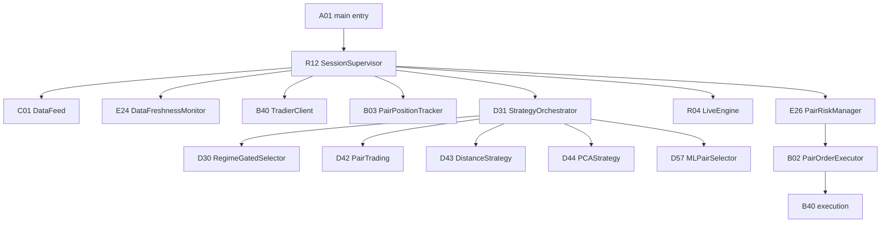

# Trading Decision Workflow (Pair / Stat-Arb) -- v50

Last Updated: 2026-06-24
Status: Current repo-aligned implementation reference
Scope: Tradov live/paper pair-trading, stat-arb orchestration, regime gating, and research launchers

## Change Log

| Version | Date | Summary |
|---|---|---|
| v50 | 2026-06-24 | Added the confirmed pair-position exit affordance from the GUI, made the scanner panel header reflect market-hours state, and aligned startup so scanning begins at 09:20 ET and trading auto-starts at 09:35 ET. |
| v49 | 2026-06-23 | Revised after live code-path verification. Captures the corrected pair startup default, explicit pair-coverage receipt, coordinated pair-executor wiring, and the remaining operational gates that can still suppress scans or trades if the market universe is undersized, the regime selector pauses stat-arb families, or a strategy has not yet warmed up. |
| v48 | 2026-06-19 | Paper-trading readiness pass based on direct inspection of the current workspace. Re-centered the document on pair trading and statistical arbitrage, immutable `RuntimeContext`, explicit market-condition availability, operator-curated stat-arb activation, best-effort pair execution, and Q92/Q94 research workflows. Clarified that the final `DISPATCH` gate must not add paper-only blockers once a signal has cleared risk and payload validation, and that session startup must fail fast if the paper execution path is unwired. |
| v46 | 2026-05-31 | Prior policy/timing snapshot before the repo re-centering. |

---

## 0) Verification Basis

This snapshot is based on direct source inspection of the current repo, including:

- `TradovA_Core/TradovA01_Main.py`
- `TradovR_Runtime/TradovR12_SessionSupervisor.py`
- `TradovD_Strategies/TradovD30_RegimeGatedSelector.py`
- `TradovD_Strategies/TradovD31_StrategyOrchestrator.py`
- `TradovD_Strategies/TradovD42_PairTrading.py`
- `TradovD_Strategies/TradovD43_DistanceStrategy.py`
- `TradovD_Strategies/TradovD44_PCAStrategy.py`
- `TradovD_Strategies/TradovD50_PairTypes.py`
- `TradovD_Strategies/TradovD51_PairScanner.py`
- `TradovD_Strategies/TradovD52_CointegrationEngine.py`
- `TradovD_Strategies/TradovD53_OUProcessFitter.py`
- `TradovD_Strategies/TradovD54_KalmanHedgeRatio.py`
- `TradovD_Strategies/TradovD55_DistanceEngine.py`
- `TradovD_Strategies/TradovD56_PCAEngine.py`
- `TradovD_Strategies/TradovD57_MLPairSelector.py`
- `TradovB_Broker/TradovB02_PairOrderExecutor.py`
- `TradovB_Broker/TradovB03_PairPositionTracker.py`
- `TradovE_Risk/TradovE26_PairRiskManager.py`
- `TradovS_Signals/TradovS07_CustomMetricsOrchestrator.py`
- `TradovU_Utilities/TradovU50_RegimeOverrideStore.py`
- `TradovU_Utilities/TradovU51_RuntimeContext.py`
- `TradovQ_Scripts/TradovQ92_ResearchWorkflow.py`
- `TradovQ_Scripts/TradovQ94_PairResearchWorkflow.py`
- `TradovT_Testing/TradovT143_LiveTradeSlotCaps.py`
- `TradovT_Testing/TradovT145_PermittedStrategyActivation.py`
- `TradovT_Testing/TradovT189_PairOrderExecutorSafety.py`
- `TradovT_Testing/TradovT190_S07_MarketConditionAvailability.py`

This document intentionally excludes legacy trading-family references that are no longer part of the active pair/stat-arb workflow.

---

## 1) Current Repo Posture

Tradov is now best described as a hybrid execution and research platform:

- pair trading and statistical arbitrage are the active trading surfaces
- runtime mode is carried by immutable per-session context rather than env rewriting
- market-condition availability is explicit and fail-closed in live entry gates
- research workflows are launched through dedicated Q92/Q94 surfaces
- the current strategy loader is operator-curated instead of registry-driven

The current package layout supports that split:

- `TradovA_Core` - application bootstrap, scheduler, configuration, event bus
- `TradovB_Broker` - Tradier execution, order management, pair order handling
- `TradovC_MarketData` - market data feeds, validation, caching, internals
- `TradovD_Strategies` - pair strategy families, regime selector, orchestration
- `TradovE_Risk` - risk manager, freshness, exposure controls
- `TradovF_Analysis` - indicators, volatility, filters, performance
- `TradovG_GUI` - dashboard and helper surface
- `TradovL_ML` - unified regime engine and ML utilities
- `TradovQ_Scripts` - research workflows and thin operator launchers
- `TradovR_Runtime` - session supervisor, live engine, paper harness, exit/liveness
- `TradovS_Signals` - S07 custom metrics and pivot signal surfaces
- `TradovT_Testing` - focused regression coverage
- `TradovU_Utilities` - logger, feature flags, runtime context, regime override store

---

## 2) Operator Entry Points

### 2.1 Main application

The installed console entry point is:

- `tradov=Tradov.TradovA_Core.TradovA01_Main:main`

`R12` is the backend lifecycle owner and the GUI is still lazily loaded to avoid heavy imports at module load time.

### 2.2 Research workflows

The repo exposes two thin shell launchers:

- `launch_research_workflow.sh` -> `TradovQ93_ResearchLauncher.py` -> `Q92`
- `launch_pair_research_workflow.sh` -> `TradovQ95_PairResearchLauncher.py` -> `Q94`

These are research and model-lifecycle tools. They do not replace the live runtime or broker path.

---

## 3) Current End-to-End Execution Flow

Current startup order in `R12` is:

1. Event manager
2. Data feed
3. Data freshness monitor
4. Broker
5. Fill reconciler
6. Pair position tracker
7. Risk manager
8. Live engine
9. Strategy orchestrator
10. Exit monitor
11. Liveness monitor
12. Orphan sweep
13. Boot self-test

The supervisor owns an immutable `RuntimeContext` per session and emits a structured startup routing receipt.

### 3.1 June 23 verification findings

Direct runtime verification on 2026-06-23 showed the session booting cleanly in paper/dry-run mode, but the pair path can still be muted by upstream inputs or gating:

- the previous fallback feed basket (`SPX,VIX,QQQ`) did not intersect the pair universe, so pair scanners received no usable wide frame
- the session now falls back to `get_pair_quote_basket()` when `FEED_SYMBOLS` is unset, which gives stat-arb strategies a scan-capable universe by default
- the startup routing receipt now records pair-feed coverage so operators can see whether the feed can support pair scanning
- pair-trading signals now route through the coordinated pair executor before single-leg dispatch
- `DistanceTradingStrategy` still requires its formation warmup window before it will emit signals
- the regime selector can still pause stat-arb families when the current regime assigns them zero weight, including crisis-like states

---

## 4) Runtime Context and Mode Handling

`TradovU51_RuntimeContext.py` is the current mode contract.

Key properties:

- `mode` is either `paper` or `live`
- `session_id` is per-session and stable
- `broker_environment` and `market_data_environment` are captured at startup
- `strict_autonomous` records the autonomous policy posture

Current rule:

- runtime components should prefer `RuntimeContext`
- env vars are startup inputs and legacy fallbacks only
- env rewrites are not the primary coordination mechanism

---

## 5) Pair / Stat-Arb Decision Contract

### 5.1 Operator-curated permitted strategy set

The current permitted-strategy loader maps the GUI/operator token set to:

- `PairTrading` -> `PairTradingStrategy`
- `DistanceApproach` -> `DistanceTradingStrategy`
- `PCAStatArb` -> `PCAStatArbStrategy`

Each activated strategy still consumes one of the global concurrent-strategy slots.

Important constraints:

- the retired registry-driven auto-activation path is not the source of truth
- the stat-arb bucket is exempt from the one-strategy-per-bucket occupancy cap
- the overall concurrency cap still applies
- activation is idempotent per strategy

### 5.2 Selector behavior

`TradovD30_RegimeGatedSelector` is the compatibility selector used by D31 for lean routing.

Current selector behavior:

- high-volatility or crisis-like regimes prefer `PCAStatArb`
- pivot support or high consensus favors `PairTrading`
- sideways or range-like regimes favor `DistanceApproach`
- default fallback is `DistanceApproach`

This gives the orchestrator a deterministic way to pick among the three hosted stat-arb families.

### 5.3 Strategy families

The active pair/stat-arb families are:

- `D42 PairTrading`
  - cointegration-driven
  - dynamic hedge ratio via Kalman filtering
  - spread mean-reversion via z-score entry/exit
- `D43 DistanceStrategy`
  - SSD-based pair formation
  - normalized spread band trading
  - explicit mean-reversion exits
- `D44 PCAStrategy`
  - cross-sectional PCA / eigenportfolio stat-arb
  - residual s-score driven entries
  - market-neutral long/short single-name positioning
- `D57 MLPairSelector`
  - higher-level pair selection helper for scoring and ranking candidate pairs

### 5.4 Current slot math

The repo now enforces:

- `PAIR_TRADING_MAX_OPEN = 3` for open pairs
- global concurrent-strategy caps still apply through D31

Interpretation:

- up to three pair positions may be open at once
- the pair families share the same current orchestration and risk envelope
- stat-arb families are treated as first-class, concurrently hostable strategies

---

## 6) Current Session and Timing Gates

`TradovD31_StrategyOrchestrator` owns the current session policy.

Current defaults include:

- `primary_start_et = 09:30`
- `primary_end_et = 16:15`
- `first_entry_not_before_et = 09:35`
- `broker_cutoff_et = 16:00`
- `fail_closed_if_cutoff_unknown_live = true`

Current runtime behavior:

- scan hydration starts at 09:20 ET
- trading auto-starts at 09:35 ET once market data is ready
- a restart during trading hours auto-adopts the active trading session without a manual confirmation prompt
- opening entries before the configured session start are blocked
- live mode fails closed if broker cutoff configuration is missing or invalid
- closing trades bypass entry-only gates
- weekends are blocked for new entries

These gates apply to the pair/stat-arb workflow and are not tied to any legacy derivative trading model.

---

## 7) Market Data and Availability

### 7.1 Explicit availability contract

`TradovS07_CustomMetricsOrchestrator` now surfaces:

- `market_conditions_available`
- per-metric availability metadata
- freshness state
- NaN/unavailable values when required metrics are not fresh

This is the current contract:

- unavailable data should not be rendered as plausible neutral live state
- live entry gates should fail closed when the required market-condition payload is unavailable

### 7.2 Core inputs

The current decision layer centers on:

- pair prices and spread history
- cointegration results
- hedge-ratio estimates
- residual spread fit and mean-reversion scores
- regime context from L09 and S07
- event / calendar context from the scheduler

### 7.3 Post-scan decision layer

After `PairScanner` reviews candidates, the system now has an explicit decision
payload:

- `PairScanResult`
- `PairDecisionContext`
- `decision_state` (`ready` or `hold`)
- `decision_reason`
- `best_pair_key`
- `best_ranking_score`
- `scan_age_seconds`

The post-scan decision path is now:

1. Rank the validated pairs.
2. Reject stale or empty scans.
3. Select a strategy family only when the scan context is ready.
4. Apply a hysteresis guard before switching families.
5. Emit a hold/no-trade outcome when the scan is weak or stale.

This keeps scan quality, regime selection, and execution gating aligned instead
of letting strategy activation ignore the scan results.

### 7.4 Regime override persistence

The user-selectable regime override is persisted at:

- `market_data/regime_override.json`

`TradovU50_RegimeOverrideStore.py` is the shared store between the GUI and D31.

The canonical option set mirrors D31's `MarketRegime` values:

- `bull_low_vol`
- `bull_high_vol`
- `bear_low_vol`
- `bear_high_vol`
- `sideways_low_vol`
- `sideways_high_vol`
- `crisis`
- `recovery`
- `event_transition`

---

## 8) Risk and Execution Gates

The current live path remains fail-closed across the usual layers:

- `F09` entry trust gate checks time, data quality, short-term stress, and regime policy
- `E26` pair risk manager validates notional, beta deviation, sector concentration, and cointegration stability
- `B02` pair order executor routes the two single-leg orders
- `B40` Tradier client executes the broker call

Key current behaviors:

- missing required market conditions can block entry in live mode
- pair risk checks guard against over-exposure and degraded cointegration
- order rejection reasons are logged and propagated rather than silently normalized
- pair execution has explicit recovery logic for partial leg submission
- pair dashboard rows and risk summaries surface `Cost` and `Funds Held by Broker` so operators can see entry basis and reserved capital alongside P&L
- pair scanner results emit candidate economics metadata so the GUI can show those fields before entry
- the scanner header now reads `SCANNING IN PROGRESS` during market hours and `SCANNING HALTED` outside regular market hours
- the open-pair rows in `PAIR POSITIONS` are clickable and route through a confirm-before-exit flow that calls `flatten_pair_position(...)` with `exit_pair_position(...)` preserved as a compatibility alias
- in normal paper trading startup, the final `DISPATCH` gate is non-blocking after approval: it should route valid signals to the paper execution path and only reject malformed payloads, explicit safety violations, or an unwired execution component
- paper startup now performs a fail-fast readiness check so the session cannot begin unless the paper execution engine is wired and exposes `execute_order()`

`TradovB02_PairOrderExecutor` uses best-effort atomic execution:

- sequential submissions by default
- concurrent submissions when enabled
- auto-recovery when one leg fails after the other is already submitted
- explicit pair-order telemetry for reconciliation

---

## 9) Research and Non-Live Surfaces

The repo has first-class offline workflows:

### 9.1 Q92 research workflow

`TradovQ92_ResearchWorkflow.py` provides:

- dataset contract validation
- time-ordered splits
- walk-forward validation
- holdout evaluation
- simple equity simulation
- JSON artifact output

### 9.2 Q94 pair research workflow

`TradovQ94_PairResearchWorkflow.py` provides the pair-trading research pipeline and is the current research surface for pair models.

### 9.3 Live vs research boundary

These workflows are useful for repeatable experimentation and model lifecycle management, but they do not replace:

- session supervision
- live broker routing
- runtime gating
- risk enforcement

### 9.4 Final paper-dispatch readiness

For Monday paper trading, the final `DISPATCH` gate should be treated as the last routing step, not an additional strategy gate.

Operational requirement:

- once a signal has passed approval, risk validation, and payload validation, paper mode should not introduce any additional business-rule blocker at dispatch time
- the expected paper path is `approved signal -> D31 dispatch -> paper broker / paper harness`
- any `BLOCKED` or `ERROR` state at `DISPATCH` should indicate malformed input, a missing execution component, or a deliberate safety policy, not an extra paper-only business gate

---

## 10) Current Repo Reality vs Historical Modules

The most important corrections relative to older versions are:

1. `R12` owns lifecycle and runtime context.
2. The active workflow is pair/stat-arb focused.
3. Allowed operator strategies are explicit and operator-curated.
4. Market-condition unavailability is explicit, not neutralized.
5. Pair trading and pair research are the first-class repo surfaces.
6. The pair dashboard supports manual exit of open positions with a safety confirmation, and the scanner panel is always live rather than paused.
7. Historical modules remain in the tree for reference, but they are not part of the active pair workflow.

---

## 11) Practical Interpretation

If you are reading this repo to understand what currently matters operationally:

- use `A01` and `R12` for startup and shutdown
- use `S07` and `L09` for market/regime state
- use `D31` for current orchestration and strategy admission
- use `D42`, `D43`, `D44`, and `D57` for the active pair/stat-arb families
- use `E26`, `B02`, `B03`, and `B40` for the entry-to-broker path
- use `Q92` and `Q94` for research workflows
- use `T143`, `T145`, `T189`, and `T190` as the current safety regression anchors

---

## 12) Current State Summary

Tradov's current architecture is a live/paper pair-trading and stat-arb system with explicit regime gating, explicit market-condition availability, a context-first runtime model, and separate research surfaces for pair workflows.

The current repo no longer matches any legacy assumption that the active workflow is derivative-trading focused. This document reflects the active pair/stat-arb implementation instead.
