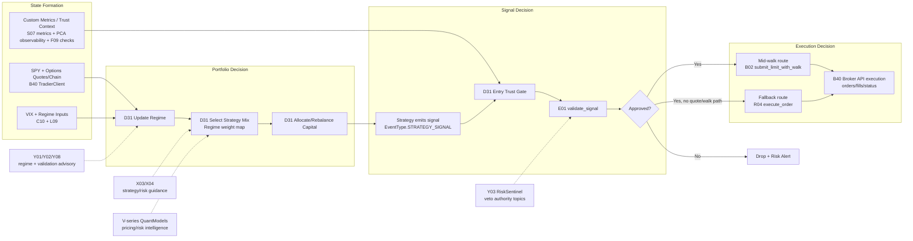

# Spyder Trading Decision - One Page Visual

Last Updated: 2026-05-10
Scope: Current workflow snapshot (v19)
Detailed Walkthrough: [Trading Decision Workflow](./2026-05-10-TRADING_DECISION_WORKFLOW-FULL-v19.md)

## At a Glance

- Strategy-set decision owner: D31 StrategyOrchestrator.
- Trade-level approval owner: E01 RiskManager (validate_signal).
- Execution routing owner: D31 dispatch into B02/B40 (or LiveEngine fallback).
- Agent role: X/Y agents are advisory and coordination-heavy; Y03 can veto via risk topics.
- PCA-Proxy / PCA-IV role: S07/S14 custom-metric observability only; they are not hard regime triggers or execution gates in the current workflow.

## Decision Pipeline (Visual)

## Who Decides What

1. Which strategy executes:
D31 StrategyOrchestrator decides active strategy set and allocation.

2. How the decision is made:
Regime classification -> regime-to-strategy mapping -> trust gate -> E01 risk validation -> execution route selection.

3. How many strategies can run simultaneously:
- Hard orchestration cap in D31: MAX_CONCURRENT_STRATEGIES = 2 (override: SPYDER_MAX_CONCURRENT_STRATEGIES).
- Hard horizon-bucket cap in D31: MAX_ACTIVE_HORIZON_BUCKETS = 2 (override: SPYDER_MAX_ACTIVE_HORIZON_BUCKETS).
- Engine registration cap in A02 (default): max_strategies = 20.
- Practical active count is at most 2 at once: one long-term/swing strategy and one intraday/0DTE strategy, still constrained further by regime map, capital, E01 risk gates, and runtime circuit-breakers.

## Current Branch Data-Provider Reality

- OPRA-vetter toggle exists in B40 via SPYDER_OPRA_REQUIRE_VETTER.
- C29 DataProviderRouter is currently Tradier-only in code.
- Massive/C27 routing is not active at the expected path in this branch snapshot.

## Fast Operational Check

1. D31 regime and allocation state.
2. D31 dropped-signal and rejection telemetry.
3. E01 rejection reasons.
4. B02 route used (mid-walk vs fallback).
5. B40 broker response and fill lifecycle.
